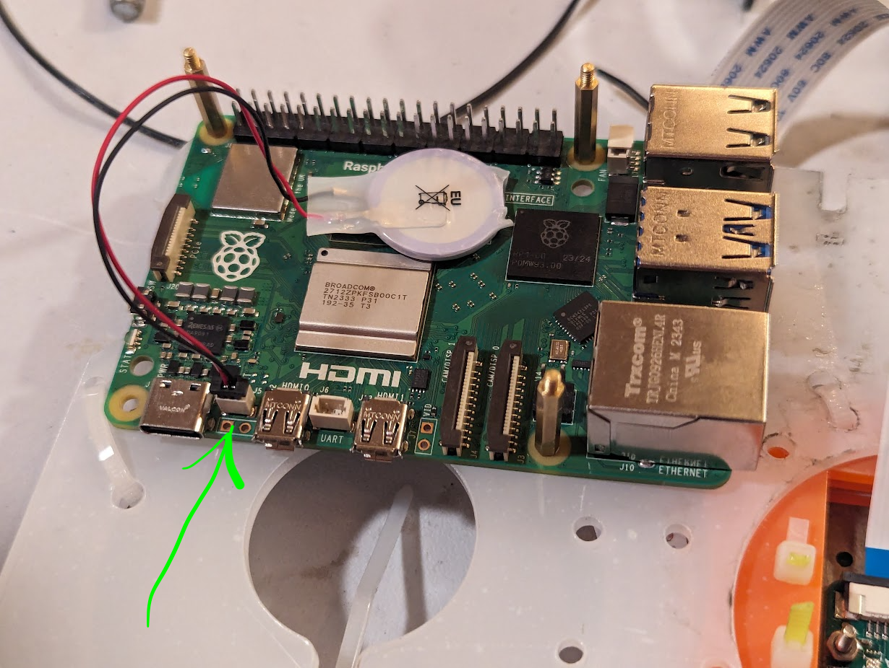
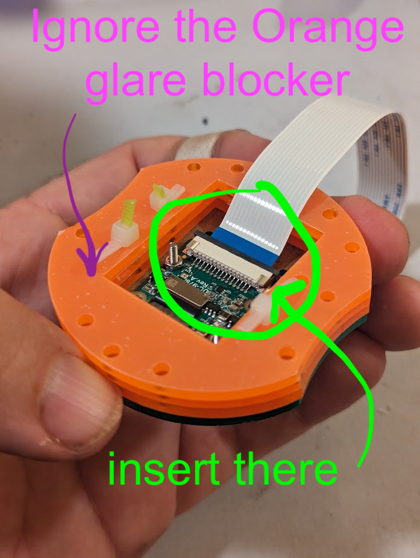
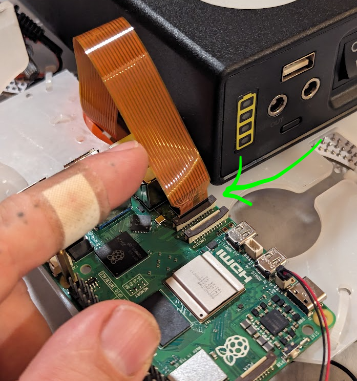
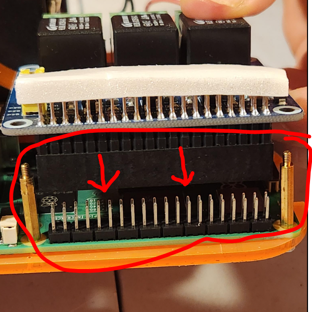
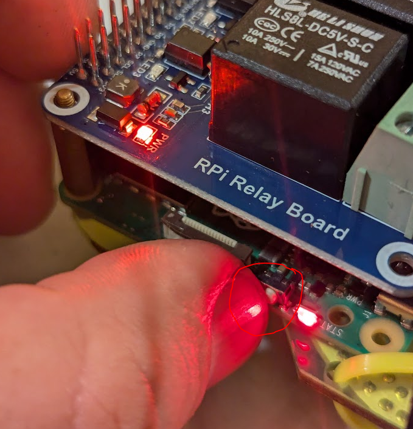
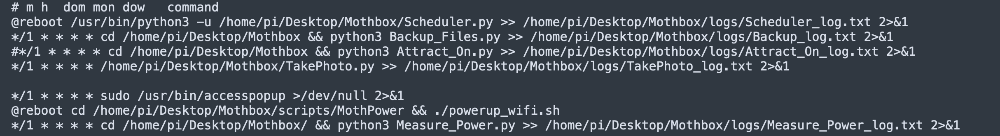
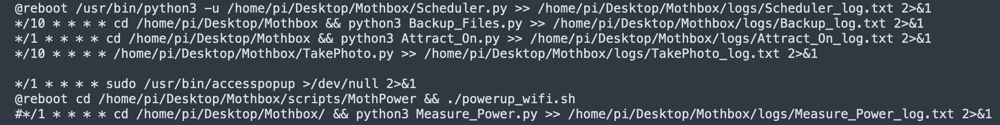
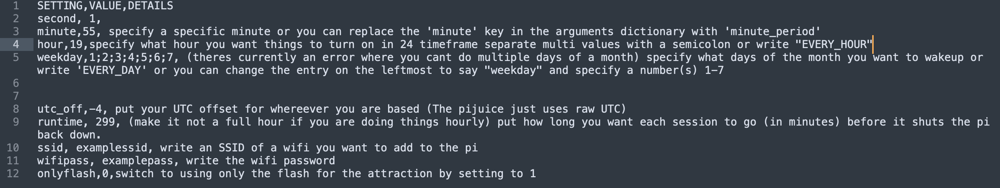
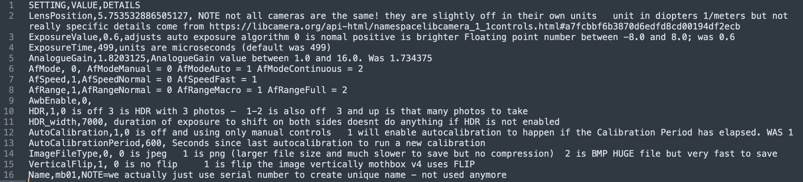

# MothBrain construction

(AKA: Detecting a Thing on a Thing)

This document contains the instructions to build the "minimal" version of the mothbox. It should be capable of handling the logic behind the mothbox, but won't actually actuate the flash lights or the blacklights. It will have a camera attached, but all other parts are to be provided by the person doing the testing.

Note: The information is written so anyone can understand it (pardon the explicit instructions if you already know most of this).


## Design

  * The Raspberri Pi 5 (Rpi) will contain the operating system image for the full mothbox system
  * The Rpi Real Time Clock (RTC) battery is connected directly to the Rpi and makes sure its internal RTC knows what time it is. 
  * The camea is connected through a ribbon connector and can take HD pictures with autofocus and exposure.
  * A Relay hat is mounted on the Rpi, connecting to and extending its I/O pins. This hat has 3 relay channels that are controlled by the mothbox software. They won't be used, but can be heard triggering when used.
  * The SD memory card will have the Rpi operating system (the specific Mothbox OS image)


## Parts (to Buy)

  * One Raspberri Pi 5: link [here](https://www.sparkfun.com/raspberry-pi-5-4gb.html)
  * One Rpi Real Time Clock (RTC) battery: link [here](https://www.sparkfun.com/raspberry-pi-rtc-battery.html)
  * One camera: link [here](https://www.amazon.com/Arducam-Raspberry-Resolution-Support-Libcamera/dp/B0CQJPKFVF?ref_=ast_sto_dp)
  * One Raspberry Pi Relay hat: link [here](https://www.amazon.com/RPi-Relay-Board-Raspberry-3-CH/dp/B085QJFWBC/)
  * One SD card: link [here](https://www.amazon.com/gp/product/B094956T4C/) Note (2-pack)

## Parts (to Use)

  * You'll need a way to see an SD card with your laptop. Some Rpi packages come with a tiny usb thumb drive that is an SD-USB-stick converter. That'll do.
  * You'll need a USB stick to serve as the backup drive for the pictures.
  * You'll need a monitor and an input cable with micro HDMI (to connect to the RPi)
  * You'll need a USB mouse and a USB keyboard
  * Note: If the pi you buy comes with a power supply, good. The one I link does not have it, so you might need something like [this power supply](https://www.sparkfun.com/raspberry-pi-27w-usb-c-pd-power-supply-black.html)  

## Instructions

  1. Complete the hardware construction first.
  2. Setup SD card with Mothbox OS image
  3. Test

### Construction

The instructions for the full MothBox construction are here, but they first build the exterior and then do the interior and electronics. In order to save you all the stuff you don't need, here is a minimal version:

  1. Place the RTC battery on the Rpi as shown below:

     
  2. Connect the ribbon to Raspberri pi camera (if it is not already connected)
     1. Note that the images have two different types of ribbons. Pick the one that fits your camera model and Rpi.

     
     2. you slide a long black holder out (but not off)
     3. then you insert the ribbon (facing the correct way)
     4. then you push the black holder back down
  3. Connect the ribbon to the Raspberri pi

     
     1. you slide a long black holder out (but not off)
  4. Place the Relay hat on the Rpi aligning the pins exactly

     

### Setup SD card

  1. You'll need a way to insert your SD card into your laptop. Some laptops don;t have an SD card port, so you'll need to find a converter.
  2. Follow [these instructions](https://digital-naturalism-laboratories.github.io/Mothbox/docs/building/flash/) to flash the OS into the SD card

## Testing

### Setup

  1. Insert the SD card into the  sdcard slot (it's under the pi). 
  2. Connect the monitor to the micro HDMI port (any should do).
  3. Connect the mouse and the keyboard to the USB ports.
  4. Connect a USB stick to a USB port.
  5. (WAIT) Read the next part first, then connect the power supply to the wall and then to the Rpi.
  6. Note that even if you connect it and it turns on, you can turn it off using the on/off button on the pi side. To turn off, press for 5+ seconds. To turn on, press for 2+ seconds.
  
  

### Configuration

The Mothbox has all the configuration files in the Desktop/Mothbox folder. In addition to this, all the actions it performs are controlled by the [crontab](https://www.geeksforgeeks.org/linux-unix/crontab-in-linux-with-examples/).

These are all the details for [how to do a Mothbox configuration](https://digital-naturalism-laboratories.github.io/Mothbox/docs/usage/configure/). It explains the VNC to connect to it, (without the need for a monitor, keyboard, and mouse), and how to change the camera settings.

### Overal function

The way this works is: 

  1. The `schedule_settings.csv` controls the Scheduler.py file, which sets the wake-up and shutdown of the Pi.
  2. The crontab file controls when each script is run.
  3. There are scripts for: 
     1. changing the scheduled wakeup (they run Scheduler.py)
     2. turning on the black light (they run Attract_On.py)
     3. Backing up the photos (they run Backup_Files.py)
     4. Taking a picture, which turns on the flash (they run TakePhoto.py)
     5. and other things, like turning on the wifi.

The way one works with this is, the moment you power the Rpi, it might turn on and stay on (and run its timed activities indicated in crontab). But if, after connecting it to power, you turn it off with the button (see above), it will be off but powered. It will wake up at whatever time was configured using the `schedule_settings.csv` file. Once the Rpi is on, it simply runs its cron tasks at the indicated frequencies. 


### crontab and configuration files

The Mothbox people are still working on their configuration tutorial, so here's my minimal version.

First, cron controls timed activities and commands for the system. The "file" controlling this is called crontab. There is an admin-wide crontab and a user-wide crontab, but in what I've seen, they use the admin one onl (maybe their new instructions change this).

To view the (admin-level) crontab, open a terminal and run `crontab -l`
This will display what's in it.

To edit the (admin-level) crontab, open a terminal and run `crontab -e`
This will open the default in-terminal editor and let you edit the file. In general, the editor is pico. Read the instructions [here](https://www.cs.colostate.edu/helpdocs/pico.html). Most basic instructions are explained at the bottom of the window. 


#### default crontab configuration:

Note: the default crontab configuration looks something like this: 



(copy-paste version below)
```
# m h  dom mon dow   command
@reboot /usr/bin/python3 -u /home/pi/Desktop/Mothbox/Scheduler.py >> /home/pi/Desktop/Mothbox/logs/Scheduler_log.txt 2>&1
*/1 * * * * cd /home/pi/Desktop/Mothbox && python3 Backup_Files.py >> /home/pi/Desktop/Mothbox/logs/Backup_log.txt 2>&1
*/1 * * * * cd /home/pi/Desktop/Mothbox && python3 Attract_On.py >> /home/pi/Desktop/Mothbox/logs/Attract_On_log.txt 2>&1
*/1 * * * * /home/pi/Desktop/Mothbox/TakePhoto.py >> /home/pi/Desktop/Mothbox/logs/TakePhoto_log.txt 2>&1

*/1 * * * * sudo /usr/bin/accesspopup >/dev/null 2>&1
@reboot cd /home/pi/Desktop/Mothbox/scripts/MothPower && ./powerup_wifi.sh
*/1 * * * * cd /home/pi/Desktop/Mothbox/ && python3 Measure_Power.py >> /home/pi/Desktop/Mothbox/logs/Measure_Power_log.txt 2>&1
```

What this is saying is:

  * At the instant the Rpi reboots, run the `Scheduler.py` script and output its results to the `Scheduler_log.txt.` This sets whatever configuration you have selected for turning the raspberri pi ON, running it for some number of minutes, and then turniing it OFF. This is explained below in the section called `schedule_settings.csv`.
  * The next line indicates that the `Backup_Files.py` script should be executed every minute and the results written into the `Backup_log.txt`
  * The next line indicates that the `Attract_On.py` script should be executed every minute and the results written into the `Attract_On_log.txt`. This is to make sure it is on, it doesn't matter it happens do often.
  * The next line indicates that the `TakePhoto.py` script should be executed every minute and the results written into the `TakePhoto_log.txt`. This is too often, so we will make a change here.
  * The last three lines are there to enable and run the wifi. I have not messed with these yet so you can add/remove/comment these at your own peril.

#### modified crontab configuration:

The minimal version I've been testing is this:



(copy-paste version below)
```
@reboot /usr/bin/python3 -u /home/pi/Desktop/Mothbox/Scheduler.py >> /home/pi/Desktop/Mothbox/logs/Scheduler_log.txt 2>&1
*/10 * * * * cd /home/pi/Desktop/Mothbox && python3 Backup_Files.py >> /home/pi/Desktop/Mothbox/logs/Backup_log.txt 2>&1
*/1 * * * * cd /home/pi/Desktop/Mothbox && python3 Attract_On.py >> /home/pi/Desktop/Mothbox/logs/Attract_On_log.txt 2>&1
*/10 * * * * /home/pi/Desktop/Mothbox/TakePhoto.py >> /home/pi/Desktop/Mothbox/logs/TakePhoto_log.txt 2>&1

*/1 * * * * sudo /usr/bin/accesspopup >/dev/null 2>&1
@reboot cd /home/pi/Desktop/Mothbox/scripts/MothPower && ./powerup_wifi.sh
#*/1 * * * * cd /home/pi/Desktop/Mothbox/ && python3 Measure_Power.py >> /home/pi/Desktop/Mothbox/logs/Measure_Power_log.txt 2>&1
```
This one backs up the photos every 10 minutes and takes a picture every 10 minutes.

Note: We might want to add specific days of the week in order to have a "double" control of when this takes pictures (not only when it gets turned on but also when the cron job gets executed).

#### When to turn the Rpi On/Off and for how long

To control the On/Off/Duration, you need to configure the file `schedule_settings.csv`.



The important parts here are that, you ONLY indicate when you want it turned on and for how long. This includes setting the day(s), the hour, the minute. They have other strange setting options that, to be honest, were too confusing for me, so I didn't explore those (I don't think we need them).

Note that UTC must be set correctly, for the Pi as a whole and for the system to work well. This part is explained [here](https://digital-naturalism-laboratories.github.io/Mothbox/docs/usage/configure/).


### A note about camera settings

The default camera settings should work for almost every case:




(copy-paste version below)
```
SETTING,VALUE,DETAILS
LensPosition,5.753532886505127, NOTE not all cameras are the same! they are slightly off in their own units   unit in diopters 1/meters but not really specific details come from https://libcamera.org/api-html/namespacelibcamera_1_1controls.html#a7fcbbf6b3870d6edfd8cd00194df2ecb
ExposureValue,0.6,adjusts auto exposure algorithm 0 is nomal positive is brighter Floating point number between -8.0 and 8.0; was 0.6
ExposureTime,499,units are microseconds (default was 499)
AnalogueGain,1.8203125,AnalogueGain value between 1.0 and 16.0. Was 1.734375
AfMode, 0, AfModeManual = 0 AfModeAuto = 1 AfModeContinuous = 2
AfSpeed,1,AfSpeedNormal = 0 AfSpeedFast = 1 
AfRange,1,AfRangeNormal = 0 AfRangeMacro = 1 AfRangeFull = 2 
AwbEnable,0,
HDR,1,0 is off 3 is HDR with 3 photos -  1-2 is also off  3 and up is that many photos to take
HDR_width,7000, duration of exposure to shift on both sides doesnt do anything if HDR is not enabled
AutoCalibration,1,0 is off and using only manual controls   1 will enable autocalibration to happen if the Calibration Period has elapsed. WAS 1
AutoCalibrationPeriod,600, Seconds since last autocalibration to run a new calibration
ImageFileType,0, 0 is jpeg   1 is png (larger file size and much slower to save but no compression)  2 is BMP HUGE file but very fast to save
VerticalFlip,1, 0 is no flip     1 is flip the image vertically mothbox v4 uses FLIP
Name,mb01,NOTE=we actually just use serial number to create unique name - not used anymore
```

The most important part is the item called `AutoCalibration`. If it is `1`, it is automatic (recommended). Other thigs can be configured, like number of fotos taken, exposure, lens position, etc. 

### Other useful scripts

  * The MothBrain will take one photo every time the cron job for Take_Photo.py is active. If that is annoying, you can run the script called `StopCron.py` like this:
  ```
  python StopCron.py
  ```
  * A script exists to restart cron (p`ython StartCron.py`), and one to turn off the blacklight (`python Attract_Off.py`).

### Unexplored things

  * I have not playe around with VNC and wifi 
  * There is a whole thing to deal with GPS, which might be useful
  * There is a whole thing to deal with voltage measurement and reporting, which might be useful


## Processing Data

The Mothbox people have their own data processing pipeline that we might want to look at before getting creative.

Check it out [here](https://digital-naturalism-laboratories.github.io/Mothbox/docs/processing)

