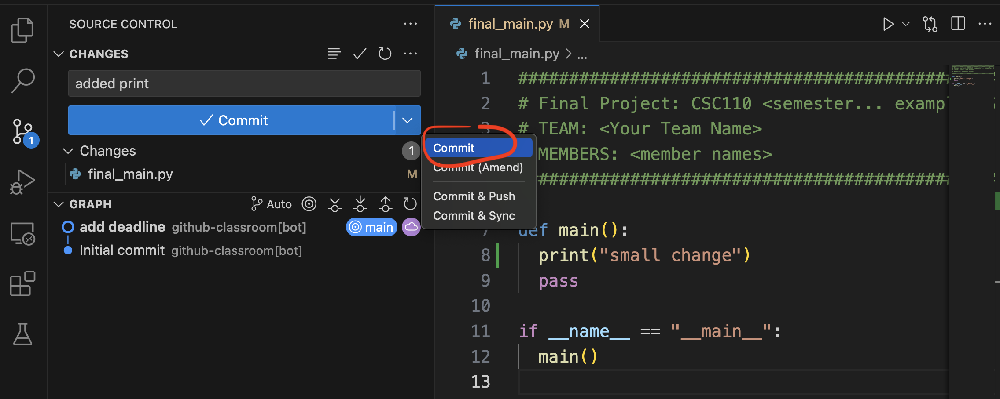
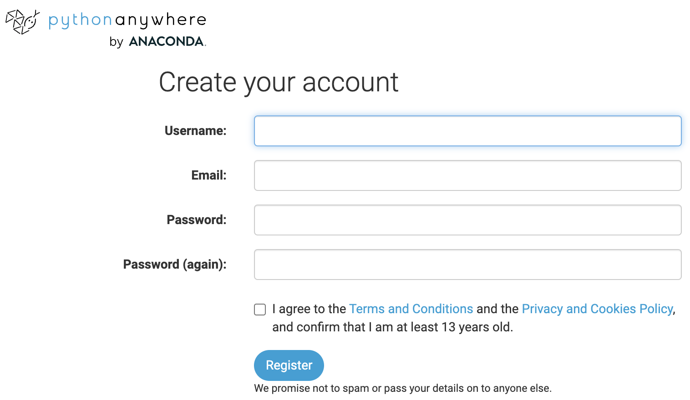
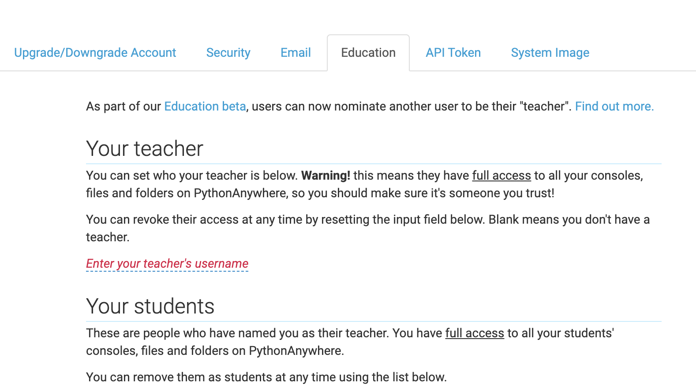
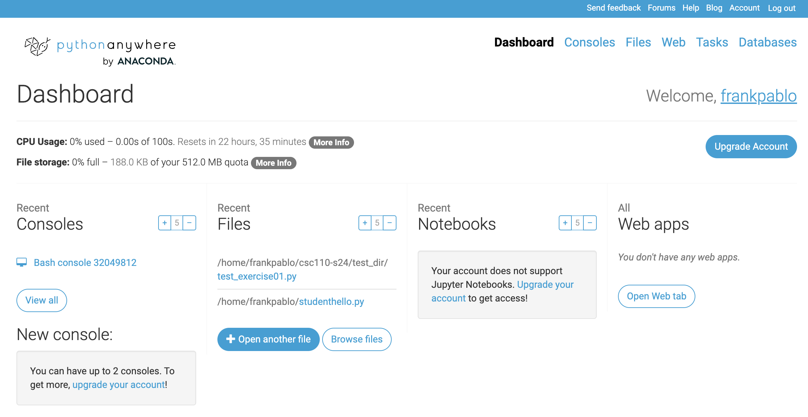

<!-- # Instructions 

  1. Go to the [GitHub classroom for the course](https://classroom.github.com/classrooms/8136643-smithcollege-classroom-csc110-s25)
  1. Obtain the first assignment: [hello-world](https://classroom.github.com/a/bXQpxF7O)
 -->


## Quick links

  * [What is GitHub](#what-is-github)

<!--   
  * [Working in Codespaces](#working-in-codespaces)
  * [Working in VSCode Individually](#working-in-vscode-individually)
  * [Working in VSCode In Groups](#working-in-vscode-in-groups)
 -->

# What is GitHub

GitHub allows you to save files and folders online and it lets you track changes made by one or many people editing that information. It uses **git**, which is a version control system that saves who changed what and when, and it let's you move "back" to previous versions and "roll back time" when needed.


## How does GitHub work

Github hosts a Repository (a set of files and folders and a history of changes) in the cloud. You can edit on the cloud directly (using a code editor in a browser) or you can download your code, work in your computer and then re-upload to keep the clud version in sync.
Here are the steps to work with Github.

## Get a GitHub account

Every student in class needs to have their own GitHub account. It is free. 
When opening your account, do the best you can to use a name similar to your username at Smith.
For example, if my name is Pablo Frank Bolton, I would love to use "pfrank". If that is taken, I could use "pfrankbolton" or "pfrank80" or something lke that.

You don't strictly need an account to use git, but it makes things easier for novices.

## Repositories

Github saves projects in repositories. We call each a "repo". 

A repo saved online is called a "remote repo", and a copy of that remote on your local computer is simply called your "local repo". 

There are many ways to create a repo and use it, but in this class, this is what we'll do:

  1. Your instructor will distribute a link that let's you copy a template repo so you get your own. This is called "forking a repo".
  2. Once you fork a repo, two things will happen: 
      a. A repo under your account will be created with an exact copy of the template repo. We'll call this your "remote repo" since it is stored online. 
      b. If the instructor set up a "coding environment" for you, your remote repo will be opened in a "local" coding environment (more on this later). In this class, we'll use GitHub codespaces to edit your repos.
  3. You then work on your assignment by editing the desired python files, checking syntax, and testing, and when ready, you...
  4. Save "waypoints" of your progress. 
  5. When you submit the last "waypoint" you are done and your repo is already submitted. The instructor can see its last submission and grade it.

## How Do You save "Waypoints"?

When using git, every repo can have tracking of changes so that every little thing could be "undone" if necessary. The steps to save your work are:

  1. Pull: Before making ANY changes, always pull from the repo so you have the most updated version of the repo contents. 
  2. Edit: Make some edits and check your code runs (has correct syntax) even if it does not do everything you need it to do yet. 
  3. Stage: You must then **stage** the changes. This means that you have git add the current changes to the list of things you want to save on your waypoint.
  4. Repeat: You could then do more edits (go to 2) but then you'd have to stage those changes as well. Once you feel you've made and staged enough changes so that you want to save your current "waypoint", you are ready to commit.
  5. Prepare a commit message: Before fully committing, prepare a commit message. It is very important that you add a commit message before committing. Usually, these are short: "added the foo(num) function" or "fixed the bug in bar()"
  6. Commit: committing is saving a group of edits that constitute the changes you want recorded. The difference between the current state of the project and the previous commit will constitute the changes made if you perform an "undo", in case you need to roll back. Note that a commit is not an upload. A commit is still only saved on your local repo and the changes are not yet submitted "online".
  7. Repeat: You can do steps 2-6 until you are ready to upload or submit the accumulated changes stored in the sequence of commits.
  8. Push: pushing, in git, means uploading all your commits to the repo that is stored remotely. In Codespaces or VSCode, an option exists for performing a "Commit and Sync". This really only means that, before performing a Push, a Pull is done. However, if your changes conflict with changes made by someone else, then a conflict may arise that needs to be resolved (more on this later).

<!-- 

## Codespaces vs VSCode on your laptop

VSCode let's you edit files, run them, and explore and create directories on your computer. We call this an IDE or an integrated development environment.
The usual way people work with git is that they: 

  1. fork a repo
  2. pull any changes (not the first time if you just forked it)
  3. do edits, stage changes, commit them, and push

However, you can also use an in-browser IDE that GitHub provides. It is called a Codespace and it acts as-if it were on your local laptop. So even though you have not downloaded the remote repo to your laptop, the act of using a codespace to work on it makes a temporary local repo that you can edit and for which you can stage and commit changes, which you eventually push.


## Working in Codespaces or VSCode version control

While you can work only using the terminal on your laptop, most people prefer using an IDE. In both VSCode and Codespaces, the procedure looks like this:

## Working In Codespaces

A Codespace is opened in two ways: An instructor might have it open automatically when you accept (fork) an assignment repo, or you might have to open it from your remote repo. Here are all the steps:

  1. Open your remote on GitHub (example hw02): <br>
  {: width="80%"} 
  2. Open a codespace from your remote: <br>
  {: width="80%"} 
  3. Before any edits, version control has no changes to stage. Go to the version control page (using the left side menu): <br>
  {: width="80%"} 
  4. Perform some edits: <br>
  {: width="80%"} <br>
  and also:<br>
  {: width="80%"} <br>
  5. After running to check it compiles, go to the test area: <br>
  {: width="80%"} 
  6. Run the tests: <br>
  {: width="80%"} 
  7. After edits are made, go to the version control page (using the left side menu) and stage changes ( + symbol): <br>
  {: width="80%"} 
  8. After staging the changes, now there is something to commit (but dont commit yet): <br>
  {: width="80%"} 
  9. Add a commit message before committing: <br>
  {: width="80%"} 
  10. Pressing commit adds one "local" waypoint to the list of commits: <br>
  {: width="80%"} 
  11. You can perform some more edits (make sure it compiles even if does not pass more tests): <br>
  {: width="80%"} <br>
  12. After edits are made, go to the version control page and stage changes ( + symbol): <br>
  {: width="80%"} 
  13. Add a commit message before committing: <br>
  {: width="80%"} 
  14. When ready, pull and push your commits by pressing commit and Sync: <br>
  {: width="80%"} 
  15. Once pushed, the changes can be seen in the remote repo: <br>
  {: width="80%"} 


## Working In VSCode Individually

Go to the top-level directory of your local repo. If you don;t have a local repo yet, you will clone it by using the following command: `git clone <repo link>` (you can get the link from the GitHub repo info). Once you have a local repo, this is how one works with it in VSCode:

  1. Open your remote on GitHub (example hw02) and copy the clone link: <br>
  {: width="80%"} 
  2. On VSCode, open the command pallete (Mac: Cmd+Shift+P  or Win: Ctrl+Shift+P), 
  search for "Clone" and press the option called **Git:Clone**, and then paste the clone link: <br>
  {: width="80%"} 
  3. Select the directory where you want the local repo ( our Documents/csc110 is good choice): <br>
  {: width="80%"} 
  4. Note that the version tree might already show previous commits from your instructor: <br>
  {: width="80%"} 
  5. Make some edits (make sure it compiles even if you don't pass tests): <br>
  {: width="80%"} 
  6. In version control, remember to stage your changes: <br>
  {: width="80%"} 
  7. Add a commit message and commit: <br>
  {: width="80%"} 
  8. You can make more edits (again, make sure it compiles): <br>
  {: width="80%"} 
  9. Remember to stage any changes: <br>
  {: width="80%"} 
  10. When ready to sync, add a last commit message and commit and Sync: <br>
  {: width="80%"} 
  11. Note your changes are visible in the remote: <br>
  {: width="80%"} 


## Working in VSCode In Groups

Given a repository, you can **clone** it to your local machine, work on it, and then **push** changes. Here is the sequence:

-->

## Installing git

git is the program that tracks changes and that knows how to talk to the remote repository in GitHub. Here is how you install it:

First, go to the section for your laptop (MAC or Windows) and then follow the instructions.

### Installing git on a Mac

  1. Open your Terminal application.
  2. Run the following command:
  `git --version`
  3. If Git is installed, you're done. If it's not already installed, a dialog box will appear prompting you to install the Xcode Command Line Tools. 
     1. Click "Install" and follow the on-screen instructions. This bundles Git along with other developer tools.
     2. ONLY If this step didn't work, do the following:
        1. we'll install `brew` and use it to install git: go to [this page](https://brew.sh/, copy the command shown below, and run in Terminal.
        `/bin/bash -c "$(curl -fsSL https://raw.githubusercontent.com/Homebrew/install/HEAD/install.sh)"`
        2. Now follow the instructions on the terminal
        3. When `brew` is done installing, run the following command:
        `brew install git`

_If you have trouble with any of these steps, ask for help._

### Installing git on a Win

  1. You need to have WSL installed in Windows and be able to select "Ubuntu" as a Terminal profile. This lets you "speak in bash".
  2. Open the Windows Terminal (select ubuntu terminal config)
  3. Run the following command: 
  `sudo apt-get install git -y`
     * Note: sudo is a way to call a program with maximum permissions (don't use it unless I tell you)
     * when you use it, it asks your password. Enter the ubuntu password you set earlier for your WSL (if you paid attention, it is the same as for win).
  4. After it's done, run the following command:
  `git --version`
  5. If it prints something like: `git version 2.34.1`

_If you have trouble with any of these steps, ask for help._


### Configuring git for local use (Mac and Win)

  * After you install git, you need to set your name lastname and email.
  * Run the following command but substitute First Last for you first and last names (include the quotes):
  `git config --global user.name "First Last"`
  * In my case, the command looks like this:
  `git config --global user.name "Pablo Frank"`
  * Now, to set your email, run the following command but substitute email for your smith email (or the email you set up in Github)
  `git config --global user.email <username>@<domain.edu>`
  * In my case, the command looks like this:
  `git config --global user.email pfrank@smith.edu`
  Now you should be all set with git.


## Working with git:

First time you want to download the materials:

### Clone

The first time you accept and create a repository, you need to name your team or join an existing team. Make sure you verify before you do this. 

Once you join a team, a repository wil be forked for you. <br>
{: width="80%"} 

If you click on that link, or search it in your github account, you will find the following information in your repository:<br>
{: width="80%"} 

The first task is to clone (or download) the github cloud reepository (remote repo) to your computer (local repo). You first need to copy the remote repo address, which is located under the <>Code button and local tab:<br>
{: width="80%"} 

<!-- 

Now follow these steps:

  1. Now Open your VSCode at your csc110-s25 folder<br>
  2. Open the command Palette by selecting View > Command Pallette  or pressing: Mac: SHIFT+CMD+P or Win: Shift+Ctrl+P<br>
  {: width="80%"} 
  3. in the command palette, search for: clone and select "Git: clone"<br>
  {: width="80%"} 
  4. Select the folder **inside of you which** you wish to place your project (DO NOT DOUBLE CLICK, JUST NAVIGATE TO THE FOLDER). Select csc110-s25<br>
  {: width="80%"} 

-->

# Working with git

The following steps are used to work with a git repository:

{: width="100%"} 


This image corresponds to the steps shown above.

{: width="100%"} 


## git commands

The following commands should be run in the terminal, while focused on (inside of) the local repository directory you cloned:


In the following examples, I will at as if I just modified hw01.py by adding two lines (don't worry if you have not reached hw01 yet):

```
    x = 27
    print("Part 1: x =",x)
```

### Checking status

First of all, I want to see what the git program sees after the modification of a file, so I run the command:

```
git status
```

In this example, the following is returned:

```
pfrank@Pablos-MBP hw01-frankpablo % git status
On branch main
Your branch is up to date with 'origin/main'.

Changes not staged for commit:
  (use "git add <file>..." to update what will be committed)
  (use "git restore <file>..." to discard changes in working directory)
        modified:   hw01.py

Untracked files:
  (use "git add <file>..." to include in what will be committed)
        __pycache__/

no changes added to commit (use "git add" and/or "git commit -a")
pfrank@Pablos-MBP hw01-frankpablo % 
```

Note that after every compilation, the computer adds an annoying little extra folder called `__pycache__`. This is like "cookies" in browsers. It helps kep track of compilation information to speed things up. 

We don't need to track some files, so we can actually tell git to ignore them. Here is how:

### Adding a gitignore

You can create a file called `.gitignore` (it starts with a dot and has no extension. These files are "hidden files" that contain configuration information.)

You can create it in the local repo using sublime or other text editors, or you can use the `touch` command on the terminal, which should allow you to simply create the file like this:

```
touch .gitignore
```

To add info to it, you can open it (sublime is fine) and add, in each line, what you want ignored. 

You can also edit directly on the terminal. There are different Terminal editors, but one of the simplest are Nano or Pico.

Here are all the [instructions](https://www.nano-editor.org/dist/latest/cheatsheet.html)

The important instructions are: 

  * If you see “^X” that means `Ctrl + x`
  * The menu at the bottom reminds you of how to do things
  * `Ctrl + o`: to save (press return or enter after you do)
  * `Ctrl + x`: to exit (you might need to confirm saving changes)

So now, in our example, let's edit the file called `.gitignore`:
I will edit this using the pico editor, like this:

```
pico .gitignore
```
It opens the editor, and I simply add the line `__pycache__/` (with the forward slash on Mac AND Win).

{: width="100%"} 


### Fetching (Checking for changes on the remote)

Sometimes, people work on multiple devices or in teams, so it is good practice to check if the remote has been changed, and if so, pull the remote BEFORE making changes to it.

First, to check what is in it, we "fetch" the changes like this:

```
git fetch
```

You can then run `git status` again to displays any changes:

If there are changes on the remote, status will say something like this:

```
Your branch is behind 'origin/main' by X commits, and can be fast-forwarded.
  (use "git pull" to update your local branch)
```

In this case, you should get the latest version of the remote.

### Pulling

Pulling means downloading. You do this when you are confident that these changes are good. In more advanced workflows, one can work on separate versions called branches that one later merges... but that is beyond the scope of this class. 


Here is how you pull your remote repo changes:

```
git pull
```

When executed, it reports the changes done to your local repo (to catch it up).

You might run into trouble here if you made local changes before pulling. In that case, go to your instructor (the only thing we'll do is to save the changes separately, pull, then try to do the local changes). 


### Editing your files

**Before you edit, you should fetch and pull any changes to the remote.**

You can edit your files on Sublime, Thonny, or directly on the terminal. 

Note that when you compile, the `__pycache__/` directory is created and that technically constitutes a modification.


### Staging, AKA: Adding (specific)

To add a single, specific newly modified file called  `modified.py` to tracking, you would run the following command:

```
git add modified.py
```

### Staging, AKA: Adding (all)

To add all newly modified files to tracking in one go, you would run the following command:

```
git add .
```
Note: notice the dot!

### Committing (all)

To commit all newly modified files to the current "set of modifications", you would run the following command:

```
git commit -m "short informative message of <80 characters"
```
Note: the `-m` flag allows you to put the message inline. It is important to add the double quotes.

### What if I forgot the `m` flag?

If you just do `git commit`, an editor window will open on the terminal and (probably) use the program called "nano" or "pico" to edit it. If this happens, simply type, at the top, the message you want to write (no need for double quotes).


**Note:** one can commit many times, and in fact, it is a good idea to do so. A standard approach is to edit and run the program until it compiles and does what we want (maybe it passes some new tests). Then we: add (stage) and commit (with a message indicating what feature was added).  You can then repeat for the next feature and so on. 

If you want to "save your progress", even if you are not done, that is when you push.

## Pushing (or Uploading to the remote)

Pushing is the way to upload and submit assignments. Once you are ready to do so, run this command:

```
git push
```

<br><br>


## Editing in a group

Editing with multiple members can be a complicated task, especially if people forget to commit or upload (push) their changes, or if they forget to update (pull) their local version with every other person's changes. So every time you work on your code, you should do the following:


  1. Always **pull** before making any changes. You can also **fetch** the changes, which allows you to see changes without actually altering your local version (but you need to eventually pull)
  2. After you make a change (added one function, one test, or one block of code) **commit** your change with a short informative comment
  3. After you do a few changes that you tested and they work, **pull** again (just to make sure nobody pushed crucial changes right before you are pushing).
  4. If no changes affect your own changes, **push** all your commits (commit and sync)
  5. go to (1)


<!-- 
How do these steps look in VSCode:

  1. Go the Source Control section of VSCode<br>
  {: width="80%"} 
  2. You can fetch any changes (without pulling)<br>
  {: width="80%"} 
  3. You then pull any changes<br>
  {: width="80%"}
  4. You then Edit the file and stage the changes<br>
  {: width="80%"}
  5. You then commit any staged changes<br>
  {: width="80%"}
  6. You can see the committed (but not yet pushed changes)<br>
  {: width="80%"}
  7. You then pull any changes (last minute modifications might be important)<br>
  {: width="80%"}
  8. After you have edited and committed then push any changes<br>
  {: width="80%"} 
  9. After you have pushed, the graph should have all changes<br>
  {: width="80%"} 


-->


## Troubleshooting

When you push, there are errors indicating there is a conflict: this usually happens if someone else made changes that you did not pull. It can also happen if you made changes through more than one codespace tab or if you disconnected between making a change and committing and pushing. 

The way to resolve this is to resolve the conflicts. Before resolving any conflicts, it is a good idea to save a copy of the edited file (in case something is lost) and then perform a merge. 

You would run the following instructions, in the terminal (inside the top directory of the repo), one by one **without the comments**:


Configure pull to merge as default strategy:

  ```
  git config pull.rebase false
  ```


After this, it is possible to pull and then push as normal. You can do this on the terminal:

Pull previous changes and merge with your own

```
git pull    
```

After this instruction, a window will ope in the editor with a bunch of comented out text. This is where you manually insert a commit message for your action tesolving the conflicts. 

You only need to add a line above the text indicating the commit message. For example: `Resolving commit conflicts`, and then click on the check mark that accepts the message (top right of the editor window).


Push your own commits to the remote  

```                   
git push                     
```


<!-- 
  1. click on the button "sign up and Try out" <br>
  {:width="250px"}<br>
  or [click here](https://www.pythonanywhere.com/pricing/)
  1. Click on "Create a Beginner account"<br>
  {:width="250px"}
  1. The fill out the form that appears with the following data:
      * **Your Smith username** (not some nickname); (if it is already in use, add a number to it: e.g. pfrank007)
      * use your Smith email
      * pick an easy-to-remember password and save it somewhere!!
      * Agree to the Terms and Conditions, the Privacy and Cookies Policy, and confirm that you are at least 13 years old.<br>
      {:width="500px"}
  1. You should verify your Smith email
  1. You should arrive at the Account for your account.
  1. If you do not see this page, look for the word "Account" on the top right (in the thin blue bar at the top of the page) and click it. The Account page looks like this:<br>
  {:width="900px"}<br><br>

  1. **IGNORE THIS TAB** and go to the **Education** tab<br>
  {:width="900px"}
  1. In the text input line (in red) write the following username: **pfrank** and click the checkmark to accept<br>
  {:width="900px"}<br><br>
  1. Once you have done this, look for the "Dashboard" link on the top (below the blue line) and click it:<br>
  {:width="900px"}<br><br>
  1. We will go over this in class. For now, feel free to do the tutorial (green box that might appear in the top), but do not do the steps that say "Now it's time to check out some of the Education-specific features". At that point, press the button to "**Close this tutorial**"
-->