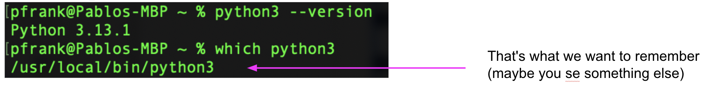
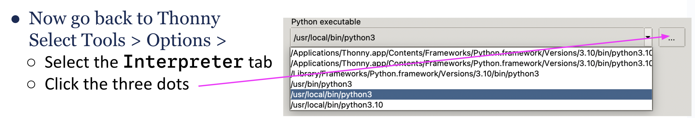

 

## Option B: I'm using a Chromebook or IPad Pro.

We recommend that you use Visual Studio Code for Education: [https://vscodeedu.com/](https://vscodeedu.com/).

1. Open a browser to [https://vscodeedu.com/](https://vscodeedu.com/).
2. Sign in with a Microsoft account. If you do not have one, create an account with your personal email (gmail/hotmail). If you want to used your Smith email and credentials, you will need to sign up for [Office 365 Education](https://www.microsoft.com/en-us/education/products/office).
3. Click `My Work` -> `My Projects` -> `New project`. Give your project a name (e.g., CSC110) then click `Create Project`.
4. A new project will be created, and you will be given a main.py file. From here you can drag files into the browser and they will be added to your project. 

 

---

 

##  Backup for Option A - Conda or Thonny

### Anaconda - If your couldn't get Python to install.

Download and Install Anaconda.

1. Visit the Anaconda Website at:  [https://www.anaconda.com/products/individual](https://www.anaconda.com/products/individual)
2. Select the download option for your operating system (Windows, macOS, or Linux). 
3. Click the `Download` button to start the download of the Anaconda installer.
4. Follow these instructions on-screen instructions: [Windows](https://docs.anaconda.com/free/anaconda/install/windows/) or [Apple](https://docs.anaconda.com/free/anaconda/install/mac-os/)

Once Anaconda (or “conda” for short) has installed follow these steps to finish setup and use anaconda: Find and launch the Anaconda Navigator application. 

Install Visual Studio Code (see above) and then ask for help.

 -->

## Install Thonny

[**Thonny**](https://thonny.org) is the name of an _Integrated Development Environment_ you can use to create Python programs on your computer. You should install Thonny on your own computer. (Mac Users: after downloading and opening the `.dmg` file. Open `readme.txt` for further instructions.)

Now we need to pick which version of Python to connect to Thonny. First, go to the section for your laptop (MAC or Windows) and then follow the instructions.

### Setting python version for Thonny in a Mac

  1. First, Open a terminal and run these commands:

  {:width="500px"}

  2. make a note of where python is saved on your system
  3. Now go back to Thonny
     1. Select Tools > Options > 
     2. In the window that opens, select the `Interpreter` tab, and then the three dots menu to select the python executable you found before.
     3. You should be able to see where we installed the new python3.13
        1. in my case, it's the line that reads `/usr/local/bin/python3`

     {:width="500px"}
  4. Select it, click OK, and restart Thonny.

### Setting python version for Thonny in Windows

  1. We need to tell Thonny to use our newest version of Python 
  2. Run, in a Command Prompt or PowerShell, the command:
  `where python`
  or inspect the Windows Registry
  3. write down the path it reports… it will be something like:
  `C:\Program Files\python313` or
  `C:\Users\<username>\AppData\Local\Programs\python\python313\`
  4. Verify that, inside that folder, you see `python.exe`
  5. Now go back to Thonny
     1. Navigate to `Run > Select interpreter`.
     2. Choose `Alternative Python 3`.
     3. Browse to the location where you installed Python 3.13 python.exe executable.

<!-- 
Here's a quick overview of how to use Thonny to program in Python. There are two distinct ways of typing in Python statements:

1. You can use the _shell_, where each line you type is
interpreted by Python as soon as you hit `return`. 
2. You can also use the _editor_, which allows you to write a
collection of statements (a program), save the collection in a file, and then
have Python execute the contents of the program. 
 -->

## Two other (online) tools: Python Tutor and Trinket

There are some free services that allow you to run Python, but you will have to create an account.

* [Trinket](https://trinket.io/) 
* [Python Anywhere](https://www.pythonanywhere.com/)
