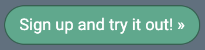
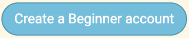
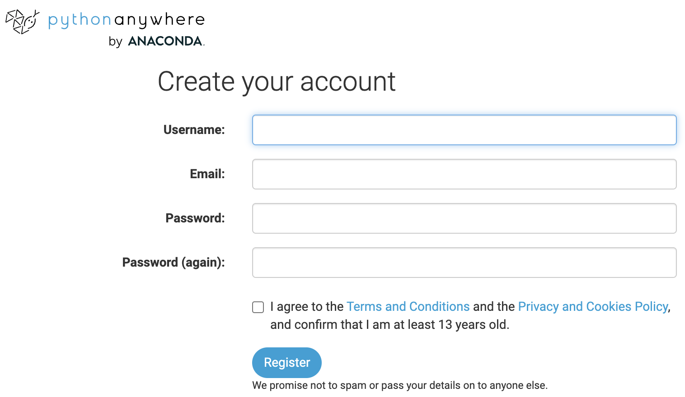
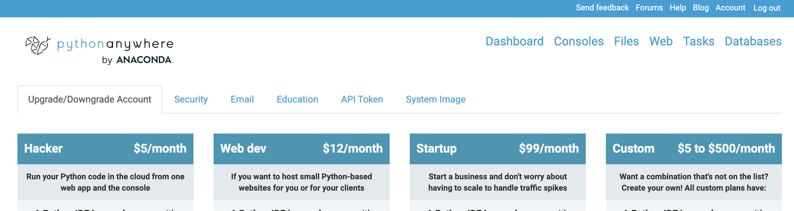
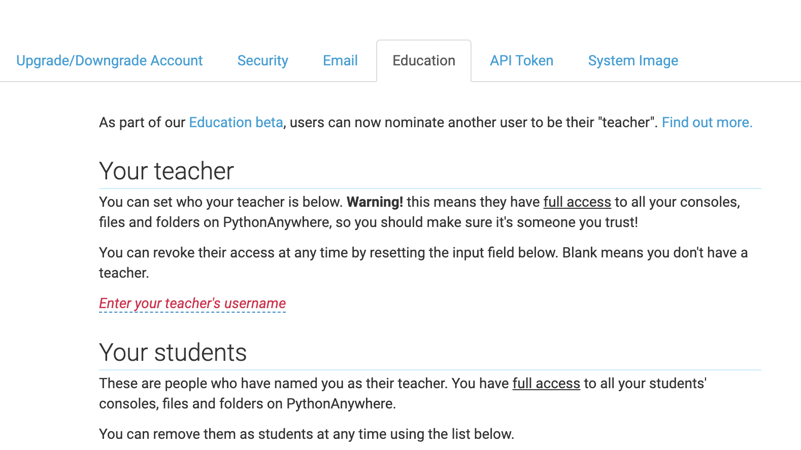
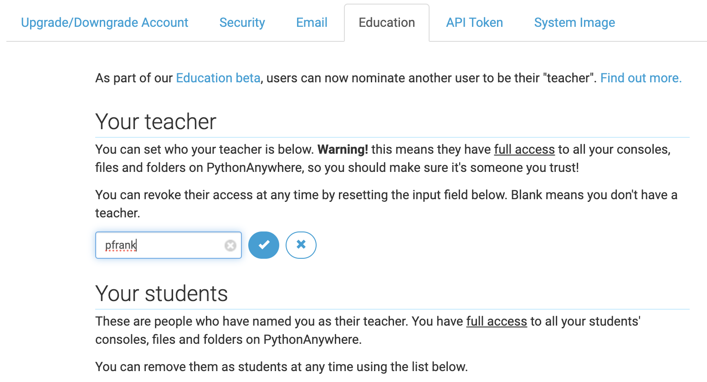
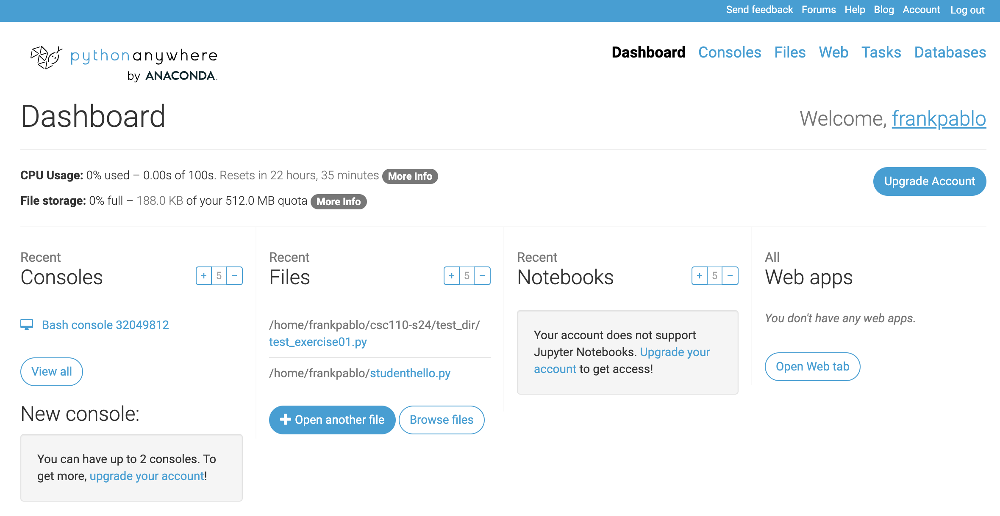

# Instructions 

  1. Go to the [PA education page](https://www.pythonanywhere.com/#id_education_details)
  1. click on the button "sign up and Try out"  
  {:width="250px"} 
  or [click here](https://www.pythonanywhere.com/pricing/)
  1. Click on "Create a Beginner account" 
  {:width="250px"}
  1. The fill out the form that appears with the following data:
      * **Your Smith username** (not some nickname); (if it is already in use, add a number to it: e.g. pfrank007)
      * use your Smith email
      * pick an easy-to-remember password and save it somewhere!!
      * Agree to the Terms and Conditions, the Privacy and Cookies Policy, and confirm that you are at least 13 years old. 
      {:width="500px"}
  1. You should verify your Smith email
  1. You should arrive at the Account for your account.
  1. If you do not see this page, look for the word "Account" on the top right (in the thin blue bar at the top of the page) and click it. The Account page looks like this: 
  {:width="900px"}  

  1. **IGNORE THIS TAB** and go to the **Education** tab 
  {:width="900px"}
  1. In the text input line (in red) write the following username: **pfrank** and click the checkmark to accept 
  {:width="900px"}  
  1. Once you have done this, look for the "Dashboard" link on the top (below the blue line) and click it: 
  {:width="900px"}  
  1. We will go over this in class. For now, feel free to do the tutorial (green box that might appear in the top), but do not make any additional test accounts (even if that's a thing to try in the tutorial).

