# How Computers Store Data

## And how to use it!

The following is a short description of how a program written in Python can get used by a computer.

* * *

### High Level View: Data

There are two different things that one must understand about the data that is found inside a computer:

  *   One thing is how the data itself is stored and passed around, which we will call the **data structure**;
    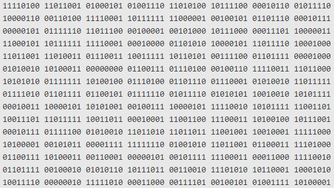{: width="50%"}

  *   The other is how the data is interpreted or shown to the user, which we will call the **data interpretation**.
    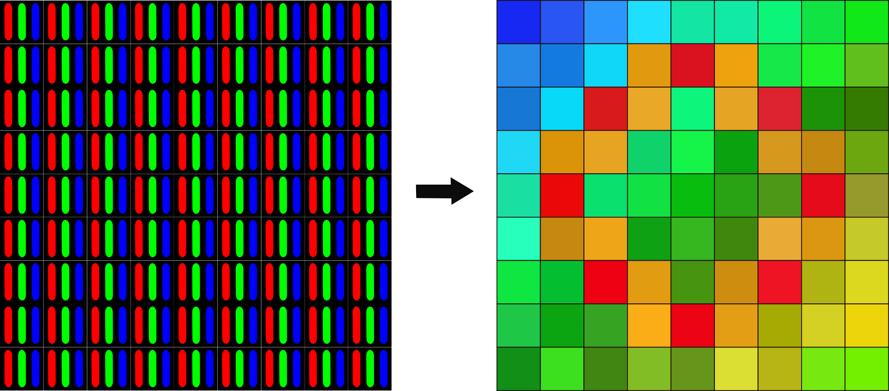{: width="50%"}
    Image credit: https://www.kdnuggets.com/2020/01/convert-picture-numbers.html

#### Data Structure

A standard modern computer is based on an electronic switching model; the standard analogy is "a system of pipes and valves running water".

The way a computer keeps data inside itself is by running a current or keeping an electromagnetic charge in a circuit component (you can think of it as running a water current through a pipe or as filling a small tank full of water).

Therefore, the smallest value one can save in a computer is if there is or there isn't a current or charge in a component

Another way to think about it is that, if there is a charge or current, then there IS data saved there, or in other words, the presence of a charge is "TRUE"; if there is no charge or current, then the presence of a charge is "FALSE";

We call a digit that stores one of two options a **b**inary dig**it**, or a **bit**. It is a binary digit because we say that something that has two setting is a "binary" element.

So, in summary:

*   A running current or a charge: A value of **True**, also called a logical **1**

*   A running current or a charge: A value of **False**, also called a logical **0**

|            | Logical | bit value |
|------------|---------|-----------|
| Current    | True    | 1         |
| No Current | False   | 0         |

<!--
.tg {border-collapse:collapse;border-spacing:0;} .tg td{border-color:black;border-style:solid;border-width:1px;font-family:Arial, sans-serif;font-size:14px; overflow:hidden;padding:10px 5px;word-break:normal;} .tg th{border-color:black;border-style:solid;border-width:1px;font-family:Arial, sans-serif;font-size:14px; font-weight:normal;overflow:hidden;padding:10px 5px;word-break:normal;} .tg .tg-baqh{text-align:center;vertical-align:top}

Logical

bit value

Current

True

1

No Current

False

0
 -->

**Note**: if you turn off the power in a computer, all the circuits stop having current/charge and all "memory" is wiped. However, we have extended these "current/charge" based storage systems with "hard disk drives" that can store information magnetically (which does not disappear after electricity is cut off). If you want to read a bit (no pun intended) more about how a computer stores information, you can check out this very clear and short article: ["How Does a Computer Physically Store Binary Code?"](http://androidgrl.github.io/2019/01/01/binary/)

#### A simplified analogy of storage: **Boxes**

Thinking about running water in pipes is ok for very simple circuits, but for thinking about data storage, it is not the best; also, once circuits get complicated enough, the analogy breaks.

So, for our purposes, we're going to switch to another "model" of the storage:

*   **Box Analogy** : Imagine we have a large set of boxes that can store a 0 or a 1:

    {: width="50%"}

    {: width="50%"}

    They are aranged in a consecutive order and each box has a known **location** or **address**.

    **Files** are (potentially large) groups of these boxes. Each file, in adition to the data it contains (0s and 1s) has a set of special boxes that indicate what type of file it is.

    **Directories** are groups of these files.

#### Memory in a computer

We have an abstract idea of how data is stored, which is in a collection of files and folders in a complex tree structure.

However, in actuality, data is stored in a **registers** that hold groups of 8 bits. We call each one of these 8-bit sequences a **word**.

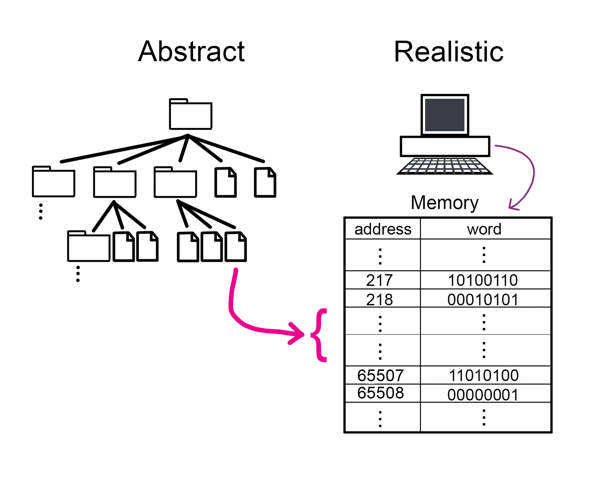

Another name for a group of 8 bits is a **byte**.

Also, these registers don't need an address, since you can find them by their location. In other words, "address" 217 is simply the register that is 217 registers after the first one. In the image shown above, we're showing the addresses explicitly so that you can visualize what we mean by them, but in actuality, they don't require that extra column of numbers.

**Later on, we'll talk about how we use group these bytes to signify other types of values, like integers, text strings, real numbers, and other things.**

#### Data Interpretation

As we established above, a computer is a machine that can store 0s and 1s and may perform actions to change these values or move them around.

However, we, as humans, don't see 0s and 1s... we see this:

{: width="50%"}
[Image Credit](https://chrome.google.com/webstore/detail/docs/aohghmighlieiainnegkcijnfilokake)

{: width="50%"}
[Image Credit](https://imgur.com/COijbLj)

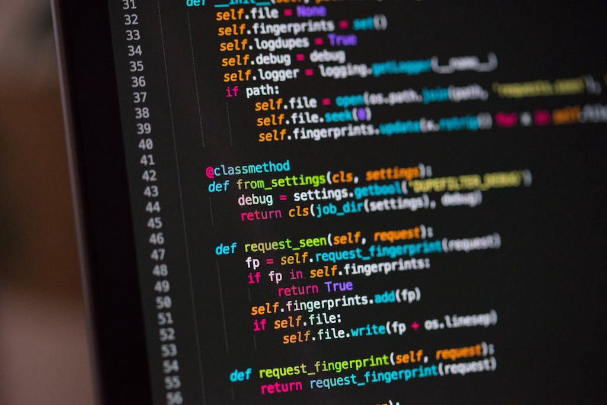{: width="50%"}
[Image Credit](https://junilearning.com/blog/guide/what-is-python-101-for-students)

So how do we get from 0s and 1s to letters, sounds, and images?

**Output Devices and interpreting signals**

*   **Monitors and Video Card**: gets a series of input signals (voltage sequences) that it uses to know which pixels to light up in the screen.
    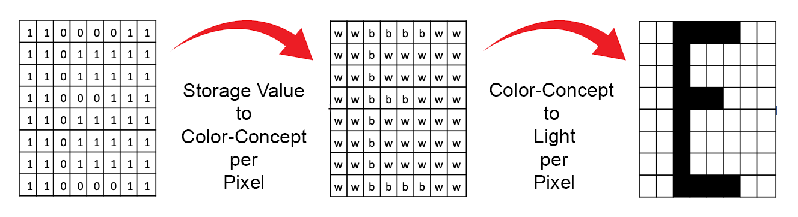{: width="80%"}

*   **Speakers and Audio Card**: gets a series of input signals (voltage sequences) that it uses to know which tones to generate with the speaker.

    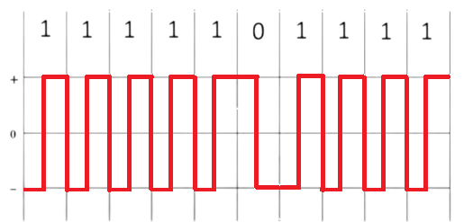{: width="80%"}

    ⟶

    {: width="80%"}

    You can test the result here:

    Note: set your speakers to low volume!

#### Input

Input can be given by hardware elements like Keyboards, mouse movement, joystick, video cameras, etc.

The thing to understand is that every input gets broken down into its smallest parts and each of these parts gets assigned a sequence of 0s and 1s so it can be stored.

It is also important to save the "desired interpretation" of the sequence of 0s and 1s for future use. The interpretation itself is also just a sequence of 0s and 1s that means something different for every value.

You can imagine something like: "0000 0000" means it is just a number; "0101 1100" means it is a video; etc. This is a bit of an oversimplification, but it will do for now.

* * *

### From Python Code to Execution

Now that you know about the way computers store information and also how it can be interpreted in order to show different images or cause different sounds, we can think of **the full path between a python program and a printout on the screen**.

#### Python Source code

Python is like English, French, or Portuguese... a collection of symbols and rules to use them.

A python program uses symbols from English and has:

*   **Reserved words**: Key words that already mean special things
*   **Identifier words**: Key words that the user can specify (like nicknames)
*   **Operators and delimiters**: symbols that let us clarify intention or combine values (like punctuation)
*   **Expressions**: Sequences of key words, identifiers, operators and delimiters that cause data to be stored, transformed, or shown

What does all this look like? See an example piece of code below:

The code:

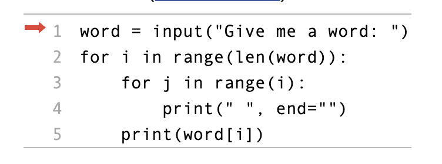{: width="50%"}

The Input:

 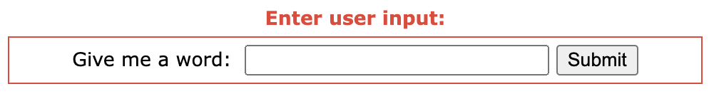{: width="50%"}

The Output and Storage:

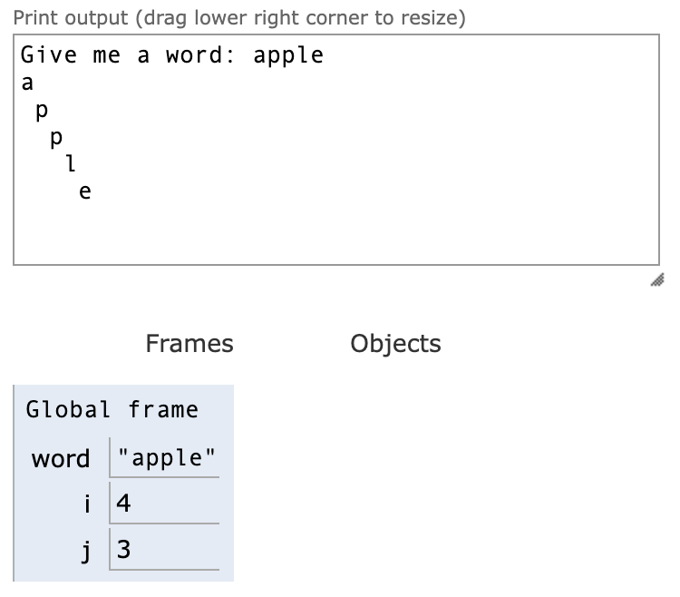{: width="50%"}

You can try it out [Here](https://pythontutor.com/visualize.html#code=word%20%3D%20input%28%22Give%20me%20a%20word%3A%20%22%29%0Afor%20i%20in%20range%28len%28word%29%29%3A%0A%20%20%20%20for%20j%20in%20range%28i%29%3A%0A%20%20%20%20%20%20%20%20print%28%22%20%22,%20end%3D%22%22%29%0A%20%20%20%20print%28word%5Bi%5D%29&cumulative=false&heapPrimitives=nevernest&mode=edit&origin=opt-frontend.js&py=3&rawInputLstJSON=%5B%5D&textReferences=false)

#### So what is happening here?

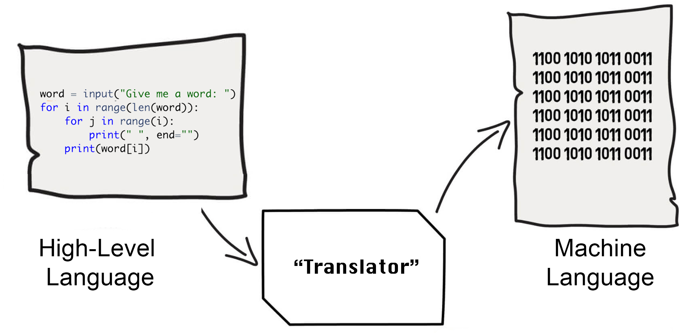{: width="80%"}

1.  First of all, the text file where you saved the Python Source code is actually just a series of 0s and 1s too! However, when shown in the screen, the computer knows to display these as letters and symbols (because of the type of the file).

3.  When we "Execute the Program" the computer checks if "the spelling makes sense" and it then converts every instruction (basically every line) into sequences of 0s and 1s that the computer knows to interpret as "machine code instructions", composed of: **operations**, **values**, and **addresses**.

5.  Each of these "machine code instructions" tells the computer where to look (boxes in memory) and what to do with the contents (update them, copy them somewhere else, or pass them to output devices)

7.  If no "spelling errors are detected" (before executing) and if no illegal operations are requested (like erasing protected memory locations), then the sequence of instructions runs until nothing else remains to be done.

9.  For this particular program, the sequence of actions cause the computer to tell the monitor to print specific symbols at specific locations

#### Execution steps for Python

A great (and short) article on the details of how Python is executed can be found here: [What happens when Python code is executed?](https://python.plainenglish.io/how-python-program-works-inside-out-5ede48d627e0)

## Analogy of instruction decoding and execution

  * A computer's main parts are:
     - The Processor, that can perform logical and arithmetic calculations, and it can interpret instructions
     - the Memory: that holds instructions and data (it is fast but it shuts down when there is no power and has a small size)
     - the Disk: holds information (data and instructions) and is huge and holds informaiton even when powered off (but it is slow).

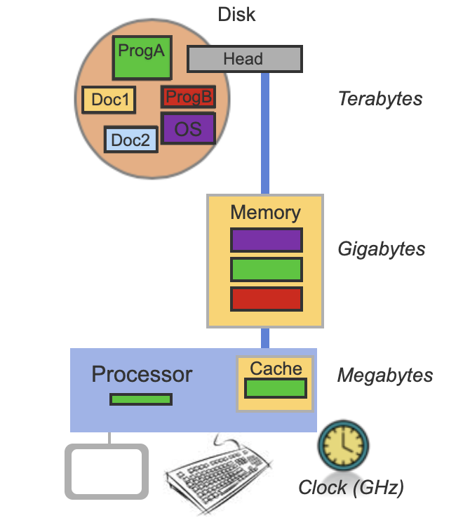{: width="50%"}

  * A computer works in Cycles where it does small operations

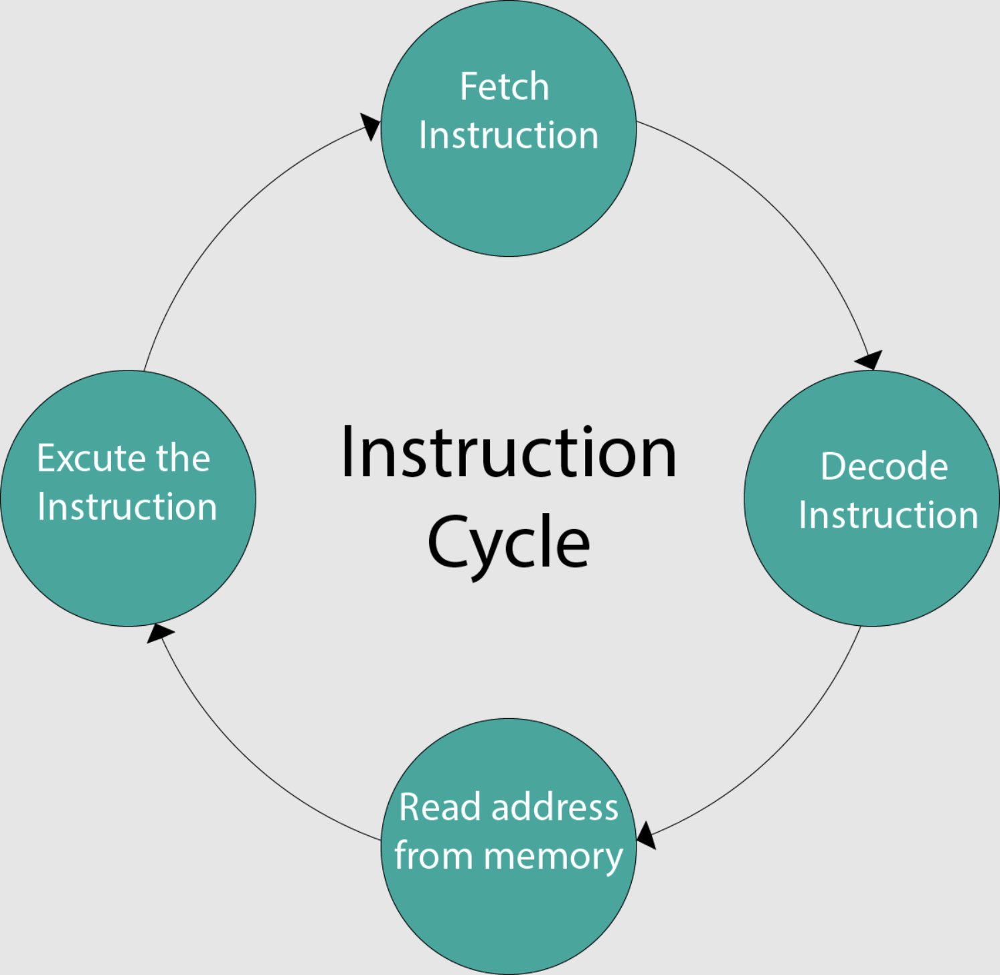{: width="50%"}

  * The Processor is continually getting instructions and data from memory and using them to complete instructions:
      - First, it goes to FETCH the next instruction from memory
      - Then, it DECODES the 0s and 1s to understand what it needs to do
      - If necessary, it READS additional values from memory
      - It performs an operation with the data it read
  * Examples of instructions (readable version):
      - Add 1 to whatever is at memory address 738500
      - Decrease the value inside the register 2 by 1

### The Restaurant Analogy

  * The analogy is a restaurant processing orders
     - The set of stored instructions are the customer’s orders
     - The CPU is like a Cook that has access to preparation areas as well as other appliances
     - The Memory is like a pantry where both ingredients and instructions can be found
     - The Disk is like a store room that can hold a lot of more ingredients and orders but that is outside

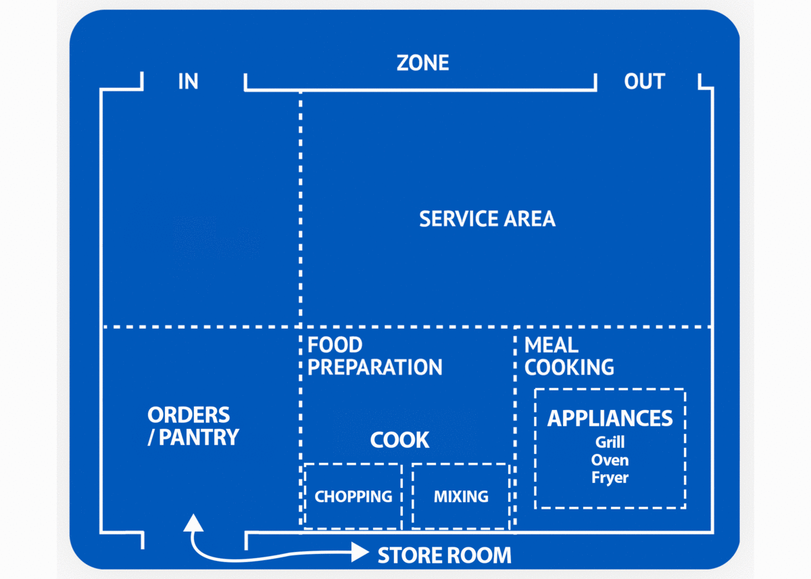{: width="80%"}
