---
layout: default
title: History
parent: CSC110
grand_parent: Teaching
nav_order: 8
#permalink: /docs/teaching/csc110/
---  
  

# History of Computing and How Computers Work

  

The following page contains a tiny summary of the history of computing, followed by a link to a short quiz. In addition to the reading, you may choose to follow the links (Highlighted in **blue**) contained in the page and read to expand your knowledge!

  

* * *

  

### Computers

The term _computer_ refers to a mechanism or agent that aids in the completion of a computation (AKA a calculation).  
These are some examples of those agents:  
  

| |
|:--:|
| [Abacus](https://en.wikipedia.org/wiki/Abacus)|

<!-- [Abacus](https://en.wikipedia.org/wiki/Abacus) [{: width="50%"}](#) -->

| 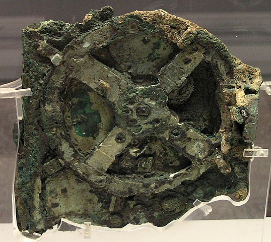{: width="50%"} |
|:--:|
| [Antikythera Mechanism](https://en.wikipedia.org/wiki/Antikythera_mechanism#Operation)|

<!-- [Antikythera Mechanism](https://en.wikipedia.org/wiki/Antikythera_mechanism#Operation) [{: width="50%"}](#) -->

| 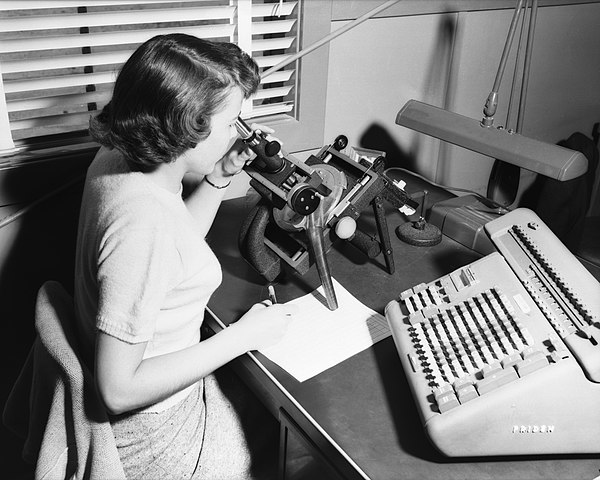{: width="50%"}|
|:--:|
| [Original Computer](https://en.wikipedia.org/wiki/Computer_(occupation))|

<!-- [Original Computer](https://en.wikipedia.org/wiki/Computer_(occupation)) [{: width="50%"}](#) -->

  
  

**Activity**: In the rightmost picture, where is the "original computer" located?

  
  

The modern term _Computer_ refers to a mechanism that "performs calculations" _automatically_ and that can be _programmed_.  
  
Let's look at these terms one by one:  

*   **Automatic**: refers to action independent of (human) intervention in order to perform its [calculations](https://youtu.be/OpLU__bhu2w?t=612).
*   **Programmable**: a system whose starting conditions and rules of execution can be predefined and assigned prior to execution.

#### A bit of [history](https://www.computerhistory.org/timeline/computers/)

  

*   **Antikythera Mechanism**, built around 100 BC, was a mechanical astronomical clock.  
    {: width="50%"}
  
*   **Cosmic Engine** was built by Su Song in 1092 and was a hydro-mechanical astronomical clock tower;  
    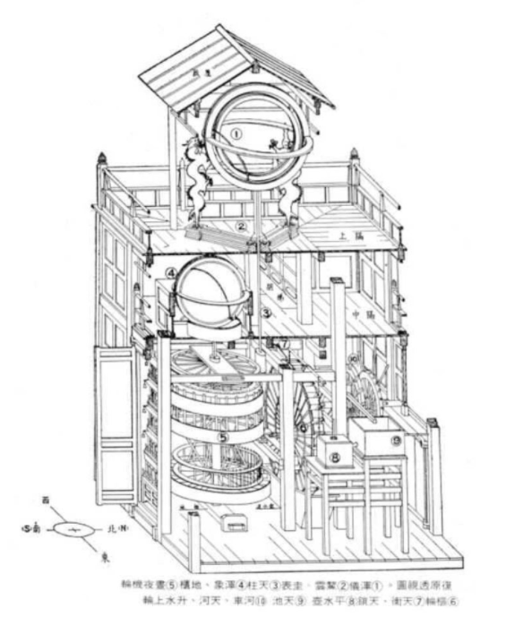{: width="50%"}
  
*   The **Difference Engine**, built by Charles Babbage in 1819 was a programmable calculator. It was "automatic" in that it could perform the calculations without intervention as long as someone provided power (hand-cranked).  
    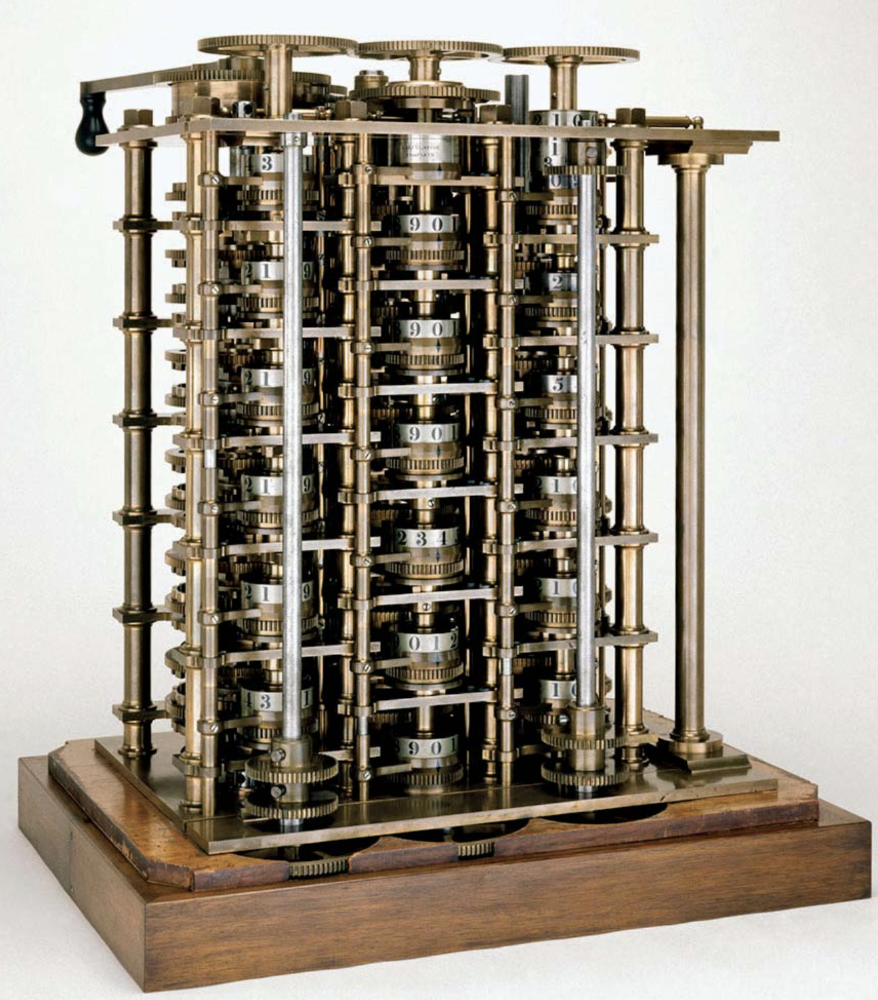{: width="50%"}
  
*   Babbage theorized a _more general_ machine that could be _programmable_ and could do many more things. This was called the **Analytical Engine** (which has not yet been built as described by Babbage).  
    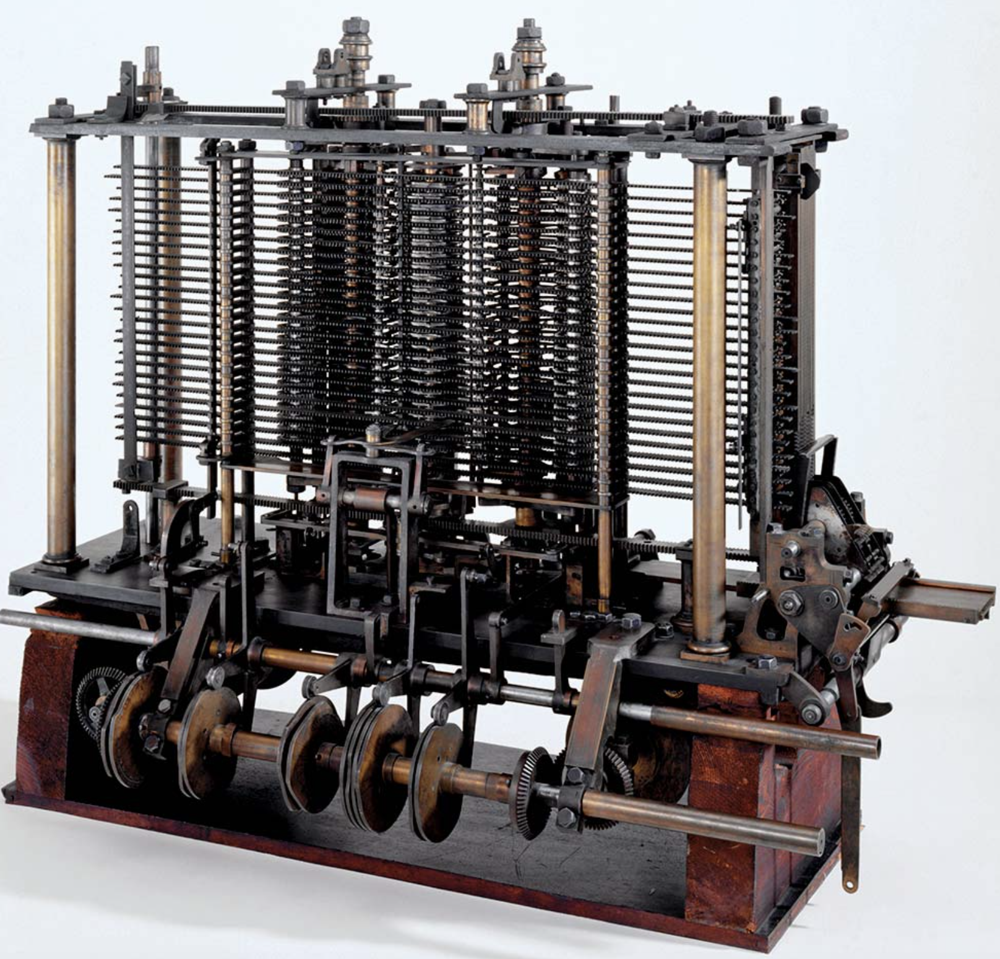{: width="50%"}
  
*   **Ada Lovelace**, who worked with Babbage, published the first computer algorithm and is commonly referred to as the _first computer programmer_.  
    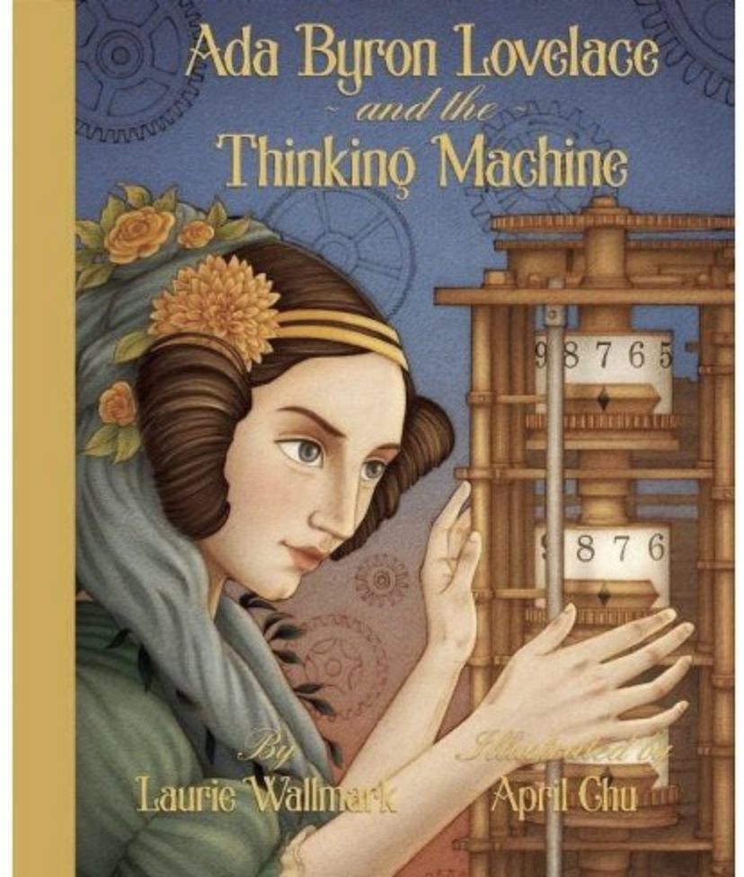{: width="50%"}
  
*   **[Analog mechanical computers](https://www.youtube.com/watch?v=IgF3OX8nT0w)** (late 1800's) were built to solve equations to predict all sorts of things  
    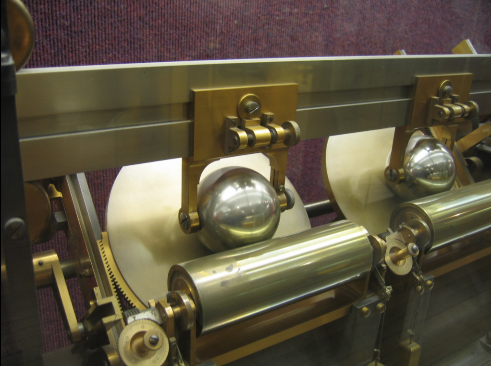{: width="50%"}
  
*   **Electromechanical calculators** (early 1900's).  
    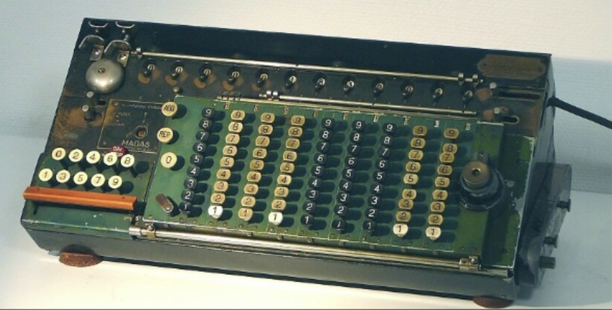{: width="50%"}
  
*   **Z3** (1941) first electromechanical programmable, fully automatic digital computer.  
    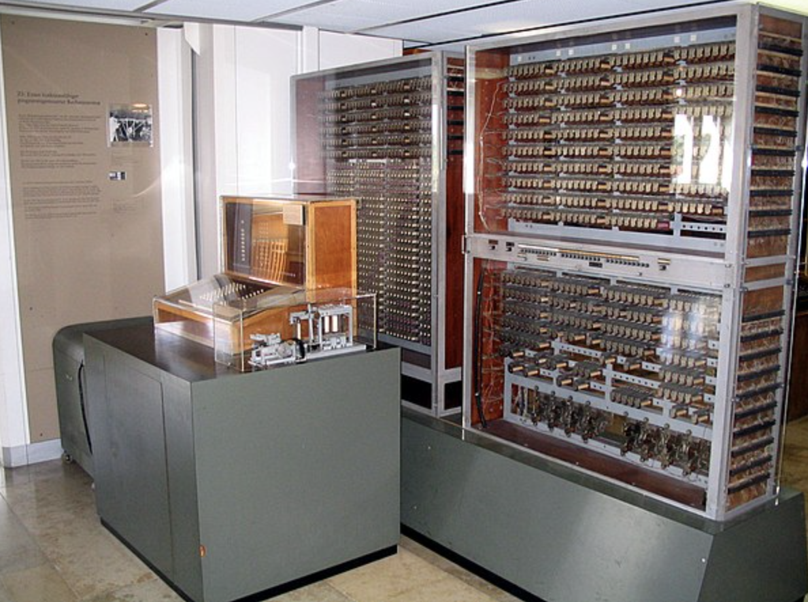{: width="50%"}
  
*   Several electromechanical computers built during WW2 to crack codes. **Colossus** (1943) was the first electronic digital programmable computer. "Programs" were defined by the states of its patch cables and switches.  
    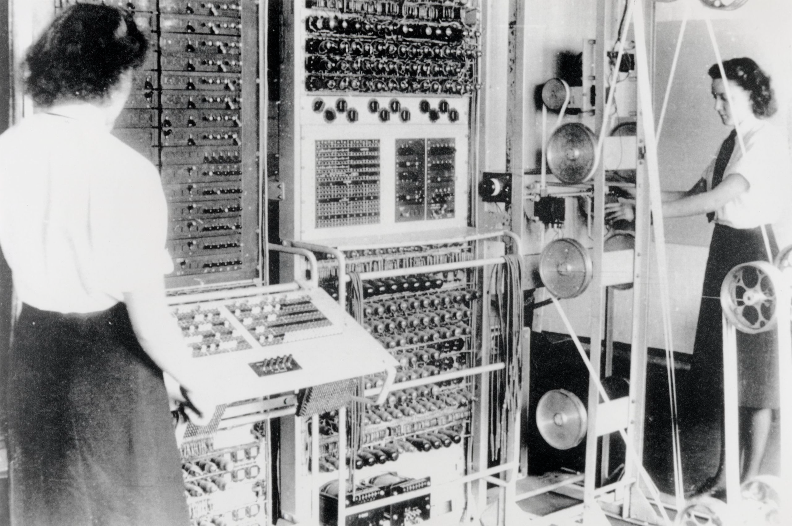{: width="50%"}
  
*   The Original meaning of a "Computer" is "someone that can perform computations"; here, computations refer to calculations, with or without the assistance of an electromechanical device.  
    In the following image, the person performing the calculations is the "computer".  
    {: width="50%"}  
      
    After the advent of electromechanical computers, the term "Computer" refers to the machines, rather than the people.
  
*   After WW2, we see an explosion in computing speed, memory capacity, and programming complexity.  
      
    The electronic stored program (see [Manchester Baby](https://en.wikipedia.org/wiki/Manchester_Baby)) became a "thing".  
      
    An important component is the "transistor" (more on this later) which was invented in 1947.  
    It allowed the construction of smaller, faster, and more efficient computers: **Moore's law** postulated that the number of transistors that can be packed into a given unit of space will double about every two years.  
      
    Effect... look in your pocket or wrist.  
    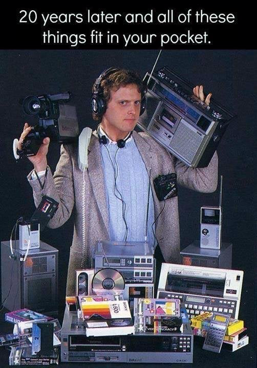{: width="50%"}  
    (this is from the late 80's or early 90's!)

**Activity**: Using these definitions and notes, we can ask the questions:  

*   Is an abacus a computer?
*   Is a calculator a computer?
*   Are one or more human "computers" computers?
*   Can we build a computer using [dominoes](https://youtu.be/OpLU__bhu2w?t=1074) (wait to click)?
*   Can we build a computer using [water](https://youtu.be/IxXaizglscw?t=835) (wait to click)?
