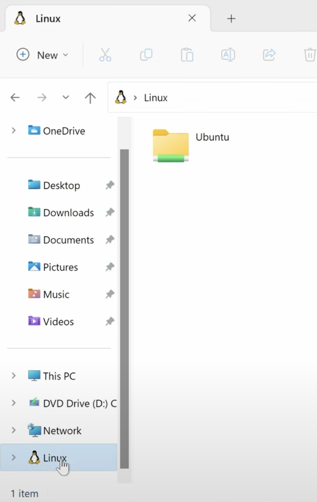
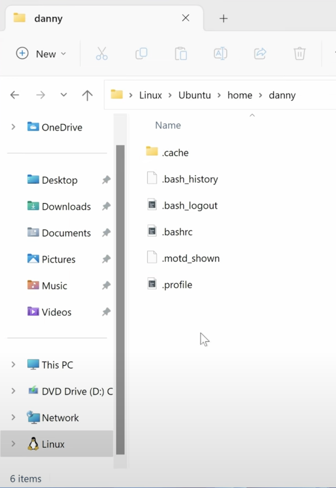

---
layout: default
title: Install_WSL
parent: CSC110
grand_parent: Teaching
nav_order: 3
#permalink: /docs/teaching/csc110/
---  
  

# Installing WSL

If you are in Windows 10 or 11, you might want to install the Windows Subsistem for Linux. This let's you use an environment that is similar to another operating system called Linux (which is similar to a Mac's system). 

This will let us run similar commands on the Terminal and use file and directory paths with the same address structure.

Please Watch this video (up until minute 4 and 18 seconds):

[How to setup WSL](https://www.youtube.com/watch?v=cJWhyycbPyA)

## Basic install

  1. Open PowerShell as Administrator: Right-click on the Start button, select "Windows PowerShell (Admin)" or "Windows Terminal (Admin)".
  2. Run the WSL Install Command: In the administrator PowerShell window, type the following command and press Enter:
  ```
  wsl --install
  ```
  This command will enable the necessary features for WSL, download the latest Linux kernel, set WSL 2 as the default, and install the default Linux distribution (Ubuntu). 

  3. Restart Your Computer: You will be prompted to restart your machine to complete the installation.
  4. Set up your Linux Distribution: After the reboot, the installation will continue. You will be prompted to create a Unix username and password for your Linux distribution.

## Troubleshooting

The error code 
```
Wsl/InstallDistro/Service/RegisterDistro/CreateVm/HCS/HCS_E_SERVICE_NOT_AVAILABLE 
```
during WSL installation on Windows (10 or 11) indicates that the Windows Subsystem for Linux (WSL) cannot start the required virtual machine environment, often due to issues with Hyper-V or other virtualization components.

Here's how to address this issue:


  1. Enable Required Windows Features: Open "Turn Windows features on or off" by searching for it in the Start menu.
  2. Ensure that the following features are checked (See reference image):
     1. Virtual Machine Platform (REQUIRED)
     2. Windows Subsystem for Linux (REQUIRED)
     3. Hyper-V (or Windows Hypervisor Platform): (if available on your Windows edition, typically Pro or Enterprise)

  {: width="80%"} 

  3. Click "OK" and restart your computer if prompted. 

  4. Reset WSL (if previous attempts were made):
Open PowerShell as an Administrator and Run the following commands. 
Code
    ```
    wsl --shutdown
    wsl --unregister Ubuntu # Replace Ubuntu with the name of the distro if different
    wsl --install Ubuntu
    ```


  5. Check Core Isolation (Memory Integrity): Navigate to Windows Security > App & Browser Control > Exploit Protection Settings.
  6. Ensure that "Core isolation" and "Memory integrity" are set to "On." If they were off, enable them and restart your computer. 

  7. Consider Windows Updates: Ensure your Windows installation is fully up-to-date, as pending updates can sometimes interfere with WSL functionality.

### Important Considerations:

  * Restarting: Several of these steps require a system restart to apply the changes correctly. Ensure you restart your computer when prompted or after making significant changes to Windows features or BIOS settings.


## Double Trouble

If the above options were not available, try this:


  1. Enable Virtualization Technology in BIOS/UEFI:
     1. Restart your computer and enter the BIOS/UEFI settings (usually by pressing F2, F10, DEL, or ESC during startup).
     2. Locate the CPU configuration or virtualization settings and ensure that "Virtualization Technology" (or similar, like Intel VT-x or AMD-V) is enabled.
     3. Save the changes and exit the BIOS/UEFI.

# Purpose of WSL

WSL allows Windows machines to house a virtual operating system inside it. The type of system is a Linux OS of the Ubuntu type (or distribution). 

It comes with many things we will find useful:

  * BASH shell and other useful programs to use in the terminal
  * Text editors
  * 

The location of the "home" folder is the following:

  1. Open an Explorer
  2. Locate the new Linux section and open it, 
  3. select Ubuntu 

  {: width="50%"} 


  4. Now select home  
  5. Then select the name you used for your username (it's "danny" in the example)

  {: width="50%"}

## Working wit Ubuntu

Much of the work we'll do can be done in the terminal or with Sublime or Thonny. As a Windows user, you can choose to work only inside the Linux > Ubuntu > home > `your name` folders, or in your WIndows folders.

If you choose to work inside the Ubuntu section, all commands shown to Mac users (including the format of file and folder paths) will be much more closely related with what you do too.


