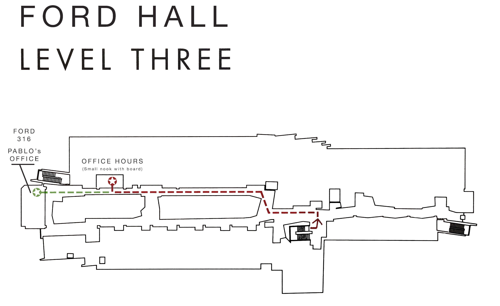

# Class Information

These sections contain information about how the class is run

## Class and Office Hours Schedule

**Professor**: Pablo Frank Bolton (pfrank at smith)

**Research interests**: *Human-Robot Interaction, Robotic Perception, STEM education*

**Class Schedule**: Monday/Wednesday/Friday, 10:50 AM - 12:05 PM / Ford 342

Attendance is mandatory.

**Contact for Class stuff**: Use *Slack* (fastest), office hours (most
detailed), or can also email me (slowest).

**Office Hours**: 

<!-- TBD : Fill this ASAP: [5-minute intro poll](https://www.when2meet.com/?23288198-ImNca) 

  - Wednesday 3:15 PM to 4:15 PM Ford 316 or the Study Nook next to Ford 322 (both shown below).
  - Friday 1:30 PM to 2:30 PM Ford 316 or the Study Nook next to Ford 322 (both shown below).
  - Zoom discussion (Priority questions to students that can't attend OHs in person): Thursday 3:30 PM to 4:40 PM.
  - Open Door Policy: If you find my office door open and I'm inside, feel free to ask for help.

Location of OHs (Ford Hall, Third Floor):
{width=500px}

-->

OH on Monday/Friday 1-2PM Ford 241

**Office Hour Rules**:

  * I like office hours! so please come and chat with me about how your doing and to clarify concepts from the class. That said, and since I have a limited amount of time for OHs, it is best if we're a bit organized:
  * Try before asking: Try the problem or research the concept you have an issue with (at least a little) before asking about it. That let's you get a better view of the problem, ask better questions, and often leads to finding the solution.
  * Check Slack: Check the thread for the lecture/assignment in which you have an issue and see if someone already asked/answered what you need help with
  * Bring questions prepared: Once you know what you need help with, it is best to write down the questions you want to ask and to have the materials ready (slides/assignment/...)
  * If you and a group of people want to review a topic, agree to meet up and attend office hours together. Group office hours is often better because more people means more questions answered!
  * "open office hours" (TBD) are available to everyone, in groups or individually. 
  * If I open calendar appointment slots:
      * "appointment slots" (TBD) are by request (usually reserved for 1-on-1 and to deal with acute issues)
      * If you solve your question before a scheduled appointment, cancel the appointment. No-Shows are bad!
      * Show up on time! and Have your question/program ready, otherwise your time will not be enough.
      * You cant book an appointment fewer than 2 hours before the desired time.

Note: if you have a non-conceptual question and you wanna ask/chat about it, you are also welcome!... no need to "prep questions" in that case.

<!-- 
**In-Class TA**: Skye Worster

See [online calendar](https://www.smith.edu/academics/applied-learning-research/spinelli-center-quantitative-learning/tutoring#disciplines) for details. There basics are: Sunday (1-3pm) and M/T/W/Th/F (7-9pm)
 -->

## Objectives and Structure 

**Objectives**

This course provides a challenging introduction to some of the core theoretical ideas that underlie the computational sciences. The objective of this course is:

  * To develop an understanding of "computer science outside the box" -- to begin to think of CS not only as the science of computers, but as the science of what can be computed.
  * Demonstrate familiarity with key concepts in logic, proofs, and the definitions of multiple computational paradigms.
  * Explain core computer science topics, such as automata, grammars, Turing machines, complexity, and more
  * Propose algorithms in order to transform and analyze problems using the tools and structures we will develop in class

**Effort Expectations**: This class has the expectation that you have mathematical maturity and programming experience, but most imporrtantly: that you can devote the time to the necessary work and study to do well in class. The course is a 4-credit course, which means you should expect to work around **12 hours per week**. 

The recommended distribution is: 

  * approximately 4 hours of class time
  * approximately 5 hours every week on homework assignments
  * approximately **3 hours every week reading or studying** (before and after class).

If you follow this general routine, the class should not be too challenging. If you do not follow this time investment, you will feel accumulating pressure. 

Summary: Please put the time in to make sure you don't feel unnecessary stress.  

**Content**: 

  * We'll begin with very simple computational machinery (automata and finite state machines, regular sets, context-free languages).
  * We'll then move on to Turing machines and computability, efficient algorithms and reducibility, NP-completeness, the P versus NP problem, the power of randomness.
  * We'll draw on real world examples from the domains of cryptography, machine learning, and more.
  * Finally, we'll talk about the present and future of computing theory, with potential topics including interactive proofs, quantum computing and the physical limits of computation.

**Class mechanics**:

  * We will discuss concepts using whiteboard annotations as well as proyected presentations, animations, and videos;
  * Optional readings will be available and are recommended material before each designated lecture. This will help prepare you for the day's discussion.
  * Friday classes will be used to practice the techniques seen during the week by solving exercises and discussing subjects that remain confusing. Note: class participation is important, as the class will include discussion and debate about many of these topics.

**Assignments**:

There will be 6 to 8 problem sets assigned during the semester.

These problem sets will often ask you to prove theorems, but it is more important to demonstrate understanding than to employ rigor for rigor's sake. For example: a brief description of an algorithm including an illustrative diagram is better than complicated spaghetti code. Additionally, a clear explanation of how you tried to solve a problem and were unsuccessful will receive partial credit.

Use the following checklist to guide your answers:

  1. Is my answer Correct? (if not, re work it until you find the correct answer)
  2. Is my answer Complete? (if not, explore corner cases and possible gaps in your logic)
  3. is my answer Concise? (if not, find a way to explain it in fewer words/steps)
  4. Is my answer Clear? (if not, re word it or add an illustration that clarifies your meaning)

If I can't understand what you mean, an answer that is hard to read (because it is to complicated or long) might get a bad grade even if it happens to be correct and complete! Always rework your answers to satisfy points 3 and 4!

All assignment submissions must be in PDF format, and must be organized and legible (typed is preferable). A LaTeX template is available for typesetting your assignments.

## Prerequisites and Student Responsibilities 

**Prerequisites**:

  * CSC110 (or CSC111) and MTH153 (or proof of mathematical maturity). The latter may be taken concurrently with permission of the instructor. Most importantly, I will assume you have basic "mathematical maturity": i.e., that you are comfortable both reading and writing mathematical proofs.

**Responsibilities**:

  * Attendance: You should attend all classes unless you have a valid excuse. I will use Google forms to take attendance/run quizzes at least once a week. Unexcused missed classes mean a loss of points in "Attendance and Participation".
  * Interact, ask questions, and generally participate in class discussions.
  * Complete the assigned preliminary readings and activities before each lecture.
  * Complete problems individually unless working in a group as specified on the assignment in which case you can work only with those group members. We do plagiarism detection so don't throw the course away.
  * When working with a group, it is essential that each group member pull their own weight, but also that other group members let them do so!

**Course Philosophies**

Throughout the class, students should focus on adhering to the following general tenets:

  * Try it! -- A common question is "will this work?", or "what will happen in this case?". The only reasonable answer is "try it and see!".
  * It is OK to make mistakes! -- an error is one learned lesson. After trying something, having that fail is as much a datapoint as a correct path. Note that we usually want correct paths after exploring and making a lot of errors so keep looking!
  * Ask for help when stuck! -- if you have 1) tried multiple paths and 2) you have explored the problem and made many mistakes, and you are still stuck, please seek assistance! that's what were here for! Believe it or not, we actually like teaching and helping you make progress.
  * Know your sources, and use them! -- We'll use Sipser's book and you can look for other online courses to support your learning. Be careful with online materials (like tutorials or articles): they are not necessarily correct! Learn to use your sources productively to help to make progress.
  * Be proud of your submissions! -- Clarity above all. Use proper styling, simplify it where you can to make it more understandable, and comment it where appropriate. You're taking part in an art that most often is shared, and it matters if others can understand your work!
  * Planning is the best problem-solving tool! -- You should not jump into writing solutions or writing code before thinking about it thoroughly. Design your solutions by breaking them into logical parts that make sense independently and when put together to make an argument.
  * Practice methodical analysis! -- Spend time "stepping though" your proofs and solutions, statement by statement to understand the logic behind them, and why it is logically sound (or why it was marked as incorrect). Do not submit a solution that you don't fully understand with the hope of flying under the radar. We look deeply at your submissions to gauge your level of understanding.

## Course Materials

-   **Moodle**: Course full name "CSC250-01: Theory of Computation"
-   **Slack**: You\'ll receive an invitation to the workspace:
    *csc250-01-s25* 

**Books:**

There is no required textbook for the course. However, there are several recommended books that some students may find helpful:

  * Sipser, Michael.  [Introduction to the Theory of Computation](https://openlibrary.org/search?q=Introduction+to+the+theory+of+computation&mode=everything). Course Technology, 2006. ISBN: 9780534950972. (Note: there is a newer edition available, but it is not necessary - the 2nd edition will suffice.)
  * Moore, Cristopher and Stephan Mertens. [The Nature of Computation](http://nature-of-computation.org/). Oxford University Press, 2011. ISBN: 9780199233212.
  * Arora, Sanjeev and Boaz Barak. [Computational Complexity: A Modern Approach](http://theory.cs.princeton.edu/complexity/). Cambridge University Press, 2009. ISBN: 9780521424264.
  * Critchlow, Carol and David Eck. Foundations of Computation. Available free online as [pdf](https://math.hws.edu/FoundationsOfComputation/) and also in [html](https://eng.libretexts.org/Bookshelves/Computer_Science/Programming_and_Computation_Fundamentals/Foundations_of_Computation_(Critchlow_and_Eck)). 
  * Maheshwari, Anil, and Michiel Smid. "Introduction to Theory of Computation." (2019). [Introduction to Theory of Computation](https://cglab.ca/~michiel/TheoryOfComputation/TheoryOfComputation.pdf). Available free online.

  * Webpage for the course: [Course-Schedule](https://frankpablo.github.io/classes/csc250/schedule.html)

## Grading

**Grade Calculation**:

(The following grade calculation may be modified slightly depending on how the semester progresses)

  - Homework Grades **40%**:
  - Quiz Grades **20**
  - Quiz completion (regardless of grade) **5%**
  - Attendance and Participation **5%**
         - in-class Q/A (just ask questions!!)
         - OHs/Slack Q/A
         - attend talks/events
         - answer polls/surveys
  - Midterm Exam:     **15%**
  - Final Exam:     **15%**

**Note**: Any changes in grading will be explained in class and will only be made to benefit the students and fit any refinements done during the semester. Example: If a student exempts the final exam, the exam's 15% will be placed on the HW grade category (which will become 55%) and the result may no go below the grade used to decide the final exam exemption (80% or above). 

### Note on Letter grading:

The grade split in this class is as follows: 

  * A  = \[95%, 100%\], 
  * A- = \[90%, 95%),
  * B+ = \[87%, 90%),
  * B  = \[83%, 87%),
  * B- = \[80%, 83%),
  * C+ = \[77%, 80%),
  * C  = \[73%, 77%),
  * C- = \[70%, 73%),
  * D+ = \[67%, 70%),
  * D  = \[63%, 67%),
  * D- = \[60%, 63%),
  * E  = \[0%, 60%)

### A note on expectations

  * In this class, a B- is a good grade. The average in the last 3 semesters has been a B+. The median in the last 3 semesters has been an A-. 
  * A grade of 89.999999 is a B- so don't discard the value of participation.
  * I do not curve. You get what you get. If the whole class gets all A's, you all get A's. I am also not shy about giving you what you got, so make sure you talk to me often about your grades so I can set your expectations, clarify any doubts, and explain your options.

**Quizzes**:

We will have one quiz per subject after the subject's homework has been submitted. We will obtain grades from them to try to identify misconceptions and recurring errors. 

**Late Submissions**:

We will accept no late submissions without a valid excuse (see exceptions). Failing to finish a homework on time excludes you from the active grading exercise where much of the actual learning happens. Submitting "what you were able to get done" is better than nothing. 

Also, for Office Hours, you must show progress up to the point where you got stuck. 

*Exceptions*: 

That said, we will have the following "stress release" policies in place:

  - If you have a justification (like a medical one), you get an extension depending on what makes most sense.
  - If you feel overwhelmed come talk to me before the due date and we will find a solution.

**Recovery options**:

We will have a few ways of alleviating grade pressure:

  * Discarding the worst HW: the worst in the first few homework assignments (all but the last 2) will be discarded.

  * Discarding the worst quiz: the worst in the first few quizzes (all but the last 2) will be discarded.

  * HW Points back: By the end of the semester, I will allow you to get up to 50% of your lost quiz points. You can do this by scheduling a 15-minute meeting with me, where we will **talk** about what you missed and what you learned after checking the feedback I gave you. Restudy pays! Note that you'll get as many points as we clarify in those 15 minutes (usually around 5 questions worth of points back).

  * Quiz points back: By the end of the semester, I will allow you to get up to 50% of your lost quiz points. You can do this by scheduling a 15-minute meeting with me, where we will **talk** about what you missed and what you learned after checking the feedback I gave you. Restudy pays! Note that you'll get as many points as we clarify in those 15 minutes (usually around 5 questions worth of points back).

  * A student that obtains a running average equivalent to a B- (80% or above), may chose to exempt the final exam. Note: If you chose to take the final, whatever you obtain will be included in your final grade.

**Collaborations**:

  * Students can choose to complete homework assignments in groups of 1, 2, or 3. 
  * Students are strongly encouraged to form study groups and to collaborate on problem sets because this helps develop the following skilles:
      * team management and communication (this is often an important aspect in recommendation letters!)
      * developping the skilles to discuss theoretical concepts out loud (good for job interviews!)
      * gives you the chance to hear other approaches (this is how science gets done!)
  * Each team of will be required to submit a single problem set and **report the names of their collaborators** (or lose points). The following information is required for all submitted work:

     1. The names of all collaborating students be listed at the top of the submission. 
     2. A "References" section, with in-line citations to any resources you used. Citations should include page numbers (if a printed resource) or a direct URL (if an online resource). If you did not use any resources in completing the assignment, please state: "I did not utilize any external resources in completing this assignment."

**Accommodations**:

As individuals, we learn in different ways. I try to vary the activities used during the course to suit a variety of learning patterns, and I am always open for suggestions. Please come talk to me if you have an idea that will make the course more accessible to you and/or other students. If you need special accommodation, like extended exam time, please submit requests for accommodations in writing with proof of College support from the Office of Disabilities Service within the first two weeks of class. Let me know if you need help with this process.

## Academic Honesty

Team assignments require collaboration amidst each team, but no
collaboration between teams is permitted. If you did not work in a team
then you are not allowed to collaborate on the homework assignments. We
use software to compare submissions, so please don't risk it. If
you're having significant trouble with an assignment, please contact
me.

Please check the [Student
Handbook](https://www.smith.edu/about-smith/offices/student-affairs/student-handbook)
to see the rules for Academic Integrity.

Just as you can do a google search for code online, it is trivial for us
to do the same. If you feel pressured about an assignment, please come
see me instead of cheating.

## Academic and Mental Health Resources 

The following are resources available to you that may provide assistance
and support during the semester.
They provide help for learning, mental health, and wellness.

**Learning resources**:

-   [Spinelli Center for Quantitative Learning](https://www.smith.edu/qlc/index.html)
-   [Jacobson Center for Writing, Teaching, and
    Learning](https://www.smith.edu/academics/jacobson-center)
-   [Teaching, Learning and Research
    Librarians](https://libguides.smith.edu/prf.php?account_id=14436)

**Mental Health and Wellness resources**:

-   [Crisis
    Resources](https://www.smith.edu/student-life/health-wellness/counseling-services/crisis-resources)
-   [Counseling
    Services](https://www.smith.edu/student-life/health-wellness/counseling-services)
-   [Wellness](https://www.smith.edu/student-life/health-wellness/wellness-services)

**Additional support resources**:

-   [Gender Identity and Expression
    Resources](https://www.smith.edu/about-smith/equity-inclusion/gender-identity-expression)
-   [Report sexual misconduct and other forms of
    discrimination](https://smith.ethicspoint.com/)

## Anonymous Feedback Form 

We will add a link inside Moodle to an anonymous feedback form so you
can let us know if there is anything getting in the way of your
learning.

## Comments from previous semesters

I usually add a section with the exact copies of recomendations from students in previous semesters. Since ALL of them are exactly of the same vein, I smiply summarize them here:

  * **Ask for Help**: This is a confusing and challenging class. If you feel a little lost, then you are exactly in the right class and the way to learn is to ask. Go to Office Hours often, even if you only need a safe space to work in. Go to TA-hours, they are great and know all the tricks. Ask your classmates! (just don't share actual answers).
  * **Understand the question**: Before getting bogged down by details, think about the big picture. What are you beain asked? What does it mean? Work down from the big picture to the detailed instance so you always know what it is you are doing.
  * **Start Early**: Constructing proofs is not like writing an essay. You can't just put in 2 hours of work and say "wherever it is by the time I'm done, that's what I'm turning in". No. The argument either works or ir does not, and it might take 1 hour or 7 (depending on several factors: did you asked for help?). The best way to deal with this is to start the day the assignment is issued and then come back to it early and often until it is out of the way.
  * **Don't be affraid to make mistakes**: Getting errors is not something to avoid. THAT IS THE WHOLE CLASS: how to understand something and explain it in an unambiguous way. You are bound to slip once in a while. The in class exercises and office hours are for getting things wrong and learning from them. Even the homework and quizzes are designed such that you can learn fromm your mistakes and not be too scared about losing points. Try things out and deal with any errors calmly. READ THE FEEDBACK, later on, it will pay off.
  * Students tend to say they learned a lot (despite the amount of work), that they liked the class, and to go see me and ask questions because I am not scary... but I'll leave that to your own judgement.

# Q & A

  * Q: **When are the instructor's office hours?**
      * A: TBD (we'll define them using a poll and set 2 x 1-hour sessions; in addition, we can always meet over zoom with prior arangement or discuss over Slack).
  * Q: **Where are office hours?**
      * A: Ford Hall, Third Floor, Chemistry side, to the end: Office #316; We might also save the classroom for OHs.
  * Q: **What can I do if I am not free during office hours?**
      * A: we can set up an appointment to meet over zoom (usually 10 min). Also, there will be TA help available (TBD).
  * Q: **When are the TA's office hours?**
      * A: TBD.
  * Q: **Can I submit Homework Assignments late?**
      * A: Only with prior permission (Slack) given an explanation or because of emergency (e.g. health); HWs build on each other so the maximum extension is 4 days (given sparingly).
  * Q: **Can I complete a quiz late?**
      * A: Only with prior permission (Slack) given an explanation or because of emergency (e.g. health); Quizzes are used for attendance AND formative assessments so you only get 1 free late attempt.      
  * Q: **Will you record classes?**
      * A: No. 
  * Q: **Can I "attend" classes over Zoom?**
      * A: Only due to health reasons and with previous permission from the instructor. In addition, the instructor will not manage the zoom call so you need to get a classmate to: 1) sit in front, and 2) manage the zoom call and your questions. I can lend that person a webcam for easy setup.  
  * Q: **What do I need to get started?**
      * A: Access to the [website](https://frankpablo.github.io/smith-site/docs/teaching/csc250home/), access to Moodle for the course, access to the Slack workspace for the course.
  * Q: **What do I do if I am not officially registered (I don't have Moodle)?**
      * A: The course has a cap, and only if students leave will I let other students in. I will pick students based on the waitlist with no preference given to anyone.
      

#### Acknowledgement

Some of the materials used in this course are derived from lectures, notes, or similar courses taught at this (thanks, Jordan) and other institutions. Appropriate references will be included on all such material.
