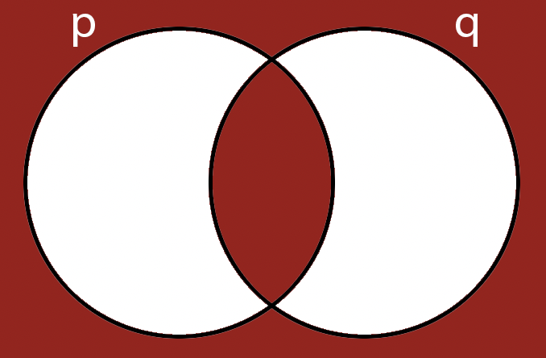

---
layout: default
title: Lecture02
parent: CSC250
grand_parent: Teaching
nav_order: 2
#permalink: /docs/teaching/csc110/
---  
  

Lecture Notes 02: Intro to Logic and Proofs
===========================================

Outline
-------

This class we'll discuss:

* Why logic?
* Crash course in logic
* What makes a good proof?
* Three kinds of proofs:
   * Direct
   * Contradiction
   * Contrapositive

  

* * *

Bird's eye view
---------------

**Remember**: we will have to convert real-life problems to language (symbols, operators, delimiters, quantifiers,...) so we can talk about them, and hopefully solve them, in the abstract.  
  
So... we must agree on some rules about symbol manipulation and drawing conclussions. That is why we'll discuss how to argue a point in such a way that it leaves no room for "comebacks" / "clapbacks" / "retaliation", etc ... in short: in such a way it does not leave the door open for a counter argument.

  

* * *

  

Logic and Logical Thinking
--------------------------

  
  
**Activity 1** \[2 minutes\]: What is Logic and logical thinking?

   

    One possible answer: 
      

(Wait; then Click)

        

          <i>The process of obtaining a conclusion from a set of propositions taken to be true.</i> 
        

      

    
  

  

#### Two Examples

1.  Easy one:
    
    * Dogs are better than Cats (Proposition or Premise A)
    * Cats are better than Parrots (Proposition or Premise B)
    * Therefore: Dogs are better than Parrots (Proposition or Conclusion C)
    
      
    Note that since we've determined that "All Dogs are better than Parrots"  
    we can now use this as another proposition.
  
  
4.  A Difficult one:
    * If Yak barks, I can't work
    * If I can't work, students are assigned no homework
    * If students have no homework, students are happy
    * Students are happy
    * Therefore: \\( ??? \\)

we'll analyze these and more examples using some structure.  
  
**Activity 2** \[2 minutes\]: if we just use English to analyze the material, **what could go wrong?**

One possible answer: (Wait; then Click)

   

    One possible answer: 
      

(Wait; then Click)

        

          <i>Ambiguity!.</i> 
        

      

    
  

  
Example:  
  
If a waiter asks: "Would you like a burger or a hotdog?"  
You could answer: "Yes".  
  
Where is the _linguistic issue_ in this exchange?  
  
Other issues: language artifacts, like [contronyms](https://en.wikipedia.org/wiki/Auto-antonym){:target="_blank"} (_dust_, _clip_, _fast_), or  
[homonyms](https://en.wikipedia.org/wiki/Homonym){:target="_blank"} ( "Buffalo buffalo buffalo Buffalo buffalo").

  
  
We need to use some structure to keep track of and operate with propositions that are unambiguous.  
  
For this, we'll use some _agreed-upon_ terminology.  
  
As an _alternative mode of visualizing_ the concepts, whenever possible,  
we'll make use of **Venn Diagrams**.

  

* * *

  

Terminology
-----------

* A **proposition** is a statement that has a truth value (either true or false).  
      
    Example:  
    * The Proposition: "All prime numbers are odd", has a truth value of **false**
  
  
* A proposition has internal structure:  
    It states that all or some members of a set have a property that makes them members of another set.  
      
    Example:  
    
    * "grass is green"
    
      
      
    The **subject** ("grass") refers to the part of the proposition that is to be the focus of the statement.
  
The **predicate**("is green") indicates a property of the set of elements pointed to by the subject.  
  
  
  
* **Quantifiers** enable us to build propositions with degree:  
      
    Example:  
    * "All grass is green"
      
      
    * "No grass is green"
      
      
    * "Some grass is green"

  
  

### Propositional Logic

The process by which we can _combine_ propositions, in a **logical computation**, to obtain valid conclusions  
OR  
with which we can detect errors in the logical computation and refute a conclusion.

  
  
**Activity 3** \[2 minutes\]: how do we combine propositions?  
  
   

    One possible answer: 
      

(Wait; then Click)

        

          <i>Logical Operators!... yes. The answer was the next title :)</i> 
        

      

    
  

  

* * *

  

Logical Operators
-----------------

In this section we'll discuss **logical operators**, which are rules that indicate the resulting effect on a proposition or a set of propositions when operated upon.

  
  

### Negation

The negation operator, symbol: \\( \\neg \\), AKA **NOT**, is a _unary_ operator and it refers to the opposite truth value of a proposition.  
  
We can show the effect of this operator using a table: 

| p   | ¬p  |
| --- | --- |
| True | False |
| False | True |

another view: 

| p   | ¬p  |
| --- | --- |
| 1   | 0   |
| 0   | 1   |

  
  
{: width="20%"}  
  
Example: I am not Swedish.  
Note: other symbols you might see are: \\( \\neg p \\text{, } \\sim{p} \\text{, } \\bar p \\text{, } !p \\).

  
  

### Conjunction

The conjunction operator, symbol: \\( \\wedge \\), AKA **AND**, is a _binary_ operator; _it is true if and only if both of its operands are true_.  
  
We can show the effect of this operator using a table: 

| p   | q   | p∧q |
| --- | --- | --- |
| False | False | False |
| False | True | False |
| True | False | False |
| True | True | True |

 another view: 

| p   | q   | p∧q |
| --- | --- | --- |
| 0   | 0   | 0   |
| 0   | 1   | 0   |
| 1   | 0   | 0   |
| 1   | 1   | 1   |

  
  
{: width="20%"}  
Note that we're labeling on the outside for clarity, but the label refers to the interior of each circle  
  
Example: I am walking and chewing gum.  
Note: other symbols you might see are: \\( p \\wedge q \\text{, } p\\cdot q \\text{, } p\\&q \\).

  
  

### Disjunction

The disjunction operator, symbol: \\( \\lor \\), AKA **OR** is a _binary_ operator; _it is true if any of its operands is true_.  
  
We can show the effect of this operator using a table: 

| p   | q   | p∨q |
| --- | --- | --- |
| False | False | False |
| False | True | True |
| True | False | True |
| True | True | True |

 another view: 

| p   | q   | p∨q |
| --- | --- | --- |
| 0   | 0   | 0   |
| 0   | 1   | 1   |
| 1   | 0   | 1   |
| 1   | 1   | 1   |

  
  
{: width="20%"}   
  
Example: I want a burger or a hotdog.  
Note: other symbols you might see are: \\( p\\lor q \\text{, } p+ q \\text{, } p\\mid q \\).

  
  

### Exclusive Disjunction

The exclusive disjunction operator, symbol: \\( \\oplus\\), AKA **XOR** is a _binary_ operator; _it is true if its operands are different_.  
  
We can show the effect of this operator using a table: 

| p   | q   | p\\( \\oplus \\)q |
| --- | --- | --- |
| False | False | False |
| False | True | True |
| True | False | True |
| True | True | False |

 another view: 

| p   | q   | p\\( \\oplus \\)q |
| --- | --- | --- |
| 0   | 0   | 0   |
| 0   | 1   | 1   |
| 1   | 0   | 1   |
| 1   | 1   | 0   |

  
  
{: width="20%"}  
  
Example: No equivalent in the english language... or is there? (**suspenseful music**)  
Note: other symbols you might see are: \\( p\\nleftrightarrow q \\text{, } p\\veebar q \\text{, } p\\not\\equiv q \\).

  

* * *

  

Compound Propositions
---------------------

We can combine these building blocks to make arbitrarily complicated propositions:  
  
\\\[ (p \\wedge ¬q) \\lor (\\neg p \\wedge q) \\\]  
  
**Activity 4** \[2 minutes\]: What is this saying?  
  
Hint: if you build its table, you'll realize it looks llike something...

   

    One possible answer: 
      

(Wait; then Click)

        

          <i>same as XOR</i> 
        

      

    
  

  
  

### More operators: Implication

**Implication**, symbol \\(\\rightarrow\\), AKA **IMPLIES**, is a binary operator that states that:  
_IF p is true, then q **must also be true**_  
  
We can show the effect of this operator using a table:  

| p   | q   | p\\( \\rightarrow \\)q |
| --- | --- | --- |
| False | False | True |
| False | True | True |
| True | False | False |
| True | True | True |

<!-- 6f439a -->
 
   
 
          
        

          Think of the whole statement as a <b>promise</b>;    
          You only "tag" it as FALSE when you break the promise.  
        

      
  

  

  
Rows 3 and 4 are the "normal" ones:

* In Row 3, The promise "IF p is True, then q is also True" has been broken! (because q is NOT True)... so the statement is False (the promise is broken)
* In Row 4, the "IF p is True, then q is also True" has been kept! so the whole statement is True!

  
**But what is happening in rows 1 and 2?**  
Rows 1 and 2 are True because they "technically" are not breaking the promise. We call the Truth value of these statements "Vacuous Truths"  

* In Row 1, The promise "IF p is True, then q is also True" is not being employed (because p is NOT True), regardless of the value of q... so the statement is True (the promise is not broken)
* In Row 2, The promise "IF p is True, then q is also True" is not being employed either (because p is NOT True), regardless of the value of q... so the statement is True (the promise is not broken)

  
  
**Examples**:

* "All my children are goats" is a vacuous truth, when spoken by someone without children
* For the implication "For any integer \\(x\\), if \\(x > 5 \\rightarrow x > 3 \\)",  
    some of its implications are _vacuously true_, like when \\(x\\) is 2, which implies the vacuous truth that  
    if \\(2 > 5 \\rightarrow 2 > 3 \\)  
      
    
* Another example would be:  
    "All living people in the world are resistant to moonlight"  
    This can be written as:  
    
    \\( \\text{if P: living person} \\quad \\text{and M: resistant to moonlight} \\), then the statement is:  
    \\(P \\rightarrow M\\)  
      
    The combination when \\( \\neg P \\text{ (not P, or P:False) and } \\neg M \\text{ (not M, or M:False) } \\)  
      
    Would be True: \\(\\neg P \\rightarrow \\neg M\\)  
    
    and since a vampire is "undead" and "not living", then...

    the sentence:  
      
    **If there are vampires in the world, they are susceptible to moonlight**"  
      
    Is (vacuously) True (I hope).  
      
    {: width="60%"}  
      
    

The left of the \\(\\rightarrow\\) operator in an implication is called the **antecedent**, and the sentence to the right is called the **consequent**.  
  
The best way to remember the way implication works is with this statement:  
The truth value of an implication is false if and only if its antecedent is true and its consequent is false; otherwise, the truth value is true.  
  
**Activity 5** \[2 minutes\]: Can you draw the Venn Diagram for this one?

   

    One possible answer: 
      

(Wait; then Click)

        

                    
        

      

    
  

  
  

### More operators: If and only if

**If and only if**, symbol \\(\\Leftrightarrow\\), AKA **IFF**, is a binary operator that states that:  
_IF p is true, then q **must also true**, and IF q is true, then p **must also true**!_  
  
We can show the effect of this operator using a table:  

| p   | q   | p\\( \\rightarrow \\)q | p\\( \\leftarrow \\)q | p\\( \\Leftrightarrow \\)q |
| --- | --- | --- | --- | --- |
| False | False | True | True | True |
| False | True | True | False | False |
| True | False | False | True | False |
| True | True | True | True | True |

  
  
**Activity 6** \[2 minutes\]: Can you draw the Venn Diagram for this one?  
  

If you look at the p, q, and p\\( \\Leftrightarrow \\)q columns, you might see something that looks familiar

  
  
   

    One possible answer: 
      

(Wait; then Click)

        

                    
        

      

    
  

  

* * *

  

Inference
---------

Inference is the process of obtaining logical consequences from premises.  
  
Let's use an example:

{: width="60%"}

  

  
**Activity 7** \[2 minutes\]: What can you infer if you do not hear a honk?  

You can assume that:  

  * we have a driver behind us;  
  * the driver saw the sign;  
  * they have a working horn  
  * people in this town take bumper stickers seriously

Hint: maybe restructure the statement as a proper implication:

\\( \text{if you love formal logic } \rightarrow  \text{ Honk} \\)

... Now, do logic    
  

### Symbolic manipulation

For some problems, holding the information in our head and making sense of it is quite hard.  
Luckily, we have been building a _symbolic language_ that can take the place of "thoughts that make sense so far" so that  
we can continue doing our logical computation.

  
  

#### Precedence

We have accumulated some symbols:

* parentheses
* \\(\\neg\\)
* \\( \\wedge \\)
* \\(\\lor\\)
* \\(\\oplus\\)
* \\(\\rightarrow\\)
* \\(\\Leftrightarrow\\)

when several of the same operator are in a row (i.e. \\(a ∧ b ∧ c\\)), evaluate from left to right.  
  
(There are a couple of cases where this is not true, but we won't look at those here)

  
  

#### Curious Constructions: Tautology

  
**Activity 8** \[4 minutes\]: What can you tell about the following proposition?  
  
\\\[ (p \\lor q) \\wedge (\\neg q) \\rightarrow p \\\]

**Answer below**

   

    One possible answer: 
      

(Wait; then Click)

        

<table class="tg">
<thead>
  <tr>
    <th class="tg-0pky">p</th>
    <th class="tg-0pky">q</th>
    <th class="tg-0pky">p ∨ q</th>
    <th class="tg-0pky">¬q</th>
    <th class="tg-0pky">(p ∨ q) ∧ (¬q)</th>
    <th class="tg-0pky">(p ∨ q) ∧ (¬q) →p</th>
  </tr>
</thead>
<tbody>
  <tr>
    <td class="tg-0pky">0</td>
    <td class="tg-0pky">0</td>
    <td class="tg-0pky">0</td>
    <td class="tg-0pky">1</td>
    <td class="tg-0pky">0</td>
    <td class="tg-0pky">1</td>
  </tr>
  <tr>
    <td class="tg-0pky">0</td>
    <td class="tg-0pky">1</td>
    <td class="tg-0pky">1</td>
    <td class="tg-0pky">0</td>
    <td class="tg-0pky">0</td>
    <td class="tg-0pky">1</td>
  </tr>
  <tr>
    <td class="tg-0pky">1</td>
    <td class="tg-0pky">0</td>
    <td class="tg-0pky">1</td>
    <td class="tg-0pky">1</td>
    <td class="tg-0pky">1</td>
    <td class="tg-0pky">1</td>
  </tr>
  <tr>
    <td class="tg-0pky">1</td>
    <td class="tg-0pky">1</td>
    <td class="tg-0pky">1</td>
    <td class="tg-0pky">0</td>
    <td class="tg-0pky">1</td>
    <td class="tg-0pky">1</td>
  </tr>
</tbody>
</table>

A Tautology is an assertion that is always true.  
In its most basic form, it is: 
 
q &or; p
        

      

    
  

  
  

#### Curious Constructions: Contradiction

  
**Activity 9** \[1 minute\]: What can you tell about the following proposition?  
  
\\\[ q \\wedge \\neg q \\\]

   

    One possible answer: 
      

(Wait; then Click)

        

          <i>This proposition is always false!</i>          
        

      

    
  

  

* * *

  

A Convincing Argument
---------------------

In spoken English we talk of "making a point".  
  
We usually "grant" said point when the person has made a convincing argument or revealed an unforeseen truth.  
  
As we mentioned before, using English leaves you exposed to ambiguity, contradictions, or language artifacts.  
  
In propositional logic, we can create a convincing argument using propositional logic by chaining together a series of boolean statements until we get to the desired conclusion.

  
  

#### A Logic puzzle

Aleks, Benita, Chas, and Dora are quadruplets, and they’ve all been invited to a birthday party. Unfortunately the quadruplets don’t get along very well:

* If Aleks goes to the party, then Benita will not go.
* If Chas goes to the party, then Aleks will not go.
* If Dora goes to the party, then Chas will not go.

**Activity 10** \[4 minutes, if we have time\]: What is the largest possible number that will go to the party?

  

* * *

  

Proofs
------

We will see a _very high-level intro_ to three types of proofs:  

* direct proofs (deduction)
* proof by contradiction
* proof by contrapositive

  
  

#### Direct proof {:target="_blank"} Deduction

To quote Wikipedia: "Deductive reasoning goes in the same direction as that of the conditionals, and links premises with conclusions. If all premises are true, the terms are clear, and the rules of deductive logic are followed, then the conclusion reached is necessarily true."  
  
Example:  

* Yak is the best dog
* half of all dogs are better than all cats
* Therefore: Yak is better than all cats

  
  

#### Proof by {:target="_blank"} Contradiction

Start by assuming (taking as a true proposition) the opposite of what you wish to prove.  
Follow the normal rules of propositional logic and if:

* You arrive at a valid conclusion: you were wrong
* You arrive at a contradiction: then the opposite of your initial assumption is true (what you wanted to prove)

  
  
Example:  
Let's say we want to prove that: "there is no smallest rational number greater than 0"  
Using proof by contradiction, we say:

* "there is a smallest rational number r greater than 0"
* however, we can make a new number s = r/2 that is >0 since r > 0
* Since s < r, and s is a rational number, then r was **not** the smallest
* Therefore: "there is no smallest rational number r greater than 0"

  
  

#### Proof by {:target="_blank"} Contrapositive

If we take an implication proposition as true, there is another proposition we can extract from it by performing some manipulations:  
  
To obtain the contrapositive of a proposition, we:

* negate both terms
* reverse the direction of inference

So if we have have the proposition \\( p \\rightarrow q \\), then, the steps are:

* negate both terms: \\( \\neg p \\rightarrow \\neg q \\)  --->**this is not correct...yet!**
* reverse the direction of inference: \\( \\neg q \\rightarrow \\neg p \\)  --->**this is the new proposition!**

  
  
So, both \\( p \\rightarrow q \\) and \\( \\neg q \\rightarrow \\neg p \\) are true.  
  
**Example**:  
Let's say we accept that: "For any integer k, if 3k + 1 is even, then k is odd."  
  
We could represent this symbolically:

* \\(p\\) is "3k + 1 is even"
* \\(q\\) is "k is odd"
* Then the phrase is: \\(\\forall k \\in \\mathbb{Z}, \\text{ } p \\rightarrow q \\)
* Then the contrapositive of the phrase is: \\(\\forall k \\in \\mathbb{Z}, \\text{ } \\neg q \\rightarrow \\neg p \\)
* Which translates to: "For any integer k, if k is not odd, then 3k + 1 is not even"
* OR more clearly: "For any integer k, if k is even, 3k + 1 is odd."

An example of a full proof by contrapositive would be:  
  
_Proof_: We will prove the contrapositive of this claim, i.e. that **for any integer k, if k is even, 3k + 1 is odd**.  
Suppose that k is an integer and k is even. Then, k = 2m for some integer m.  
Then 3k + 1 = 3(2m) + 1 = 2(3m) + 1.  
Since m is an integer, so is 3m. If we say n = 3m, Then 2(3m) + 1 = 2n + 1, which is an odd number.  
This means 3k + 1 = 2(3m)+1 = 2n + 1 = an odd number, which is what we needed to show.  
  
Example from the University of Illinois Urbana-Champaign, CS173

  

**Activity 11** \[4 minutes, if we have time\]:  
Prove the following statement: "Theorem: For any \\(n \\in \\mathbb{Z}\\), if \\(n^2\\) is even, then \\(n\\) is even."

  

* * *

  

Logical Errors
--------------

**Activity 12** \[4 minutes, if we have time\]:  
What is wrong with this statement:

If the weather is stormy, we can’t go swimming.  
If we can’t go swimming, we won’t go to the beach.  
We aren’t at the beach.  
Therefore, the weather must be stormy.

  
  

#### Converse

The **converse** of an implication is is the result of inverting the direction of the implication, so if:  
\\( p \\rightarrow q \\)  
  
The converse would be:  
\\( q \\rightarrow p \\)  
  
The error would be in believing that just because an implication is true, its converse is too.  
  
**Example**:  
"Petting dogs makes me happy.  
"I am happy, therefore I am petting a dog"  
OR (Jordan's example!) "Being happy makes me pet dogs."

  
  

#### Inverse

The **inverse** of an implication is is the result of inverting (negating) its propositions while maintaining the direction of the implication, so if:  
\\( p \\rightarrow q \\)  
  
The inverse would be:  
\\( \\neg p \\rightarrow \\neg q \\)  
  
The error would be in believing that just because an implication is true, its inverse is too.  
  
**Example**:  
"Petting dogs makes me happy.  
"I am not petting a dog, therefore I must not be happy"

**Activity 12** \[4 minutes, if we have time\]:  
Think about the following "puzzle":

A prosecutor in Logic Court (which is totally a thing) says to the defendant:  
"If you committed the crime, then you must have had an accomplice" (this is known).  
The defendant hotly denies that the _implication_ is true.  
  
Therefore, the jury (being apt logicians) convicts the defendant.  
  
Explain what happened in this story.

  
  

  

* * *

  

#### Homework

  
**\[Due for everyone\]**: Go over any exercises we did not do in class (participation opportunity next class!)  
Bring me questions and be ready to work in groups.  

Then, read the overleaf guide and check the tutorials mentioned below.
  
  

### Submitting Assignments in Latex using Overleaf

[Overleaf](https://www.overleaf.com/){:target="_blank"} is an online LaTeX editor.  
  
_What is LaTeX?_ you ask.  
From [https://www.latex-project.org/](https://www.latex-project.org/){:target="_blank"}:  

> _"LaTeX is a high-quality typesetting system; it includes features designed for the production of technical and scientific documentation. LaTeX is the de facto standard for the communication and publication of scientific documents."_
> 
> a lot of geeks like me (and you, soon enough)  

  

#### How to Learn LaTeX?

I will provide templates for every Assignment where you only need to fill-in what your answer is. Whether it is text-only, text with mathematical symbols, equations, or even diagrams, there is a way to do it in overleaf.  
  
Follow this [Oveleaf guide to learn LaTeX in 30 minutes](https://www.overleaf.com/learn/latex/Learn_LaTeX_in_30_minutes){:target="_blank"}.  
  
Overleaf has a set of quicklinks on the right side that have most (if not all) of what you'll need. Some of the most important things are the [symbols](https://www.overleaf.com/learn/latex/List_of_Greek_letters_and_math_symbols){:target="_blank"}!.  
  
Later on, we'll use the [FSM designer](https://madebyevan.com/fsm/){:target="_blank"} to make nice digrams like the ones shown below.  
  
