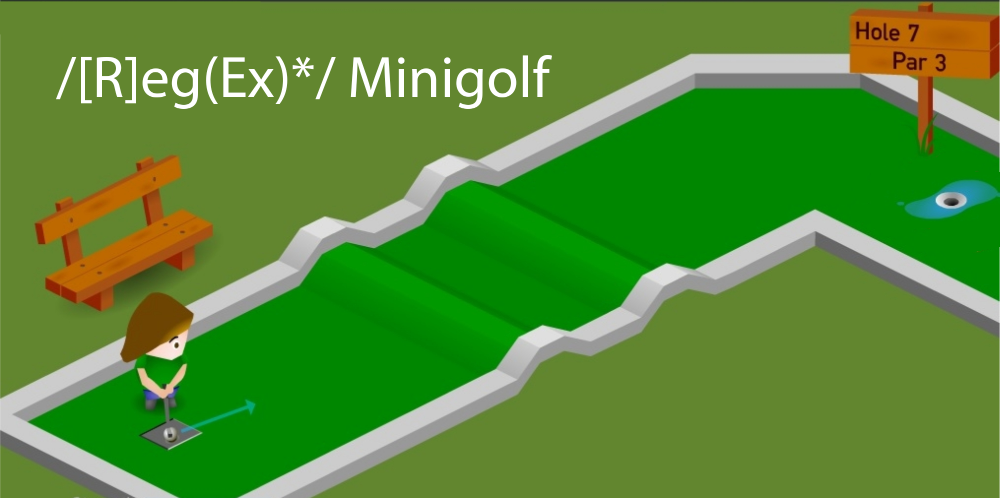

---
layout: default
title: Lecture05
parent: CSC250
grand_parent: Teaching
nav_order: 5
#permalink: /docs/teaching/csc110/
---  

Lecture Notes 05: Regular Languages and Regular Expressions
=============================================================

  

## Outline ##

This class we'll discuss:

* What are we doing?
* Regular Expressions
* Regular Languages

  

* * *

  

A Map of what we'll be doing in class
-------------------------------------

### What are we going to do?

  
As we mentioned last class, We are going to analyze what types of problems can be solved with minimal "machinery".  

* what can we do with a specific type of "machine", or in other words: "what types of problems can we solve?"
* Another way to look at it is: "Given problem A, what is the minimal "machine" that can help me solve it.

  
  
We are going to work up from basic machines up to the modern computer.  
  
  
  

### How are we going to do? it

  
Since we are not really going to build those machines in hardware, we will need to "represent" them symbolically.  
  
We will be _building symbolic machines_ to solve problems of greater and greater complexity.  
  
  
  

### A candidate "simple" problem:

$$ 
\begin{align*} 
& 1001011 \\ 
& + \\ 
& 0111011 \\
\end{align*} 
$$
  
While this might look simple, this is really a very advanced problem, it requires that the machine know:

* what 1001011 is
* what + means
* what 0111011 is, and
* How to do it

  
  
In other words, performing **Arithmetic operations** is a few "machines" away.  
  
  
  

### Step 1: recognizing a pattern

  
You can think of a machine that recognizes things and can clasify them as being in a set of known elements or being outside that set of know elements.  
  
With our _symbolic_ replicas, a first task would be to be able to specify the structure or pattern of a set of symbols that we would like to be able to recognize.  
  

### How to build a "recognizing" machine

  
**Activity 1** \[1 minute\]:  
Can you think of a super simple (mechanical) machine that "recognizes" things?

Think before revealing some examples: 

   

    One possible answer: 
      

(Wait; then Click)

        

          think of a sieve:  
           
			It "recognizes" small particles and lets them through!          
        

      

    
  

  
  
**Activity 2** \[1 minute\]:  
Can you think of a super simple (mechanical) machine that "recognizes" a pattern (sequence of things)?

Think before revealing some examples: 

   

    One possible answer: 
      

(Wait; then Click)

        
            
think of a  <a href="https://youtu.be/1NUu0PiM-YI" target="_blank" rel="noopener noreferrer">locking mechanism</a>:  It "recognizes" a key!
        

      

    
  

  
  
**Regular Expressions** are like lock mechanisms that can be built to recognize one or many "keys".

  
  

  

* * *

  

Regular Expressions
-------------------

An expression is a combination of objects and operators that can be "resolved" into a value.  
  
In **Arithmetic**, the objects are numbers, and the operators are: \\( + \\text{, } - \\text{, } * \\text{, } ÷ \\text{, }\\) etc.  
A (correct) arithmetic expression looks like this: \\\[ (27 - 6)* 2\\\]

The value of a resolved arithmetic expression is a _number_, in this case \\(42\\).

  
  
A **Reglar Expression** (RE or RegEx) is an algebraic way to describe a set of words.  
  
In reglar expressions, we also have objects and symbols, which can be combined to form an expression that might look like this: $$ 0^*(101 + 11011)0^* $$

The value of a resolved regular expression is a _Language_ (or a set of possible _words_), or  
**"the set of words that follow the pattern of the regular expression"**.  
  
in this case:  
  
a sequence that _starts_ with any number of sequential zeroes (zero or more 0s); followed by either the exact sequence **101** or the exact sequence **11011**; and concluding with any number of zeros (zero or more 0s)"

  
  
Another way you'll see this written is as: \\( \\mathrm{L} (R) \\), (for some RE \\(R\\))  
which refers to the _Language_ (set of words) described by the expression ( \\(R\\) ) inside parenthesis.  
  
We sometimes refer to the Language with some symbol like $\mathrm{L}_A$, where language $L$ has some property $A$.

  
  

## Defining a Regular Expression

We will follow a sequence of steps to understand how to build regular expressions.  
First, we'll need some basic definitions

### RE Definitions

* A **set** is a group of items under the same property.  
    We'll use set operations like union (\\(\\cup\\)), concatenation, and complement ( of \\(A\\) is \\( \\bar{A} \\));
* \\( \\emptyset \\) : the set with no members is called the **empty set**: \\( \\emptyset \\) or \\(\\{ \\} \\) ;
* \\(\\Sigma\\): an **alphabet** \\(\\Sigma\\) is a nonempty set of symbols (letters), for example:
    * \\(\\Sigma = \\{a \\text{, } b \\text{, } c \\text{, } \\dots\\}\\), or
    * \\(\\Sigma = \\{0,1\\}\\)
* \\(w\\): a **string** (or word) \\(w\\) is a sequence of symbols from an alphabet.
* \\(\\epsilon\\): a string with no letters is the **empty string** \\(\\epsilon\\);
* a **Language** is a _set_ of words.

  
  
The following are some examples:  

* The set with no elements: \\( \\emptyset \\) or \\(\\{ \\} \\)
* The set with the the empty string as its **single element** : \\(\\{ \\epsilon \\} \\)
* the set with three words: \\(\\{ Larry \\quad , \\quad Curly \\quad , \\quad Moe \\} \\)
* The Language with all two-bit binary words: \\(\\{ 00 \\quad , \\quad 01 \\quad , \\quad 10 \\quad , \\quad 11\\} \\)
* In the last example, the alphabet \\(\\Sigma = \\{0,1\\}\\)

  
  

### Regular Operations

* The **Union** of two sets \\(A\\) and \\(B\\): \\(A\\cup B\\) is the set that has both the members of \\(A\\) and from \\(B\\)  
    For example: If \\(A: \\{ white \\text{, } blue\\}\\), and \\(B: \\{ duck \\text{, } rabbit\\}\\),  
    The union would be: \\(A\\cup B: \\{ white \\text{, } blue \\text{, } duck \\text{, } rabbit\\}\\)  
      
    Another example: If \\(A: \\{ 0 \\text{, } 1\\}\\), and \\(B: \\{ x \\text{, } y\\}\\),  
    The union would be: \\(A\\cup B: \\{ 0 \\text{, } 1 \\text{, } x \\text{, } y\\}\\)
  
* The **Concatenation** of two sets \\(A\\) and \\(B\\): \\(A\\circ B\\) or simply \\(AB\\) is **a set**.  
    This is the set that has a sequences of two symbols: a member of \\(A\\) before a member of \\(B\\): \\(AB: \\{ whiteduck \\text{, } whiterabbit \\text{, } blueduck \\text{, } bluerabbit \\}\\).  
      
    
    Note that in the expression \\(AB\\), we're saying "any element from \\(A\\) followed by any element from \\(B\\)", not "all of \\(A\\) followed by all of \\(B\\)"!
    
      
    Another example: If \\(A: \\{ 0 \\text{, } 1\\}\\), and \\(B: \\{ x \\text{, } y\\}\\),  
    \\(AB: \\{ 0x \\text{, } 0y \\text{, } 1x \\text{, } 1y \\}\\).
  
* The **Star** (or **Kleene Star**) operator $A^{\*}$ is a _unary_ operator that returns the set of sequences that have zero or more symbols from a set $A$:  
    $A^\*: \{ \epsilon \text{, } white \text{, } blue \text{, } whiteblue \text{, } bluewhite \text{, } whitewhiteblue \text{, } whitebluewhite \text{, } \dots\}$  
      
    Another example: If \\(A: \\{ 0 \\text{, } 1\\}\\),  
    $$ A^*: \{ \epsilon \text{, } 0 \text{, } 1 \text{, } 01 \text{, } 10 \text{, } 001 \text{, } 010 \text{, } \dots\} $$  
      
    You can think of it as a zero or more concatenation operator.

  
  

### Definition of Regular Expressions (Recursively)

**Basic (axiomatic) definitions:**

* Basis 1: \\(\\emptyset\\) is a regular expression, and \\( \\mathrm{L} (\\emptyset) = \\emptyset\\)
* Basis 2: \\(\\epsilon\\) is a regular expression, and \\( \\mathrm{L} (\\epsilon) = \\{\\epsilon\\} \\)
* Basis 3: \\(a\\) is a symbol, then \\(a\\) is a regular expression, and \\( \\mathrm{L} (a) = \\{a\\} \\)

  
**Recursive extensions:**

* **Alternation**:  
    One expression **or** another,
    
    If \\(\\mathrm{R}\_1\\) and \\(\\mathrm{R}\_2\\) are regular expressions,  
    then \\(\\mathrm{R}\_1 + \\mathrm{R}\_2\\) is a regular expression,  
    and \\( \\mathrm{L} (\\mathrm{R}\_1 + \\mathrm{R}\_2) = \\mathrm{L} (\\mathrm{R}\_1) \\cup \\mathrm{L} (\\mathrm{R}\_2)\\)  
      
    **Example:**  
    If \\( R\_1 = 0\\) and \\( R\_2 = 1\\),  
    what is \\( R\_3 = R\_1 + R_2\\) ?  

    

    answer: 
      

(Wait; then Click)

        

          $$ R_3 = 0 + 1 $$
        

      

    
  

      
    what is \\( \\mathrm{L} (\\mathrm{R}\_1 + \\mathrm{R}\_2) \\)?
    
    Think before revealing the answer:

    

    answer: 
      

(Wait; then Click)

        

          $$ \mathrm{L} (\mathrm{R}_3 ) = \{ 0, 1\} $$
        

      

    
  

    
  
  
* **Concatenation**:
    
    If \\(\\mathrm{R}\_1\\) and \\(\\mathrm{R}\_2\\) are regular expressions,  
    then \\(\\mathrm{R}\_1 \\mathrm{R}\_2\\) is a regular expression,  
    and \\( \\mathrm{L} (\\mathrm{R}\_1 \\mathrm{R}\_2) = \\mathrm{L} (\\mathrm{R}\_1) \\mathrm{L} (\\mathrm{R}\_2)\\)  
      
    **Example:**  
    If \\( R\_3 = (0 + 1)\\) and \\( R\_4 = 1\\),  
    what is \\( R\_5 = R\_3 R_4\\) ?  
    
    Think before revealing the answer:
    
    

    answer: 
      

(Wait; then Click)

        

          $$ R_5 = (0 + 1)1 $$
        

      

    
    

      
    what is \\( \\mathrm{L} (\\mathrm{R}\_3 \\mathrm{R}\_4) \\)?
    
    Think before revealing the answer: 
    
    

    answer: 
      

(Wait; then Click)

        

          $$ \mathrm{L} (\mathrm{R}_5 ) = \mathrm{L} ( \; (0 + 1)1 \; ) = \{ 01, 11\} $$
        

      

    
    

  
  
* **Kleene star**:
    
    If $$ \mathrm{R}_1$$ is a regular expression,  
    then $$ \mathrm{R}^*_1 $$ is a regular expression,  
    and $$ \mathrm{L} (\mathrm{R}_1^*) = \big( \mathrm{L} (\mathrm{R}_1) \big)^* $$ 
      
    **Example:**  
    If $$ R_5 = (0 + 1)1 $$,  
    what is $$ R_5^* $$ ?  
    
    Think before revealing the answer: 
    
    

    answer: 
      

(Wait; then Click)

        

          $$ R_5^* = ( \; (0 + 1)1 \; )^* $$
        

      

    
    

      
    what is $$ \mathrm{L} (\mathrm{R}_5^*) $$?
    
    Think before revealing the answer: 
    
    

    answer: 
      

(Wait; then Click)

        

          $$ \mathrm{L} (\mathrm{R}_5^* ) = \mathrm{L} ( \; ((0 + 1)1)^* \; ) = (\mathrm{L} ( \; (0 + 1)1 \;))^* = ( \; \{ 01, 11\} \; )^* $$

          $$ = \{ \epsilon, \quad 01, \quad 11, \quad 0101, \quad 0111, \quad 1101, \quad 1111, \quad 010101, \quad \dots \} $$
        

      

    
    

  
  
**Precedence** rules are: do parenthesis first, then do star first, then concatenation, then union.

  
  
Let's trt some exercises:  
  

**Activity 4** \[2 minutes\]:  
What is the expression that gives us **all binary strings**?  
Describe it in words or with any notation you find useful. We'll develop the rigorous notation later.  
Hints:  
1) what is the alphabet \\(\\Sigma\\)?  
2)Which operator might help us expand this into the correct language $$ \mathrm{L}_b $$?

  
  

**Activity 5** \[2 minutes\]:  
What is the expression that gives us **all binary strings that begin with a 1**?

  
  

**Activity 6** \[2 minutes\]:  
What is the expression that gives us **all binary strings that begin with a 1, end with a 0, and have an even number of digits**?

  
  

The RegEx Minigolf!
-------------------

  
  
  

**Activity 7** \[5-10 minutes!!\]:  
Make teams of 2 or 3 and complete the following challenges.  
Let me know when your team is done.

**Hole 1**:  
What is the expression that gives us:  

\\(\\{w \\mid w \\text{ contains a single 1}\\}\\)

  
  

**Hole 2**:  
What is the expression that gives us:  

\\(\\{w \\mid w \\text{ contains at least one 1}\\}\\)

  
  

**Hole 3**:  
What is the expression that gives us:  

\\(\\{w \\mid w \\text{ contains 001 as a substring}\\}\\)

  
  

**Hole 4**:  
What is the expression that gives us:  

\\(\\{w \\mid \\text{ every 0 in w is followed by at least one 1}\\}\\)

  
  

**Hole 5**:  
What is the expression that gives us:  

\\(\\{w \\mid w \\text{ w is a string of even length}\\}\\)

  
  

**Hole 6**:  
What is the expression that gives us:  

\\(\\{w \\mid w \\text{ w is a string of odd length}\\}\\)

  
  

**Hole 7**:  
What is the expression that gives us:  

\\(\\{w \\mid w \\text{ the length of w is a multiple of 3}\\}\\)

  
  

**Hole 8**:  
What is the expression that gives us:  

How do we search for this set exactly: \\( \\{ 01 \\text{, } 10\\} \\)?

  
  

**Hole 9**:  
If \\( \\Sigma={0,1} \\), how do we get the following expression?  

\\( \\{w \\mid w \\text{ w starts and ends with the same symbol} \\} \\)

  
  

  

* * *

  

Regular Languages
-----------------

A **regular language** is one that can be generated using a regular expression.

**Activity 8** \[1 minute\]:  
Answer the following questions:

* Are all finite languages regular?
* Are all regular languages finite?

    answer: 
      

(Wait; then Click)

        

          Regular Languages are more powerful!  
           
          
        

      

    
    

  

### Properties

The following properties are true about regular languages:

* Claim: Regular languages are closed under union
* Claim: Regular languages are closed under concatenation
* Claim: Regular languages are closed under intersection
* Claim: Regular languages are closed under complement
* Claim: Regular languages are closed under difference
* Claim: Regular languages are closed under reversal

  
  

### Practice Proof!

Claim: Regular languages are closed under union  
  
Tips: Use the axioms defined above!  
In particular:

* A regular language is, by definition, the language generated by a regular expression.
* The Alternation rule

  

* * *

  

### Next Class: Overleaf + Latex, Regex Recap, and Intro to Finite Automata!!

  

* * *

  

### Homework

  

Review today's class and keep working on the Problem Set 1!  

  
**\[Optional\]** How would you build a "flowchart" to solve this regex:

Given a \\(\\Sigma = \\{0,1\\}\\), get the regex that gets the language \\( \\{w \\mid w \\text{ contains at least one 1} \\}\\)

  

