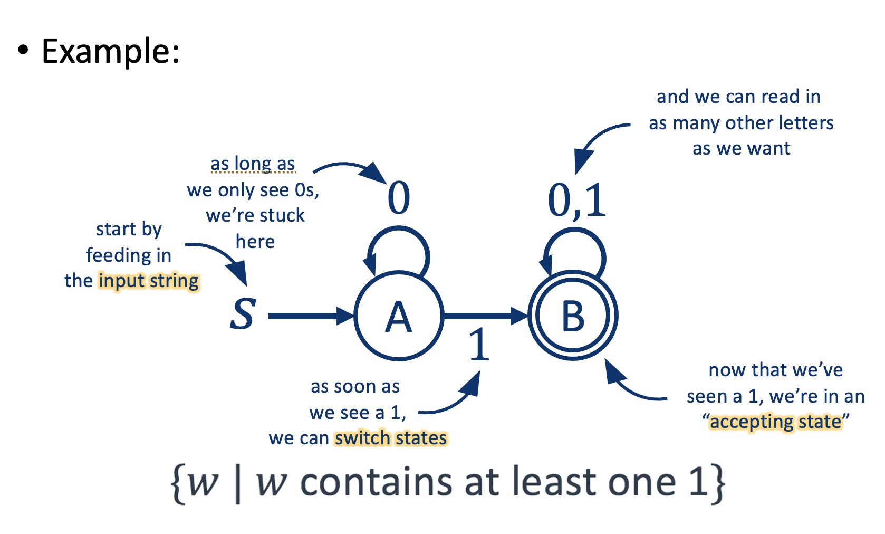
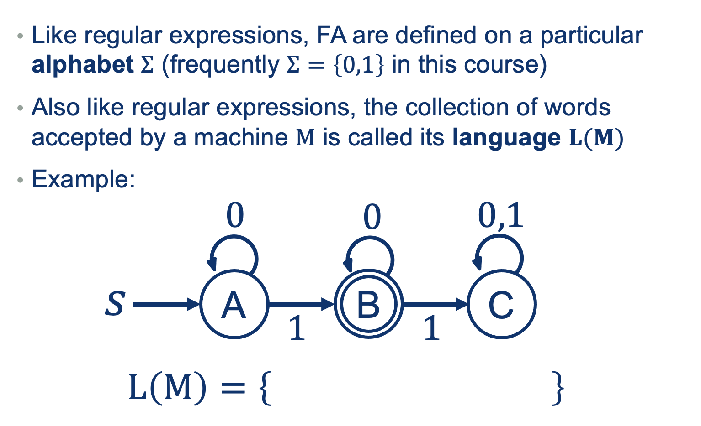
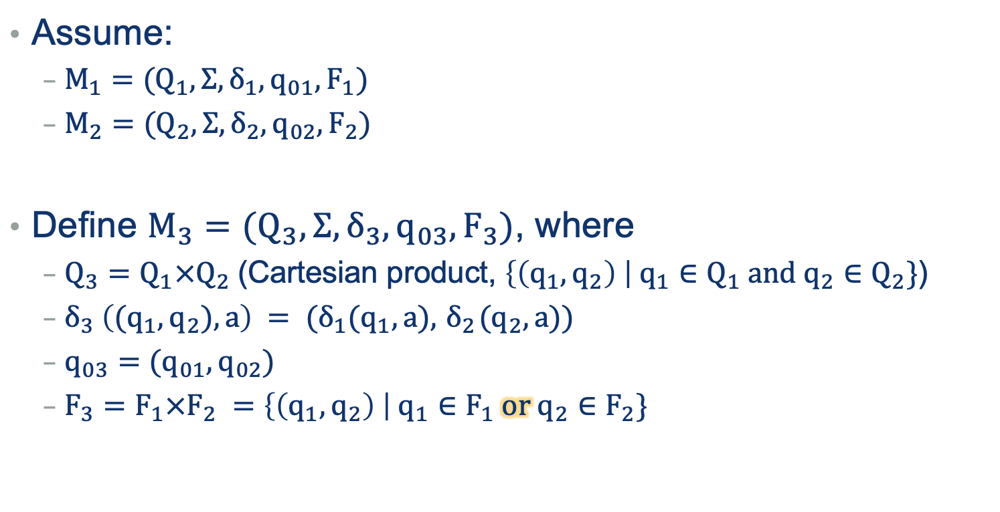
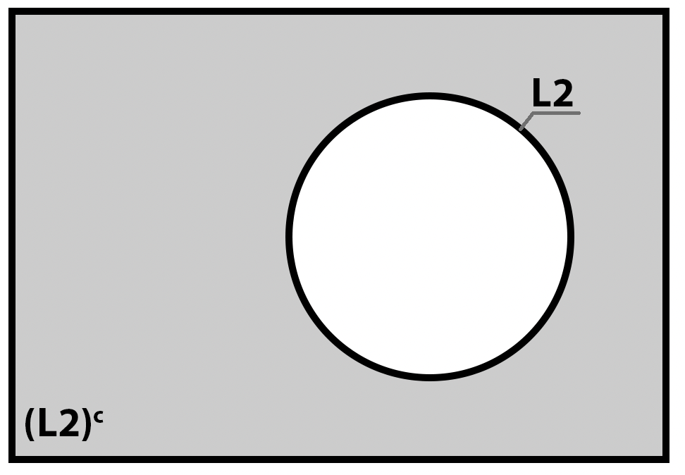
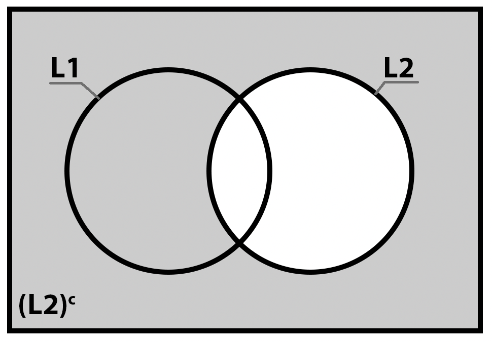
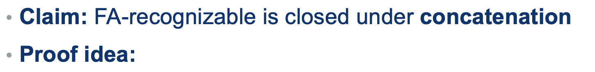

---
layout: default
title: Lecture06
parent: CSC250
grand_parent: Teaching
nav_order: 6
#permalink: /docs/teaching/csc110/
---  

Lecture Notes 06: Finite Automata
=====================================================

Outline
-------

This class we'll discuss:

* RE power
* Algorithms: Code, RegExes, and Diagrams
* Intro to Finite Automatons

  

* * *

  

Recap: RegExes, how powerful are they?
--------------------------------------

For the the Machine Abstraction of Regular Expressions, we can ask:  
  
what problems can they solve?  
  
In other words: Which Language sets can they generate/accept?  
  
Regular Languages are more powerful than Finite Languages (can encompass more)  
{: width="50%"}

Still confused about RExs? Go to Office Hours with Winnie!! (and with me)

  

* * *

  

Algorithms: Code, RegExes, and Diagrams
---------------------------------------

As we saw above, an algorithm can be _encoded_ as:

1.  RegEx
2.  (pseudo) Code

But we know that a piece of code can also be drawn using things like a "Flow Diagram"!  
  
In this section, we'll use a special type of diagram called a **State Diagram**.  
  

### State Diagram

A State diagram looks like this:  
  
{: width="80%"} 
  
  
  

### Finite Automaton AKA: Finite State Machine (FSM)

1.  Finite number of states
2.  Follows Rules that have been programmed beforehand

  
  
{: width="80%"}  
  

### Operation Examples

#### Example 01: Processing a String

  
  
{: width="80%"}  
  

#### Example 02: Processing a String

  
  
{: width="80%"}  
  

#### Example 03: Processing a String

  
  
{: width="80%"}  
  
**Activity 1** \[2 minutes\]:  

Try to build your own machine. One that "Accepts" this set:  
  
  

answer: 
  

(Wait; then Click)

    

       
    

  

* * *

  

Alphabets and languages
-----------------------

  
  
{: width="80%"}  
  

  

* * *

  

Formal Definition
-----------------

  
  
{: width="80%"}  
  

### Our Last Example:

  
  
{: width="80%"}  
  

### Operators in FSMs: OR

How might we handle a language that contains an or?  
  
Example:

$$\{w \vert w \text{ doesn’t contain either 00 or 11 as a substring}\}$$

  
  
{: width="80%"}  
  
Let's try one basic example:  
  
{: width="80%"} 
  
**Activity 2** \[2 minutes\]:  

Explain the sequence of states for these words:

* 101010
* 010110
* 110011

  
  
**Activity 3** \[2 minutes\]:  

Answer the following questions:

* What is the descriptive power of Finite Automata?
(Wait; then Click)  
  

answer: 
  

(Wait; then Click)

    

      We need to compare it with regular expressions... we'll do that bit by bit.   
       
    

  

  

  
* Are there languages that **Cannot** be described by a finite automaton?
  
(try to come up with a counter example) 
  

answer: 
  

(Wait; then Click)

    

      YES! NON Regular Languages! 
       
    

  

 

  

* * *

  

Useful Properties
-----------------

These are some properties that can help you deduce, generalize, or analyze FSMs with respect to their RegEx and Regular Languages.  
  

### Complement

IF a Language $$L_1$$ is recognizable by an FA $$ M_1$$,  
is language $$ (L_1)^{c} $$ also recognizable by some FA?  
  
Or in other words, $$\exists M_2  \quad \vert \quad L(M_2) = L(M_1)^{c}$$  
  
{: width="80%"} 
  
  
  

### Intersection

  
{: width="60%"}   
  
**Activity 4** \[2 minutes\]:  

How would you prove this (by construction)?

answer: 
  

(Wait; then Click)

    

      1.  run both machines “in parallel”  
	    2.  accept <b>if (and only if) both</b> reach an accepting state
    

  

  

Example:  
  
{: width="50%"} 
  
  
  
{: width="50%"}   
  
  
  
#### Intersection: General Rule

  
  
{: width="60%"}  
  
  

**The set of possible states** 

$$ Q_3 = \{ AD, BD, CD, AE, BE, CE \}$$  
  
**Look at the rule for the transition function**:  

$$ \delta_3 ( (q_1, q_2), a ) = (\delta_1(q_1,a), \delta_2(q_2,a)) $$ 

That means:  
  
$$ \mathbf{ \delta_3 ( (q_1, q_2), a ) }$$

the transition for $$M_3$$ starting at the combo state: $$q_1q_2$$ and input symbol $$a$$.  
the combo state resulting from the output of $$M_1$$ when starting at state $$q_1$$ and input symbol $$a$$,  
and the state resulting from the output of $$M_2$$ when starting at state $$q_2$$ and input symbol $$a$$  
or $$ \mathbf{ \delta_1(q_1,a), \delta_2(q_2,a)) }$$  
  
**The set of starting states**  

$$ q_{03} = (q_1,q_2) $$ 

Which is the combination state of the starting states of each of the machines: $$q_1$$ from $$M_1$$ and $$q_2$$ from $$M_2$$.  
  
**The set of Accepting states** 

$$ F_3 = (q_1,q_2) $$  

Where **each one** is the combination state of states where **both** are accepting states in each of the machines:  
$$C$$ from $$M_1$$ **AND** $$E$$ from $$M_2$$.  
  
  
  
{: width="50%"}  
  
Notice that for the example word $$ w = 0111 $$ , the sequence of states is:  

$$ AD \xrightarrow{0} BD \xrightarrow{1} CE \xrightarrow{1} CD \xrightarrow{1} CE $$ (Accept)  
  
  

### Union

  
  
{: width="80%"}
  
**Activity 5** \[2 minutes\]:  

How would you prove this (by construction)?

answer: 
  

(Wait; then Click)

    

      1.  run both machines “in parallel”  
	  2.  accept <b>if either</b> reach an accepting state
    

  

 
  
  

Example:  
  
{: width="50%"} 

**NOW, the set of Accepting states $$ F_3 = (q_1,q_2) $$**  
Where **each one** is the combination state of states where **either** are accepting states in each of the machines:  
$$C$$ from $$M_1$$ **OR** $$E$$ from $$M_2$$.  
  
  
{: width="50%"}
  
  
  

#### Union: General Rule

  
{: width="80%"}

Example: word $$ w = 0111 $$  
  
{: width="50%"}  
  
  

### Set Difference

$$ L_3 = L_1 - L_2 $$ 
  
  
  
**Activity 1** \[2 minutes\]:  

How would you prove this (draw the Venn Diagram and use previous properties)?

answer: 
  

(Wait; then Click)

    

$$ L_3 = L_1 - L_2 = L_1 \cap (L_2)^c $$  

       
    

  

 
  
  
  

  
  

### Concatenation

  
  
{: width="80%"}  
  
**Activity 2** \[2 minutes\]:  

How would you prove this (by construction)?

answer: 
  

(Wait; then Click)

    

1.  Let’s say we have two FAs $M_1$ and $M_2$, both with the same $\Sigma$
 
2.  Want to build another FA $M_3$ with $$ L(M_3)=L(M_1) \circ L(M_2) \texttt{, which is } \{ x_1 x_2 | x_1 \in 𝐿(𝑀_1) \texttt{ and } 𝑥_2 \in 𝐿(𝑀_2) \} $$ 
3.  Just need to attach the accepting states of $M_1$ to the start state of $M_2$ 
4.  Caution: since we don’t know when we’re done with the L($M_1$) part of the string; could go through accepting states of $M_1$ several times!
    

  

  
  

  
Example: word $$ w = 000 $$  
  
  
  
Notice that for the example word $$ w = 000 $$ , the sequence of states might be:  
$$ A \xrightarrow{0}$$ "invisible reject state" (Reject)  
or  
$$ A \rightarrow B \xrightarrow{0} C \xrightarrow{0} C \xrightarrow{0} C$$ (Accept)  
  
  

#### How to combine them?

We seem to need to be able to “guess” when to shift to the second machine.  
  
And we can't do that yet.  
  
Another example of the logic and the issue:

1.  Say we have: $$M_1$$: all strings with an odd number of 1's
2.  And $$M_2$$: all strings with alternating 0s and 1s
3.  Is $$L(M_3) = L(M_1) \circ L(M_2)$$ FA-recognizable?
4.  Say we have the string $$101001101010101$$
5.  is this recognizable if we split the string into $$x_1$$ and $$x_2$$
6.  such that $$M_1$$ recognizes $$x_1$$, and
7.  such that $$M_2$$ recognizes $$x_2$$
8.  What happens if $$x_1 = 101001101$$ and $$x_2 = 010101$$?
9.  What happens if $$x_1 = 1010011$$ and $$x_2 = 01010101$$?

  
  

### Kleene Star

  
  
  
  

1.  Start with FA $$M_1$$
2.  Build another FA $$M_2$$, with $$L(M_2) = L(M_1 )^∗$$
3.  Same problem as with concatenation: we need to guess...

  
#### Homework

Prep to Demo **Homework 01** next lecture. Every team presents 4 problems, 1 each and one randomly chosen to present the last problem. Practice to demo in a maximum of 5 minutes (about 1 minute per question).

  

