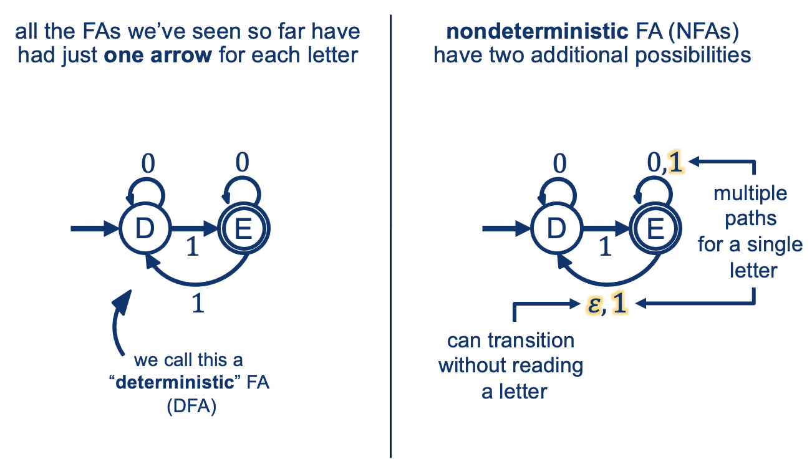

---
layout: default
title: Lecture06
parent: CSC250
grand_parent: Teaching
nav_order: 7
#permalink: /docs/teaching/csc110/
---  

Lecture Notes 06: Non-Deterministic FAs and FA Properties
=====================================================

Outline
-------

This class we'll discuss:

* Non-Deterministic FAs (NFAs)
* NFA Properties

  
* * *

A Slideshow:
---------------

<!-- <iframe src="https://docs.google.com/presentation/d/e/2PACX-1vTZV0N1p1fSZr0deQDeE1LgiTwPuBTVirCETOvtti0wYk2dGgmgL4C2XSRNpGj53PtGx0qokmRkAc5o/embed?start=false&loop=false&delayms=60000" frameborder="0" width="800" height="629" allowfullscreen="true" mozallowfullscreen="true" webkitallowfullscreen="true"></iframe> -->

<iframe src="https://docs.google.com/presentation/d/15l5Qukk0On_BVTGPwyEUnnZCp6z_Bih2IRbYQ1a--Ks/embed?start=false&loop=false&delayms=60000" frameborder="0" width="960" height="749" allowfullscreen="true" mozallowfullscreen="true" webkitallowfullscreen="true"></iframe>

GUIDED NOTES (Optional)
=======================

  
  

Nondeterminism
--------------

Let's check a small video fragment from [MinutePhysics](https://youtu.be/Ywn2Lz5zmYg?t=165).  
  
The part we are interested in is the fact that there is a way to:  

* Let multiple parallel options happen at the same time!
* As long as any of them succeeds, all "timelines" collapse and the word is accepted.
  
  
  
  
  
  
{: width="80%"} 
  
  
  
Think of it as having the option of "cloning yourself" into multiple word checkers... each checking one possible path.  
  
We "split" or "clone" each time we:

* see an \\(\\epsilon\\) (or free jump without consuming a symbol), or
* each time we see multiple paths for the same symbol.

  
  
  

#### Example

Notice that for the example word \\( w = 011 \\) , the sequence of states is:  
\\( D \\xrightarrow{0} D \\xrightarrow{1} E \\dots \\) and then we have a split!!  
  

* One path continues with: \\( D \\xrightarrow{0} D \\xrightarrow{1} E \\mathbf{ \\xrightarrow{1} D }\\) (Rejected) ...
* Another path continues with: \\( D \\xrightarrow{0} D \\xrightarrow{1} E \\mathbf{ \\xrightarrow{1} E } \\) (Accepted) ...
* Yet another path continues with: \\( D \\xrightarrow{0} D \\xrightarrow{1} E \\mathbf{ \\xrightarrow{\\epsilon} D \\xrightarrow{1} E } \\) (Accepted)
* The last path continues with: \\( D \\xrightarrow{0} D \\xrightarrow{1} E \\mathbf{ \\xrightarrow{\\epsilon} D \\xrightarrow{1} E \\xrightarrow{\\epsilon} D} \\) (Rejected)

  

* * *

  

NFAs Formal Definition
----------------------

  
  
{: width="80%"}  
  
**Activity 3** \[2 minutes\]:  

Why would this be useful at all?

  
  

### Remember Union?

  
  
{: width="80%"}  
  

#### With an NFA:

  
  
{: width="80%"}  
  
So how do NFA's **Compute**?  
  
{: width="80%"}  
  

  

* * *

  

NFA computation (tree)
----------------------

We can visualize what happens with the computation of a string with an NFA by building a **NFA computation Tree**.  
  
This is like "unrolling an FA as we walk it into paths", except with two extra rules:

1.  You add a possible path into a "next" state for every outgoing symbol option, and
2.  You add a possible path into a "next" state any states we might get to through an arrow labeled with \\(\\epsilon\\)

  
  
An Example:  
  
{: width="80%"}  
  
**Activity 4** \[2 minutes\]:  

Does the above example **Accept** or **Reject** string:   \\( 0 \\; 1 \\)?

  
  
**Activity 5** \[2 minutes\]:  

Build the computation tree for the Union example for the string   \\( 1 \\; 0 \\)  
  
The example is repeated here for your convenience (you're welcome)  
  
{: width="80%"}
  
"Walk" the NFA and add a path for every possible choice (given the symbol read)

   

    answer: 
      

(Wait; then Click)

        

           
        

      

    
  
 

  
  
  

### Remember Concatenation?

  
  
The problem was we could not "guess" at which part of the string one Machine should accept (reject) and the next begin processing.  
  

#### With an NFA:

  
  
{: width="80%"}  
  
**Activity 6** \[2 minutes\]:  

Build the computation tree for the Concatenation example above, given the string:  
\\( 1 \\quad 1 \\quad 1 \\quad 0 \\)
