GUIDED NOTES (Optional)
=======================

  

DFA-NFA equivalence
-------------------

Last lecture we asked the question: **Are NFAs stronger than DFAs?**  
  

  
Let's make a claim:  
  

#### NFAs and DFAs are equally powerful!

  
  
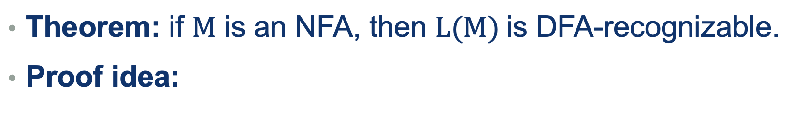{: width="80%"}  
  
The proof approach is by construction (in two steps):  
  
What we know: \\(M_{NFA}=(Q,\\Sigma,\\delta, q_0, F)\\)

1.  Need to construct: \\(M_{DFA}=(Q^\\prime,\\Sigma,\\delta^\\prime, q_0^\\prime, F^\\prime)\\) that recognizes L(M)
2.  Prove that \\( L(M_{DFA}) = L(M_{NFA}) \\)

  
  

### Step 1: Building the equivalent \\(M_{DFA}\\)

We need to make the 5-tuple for the DFA equivalent to out NFA:  
  

#### From NFA to DFA: the states \\(Q \\rightarrow Q^\\prime \\)

It’s possible that in an NFA, we could be in multiple states at each step. If we want to emulate the NFA’s behavior, we’ll have to have a state for each combination.  
  
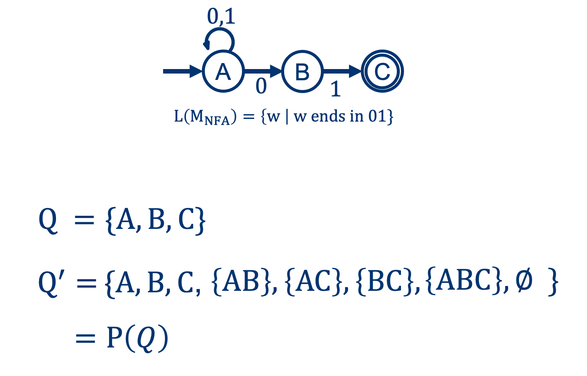{: width="80%"}  
  
  
  

#### From NFA to DFA: the Start states \\(q\_0 \\rightarrow q\_0^\\prime\\)

  
  
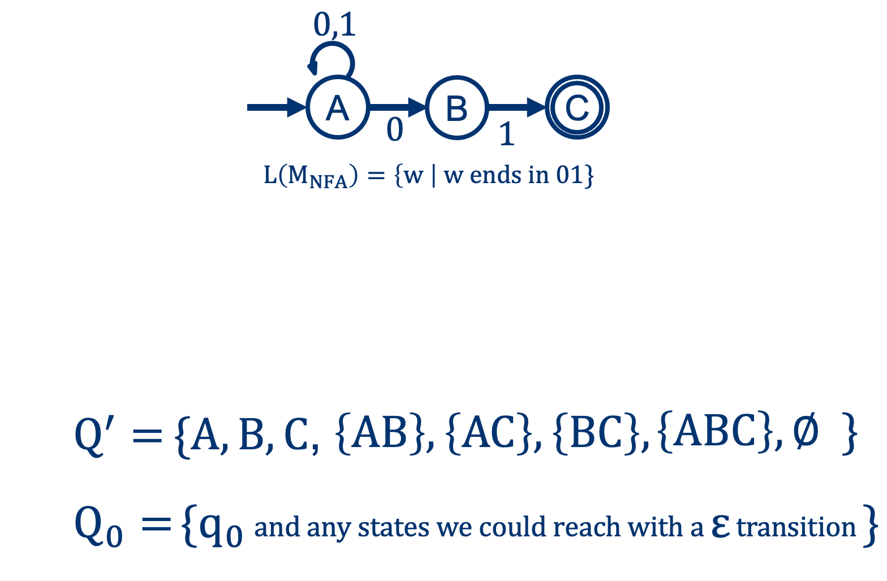{: width="80%"}  
  
(In this case, only \\(A\\))  
  
  
  

#### From NFA to DFA: the Accepting states \\(F \\rightarrow F^\\prime\\)

  
  
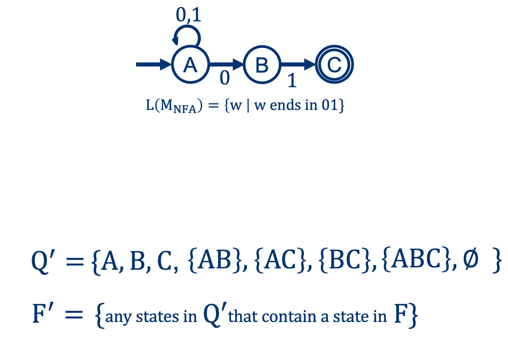{: width="80%"}  
  
(In this case, \\( \\{ C, AC, BC, ABC \\} \\))  
  
  
  

#### From NFA to DFA: the Transitions \\(\\delta \\rightarrow \\delta^\\prime\\)

At each symbol reading, if there are multiple paths to follow, we want to jump the the single state (in the DFA) that is the **Union** of all the possible destination states (in the NFA) for that symbol.  
  
This can be expressed like this: \\\[ \\begin{alignat}{2} &\\delta^\\prime ( q, \\mathit{a} ) = \\bigcup\\limits_{p\\in q} \\delta(\\mathit{p}, a) \\\ &\\qquad \\text{ where $q \\in Q^\\prime$; $a \\in \\Sigma$} \\\ &\\qquad \\text{ and $q$ can be a set of states from $Q$} \\end{alignat} \\\]  
  
Let's see it in action.  
  

Example: building the DFA for this NFA  
  
  
  
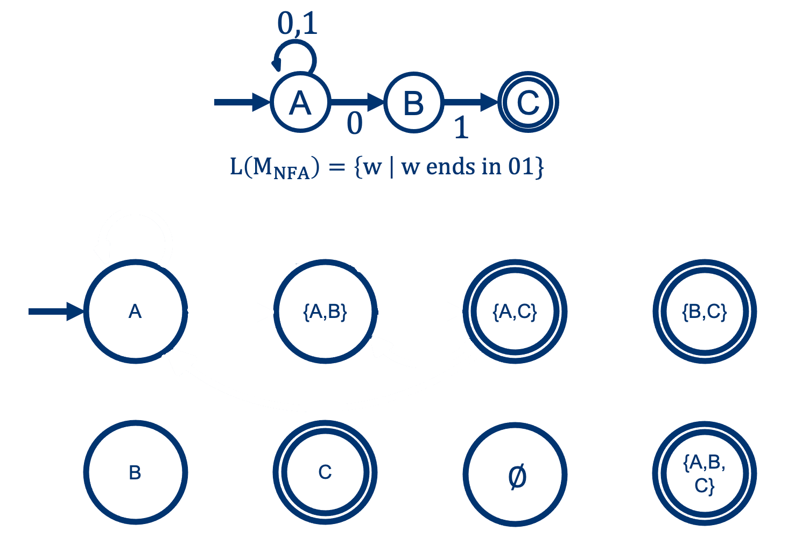{: width="80%"}  
  
Solution:

  
  
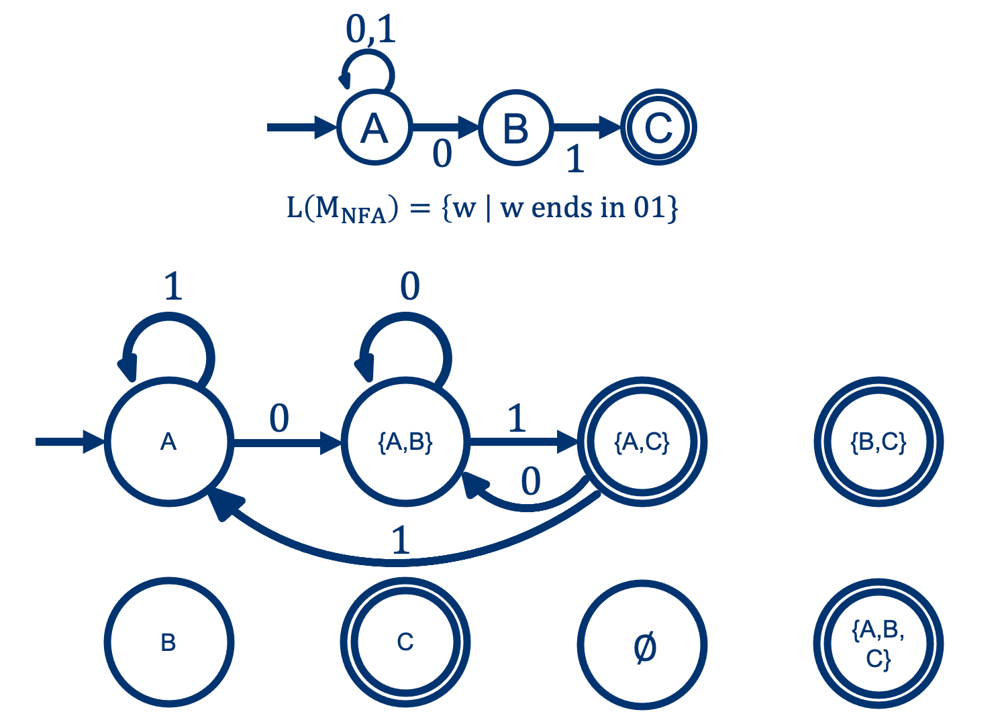{: width="80%"}  
  

  

### Step2: Prove \\(L(M_{DFA}) = L(M_{NFA}) \\):

  
  
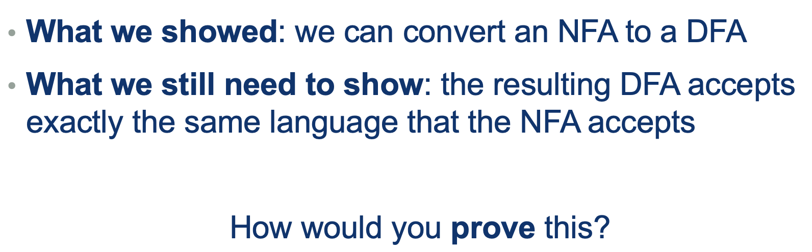{: width="60%"}  
  

#### Hint:

To prove that L(DFA) = L(NFA), use induction to show that the result of running the DFA on a word \\(w\\) (denoted \\( \\hat{\\delta}^\\prime(q\_0^{\\prime} , w))\\) is equivalent to the result of running the NFA on the same word \[denoted \\(\\hat{\\delta}(q\_0, w)\\)\] for every word $w \in \Sigma^*$.  

A summary of recommended steps is:  

1.  **Base Case**: Prove that \\( \\hat{\\delta}^\\prime(q\_0^{\\prime} , w)) = \\hat{\\delta}(q\_0, w)\\) for the **base** case of \\(w = \\epsilon\\), which is when \\( \\vert w \\vert = 0 \\)
2.  **Induction Hypothesis**: Asume that \\( \\hat{\\delta}^\\prime(q\_0^{\\prime} , w)) = \\hat{\\delta}(q\_0, w)\\) for when \\( \\vert w \\vert = k \\)
3.  **Induction Step**: Prove that, for a word \\(z\\) that has a length \\( \\vert z \\vert = k+1 \\), (or which we can represent as a concatenation of a word \\(w\\) of size \\(k\\) and one more symbol \\(a\\)), that \\( \\hat{\\delta}^\\prime(q\_0^{\\prime} , z)) = \\hat{\\delta}(q\_0, z)\\)

### Full proof here:

<iframe src="https://docs.google.com/presentation/d/e/2PACX-1vS4gXLGKRHOY89egIRruvkDBdz9MfmAQ4RSjCjUtJiJpfMw_QxjdXMrGN4KFs3pjUYYR65Q3QrTIO9p/embed?start=false&loop=false&delayms=60000" frameborder="0" width="480" height="299" allowfullscreen="true" mozallowfullscreen="true" webkitallowfullscreen="true"></iframe>
  

* * *

  

FAs Vs REs
----------

Where do FA-Recognizable Languages stand with respect to Regular Languages?  
  
{: width="40%"}  
  

### Where are FA-recognizable languageswith respect to Regular Languages?

  
  
  
  

### Try Proving: FAs are at least as powerful as REs

We can use the same approach as we did when defining REs (a recursive definition out of base cases).  
  
  
  
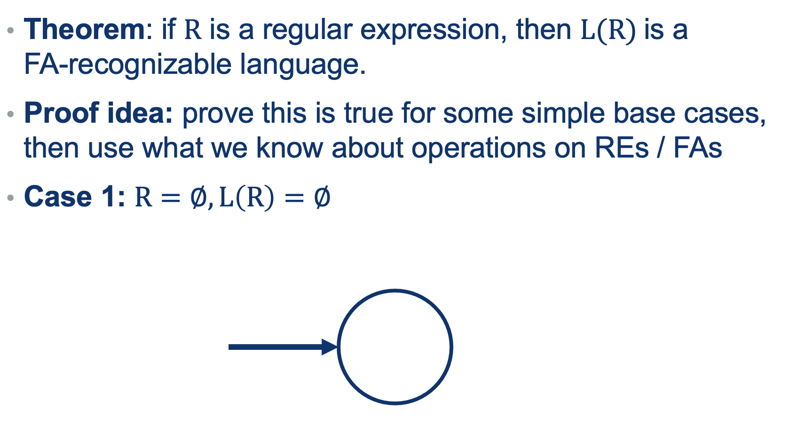{: width="60%"}  
  
  
  
  
  
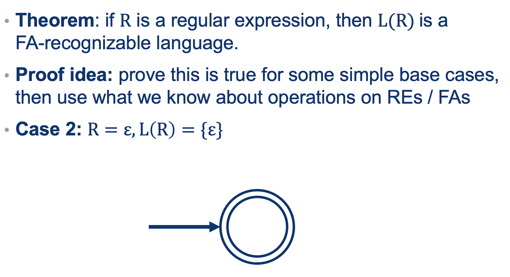{: width="60%"}  
  
  
  
  
  
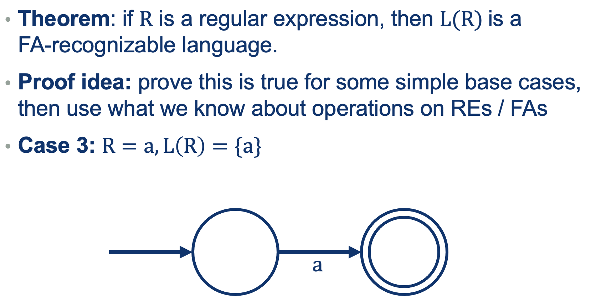{: width="60%"}  
  
  
  
  
  
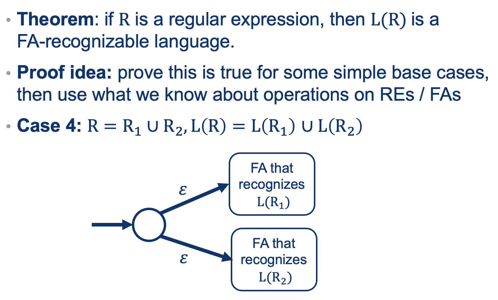{: width="60%"}  
  
  
  
  
  
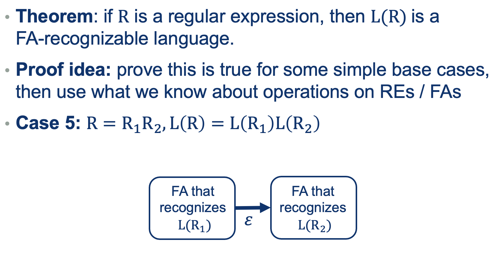{: width="60%"}  
  
  
  
  
  
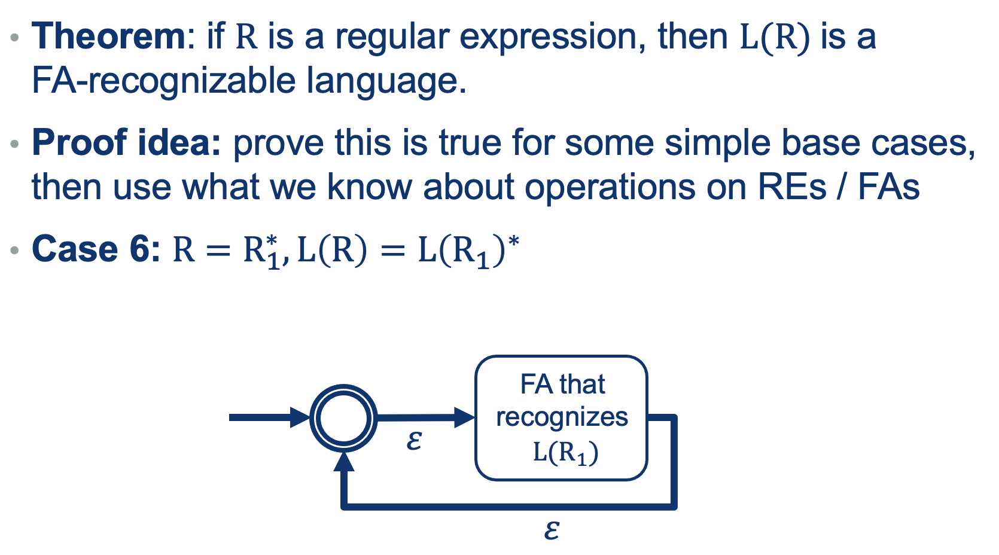{: width="60%"}  
  

### So What did we prove?

  
  
  
  
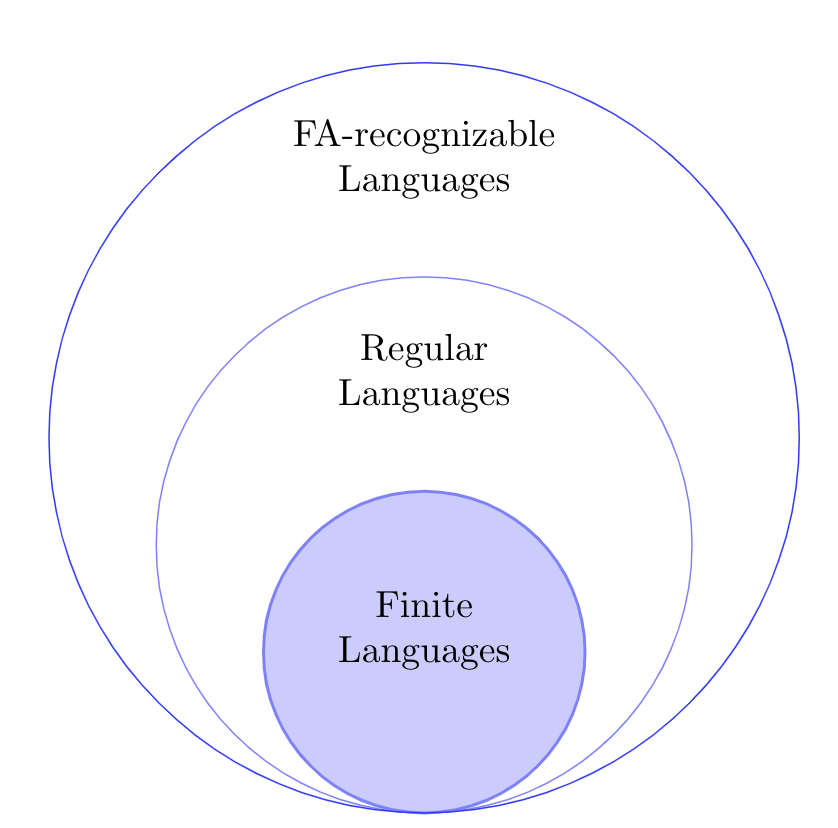{: width="40%"}  
  
  
  

### NOW, Try Proving: REs are at least as powerful as FAs

Example FA:  
  

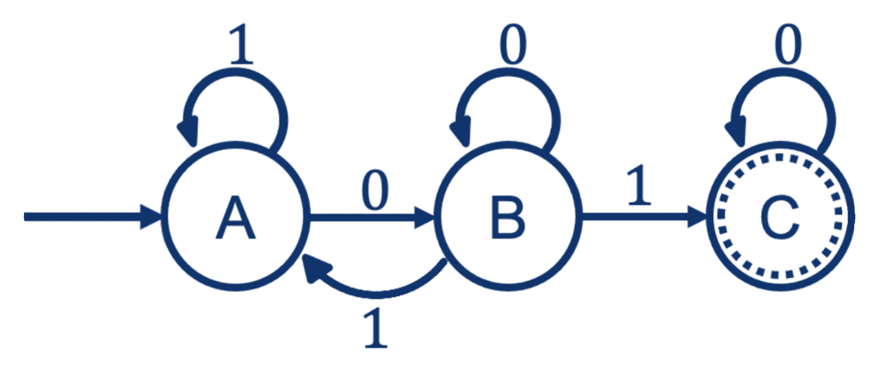{: width="60%"}

  
  
  
  

#### Proof Idea:

convert the FA that recognizes L into a RE  
  
**Step 1: modify the FA so that**

1.  the start state doesn’t consume any letters
2.  there is only one final state
3.  the final state doesn’t consume any letters

  
  
  
  
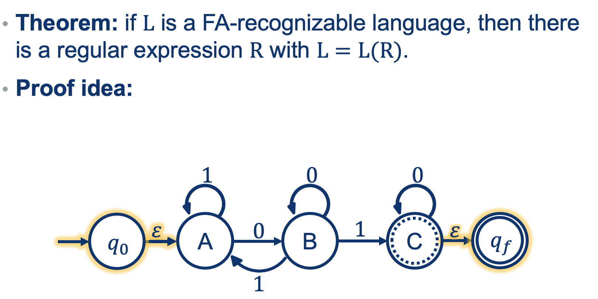{: width="60%"}  
  
  
  
  
  
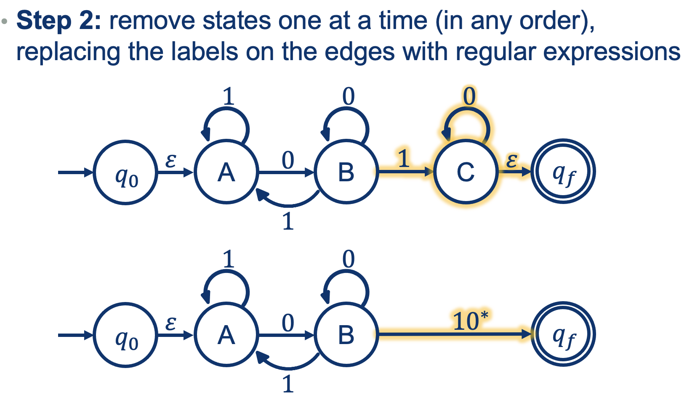{: width="60%"}  
  

#### A more difficult one:

* To get into A: nothing to read
* Any numnber of 1s
* You need a 0 to get out

But removing A also changes B!  
I need to accont for the transitions going back and forth between A and B!  
  
So how could one get into B?

* We could read a 0 to get into B, OR
* Read a 1 from inside B, read any number of 1s while at A, and then a 0 to get back to B

  
  
  
  
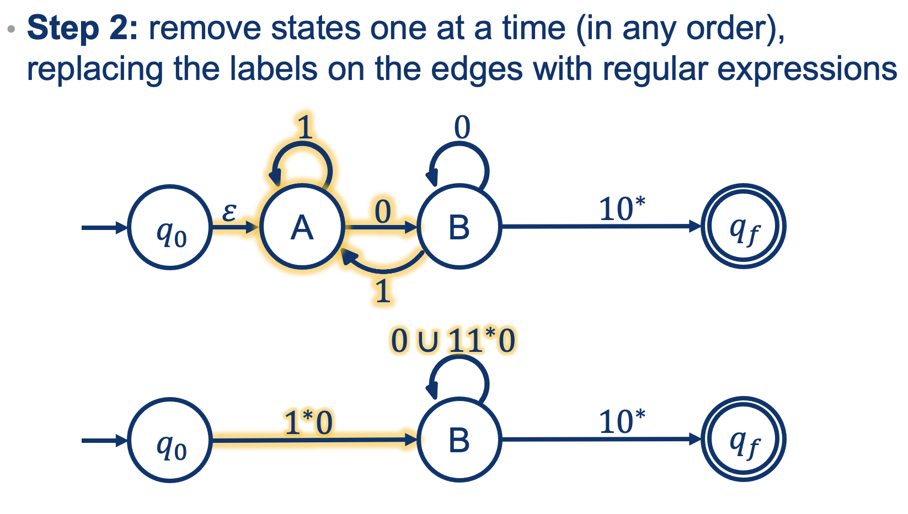{: width="60%"}  
  
  
  
  
  
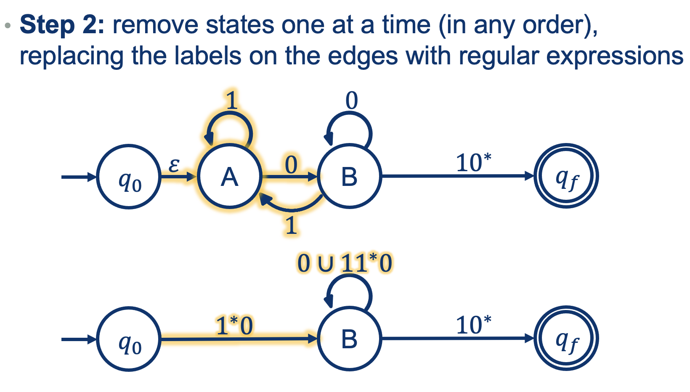{: width="60%"}  
  
  
  
  
  
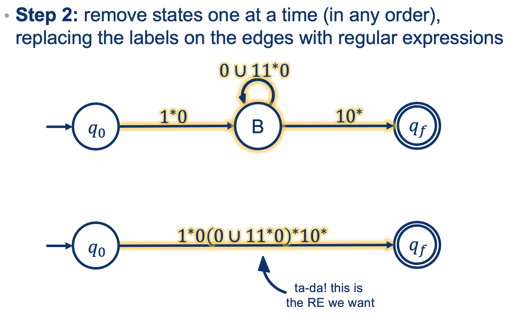{: width="60%"}  
  

### So What did we prove?

  
  
  
  
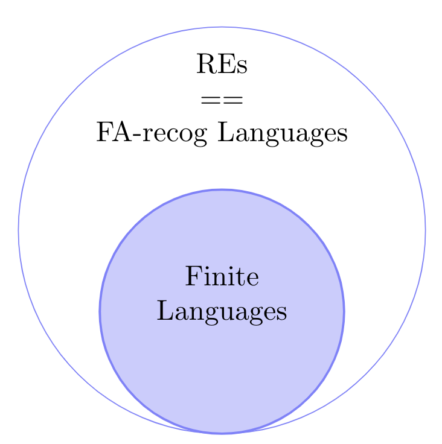{: width="40%"}  
  

  

* * *

  

