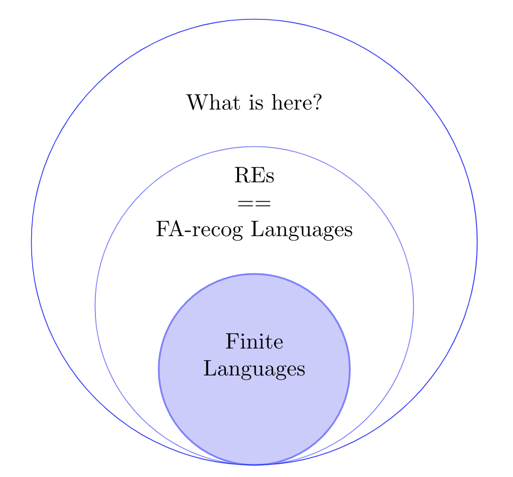
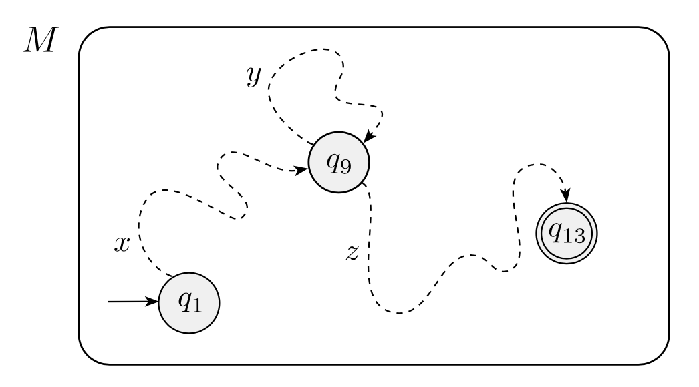
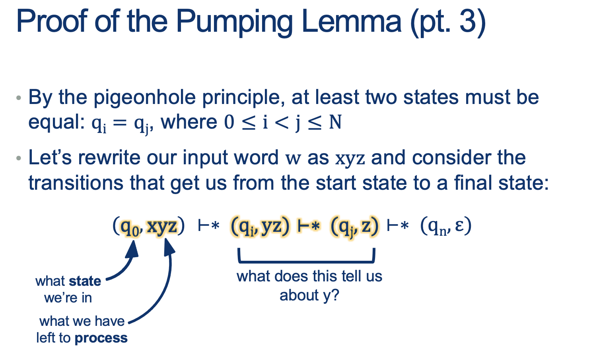
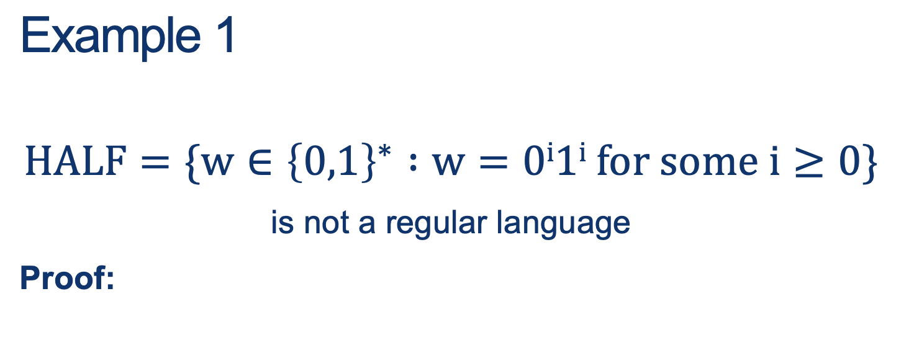
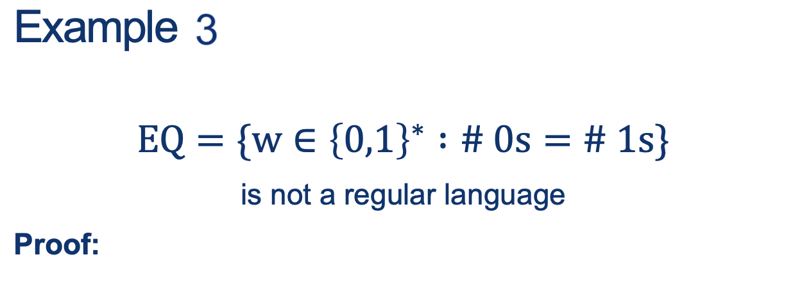

---
layout: default
title: Lecture11
parent: CSC250
grand_parent: Teaching
nav_order: 11
#permalink: /docs/teaching/csc110/
---  

Lecture Notes 11:  Non-Regular Languages and the Pumping Lemma
===============================================================

  

Outline
-------

This class we'll discuss:

* Recap: RE, FA, and their equivalence
* Non Regular Languages
* The Pumping Lemma
* Proof for the Pumping Lemma
* Proving a language is not Regular

  

* * *

  

Recap: RE, FA, and their equivalence
------------------------------------

A **Regular Expression** is a succint way to indicate a pattern that is used to filter out strings so that only certain strings are accepted into a set of words called a **Regular Language**  
  
They look like this:  
  
**\\[(00(10)^\*11) + (11(01)^\*00) \\]**  
  
**Activity 1** \[2 minutes\]:  

What is the Language accepted by this RE? (Use an English sentence to summarize it)

(Wait; then Click)  
  

It is the Language that consists of words that start with $00$, and with $11$ and have zero or more $10$ pairs in between, **OR** the words that start with $11$, and with $00$ and have zero or more $01$ pairs in between.  
  
Examples are: \\[0011, 1100, 001011, 110100, 00101011, 11010100, \dots \\]

  
  
A **Finite Automaton** is a state machine described by a 5-tuple: $ (Q, \Sigma, \delta, q_0, F) $ that represents a process that examines a string of symbols, one at a time, and accepts or rejects the string depending on the sequence of visited states.  
  
**Activity 2** \[2 minutes\]:  

What is the FA that does the exact same thing as the RE shown above?

Answer below, so don;t peek if you wanna do it yourself.

  
  
{: width="80%"}  
  

  
  

### Relation between REs and FAs

  
  
{: width="50%"}  
  

  

* * *

  

Non Regular Languages
---------------------

What are the limits of the REs and FAs we've seen?  
  
In other words, are there are some languages that cannot be described with them?  
  
The answer is **YES**.  
  
**Can you suggest a couple examples?**

   

    answer: 
      

(Wait; then Click)

        

            An example: 
            $$\text{Language B }= \{ 0^n1^n \mid n\geq 0\}$$
            Notice that we would need states that capture the fact that there were no 0z and no 1s ; one 0 and one 1; two 0s and teo 1s; etc... up to $ n \rightarrow \inf$
        

      

    
  
 
  

  
  
  
  
  
  
How do we find out if a language is regular or not?  
  
* First thing first: **It MUST BE INFINITE**... why?
  
  
  
  
* But, is an infinite language non-regular? ... NO, because (1*) is a RE that generatea an infinit RL!
  
  
  
  
* Would we need infinite states to express the result???
  
  
Intuition is not enough (some Langs that appear to need infinite states don't actually).  
  
Proving that a whole language is not regular because you can't find the RE or FA to generate it is not a valid argument.  
  
But also, using a proof by construction to show that something does NOT have a property is not the right path.  
  
We would like to have a proof that finds a contradiction but that would require showing that a language does not have some property! (That is the right way).  
  

### Proof Idea

1.  We will define a special property that all regular languages have.
2.  If we can show that a language does not have this property, we are guaranteed that it is not regular.

  

* * *

  

Defining a property all Regular Languages have
----------------------------------------------

  
  
{: width="50%"} 
  
**Activity 3** \[2 minutes\]:  

What do you see in the following sequences of states (for accepted and rejected strings?)  
  
{: width="50%"} 
  

   

    answer: 
      

(Wait; then Click)

        

            <ul>
                <li>$ \texttt{1}: A^{\prime} \vdash B \rightarrow \text{Accepted}$</li>
                <li>$ \texttt{010}: A^{\prime} \vdash A \vdash B \vdash B \rightarrow \text{Accepted}$</li>
                <li>$ \texttt{01000}: A^{\prime} \vdash A \vdash B \vdash B \vdash B \vdash B \rightarrow \text{Accepted}$</li>
                <li>$ \texttt{11}: A^{\prime} \vdash B \vdash C \rightarrow \text{Rejected}$</li>
                <li>$ \texttt{0101}: A^{\prime} \vdash A \vdash B \vdash B \vdash C \rightarrow \text{Rejected}$</li>
                <li>$ \texttt{11111}: A^{\prime} \vdash B \vdash C \vdash C \vdash C \vdash C \rightarrow \text{Rejected}$</li>                              
            </ul>             
        

      

    
  
 
  

  
  
Notation:

1.  $A^{\prime}$ is just the "Start State A before consuming any symbols"
2.  The Turnsile symbol $\vdash$ means: "yields", "proves", "satisfies" or "entails".

  
It is saying: "Then it follows that..."  
  

  
  
  
  
  

### Intuition First :

* In an FA, we MUST have a FINITE number of states
* However, we CAN get an infinite list of words!!!
* How do we get infinite words from a finite set of states?

  
  
**Example:**  
Imagine a language L that has the following words:  
$ L = \{ a, \; ak,\; afgh,\; afghk,\; afghfgh,\; afghfghk,\; afghfghfgh,\; afghfghfghk,\; \dots \} $  
  
**Activity 4** \[4 minutes\]:  

Can you come up with more words in this Language just from the observed pattern?  
Can you think of the FA that recognizes this language?  
Can you come up with the RE that spits generates this language?

   

    answer: 
      

(Wait; then Click)

        

The pattern must have, as a **prefix**, the pattern a  
followed by any number of repetitions of the sequences fgh,  
and optionally terminate with a k or $\epsilon$  
  
Notice that this infinite language could be made like this:  

 
  
  
An RE ( with $\Sigma = \text{english alphabet} $) that works is: $a(fgh)^*(k+\epsilon)$  
  
  
  
The Important thing to note is that after a specific size (let's call it N), any new words that we generate MUST come from a repeated pattern!  
   

As words get longer, we have to traverse loops more and more often.  
   
If we wanted another word in the language, we could take any one of our existing words in the language and change the number of times we went around one of those loops.  
   
Turns out that <b>there’s a precise way to articulate this property, which will be what we need to be able to prove a language is non-regular.</b>
        

      

    
  
   
  

  
  

  

* * *

  

The Pumping Lemma
-----------------

  
  
{: width="80%"} 
  
Translation: if L is a regular language, then words that are sufficiently long must have some repeatable subsequence that we could use to generate arbitrarily many more words in L  
  
{: width="80%"}
  
  
  
Note: If proven true, the lemma, as applied to a language $ L_{short} $ whose words are all smaller than $N$, would be _vacuously_ true: Obviously the three conditions hold for all strings of length at least $N$ if there aren’t any such strings.  
  

### Proof for the Pumping Lemma

Check out our set of accepted words from our running example:

* $ \texttt{1}: A^{\prime} \vdash B \rightarrow \text{Accepted}$
* $ \texttt{010}: A^{\prime} \vdash A \vdash B \vdash B \rightarrow \text{Accepted}$
* $ \texttt{01000}: A^{\prime} \vdash A \vdash B \vdash B \vdash B \vdash B \rightarrow \text{Accepted}$

  
  
Notation:

1.  $A^{\prime}$ is just the "Start State A before consuming any symbols"
2.  The Turnsile symbol $ \vdash $ means: "yields", "proves", "satisfies" or "entails".

  
  
**Activity 5** \[2 minutes\]:  

**Count the number of symbols and the number of states involved in accepting the word.**  
  
Do you notice something? 

   

    answer: 
      

(Wait; then Click)

        

            The number of states is one more than the number of symbols (since we start at a state before consuming the first symbol).  
        

      

    
  
 
  

Given this observation, the proof goes like this:  
  
  
  
{: width="60%"}
  
  
  
{: width="60%"} 
  
  
  
{: width="60%"}
  
  
  
{: width="60%"}
  
All parts of the $xyz$ word are sequences of symbols, not necessarily a single symbol.  

1.  $ \vdash \ast $ means: After several steps ...

  
  
{: width="60%"}
  
  
  
{: width="60%"}
  
**Why are we doing this?**  
  

### Proving that some language $L_{\tiny{NonReg}} $ is not Regular

1.  We will define a special property that all regular languages have (The Pumping Lemma).
2.  If we can show that a language does not have this property, we are guaranteed that it is not regular.

  

* * *

  

Proving a language is not Regular
---------------------------------

* The pumping lemma tells us that **IF L is regular, then this property must hold for every single word in L (except the first few short words, which we don’t have to care about)**
* **Idea for contradiction**: assume it’s true, then find ONE WORD that breaks this rule; one, single word that can’t be pumped is enough to prove the language isn’t regular.
* Remember: it’s a lot easier to show something does exist than to prove that it doesn’t or can’t.  
      
    {: width="60%"}  
      
    Steps:
    
    1.  Suppose this were regular.
    2.  Let $N$ be the constant selected by the pumping lemma.
    3.  Consider the string $w = 0^N 1^N $. Then $ \mid w \mid = 2 \cdot N>N $, and so we can write $w = xyz$.
    4.  Since $\mid xy \mid \leq N $ and $ \mid y \mid > 0 $, it must be that $y$ is a non-empty substring of the $0^N$ part, i.e. $y = 0^k $ for some k>0.
    5.  According to the pumping lemma, $ xyyz = 0^{N+k} 1^N $ must also belong to L for k>0
    6.  CONTRADICTION!
    
      
      
      
      
    {: width="60%"}  
      
    **Proof sketch**  
    Since $HALF$ is a subset of $EQ$ and we proved $HALF$ is not regular, then we could pick $w \in HALF \subset EQ$ and just indicate that that is enough.  
      
    The technical part is: simply choose a way to express the fact that $HALF$ is a subset of $EQ$. Steps:
    
    1.  This proof by contradiction will use the previous example and closure properties.
    2.  Let’s assume EQ is regular.
    3.  We also know that $0^\*1^\*$ is regular.
    4.  Because regular languages are closed under intersection, this language would also have to be regular: $ EQ \cap 0^\*1^\* = \{ w \in \{0,1\}^* : w = 0^i1^i, \text{for some }i \geq 0 \} = HALF $
    5.  We just proved the non-regularity of HALF, which is a contradiction.
    6.  Therefore EQ cannot be regular.
      
    
    * * *
    
      
    
Some Perspective
----------------
    
Why am I asking you all of these questions about regularity of languages, etc.?  
  
REs and FAs are really simple computational machines.  
  
What does this have to do with getting your Java code to compile, or using dynamic programming, or ...  
  
Turns out that there are some surprisingly algorithmic things we can do when we start asking questions about these simple machines.  
  
Let’s take a look at some questions we might ask.  
  
  
  
{: width="60%"} 
  

  

* * *

### Homework

  
**\[Due for everyone\]**

Continue with HW03

  
**\[Optional\]**

TODO