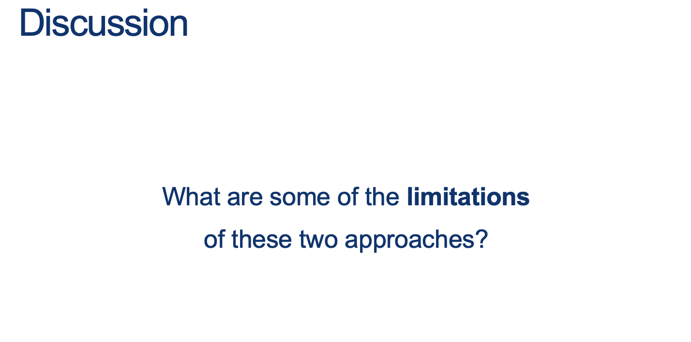

GUIDED NOTES (Optional)
=======================

Intro: Context-Free Grammar
---------------------------

  
  
{: width="60%"} 
  
EQ, HALF, PAL  
  
  
  
  
  
  
  
Finite automata and regular expressions are limited  
  
They both only match patterns that can be described by reaching L to R  
  
Some patterns are more interesting…  
  
  
  
  
  
{: width="60%"} 
  
Seems like PAL lives really close to Regular: there’s a structure to the words that’s ALMOST regular… but the pattern is in the middle.  
  
{: width="80%"} 
  
  
  
{: width="80%"} 
  
  
  
  
  
{: width="80%"} 
  
  
  
{: width="80%"} 
  
  
  
{: width="80%"} 
  
  
  
{: width="80%"} 
  
  
  
{: width="80%"} 
  
  
  
{: width="80%"} 
  
  
  
{: width="80%"} 
  
  
  
{: width="80%"} 
  
  
  
{: width="80%"} 
  

  
  
  
  

### How about EQ?

  
  
  
  
In the following map...

* Where are CFGs?
* How would we represent a finite language with a CFG?
* How would we represent a regular language with a CFG?
* Is there something outside a CFG?
* Where is EQ?

  
  
  
  

### Ideas to prove all RL's are "inside" CFGs

  
  
(You suggest some:)  
  
  
  
  
  
  
  
  
  
  
  

### Tip for designing Context-Free-Languages

  
  
Many CFLs are the union of simpler CFLs. If you must construct a CFG for a CFL that you can break into simpler pieces, do so and then construct individual grammars for each piece.  
  
Example:  
  
If the objective is to design a grammar for $ \{0^n1^n \mid n>0 \} \cup \{1^n0^1 \mid n>0 \}$, start with two sub-languages using sub-"starting symbols" and then join them to get the target language starting at $S$  
  
You can build:  
$S_1 = 0S1 \mid \epsilon $  
and  
$S_2 = 1S0 \mid \epsilon$, :  
  
And then join them to obtain:  
  
$$
\begin{alignat}{2} S &= S_1 \mid S_2 \\ S_1 &= 0S_1 1 \mid \epsilon \\ S_2 &= 1S_2 0 \mid \epsilon \end{alignat}
$$
  

### So now, how would we "Build" a Regular Language using a CFG?

  
  
{: width="80%"} 
  

  
{: width="80%"} 
  

### Approach 2: RL's are a special case of CFLs

You can convert any DFA into an equivalent CFG as follows.

1.  Make a variable $S_i$ for each state $q_i$ of the DFA.
2.  Add the rule $S_i$ → $aS_j$ to the CFG if $\delta (q_i,a) = q_j$ is a transition in the DFA.
3.  Add the rule $S_i$ → ε if qi is an accept state of the DFA.
4.  Make $S_0$ the start variable of the grammar, where $q_0$ is the start state of the machine.

  
  
Verify on your own that the resulting CFG generates the same language that the DFA recognizes.  
  
  
  
**Activity 1** \[2 minutes\]:  

Try to build your own CFG. One that "Accepts" the language: $ L = \{ w \in \Sigma^* \vert w \ has \ an \ odd \ number \ of \ 1s \}$

  
   

    answer: 
      

(Wait; then Click)

        

            
          if A is $S_0$ and B is $S_1$: 

$$
\begin{alignat}{2} S &\rightarrow_g S_0 \\ S_0 &\rightarrow_g 0S_0 \\ S_0 &\rightarrow_g 1S_1 \\ S_1 &\rightarrow_g \epsilon \\ S_1 &\rightarrow_g 0S_1 \\ S_1 &\rightarrow_g 1S_0 \\ \end{alignat}
$$
        

      

    
  
 
  
<!-- {: width="60%"}  -->
  
  
  
{: width="80%"} 
  

### How do we prove there are languages that are NOT (beyond) CFLs?

  
  
How did we do this back when we did it for RLs?  
  
  
  
{: width="80%"} 
  

* the middle part is not too big
* v and y (the repeating parts) are not both simultaneously empty
* repeating v and or y we will keep us in the language

  
  
Note that RLs are a special case of Context-Free-Languages (without the $uv^i$) part.  
  
  
  
So, if we have a pumping lemma for CFGs, is there a "Machine" equivalent to the Finite Automatons as well?  
  
  
  
We'll see those next class.

  

* * *

  

Proving a language is NOT context-free
--------------------------------------

  
  
  
  
  
  
  
  
**What does your intuition say?** Is it a CFL?  
  
  
  
  
  
  
  
  
  
Remember:

* Given a structure of $w = uvxyz$, and $ \mid vy \mid \geq 1$
* We want to find an $i$ for which a word $uv^ixy^iz$  
    does not have a prime length ( $ \mid uv^ixy^iz \mid $ is not prime ) after being "pumped" some number of times.
* Here, we can start with a word $w$ with length $p\geq N $ ($N$ provided by the pumping Lemma)
* Now, the trick is to pump the pattern some number of times so that we can prove that the final length is NOT prime!
* Ideas?

   

    answer: 
      

(Wait; then Click)

        

          Steps: 
          <ol>
            <li>The length of a word $\mid uv^ixy^iz \mid $  
              is the length of $ \mid w \mid $ plus any added repetitions of $v$ and $y$</li>
            <li>So, $ \mid uv^ixy^iz \mid $ is $ \mid w\mid + (i-1)\mid vy \mid $</li>
            <li>Since we said $w$ is in PRIMEAL, then $ \mid w\mid $ is some prime number $p\geq N $.</li>
            <li>Then, $ \mid uv^ixy^iz \mid = \mid w\mid + (i-1)\mid vy \mid = p + (i-1)\mid vy \mid$</li>
            <li>Now, <b>What possible choice of $i$ could we choose to cause the overall length to be provably NOT prime</b> ? </li>
          </ol>
        

      

    
  
 

Answer Below:

   

    answer: 
      

(Wait; then Click)

        

If we choose $i$ so that the $i-1$ is equal to $p$ in the following expression:  

$$ \mid uv^ixy^iz \mid = \mid w\mid + (i-1)\mid vy \mid = p + (i-1)\mid vy \mid $$  
Then substituting $i-1$ for $p$ ( by making $i = p-1$), we would get: 

$$ \mid uv^ixy^iz \mid = \mid w \mid + (i-1)\mid vy \mid = p + p\mid vy \mid \\ = p (1+\mid vy \mid) $$
which means that, after pumping, the word is <b>divisible by $p$</b>! and therefore, <b>not of prime length</b>.
        

      

    
  
 
 
  

* * *

  

Why are CFGs important?
-----------------------

  
  
  
  
check the article out: [https://www.nature.com/articles/nature04675](https://www.nature.com/articles/nature04675)

  

* * *

<!-- 

Proving a Language is Not Regular (summary in English)
-----------------  

  * If a Language is Regular, it must have come from a RegEx
      * Example $L_1 = \\{ w \vert w \text{ is a 1 followed by an even number of zeros and ending in 1} \\}$
      * Then RegEx $E_1$ such that $L(E_1) = L_1$ is $1(00)^*1$
  * If it has a RegEx, it has a Finite Automaton 
      * Example FA $A_1$: \
        {: width="40%"}   
  * The finite automaton has a finite numnber of states, let's call that number N
      * Example: for FA $A_1$ above, N is 4     
  * If the Language is infinite, then it must accept words of increasing length
      * Example: for FA $A_1$ above, it accepts: 11, 1001, 100001, etc  
  * Any word with $N$ or more symbols must have been generated (or accepted) by passing through a loop!
      * Example: FA $A_1$ above accepts word $w = 1001$ which is impossible to do without using a loop
      * Note that if I let you draw ANY FA with 4 states that accepts a word with 4 symbols, it MUST have a loop!   
  * Any of these words $\vert w\vert \geq N$ can be written as $w = xyz$, where 
      * $x$ is the part of the word read before a loop (if the loop is at the start, $x = \epsilon$)
      * $y$ is the part of the word read through the loop (the loop must account for at least 1 symbol or $\vert y\vert \geq 1$)
      * $z$ is the part of the word read after the loop (this could have no symbols, symbols that are fixed, or some that passed through a loop)
      * Example: for FA $A_1$ above, it accepts $w = 1001$ where the $1$ did not use the loop, and the $00$ did. In this case, the part $z$ is $1$.
  * Note that the $xy$ part of the word MUST have AT MOST $N$ symbols (when $z = \epsilon$)
      * Example FA $A_2$ has $N = 4$ states (with the loop at the end, meaning accepted words have $z = \epsilon$): \
        {: width="40%"}
      * Note that all accepted words $\vert w\vert \geq N$ can be written as $w = xyz$ with $z = \epsilon$.
          * Examples: 1000, 1000000, etc
      * Then, any accepted words $\vert w\vert \geq N$ have the $xy$ part with exactly $N$ symbols.
      * If the loop happens earlier, then the  $xy$ part has fewer than $N$ symbols, so the rule is:
          * $\mathbf{\vert xy\vert \leq N}$
  * Summing up: any infinite Regular Language $L_R$ 
      * accepts words $\vert w\vert \geq N$ which can be written as $w = xyz$ such that
      * $\vert y\vert \geq 1$
      * $\vert xy\vert \leq N$
      * And repeating the $y$ part of the word (or removing it) generates another word that MUST also be in the Language!
          * This is indicated like this:  $w^{\prime} = xy^iz$ with $i \geq 0$ with $w^{\prime} \in L_R$

* * *

  

The Pumping Lemma
-----------------

  
  
{: width="80%"} 
  
Translation: if L is a regular language, then words that are sufficiently long must have some repeatable subsequence that we could use to generate arbitrarily many more words in L  
  
{: width="80%"}
  
  
  
Note: If proven true, the lemma, as applied to a language $ L_{short} $ whose words are all smaller than $N$, would be _vacuously_ true: Obviously the three conditions hold for all strings of length at least $N$ if there aren’t any such strings.  
  

### Proof for the Pumping Lemma

Check out our set of accepted words from our running example:

* $ \texttt{1}: A^{\prime} \vdash B \rightarrow \text{Accepted}$
* $ \texttt{010}: A^{\prime} \vdash A \vdash B \vdash B \rightarrow \text{Accepted}$
* $ \texttt{01000}: A^{\prime} \vdash A \vdash B \vdash B \vdash B \vdash B \rightarrow \text{Accepted}$

  
  
Notation:

1.  $A^{\prime}$ is just the "Start State A before consuming any symbols"
2.  The Turnsile symbol $ \vdash $ means: "yields", "proves", "satisfies" or "entails".

  
  
**Activity 5** \[2 minutes\]:  

**Count the number of symbols and the number of states involved in accepting the word.**  
  
Do you notice something? 

   

    answer: 
      

(Wait; then Click)

        

            The number of states is one more than the number of symbols (since we start at a state before consuming the first symbol).  
        

      

    
  
 
  

Given this observation, the proof goes like this:  
  
  
  
{: width="60%"}
  
  
  
{: width="60%"} 
  
  
  
{: width="60%"}
  
  
  
{: width="60%"}
  
All parts of the $xyz$ word are sequences of symbols, not necessarily a single symbol.  

1.  $ \vdash \ast $ means: After several steps ...

  
  
{: width="60%"}
  
  
  
{: width="60%"}
  
**Why are we doing this?**  
  

### Proving that some language $L_{\tiny{NonReg}} $ is not Regular

1.  We will define a special property that all regular languages have (The Pumping Lemma).
2.  If we can show that a language does not have this property, we are guaranteed that it is not regular.

  

* * *

  

Proving a language is not Regular
---------------------------------

* The pumping lemma tells us that **IF L is regular, then this property must hold for every single word in L (except the first few short words, which we don’t have to care about)**
* **Idea for contradiction**: assume it’s true, then find ONE WORD that breaks this rule; one, single word that can’t be pumped is enough to prove the language isn’t regular.
* Remember: it’s a lot easier to show something does exist than to prove that it doesn’t or can’t.  
      
    {: width="60%"}  
      
    Steps:
    
    1.  Suppose this were regular.
    2.  Let $N$ be the constant selected by the pumping lemma.
    3.  Consider the string $w = 0^N 1^N $. Then $ \mid w \mid = 2 \cdot N>N $, and so we can write $w = xyz$.
    4.  Since $\mid xy \mid \leq N $ and $ \mid y \mid > 0 $, it must be that $y$ is a non-empty substring of the $0^N$ part, i.e. $y = 0^k $ for some k>0.
    5.  According to the pumping lemma, $ xyyz = 0^{N+k} 1^N $ must also belong to L for k>0
    6.  CONTRADICTION!
    
      
      
 <Big>Example 2</Big> 

Prove that

$$ {\large{OneMoreOne}} = \{  w \in \{ 0, 1\}^* \vert w = 0^k1^{k+1}\text{ for some k } \geq 0 \}$$

is not regular:

   

    answer: 
      

(Wait; then Click)

        

          <ol>
            <li>First of all, this language is infinite, so if it is regular, there MUST be some size $N$ after which all words have started including the repeatable part of the pattern that generates this language.  
            Now, let's use the pumping lemma by first assuming this language is regular. 
              We will then find a word that when pumped gives us a word NOT in the language $OneMoreOne$</li>
            <li>Start by finding a word $w$ in $OneMoreOne$ that is a <b>generic</b> representation of the property in $OneMoreOne$  
             A good example is already given in the statement: $w = 0^k1^{k+1}$  
           This word is not yet a good candidate... we'll see why below:</li>
            <li>Now, we need to show that <b>for some split of $w$ into $xyz$ (a prefix, repeatable-part, and a suffix), if we pump the word, we create a word that is NOT in $OneMoreOne$.</b>   
             The first step is to make sure our "candidate word" $w$ includes our pumping length $N$ in such a way that the prefix and repeatable part put together are NO LONGER than $N$ or $\vert xy \vert \leq N$</li>
            <li>Also, in order to use the Pumping lemma, you must somehow make sure the word is at least the size of the "pumping length" or $\vert w \vert \geq N$  
              In our example, we can simply choose $k = N$ so that our base example is:   
              $$w = 0^N1^{N+1}$$  
            This word, for sure satisfies the basic condition of the pumping lemma ($\vert w \vert \geq N$); 
            </li>
            <li>Also, since we assumed the language is regular, for this sized word, there must be a partition of the word into $xyz$ such that $\vert y \vert > 0$ (or $y \neq \epsilon$), and $\vert xy \vert \leq N$.   
            <b>This forces $xy$ to be composed of only zeros! (because of the $0^N$ part of $w = 0^N1^{N+1}$)</b> 
            This is important since, when we pump the word, we'll be pumping ONLY zeros!</li>
            <li>Now, you need to argue that if we pum the word, the result will be a word that is NOT in the language $OneMoreOne$</li>
            <li>The proper argument is this:  
              $$ 
              \begin{align*}
              w = xyz &= 0^N1^{N+1} \\
              \text{ then } &xy = 0^N \text{ and } z = 1^{N+1} \\
              \text{ then } &x=0^i \text{ and } y = 0^j \text{ for } N = i+j\\
              \text{ then } &\text{ since } N = i+j \text{ and } z = 1^{N+1} \text{ then }z = 1^{i+j+1}\\
              \text{ so } w = xyz &= 0^i0^j1^{i+j+1} \text{ for } z = 1^{i+j+1}\\
              \end{align*}
              $$
                
              So now, after we pump $w = xyz$ into $w^{\prime} = xyyz$, this happens:
              $$ 
              \begin{align*}
              \text{ if } w = xyz &= 0^i0^j1^{i+j+1} \text{ for } z = 1^{i+j+1}\\
              \text{ then } w^{\prime} = xyyz &= 0^i0^j0^j1^{i+j+1}\\
              &\text{ so the number of zeros is: } i+j+j = N + j\\
              &\text{and the number of ones is still: } i+j+1 = N + 1\\
              &\text{ and since } j > 0 \text{, then there are } N + j \text{ zeros } \geq N + 1 \text{ ones }
              \end{align*}
              $$
              A contradiction!!! 
            </li>
          </ol> 
        

      

    
  
 

<!-- 
{: width="60%"}  
  
**Proof sketch**  
Since $HALF$ is a subset of $EQ$ and we proved $HALF$ is not regular, then we could pick $w \in HALF \subset EQ$ and just indicate that that is enough.  
  
The technical part is: simply choose a way to express the fact that $HALF$ is a subset of $EQ$. Steps:

1.  This proof by contradiction will use the previous example and closure properties.
2.  Let’s assume EQ is regular.
3.  We also know that $0^\*1^\*$ is regular.
4.  Because regular languages are closed under intersection, this language would also have to be regular: $ EQ \cap 0^\*1^\* = \{ w \in \{0,1\}^* : w = 0^i1^i, \text{for some }i \geq 0 \} = HALF $
5.  We just proved the non-regularity of HALF, which is a contradiction.
6.  Therefore EQ cannot be regular.
 -->
* * *

Some Perspective
----------------

Why am I asking you all of these questions about regularity of languages, etc.?  
  
REs and FAs are really simple computational machines.  
  
What does this have to do with getting your Java code to compile, or using dynamic programming, or ...  
  
Turns out that there are some surprisingly algorithmic things we can do when we start asking questions about these simple machines.  
  
Let’s take a look at some questions we might ask.  
  
  
  
{: width="60%"} 
  

  

## Why are RegExes or FAs useful?

Think about these problems:

  1. You have written a long essay and you realize that you misspelled a name in all of it! The name **Theodore** should be replaced for the name **Teodoro**: How do you tell a program to find all the words tnhat should be changed!
  2. You want to design a deck-building card game where players accumulate cards and can gain points by making groups of cards and playing them. How do you define the rules for the game and print out all the combinations that are allowed or check if a combination is allowed?
  3. In terms of programming, you can use regular expressions to indicate password-rule matching, smart character replacement, email format checkers, etc.
 -->
<!-- 

* * *

### Homework

  
**\[Due for everyone\]**

Continue with HW03

  
**\[Optional\]**

TODO
 -->
