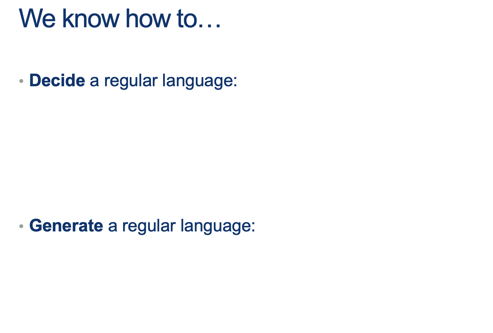
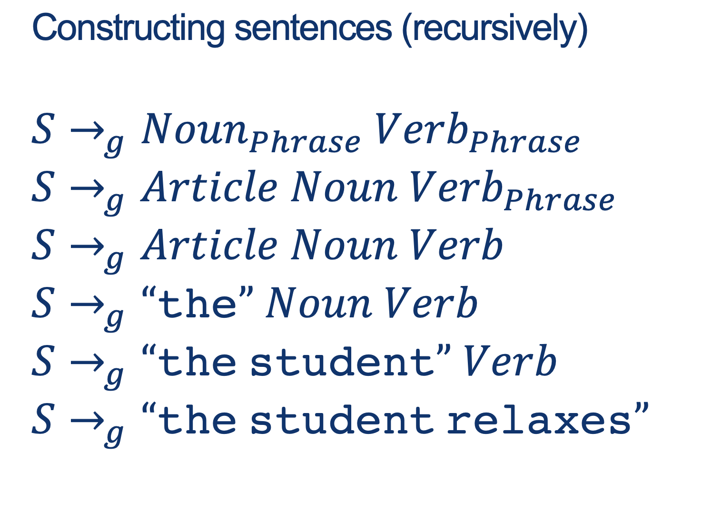
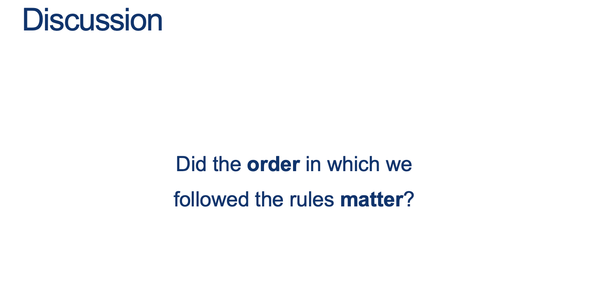
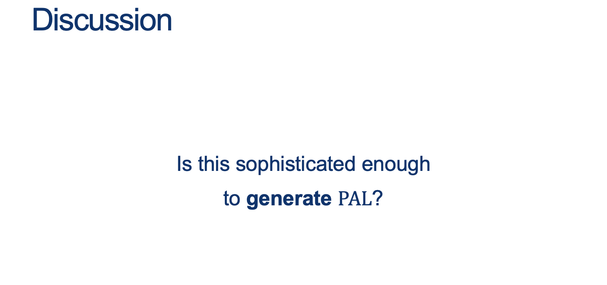
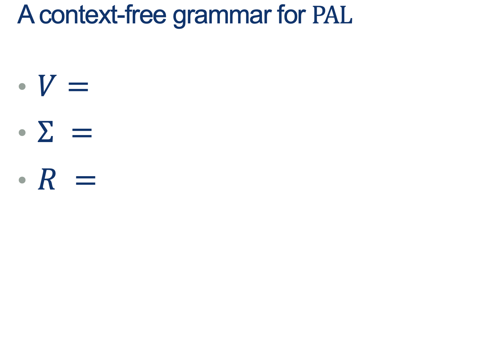
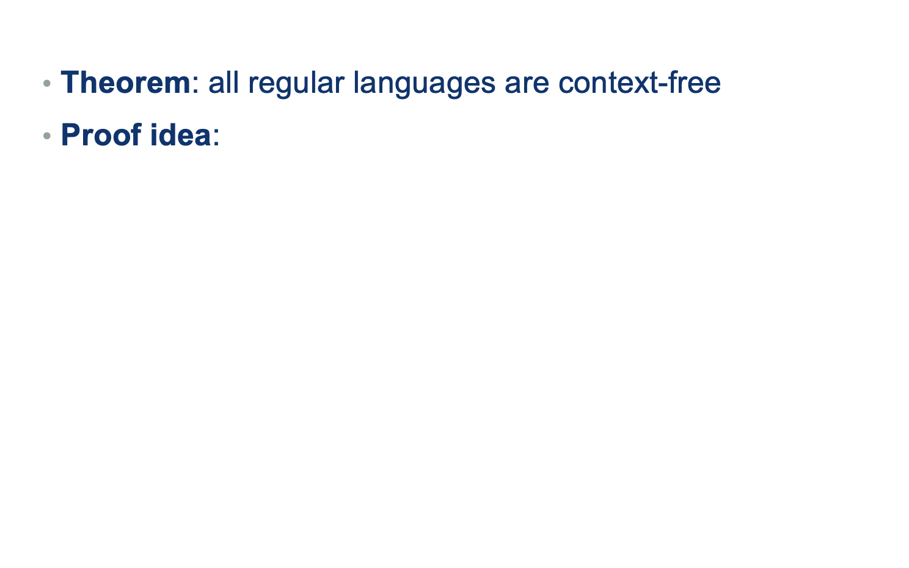
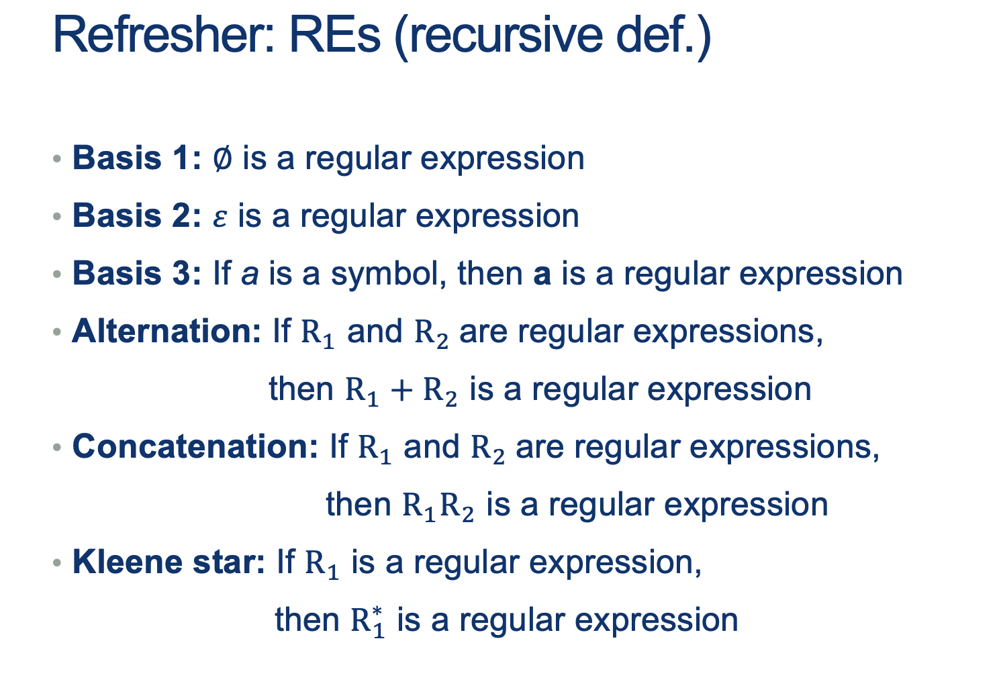
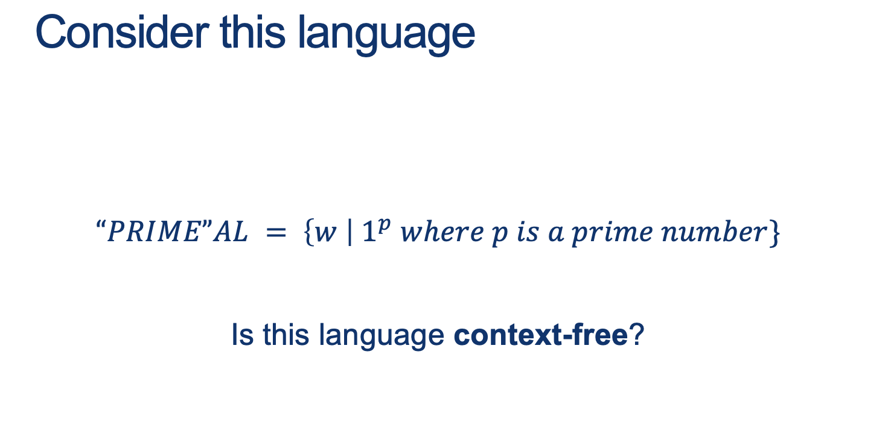

---
layout: default
title: Lecture14
parent: CSC250
grand_parent: Teaching
nav_order: 14
#permalink: /docs/teaching/csc110/
---  

Lecture Notes 14: OLD Context-Free Grammars
=======================================

  

Outline
-------

This class we'll discuss:

* Perspectives on simple machines
* Properties of Regular Languages
* Looking ahead: Context-Free Grammars
* CFG examples

  <!-- 
  

Intro: Context-Free Grammar
---------------------------

  
  
{: width="60%"} 
  
EQ, HALF, PAL  
  
  
  
  
  
  
  
Finite automata and regular expressions are limited  
  
They both only match patterns that can be described by reaching L to R  
  
Some patterns are more interesting…  
  
  
  
  
  
{: width="60%"} 
  
Seems like PAL lives really close to Regular: there’s a structure to the words that’s ALMOST regular… but the pattern is in the middle.  
  
{: width="80%"} 
  
  
  
{: width="80%"} 
  
  
  
  
  
{: width="80%"} 
  
  
  
{: width="80%"} 
  
  
  
{: width="80%"} 
  
  
  
{: width="80%"} 
  
  
  
{: width="80%"} 
  
  
  
{: width="80%"} 
  
  
  
{: width="80%"} 
  
  
  
{: width="80%"} 
  
  
  
{: width="80%"} 
  

  
  
  
  

### How about EQ?

  
  
  
  
In the following map...

* Where are CFGs?
* How would we represent a finite language with a CFG?
* How would we represent a regular language with a CFG?
* Is there something outside a CFG?
* Where is EQ?

  
  
  
  

### Ideas to prove all RL's are "inside" CFGs

  
  
(You suggest some:)  
  
  
  
  
  
  
  
  
  
  
  

### Tip for designing Context-Free-Languages

  
  
Many CFLs are the union of simpler CFLs. If you must construct a CFG for a CFL that you can break into simpler pieces, do so and then construct individual grammars for each piece.  
  
Example:  
  
If the objective is to design a grammar for $ \{0^n1^n \mid n>0 \} \cup \{1^n0^1 \mid n>0 \}$, start with two sub-languages using sub-"starting symbols" and then join them to get the target language starting at $S$  
  
You can build:  
$S_1 = 0S1 \mid \epsilon $  
and  
$S_2 = 1S0 \mid \epsilon$, :  
  
And then join them to obtain:  
  
$$
\begin{alignat}{2} S &= S_1 \mid S_2 \\ S_1 &= 0S_1 1 \mid \epsilon \\ S_2 &= 1S_2 0 \mid \epsilon \end{alignat}
$$
  

### So now, how would we "Build" a Regular Language using a CFG?

  
  
{: width="80%"} 
  

  
{: width="80%"} 
  

### Approach 2: RL's are a special case of CFLs

You can convert any DFA into an equivalent CFG as follows.

1.  Make a variable $S_i$ for each state $q_i$ of the DFA.
2.  Add the rule $S_i$ → $aS_j$ to the CFG if $\delta (q_i,a) = q_j$ is a transition in the DFA.
3.  Add the rule $S_i$ → ε if qi is an accept state of the DFA.
4.  Make $S_0$ the start variable of the grammar, where $q_0$ is the start state of the machine.

  
  
Verify on your own that the resulting CFG generates the same language that the DFA recognizes.  
  
  
  
**Activity 1** \[2 minutes\]:  

Try to build your own CFG. One that "Accepts" the language: $ L = \{ w \in \Sigma^* \vert w \ has \ an \ odd \ number \ of \ 1s \}$

  
   

    answer: 
      

(Wait; then Click)

        

            
          if A is $S_0$ and B is $S_1$: 

$$
\begin{alignat}{2} S &\rightarrow_g S_0 \\ S_0 &\rightarrow_g 0S_0 \\ S_0 &\rightarrow_g 1S_1 \\ S_1 &\rightarrow_g \epsilon \\ S_1 &\rightarrow_g 0S_1 \\ S_1 &\rightarrow_g 1S_0 \\ \end{alignat}
$$
        

      

    
  
 
  
<!-- {: width="60%"}  -->
  
  
  
{: width="80%"} 
  

### How do we prove there are languages that are NOT (beyond) CFLs?

  
  
How did we do this back when we did it for RLs?  
  
  
  
{: width="80%"} 
  

* the middle part is not too big
* v and y (the repeating parts) are not both simultaneously empty
* repeating v and or y we will keep us in the language

  
  
Note that RLs are a special case of Context-Free-Languages (without the $uv^i$) part.  
  
  
  
So, if we have a pumping lemma for CFGs, is there a "Machine" equivalent to the Finite Automatons as well?  
  
  
  
We'll see those next class.

  

* * *

  

Proving a language is NOT context-free
--------------------------------------

  
  
  
  
  
  
  
  
**What does your intuition say?** Is it a CFL?  
  
  
  
  
  
  
  
  
  
Remember:

* Given a structure of $w = uvxyz$, and $ \mid vy \mid \geq 1$
* We want to find an $i$ for which a word $uv^ixy^iz$  
    does not have a prime length ( $ \mid uv^ixy^iz \mid $ is not prime ) after being "pumped" some number of times.
* Here, we can start with a word $w$ with length $p\geq N $ ($N$ provided by the pumping Lemma)
* Now, the trick is to pump the pattern some number of times so that we can prove that the final length is NOT prime!
* Ideas?

   

    answer: 
      

(Wait; then Click)

        

					Steps: 
					<ol>
						<li>The length of a word $\mid uv^ixy^iz \mid $  
					    is the length of $ \mid w \mid $ plus any added repetitions of $v$ and $y$</li>
						<li>So, $ \mid uv^ixy^iz \mid $ is $ \mid w\mid + (i-1)\mid vy \mid $</li>
						<li>Since we said $w$ is in PRIMEAL, then $ \mid w\mid $ is some prime number $p\geq N $.</li>
						<li>Then, $ \mid uv^ixy^iz \mid = \mid w\mid + (i-1)\mid vy \mid = p + (i-1)\mid vy \mid$</li>
						<li>Now, <b>What possible choice of $i$ could we choose to cause the overall length to be provably NOT prime</b> ? </li>
					</ol>
        

      

    
  
 

Answer Below:

   

    answer: 
      

(Wait; then Click)

        

If we choose $i$ so that the $i-1$ is equal to $p$ in the following expression:  

$$ \mid uv^ixy^iz \mid = \mid w\mid + (i-1)\mid vy \mid = p + (i-1)\mid vy \mid $$  
Then substituting $i-1$ for $p$ ( by making $i = p-1$), we would get: 

$$ \mid uv^ixy^iz \mid = \mid w \mid + (i-1)\mid vy \mid = p + p\mid vy \mid \\ = p (1+\mid vy \mid) $$
which means that, after pumping, the word is <b>divisible by $p$</b>! and therefore, <b>not of prime length</b>.
        

      

    
  
 
 
  

* * *

  

Why are CFGs important?
-----------------------

  
  
  
  
check the article out: [https://www.nature.com/articles/nature04675](https://www.nature.com/articles/nature04675)

  

* * *

 -->