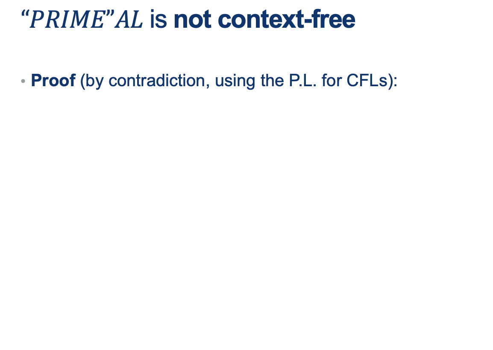
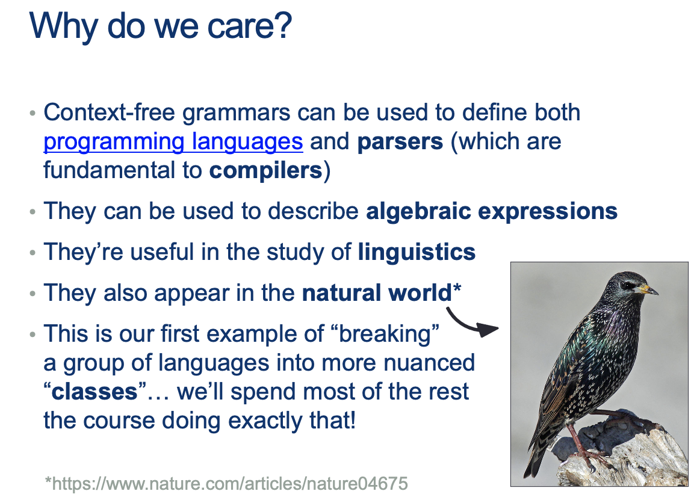
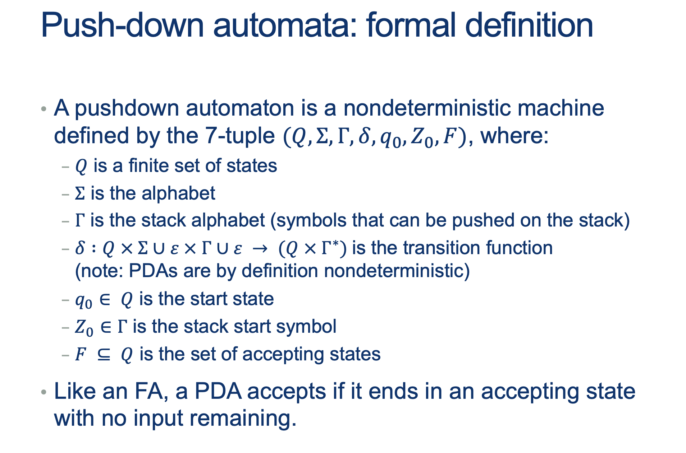

---
layout: default
title: Lecture15
parent: CSC250
grand_parent: Teaching
nav_order: 15
#permalink: /docs/teaching/csc110/
---  

Lecture Notes 15: More CFGs and Intro to Push-Down Automata
===========================================================

  

Outline
-------

This class we'll discuss:

* More on CFGs
* Intro to Push-Down Automata

  

* * *

  

Recap: CFGs
-----------

  
  
{: width="80%"}  
  
  
  
  
  

All REs can be created with CFGs
--------------------------------

### Approach 1: Recursive creation of CFG from definition of REs

For any RE $R_1$ We can produce a CFG $G_1$ by applying the following steps:  
  

* Any base cases can be writen as generation of  
    $S \rightarrow_g \emptyset \vert \epsilon \vert a$ for all $a \in \Sigma \quad from \ R_1's \ \Sigma$
* Defining the more complex rules requires combining two rules. The recursive expression based on these two base rules can start with:  
    $S \rightarrow_g A $ (some expression)  
    $S \rightarrow_g B $ (another expression)  
    and combined to generate more complex expressions:
    * Alternation:  
        $S \rightarrow_g S_1 \vert S_2 $ (equivalent to A + B for some A, B)
      
    * Concatenation:  
        $S \rightarrow_g S_1 S_2 $ (equivalent to A B for some A, B)
      
    * Kleene:  
        $S \rightarrow_g S_1 S \vert \epsilon $ (equivalent to $ A^* $ for some A)

  
  
  
  

### Approach 2: RL's are a special case of CFLs

You can convert any DFA into an equivalent CFG as follows.

1.  Make a variable $S_i$ for each state $q_i$ of the DFA.
2.  Add the rule $S_i$ → $aS_j$ to the CFG if $\delta (q_i,a) = q_j$ is a transition in the DFA.
3.  Add the rule $S_i$ → ε if qi is an accept state of the DFA.
4.  Make $S_0$ the start variable of the grammar, where $q_0$ is the start state of the machine.

  
  
Verify on your own that the resulting CFG generates the same language that the DFA recognizes.  
  
  
  
**Activity 1** \[2 minutes\]:  

Try to build your own CFG. One that "Accepts" the language: $$ L = \{ w \in \Sigma^* \vert w \ has \ an \ odd \ number \ of \ 1s \}$$

  
   

    answer: 
      

(Wait; then Click)

        

            
if A is $S_0$ and B is $S_1$: 

$$ 
\begin{alignat}{2} S &\rightarrow_g S_A \\ S_A &\rightarrow_g 0S_A \\ S_A &\rightarrow_g 1S_B \\ S_B &\rightarrow_g \epsilon \\ S_B &\rightarrow_g 0S_B \\ S_B &\rightarrow_g 1S_A \\ \end{alignat} 
$$
        

      

    
  
 
  
  
  
  
{: width="80%"}  
  

### How do we prove there are languages that are NOT (beyond) CFLs?

  
  
How did we do this back when we did it for RLs?  
  
  
  
  
  
{: width="80%"}  
  

* the middle part is not too big
* v and y (the repeating parts) are not both simultaneously empty
* repeating v and or y we will keep us in the language

  
  
Note that RLs are a special case of Context-Free-Languages (without the $uv^i$) part.  
  
  
  
So, if we have a pumping lemma for CFGs, is there a "Machine" equivalent to the Finite Automatons as well?  
  
  
  
We'll see those next class.

  

* * *

  

Proving a language is NOT context-free
--------------------------------------

  
  
{: width="80%"}  
  
  
  
  
  
**What does your untuition say?** Is it a CFL?  
  
  
  
  
  
{: width="80%"}  
  
  
  
Remember:

* Given a structure of $w = uvxyz$, and $ \mid vy \mid \geq 1$
* We want to find an $i$ for which a word $uv^ixy^iz$  
    does not have a prime length ( $ \mid uv^ixy^iz \mid $ is not prime ) after being "pumped" some number of times.
* Here, we can start with a word $w$ with length $p\geq N $ ($N$ provided by the pumping Lemma)
* Now, the trick is to pump the pattern some number of times so that we can prove that the final length is NOT prime!
* Ideas?

   

    answer: 
      

(Wait; then Click)

        

					Steps: 
					<ol>
						<li>The length of a word $\mid uv^ixy^iz \mid $  
					    is the length of $ \mid w \mid $ plus any added repetitions of $v$ and $y$</li>
						<li>So, $ \mid uv^ixy^iz \mid $ is $ \mid w\mid + (i-1)\mid vy \mid $</li>
						<li>Since we said $w$ is in PRIMEAL, then $ \mid w\mid $ is some prime number $p\geq N $.</li>
						<li>Then, $ \mid uv^ixy^iz \mid = \mid w\mid + (i-1)\mid vy \mid = p + (i-1)\mid vy \mid$</li>
						<li>Now, <b>What possible choice of $i$ could we choose to cause the overall length to be provably NOT prime</b> ? </li>
					</ol>
        

      

    
  
 

Answer Below:

   

    answer: 
      

(Wait; then Click)

        

If we choose $i$ so that the $i-1$ is equal to $p$ in the following expression:  

$$ \mid uv^ixy^iz \mid = \mid w\mid + (i-1)\mid vy \mid = p + (i-1)\mid vy \mid $$  
Then substituting $i-1$ for $p$ ( by making $i = p-1$), we would get: 

$$ \mid uv^ixy^iz \mid = \mid w \mid + (i-1)\mid vy \mid = p + p\mid vy \mid \\ = p (1+\mid vy \mid) $$
which means that, after pumping, the word is <b>divisible by $p$</b>! and therefore, <b>not of prime length</b>.
        

      

    
  
 
 
  

  

* * *

  

Why are CFGs important?
-----------------------

  
  
{: width="80%"}  
  
check the article out: [https://www.nature.com/articles/nature04675](https://www.nature.com/articles/nature04675)  
  
{: width="80%"}  
  
  
  
{: width="80%"}  
  
  
  
{: width="80%"}  
  

  

* * *

  

Push-Down Automata
------------------

  
  
{: width="80%"}  
  
  
  
{: width="80%"}  
  
  
  
{: width="80%"}  
  
  
  
{: width="80%"}  
  
**Activity 2** \[2 minutes\]:  

What is the language that these rules are describing?

   

    answer: 
      

(Wait; then Click)

        

        	<ul>
        		<li>are these a valid words? $\{ \epsilon, 01, 0011, \dots \} $</li>
        		<li>We know this language!! What is it called?</li>
 
        		<b>Now, let's try to buid an automaton that can keep track of all of this</b>
        	</ul>
        

      

    
  
 
  

  
  
{: width="80%"}  
  
**Notes**

* we need a notation for READ, POP and PUSH... we'll use: $ READ, POP \rightarrow PUSH$
* we need a symbol for "The stack is currently empty!"... we'll use $z_0$
* we need to be able to read a symbol without pushing ... we'll use $\epsilon$ in place of PUSH
* we need to be able to read a symbol without popping ... we'll use $\epsilon$ in place of POP
* we need to be able to push without reading a symbol ... we'll use $\epsilon$ in place of READ
* we need to be able to pop without reading a symbol ... we'll use $\epsilon$ in place of READ

  
  
{: width="80%"}  
  
  
  
  
  
  
  

### So now, let's draw the PDA for HALF

  
  

#### An example for HALF:

  
  
{: width="80%"}  
  
And in a "compressed notation":  
  
{: width="80%"}  
  
  
  
{: width="80%"}  
  
Note that we defined an Augmented **NON-Deterministic** Automaton  
  
{: width="80%"}  
  
  
  
{: width="80%"}  
  
  
  
{: width="80%"}  
  
  
  
{: width="80%"}  
  
**Tips:**

* Think of phases:
    1.  memorizing
    2.  middle (even or odd)
    3.  replicating in reverse
* write the PDA... and remember it is NON-Deterministic

**Activity 3** \[2 minutes\]:  

Build the PDA for PAL

   

    answer: 
      

(Wait; then Click)

        

        

      

    
  
   

  
  
{: width="80%"}  
  
  
  
{: width="80%"}