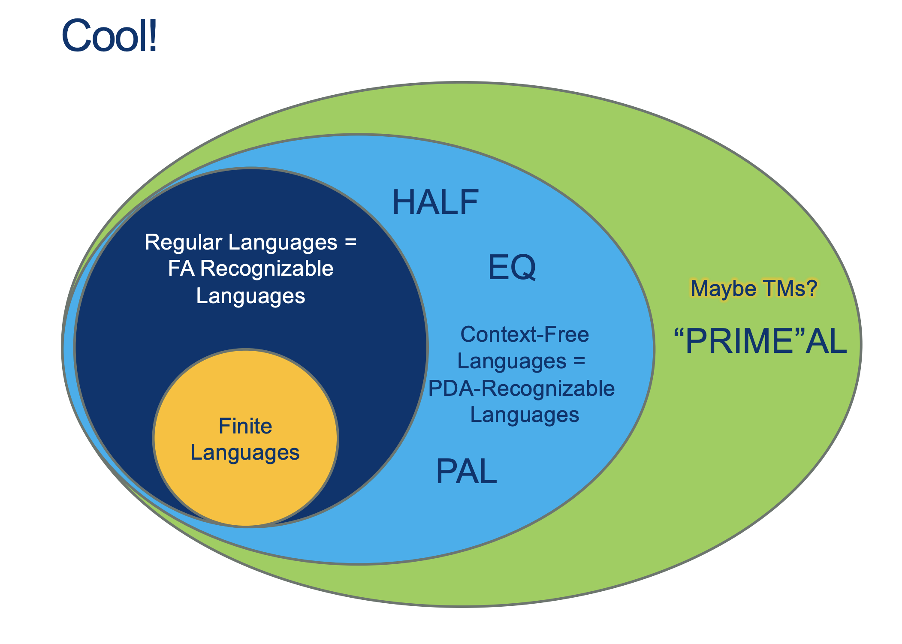

---
layout: default
title: Lecture17
parent: CSC250
grand_parent: Teaching
nav_order: 17
#permalink: /docs/teaching/csc110/
---  
  

Lecture Notes 17: Intro to Turing Machines
==========================================

  

Outline
-------

This class we'll discuss:

* Recap: REs and CFGs
* The "tape-processing" view
* More powers: TMs

  

* * *

  

Building up to the big one...
-----------------------------

  

* * *

  

Turing Machines
---------------

  
  
{: width="80%"}  
  
  
  
{: width="80%"}  
  
  
  
{: width="80%"}  
  
  
  
{: width="80%"}  
  
  
  
{: width="80%"}  
  
  
  
{: width="80%"}  
  
  
  
{: width="80%"}  
  
  
  
{: width="80%"}  
  
  
  
{: width="80%"}  
  
  
  
{: width="80%"}  
  
  
  
{: width="80%"}  
  
  
  
{: width="80%"}  
  
  
  
{: width="80%"}  
  
  
  
{: width="80%"}  
  
  
  
{: width="80%"}  
  
  
  
{: width="80%"}  
  
  
  
{: width="80%"}  
  
  
  
  
  

So, a transition would look like this:

$$ (r, w, m) $$

where each of the elements means:

* **r**: what is Read from the "tape"
* **w**: what is Written into the "tape"
* **m**: the movement direction in the "tape"

Examples:  

* **(0, $\square$, L)**: IF we read a 0, we write a "blank" and move Left
* **(1, 1, R)**: IF we read a 1, we write a 1 and move Right
* **(0, 0, L)**: IF we read a 0, we write a 0 and move Left

  
  
  
  
  
  
{: width="80%"}  
  
  
  
{: width="80%"}  
  
  
  
{: width="80%"}  
  
   <div class="container mx-lg-5">
    <span style='color:#6f439a'>answer: 
      <details><summary>(Wait; then Click)</summary>
        <p>
        	Solution  <br>
          <br> 
          Where would the reject state be?  
        </p>
      </details>
    </span>
  </div> 
  
But... we don't need to write them like that!


## Writing Turing Machines
  

These machines are so powerful, we can actually describe them with pseudocode.

Example, the machine shown above can also be described like this:

```    
    On input w:
    while there are symbols left in the tape:
        i. note whether 1st letter is a 0 or a 1 and erase it
        ii. go all the way to the last symbol
        iii. if this symbol doesn't match the one we just erased, REJECT; 
            otherwise erase it and go back to the start.
    ACCEPT. 
```

## TM Powers

<br><br>

  
{: width="80%"}  
  
  
  
{: width="80%"}  
  
  
  
{: width="80%"}  
  
  
  
{: width="80%"}  
  
  
  
{: width="80%"}  
  
  
  
{: width="80%"}  
  
  
  
{: width="80%"}  
  
  
  
  
  

### The magic Halting predictor machine H

Can we create a machine/routine (let's call it machine **H**) that can predict if a program will halt?  
  
Let's watch the following video to see what could go wrong with such a machine **H**:  
[Halting Problem Video](https://www.youtube.com/watch?v=92WHN-pAFCs)  
  
  
  
  
  
  
  

### Proof Sketch

The following is a (sketch of a) proof by contradiction:  
  
  
  

#### 1: Say there exists a function called halts

  

#### halts(f) returns true if the subroutine f halts and returns false otherwise.

  
  

#### 2: Now consider the following subroutine g:

  
  
{: width="80%"}  
  
  
  
What is happening here? 
  
   <div class="container mx-lg-5">
    <span style='color:#6f439a'>answer: 
      <details><summary>(Wait; then Click)</summary>
        <p>
        	<ol>
						<li>halts(g) must either return true or false.</li>
						<li>If halts(g) returns true, then g will call loop_forever and never halt, which is a contradiction.</li>
						<li>Therefore, the initial assumption that halts is a total computable function must be false.</li>
					</ol>
        </p>
      </details>
    </span>
  </div> 


* * *

