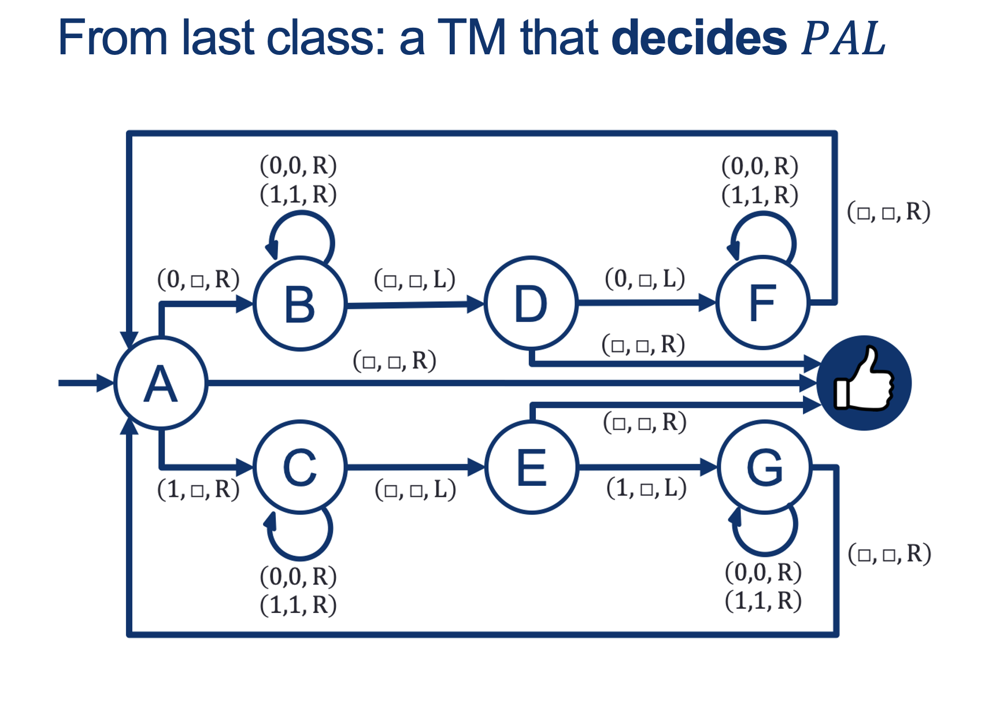
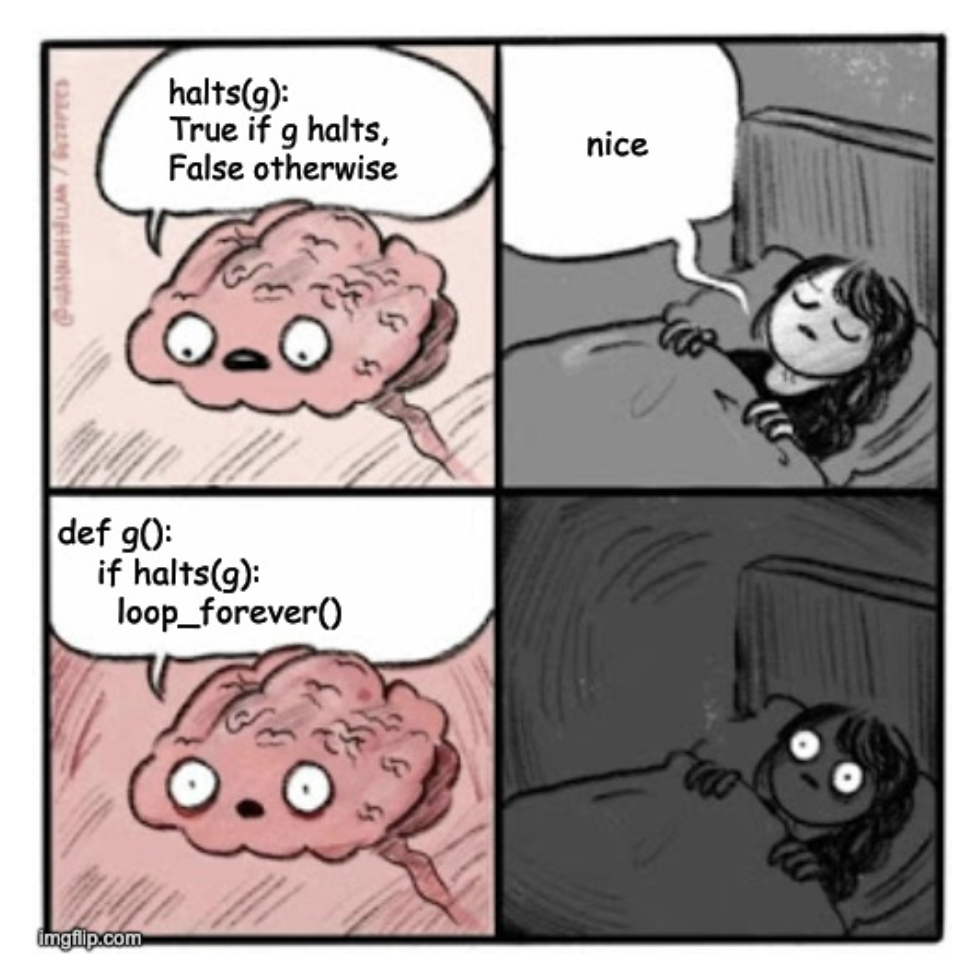

---
layout: default
title: Lecture18
parent: CSC250
grand_parent: Teaching
nav_order: 18
#permalink: /docs/teaching/csc110/
---  
  
Lecture Notes 18: More on Turing Machines
==========================================

Outline
-------

This class we'll discuss:

* Recap: Turing Machines
* Universal Turing Machines
* A Strange Turing Machine


# The Universal Turing Machine

<br><br>
  
{: width="80%"}  
  
  
  
{: width="80%"}  
  
  
  
{: width="80%"}  
  
  
  
{: width="80%"}  
  
  
  
{: width="80%"}  
  
  
  
{: width="80%"}  
  
  
  
{: width="80%"}  
  
  
  
  
  

### The magic Halting predictor machine H

Can we create a machine/routine (let's call it machine **H**) that can predict if a program will halt?  
  
Let's watch the following video to see what could go wrong with such a machine **H**:  
[Halting Problem Video](https://www.youtube.com/watch?v=92WHN-pAFCs)  
  
  

### Proof Sketch

The following is a (sketch of a) proof by contradiction:  
  
  
  

#### 1: Say there exists a function called halts

  

#### halts(f) returns true if the subroutine f halts and returns false otherwise.

  
  

#### 2: Now consider the following subroutine g:

  
  
{: width="80%"}  
  
  
  
What is happening here? 
  
   <div class="container mx-lg-5">
    <span style='color:#6f439a'>answer: 
      <details><summary>(Wait; then Click)</summary>
        <p>
        	<ol>
						<li>halts(g) must either return true or false.</li>
						<li>If halts(g) returns true, then g will call loop_forever and never halt, which is a contradiction.</li>
						<li>Therefore, the initial assumption that halts is a total computable function must be false.</li>
					</ol>
        </p>
      </details>
    </span>
  </div> 


## Here is another view of the haltin machine problem:

  

## Turing Machines and Intro to Decidability

  
  
{: width="80%"}  
  
  
  
{: width="80%"}  
  
  
  
{: width="80%"}  
  


  
   <div class="container mx-lg-5">
    <span style='color:#6f439a'>answer: 
      <details><summary>(Wait; then Click)</summary>
        <p>
        	<ol>
						<li>move both left and right.</li>
						<li>write new symbols to the tape.</li>
						<li>stop at any point and return an answer.</li>
					</ol>
        </p>
      </details>
    </span>
  </div> 

  
  
{: width="80%"}  
  
### Recognizing vs Deciding  
  
  
**Recognizing** a word is having the capacity of saying "YES, I know this one", if that word is in the Language $L$ you are able to "Recognize".  
  
Note: If you are trying to **Recognize** a word, but you are not done checking, .... how long do you wait?  
  
In other words, you just say: If I say "YES", I'm sure it is "YES" (ACCEPT), but I don't promise anything else.  
  
  
  
**Deciding** a word is having the capacity of saying "YES, I know this one", if that word is in the Language $L$ you are able to "Decide", AND "NO, this one is NOT one of mine" for ALL words that are not in the Language you are able to "Decide" (called the complement of $L$, or $L^c$ or $\bar{L}$.  
  

<br><br>
  
  
{: width="80%"}  
  
  
  
{: width="80%"}  
  
  
  
{: width="80%"}  
  

```    
    On input w:
    while there are symbols left in the tape:
        i. note whether 1st letter is a 0 or a 1 and erase it
        ii. go all the way to the last symbol
        iii. if this symbol doesn't match the one we just erased, REJECT; 
            otherwise erase it and go back to the start.
    ACCEPT. 
```
  
  
### Big Idea 1: Emulating

If the TM $U$ has arbitrary memory (Tape), we can "save" input descriptions of other machines $M$ and, given a word $w$ as input, process the word using the rules we read from the tape and interpret with the states described in $M$.

In other words, TM $U$ can **emulate** other turing machines $M$ for some input $w$  
  

### Big Idea 2: Input Descriptions  
  

If TM $U$ can **emulate** $< M, w >$,  
We can make the input $w$ the description of another machine $ M_2 $

In other words, TM $U$ can **emulate** other turing machines $M$ that can get as input, other turing machines $w = description(M_2)$  
  
Or $U$ emulates $< M, description(M_2) >$ or just $< M, M_2 >$  
  
  
  
Where we left off...  
  
{: width="80%"}  
  
  
  
{: width="80%"}  
  
  
  
{: width="80%"}  
  
  
  
{: width="80%"}  
  

  

1.  Isn't just looking for a while (true)?
2.  How about an example problem:  

    $$ \begin{align*} &n = 19 \\ &while \ (n != 1): \\ & \quad if \ n\%2 == 0: \\ & \quad \quad n = n/2 \\ & \quad else : \\ & \quad \quad n = 3*n + 1 \\ \end{align*} $$

  

### And now a proof that the halting problem is an actual thing:
  
{: width="80%"}  
  


#### How about an example problem:  

  Assume we have a turing machine H that decides (Accept AND Reject) **HALT** : 

  $$ 
  \begin{align*} 
  &M_{HALT}: \\ 
  & \text{On INPUT $< M, \hat{w} >$} \\ 
  & \quad \text{ if M HALTS on $\hat{w}$, ACCEPT } \\ 
  & \quad \text{ if M FLOOPS on $\hat{w}$, REJECT } 
  \end{align*} 
  $$  


  Note that this is the same as:

  $$ 
  \begin{align*} 
  &M_{HALT}: \\ 
  & \text{On INPUT $< M, \hat{w} >$} \\ 
  & \quad \text{ if M ACCEPTS $\hat{w}$, ACCEPT } \\
  & \quad \text{ if M REJECTS $\hat{w}$, ACCEPT } \\ 
  & \quad \text{ if M FLOOPS on $\hat{w}$, REJECT } 
  \end{align*} 
  $$  


  Since there are no restrictions on what w looks like, it’s possible that w could be the description of another machine.  
  (this is actually pretty familiar: that’s exactly what a compiler is, right? A program that takes another program as input)  

  Let’s use this machine to define a new **helper** machine called **$M_X$**: 

  $$ 
  \begin{align*} 
  &M_X: \\ 
  & On \; INPUT \; < M > \\ 
  & \quad \text{Make } \hat{w} = < M > \color{gray}{ \text{# a copy of the input machine's description} }\\
  & \quad \text{run $M_{HALT} ( < M , \hat{w}>)$}
  \quad \color{gray}{ \text{# run $M_{HALT} ( < M , < M > > )$ } } \\     
  & \quad \text{if $M_{HALT}( < M , \hat{w} > )$ returns ACCEPT, FLOOP on purpose } \\ 
  & \quad \text{if $M_{HALT}( < M , \hat{w} > )$ returns REJECT, ACCEPT } \\ 
  \end{align*} 
  $$  
  
  1.  This machine just takes in the description of a machine $ < M > $ as input (no w)
  2.  It then creates an input word $\hat{w}$ with its own description
  3.  Lastly, it calls $M_{HALT}$ to check if the input machine HALTS on its own description and:

      1. If $M_{HALT}$ predicts that the input machine HALTS on its own description (ACCEPT), $M_X$ FLOOPS on purpose (imagine a $While(True)$ Loop);
      2. If $M_{HALT}$ predicts that the input machine FLOOPS on its own description (REJECT), $M_X$ ACCEPTS!

<!-- 
    Let’s use this machine to define a new **helper** machine called **$M_{\text{TEST_ON_ITSELF}}$**: 

    $$ 
    \begin{align*} 
    &M_{\text{TEST_ON_ITSELF}}: \\ 
    & On \; INPUT \; < M > \\ 
    & \quad \color{gray}{ \text{# run $M_{H} ( < M , < M > > )$ ADWID } } \\ 
    & \quad \text{run $M_{HALT} ( < M , < M > >)$}\\ 
    & \quad \text{if $M_{HALT}( < M , < M > > )$ returns ACCEPT, ACCEPT } \\ 
    & \quad \text{if $M_{HALT}( < M , < M > > )$ returns REJECT, REJECT } \\ 
    \end{align*} 
    $$  
    
    1.  This machine just takes in the description of a machine $ < M > $ as input (no w)
    2.  It then calls the decider for HALT to see what would happen if we ran that machine on its own description **ADWID** (And Do What It Does)
    
      
      
    Finally, we’ll define one last machine **$M_{X}$** that FLOOPS if $M_{\text{TEST_ON_ITSELF}}$ says ACCEPT;  
    otherwise ADWID.  

    $$ \begin{align*} 
    &M_{X}: \\ 
    & On \; INPUT \; < M > \\ 
    & \quad \text{run $M_{\text{TEST_ON_ITSELF}} ( < M > )$}\\ 
    & \quad \text{if $M_{\text{TEST_ON_ITSELF}}( < M > )$ returns ACCEPT (HALTS), FLOOP } \\ 
    & \quad \text{if $M_{\text{TEST_ON_ITSELF}}( < M > )$ returns REJECT (FLOOPS), DWID } \\
    & \qquad \qquad \qquad \qquad \qquad \qquad \qquad \qquad \qquad \text{ (if Rej->Rej; if Floop -> Floop)) } \\ 
    \end{align*} 
    $$  
       -->

  So, **What happens if we run $ M_{X} ( < M_{X} > ) $?**  

  I'll replace $< M >$ with $< M_X >$ in the pseudocode shown above
  (and use that explicitly instead of $\hat{w}$):

  $$ 
  \begin{align*} 
  &M_X: \\ 
  & On \; INPUT \; < M_x > \\ 
  & \quad \text{run $M_{HALT} ( < M_x , M_x > )$}\\
  & \quad \text{if $M_{HALT}( < M_x ,  M_x > )$ returns ACCEPT, FLOOP on purpose } \\ 
  & \quad \text{if $M_{HALT}( < M_x ,  M_x > )$ returns REJECT, ACCEPT } \\ 
  \end{align*} 
  $$ 

  1.  This run of $M_X$ takes in the description of itself $< M_X >$ as input
  2.  It calls $M_{HALT}$ to check if it HALTS on its own description (remember that $M_{HALT}$ should always have a consistent answer!):

      1. If $M_{HALT}$ predicts that $M_{X}$ HALTS on its own description (ACCEPT), $M_X$ FLOOPS on purpose... But that means that we just FLOOPED when runing $M_{X}$ with its own input (which is exactly the opposite of what $M_{HALT}$ predicted!)
      2. If $M_{HALT}$ predicts that $M_{X}$ FLOOPS on its own description (REJECT), $M_X$ ACCEPTS!... But that means that we just HALTED when runing $M_{X}$ with its own input (which is exactly the opposite of what $M_{HALT}$ predicted!)

 **A CONTRADICTION**

 Since the ONLY assumption was that $M_{HALT}$ exists, then **that means that $M_{HALT}$ cannot exist!** 

<!-- 
  Inside $M_{X}$, we call $M_{\text{TEST_ON_ITSELF}}( < M_{X} > )$, which calls $M_{HALT} ( < M_{X} , < M_{X} > >)$.  
  If $M_{X}$ halts when fed $M_{X}$ as input then the call $M_{X} ( < M_{X} >)$ loops forever.  
  If $M_{X}$ doesn't halt when fed $M_{X}$ as input, then the call $M_{X} ( < M_{X} >)$ halts.  
  $M_{X} ( < M_{X} >)$ can neither halt nor loop forever.  
  This is a contradiction! Since our only assumption was the existence of HALTS, procedure HALTS cannot exist.
 -->
  


