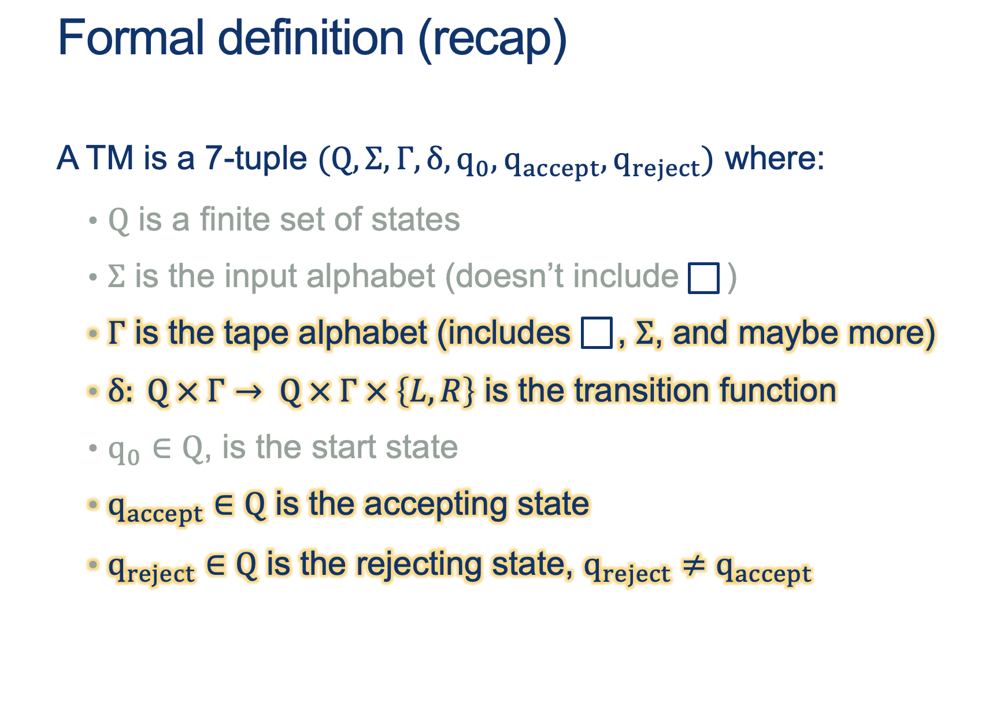
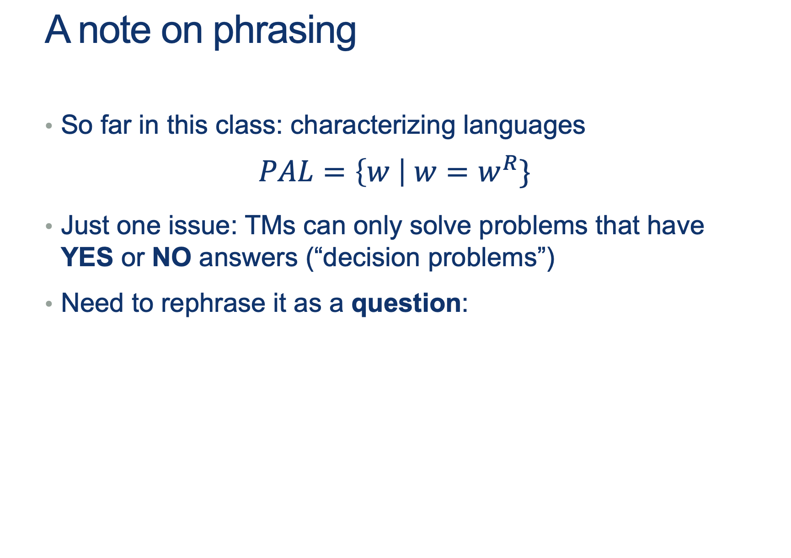

---
layout: default
title: Lecture20
parent: CSC250
grand_parent: Teaching
nav_order: 20
#permalink: /docs/teaching/csc110/
---  

Lecture Notes 20: Decidability
==============================


Outline
-------

This class we'll discuss:

* Recap: TMs
* Decidability


* * *

  

Turing Machines and Decidability
--------------------------------

  
  
  
  
  
  
{: width="80%"}  
  
  
  
{: width="80%"}  
  

<div class="container mx-lg-5">
  <span style='color:#6f439a'>answer: 
    <details><summary>(Wait; then Click)</summary>
      <p>
     	  <ol>
					<li>move both left and right</li>
					<li>write new symbols to the tape</li>
					<li>stop at any point and return an answer</li>
				</ol>
      </p>
    </details>
  </span>
</div> 
  

  
{: width="80%"}  
  

## Recognizing vs Deciding  
  
  
  
**Recognizing** a word is having the capacity of saying "YES, I know this one", if that word is in the Language $L$ you are able to "Recognize".  
  
Note: If you are trying to **Recognize** a word, but you are not done checking, .... how long do you wait?  
  
In other words, you just say: If I say "YES", I'm sure it is "YES" (ACCEPT), but I don't promise anything else.  
  
  
  
**Deciding** a word is having the capacity of saying "YES, I know this one", if that word is in the Language $L$ you are able to "Decide", AND "NO, this one is NOT one of mine" for ALL words that are not in the Language you are able to "Decide" (called the complement of $L$, or $L^c$ or $\bar{L}$.  
  
<br><br>

## Examples

### A Decider for PAL
  
  
{: width="80%"}  
  

  
{: width="80%"}  
  
  
  
{: width="80%"}  
  


```    
    On input w:
    while there are symbols left in the tape:
        i. note whether 1st letter is a 0 or a 1 and erase it
        ii. go all the way to the last symbol
        iii. if this symbol doesn't match the one we just erased, REJECT; 
            otherwise erase it and go back to the start.
    ACCEPT. 
```

<br><br>

### Recap: A Decider for HALT?


if we define HALT as: $\{ w \vert w = < M, \hat{w}> \text{ where M is a TM and M HALTS on } \hat{w} \}$

We can prove a Decider for HALT cannot exist by contradiction:

Suppose it exists:

  $$ 
  \begin{align*} 
  &M_{HALT}: \ 
  & \text{On INPUT $< M, \hat{w} >$} \ 
  & \quad \text{ if M HALTS on $\hat{w}$, ACCEPT } \ 
  & \quad \text{ if M FLOOPS on $\hat{w}$, REJECT } 
  \end{align*} 
  $$  

If we build the helper machine $M_X$:

  $$ 
  \begin{align*} 
  &M_X: \ 
  & On \; INPUT \; < M > \ 
  & \quad \text{Make } \hat{w} = < M > \color{gray}{ \text{# a copy of the input machine's description} }\
  & \quad \text{run $M_{HALT} ( < M , \hat{w}>)$}
  \quad \color{gray}{ \text{# run $M_{HALT} ( < M , < M > > )$ } } \     
  & \quad \text{if $M_{HALT}( < M , \hat{w} > )$ returns ACCEPT, FLOOP on purpose } \ 
  & \quad \text{if $M_{HALT}( < M , \hat{w} > )$ returns REJECT, ACCEPT } \ 
  \end{align*} 
  $$  

And run $M_X$ with input equal to itself, we get:

  $$ 
  \begin{align*} 
  &M_X: \ 
  & On \; INPUT \; < M_x > \ 
  & \quad \text{run $M_{HALT} ( < M_x , M_x > )$}\
  & \quad \text{if $M_{HALT}( < M_x ,  M_x > )$ returns ACCEPT, FLOOP on purpose } \ 
  & \quad \text{if $M_{HALT}( < M_x ,  M_x > )$ returns REJECT, ACCEPT } \ 
  \end{align*} 
  $$ 

  1.  This run of $M_X$ takes in the description of itself $< M_X >$ as input
  2.  It calls $M_{HALT}$ to check if it HALTS on its own description (remember that $M_{HALT}$ should always have a consistent answer!):

      1. If $M_{HALT}$ predicts that $M_{X}$ HALTS on its own description (ACCEPT), $M_X$ FLOOPS on purpose... But that means that we just FLOOPED when runing $M_{X}$ with its own input (which is exactly the opposite of what $M_{HALT}$ predicted!)
      2. If $M_{HALT}$ predicts that $M_{X}$ FLOOPS on its own description (REJECT), $M_X$ ACCEPTS!... But that means that we just HALTED when runing $M_{X}$ with its own input (which is exactly the opposite of what $M_{HALT}$ predicted!)

 **A CONTRADICTION**

 Since the ONLY assumption was that $M_{HALT}$ exists, then **that means that $M_{HALT}$ cannot exist!** 

  
{: width="80%"}  
  
  
  
{: width="80%"}  
  
  
  
{: width="80%"}  
  
  
  
{: width="80%"}  
  
  
  
{: width="80%"}  
  
  
  
{: width="80%"}  
  

<div class="container mx-lg-5">
  <span style='color:#6f439a'>answer: 
    <details><summary>(Wait; then Click)</summary>
      <p>
     	  <ol>
					<li>Run both machines in parallel</li>
					<li> $\qquad$ Accept if either accepts</li>
				</ol>
      </p>
    </details>
  </span>
</div>  
  

<br><br>

  
  
{: width="80%"}  
  

<div class="container mx-lg-5">
  <span style='color:#6f439a'>answer: 
    <details><summary>(Wait; then Click)</summary>
      <p>
     	  <ol>
					<li>Run both machines in parallel</li>
					<li> $\qquad$ Accept if both accept</li>
				</ol>
      </p>
    </details>
  </span>
</div>  
  

<br><br>

  
  
{: width="80%"}  
  

<div class="container mx-lg-5">
  <span style='color:#6f439a'>answer: 
    <details><summary>(Wait; then Click)</summary>
      <p>
     	  <ol>
					<li>Suppose that M decides L.</li>
					<li> Design a new machine $M^\prime$ that behaves just like M, but: 
						<ul>
							<li>If M accepts, $M^{\prime}$ rejects</li>
							<li>If M rejects, $M^{\prime}$ accepts</li>
						</ul>
					</li>
					<li>Formally, can do this by interchanging $q_{acc}$ and $ q_{rej}$</li>
					<li>Then $M^{\prime}$ decides $L^c$</li>
<!-- 						
						<ul>
							<li></li>
							<li></li>
							<li></li>
						</ul> 
-->
				</ol>
      </p>
    </details>
  </span>
</div>  
  

<br><br>
  

  
{: width="80%"}  
  
  
  
{: width="80%"}  
  

<div class="container mx-lg-5">
  <span style='color:#6f439a'>answer: 
    <details><summary>(Wait; then Click)</summary>
      <p>
     	  <ol>
					<li>Run both M1 and M2 on w</li>
					<li>One must accept</li>
					<li> 
						<ul>
							<li>If M1 accepts, then M accepts</li>
							<li>If M 2 accepts, then M rejects</li>
						</ul> 						
					</li>
				</ol>
How? In sequence? <b>What if M1 loops?</b>  <br>
What can we do?	<br><br>

{: width="80%"}  
      </p>
    </details>
  </span>
</div>  
  
<br><br><br>
  
{: width="80%"}  
  
  
  
{: width="80%"}  
  
  
  
{: width="80%"}  
  
  
  
{: width="80%"}  
  
  
  
{: width="80%"}