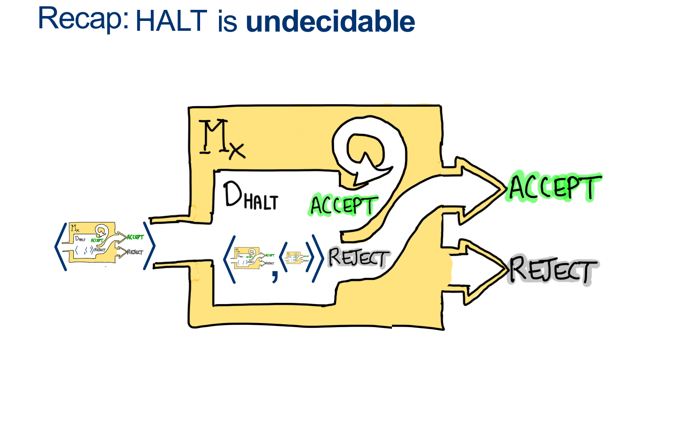
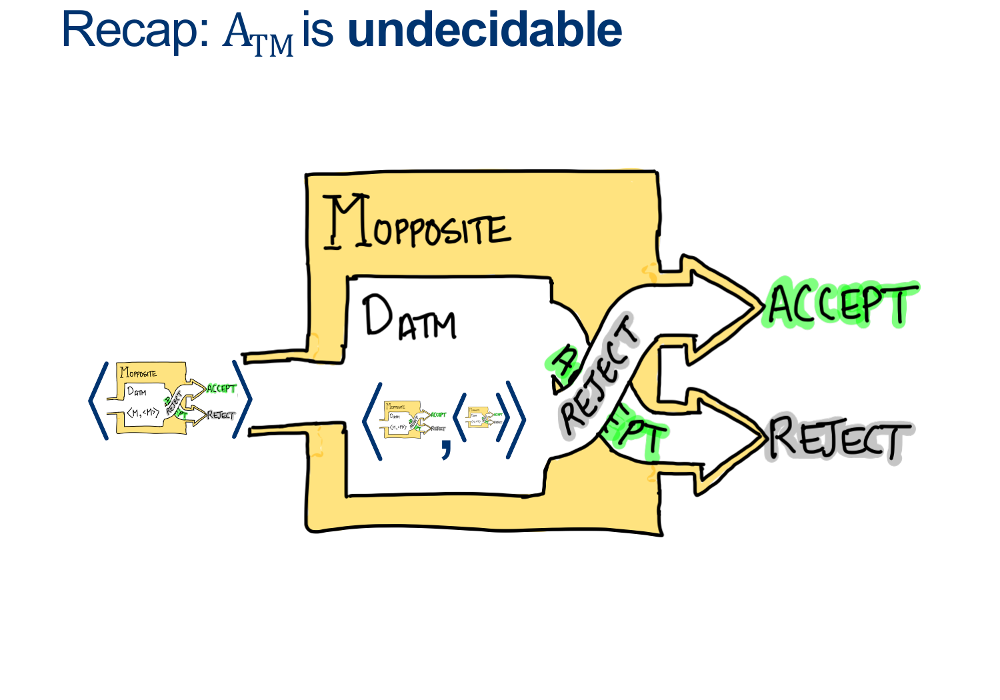
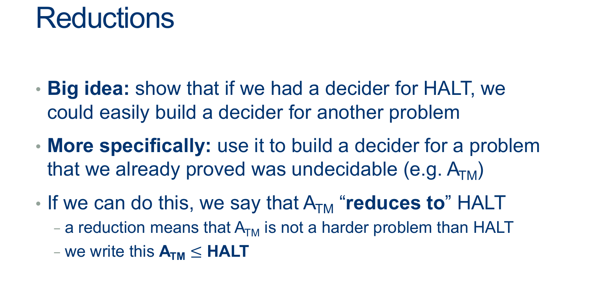
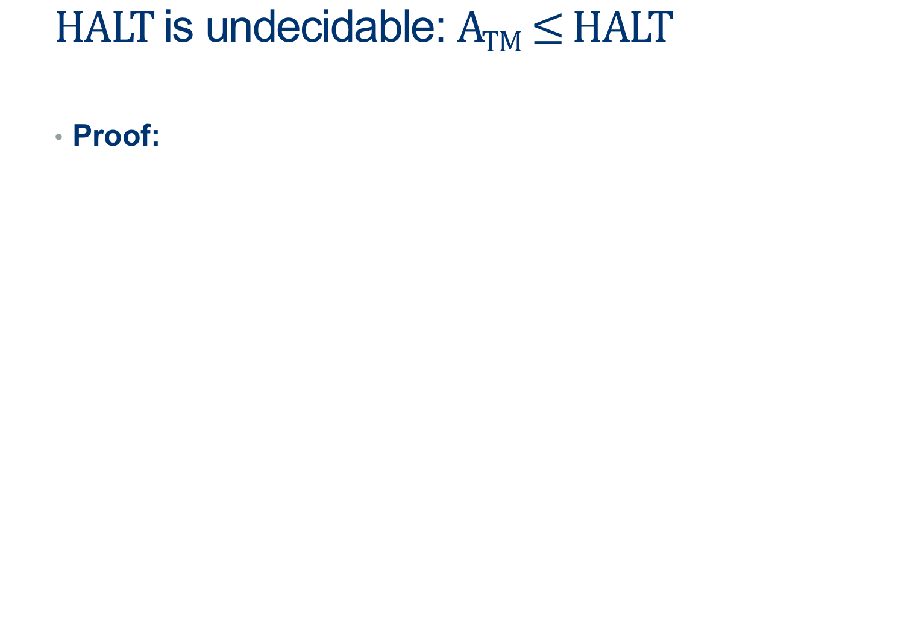
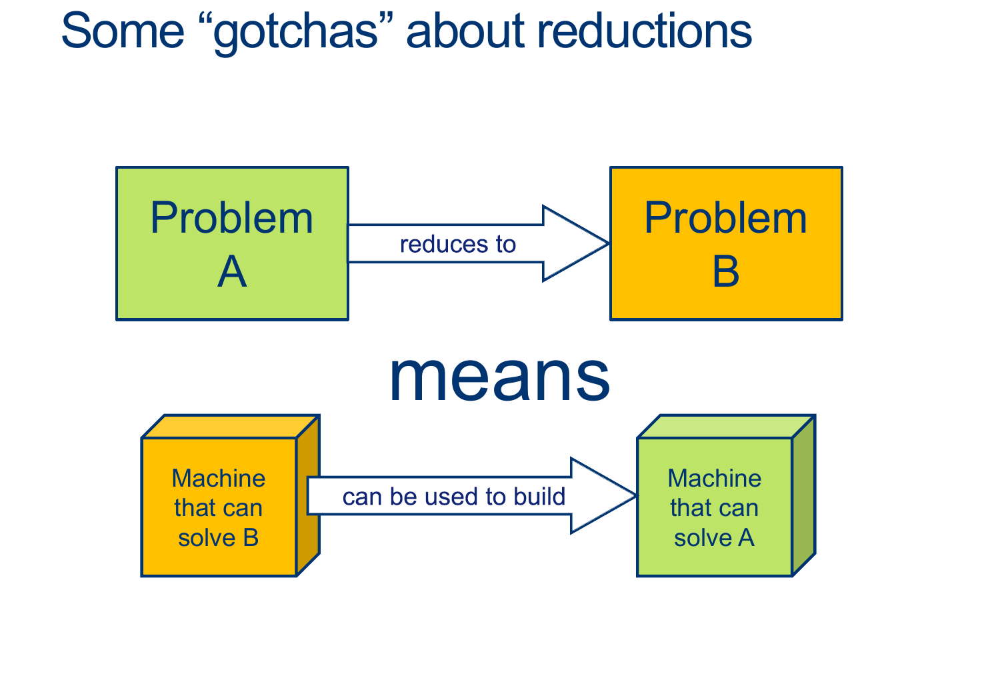
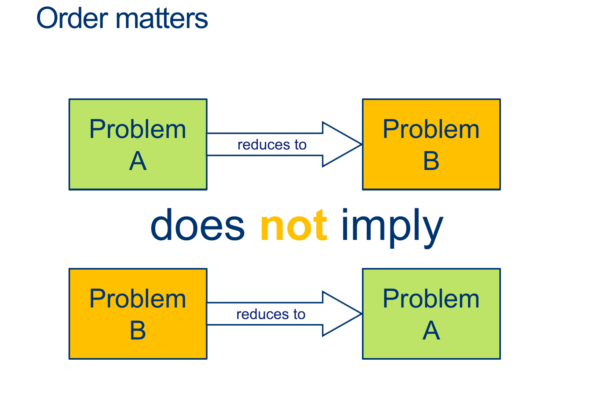
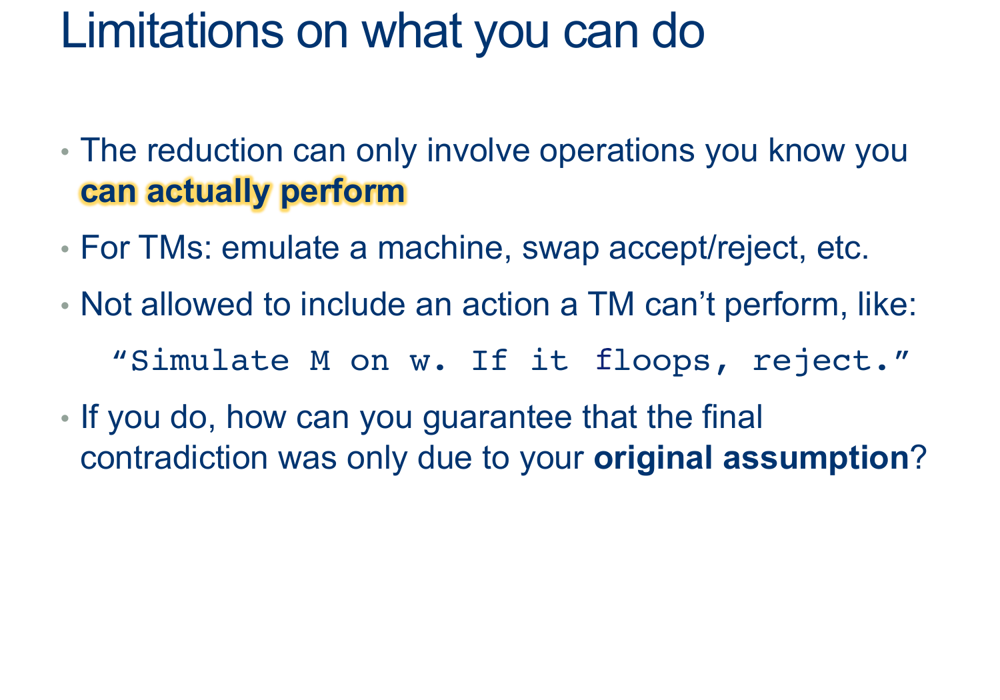
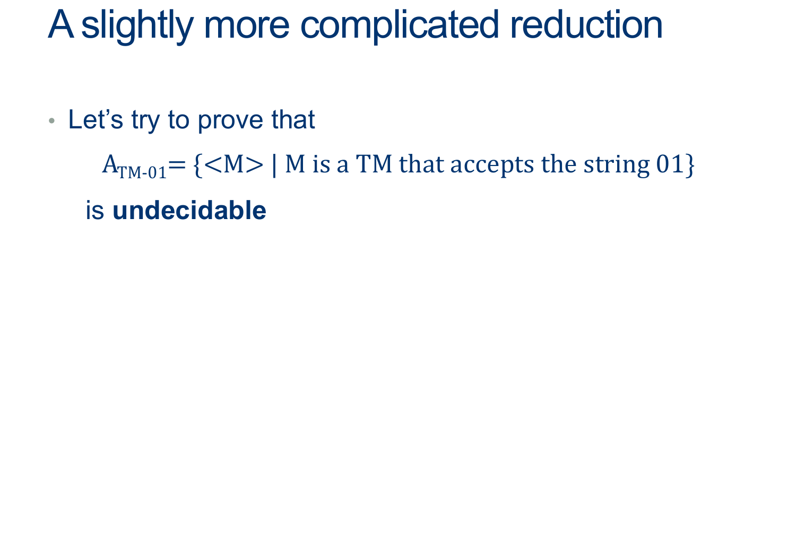
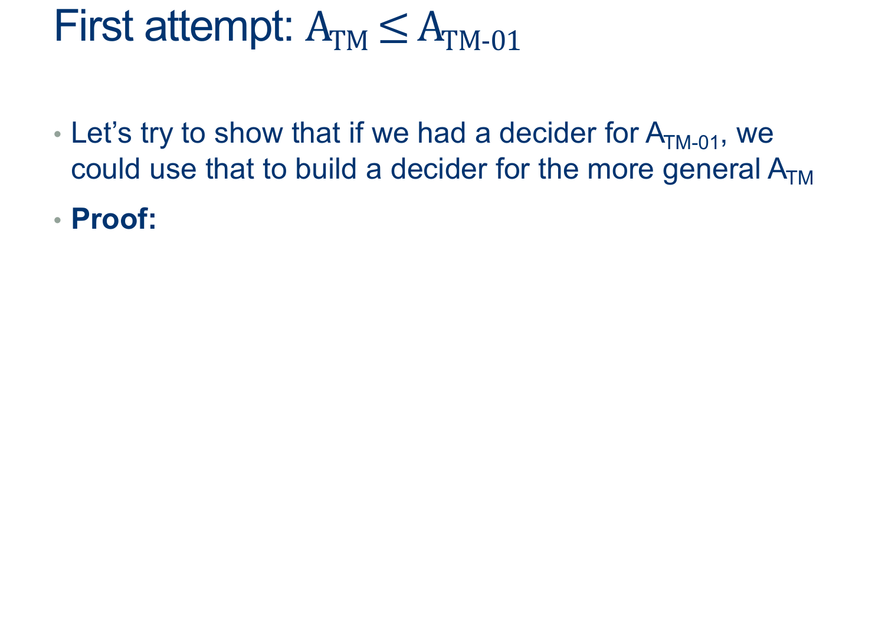
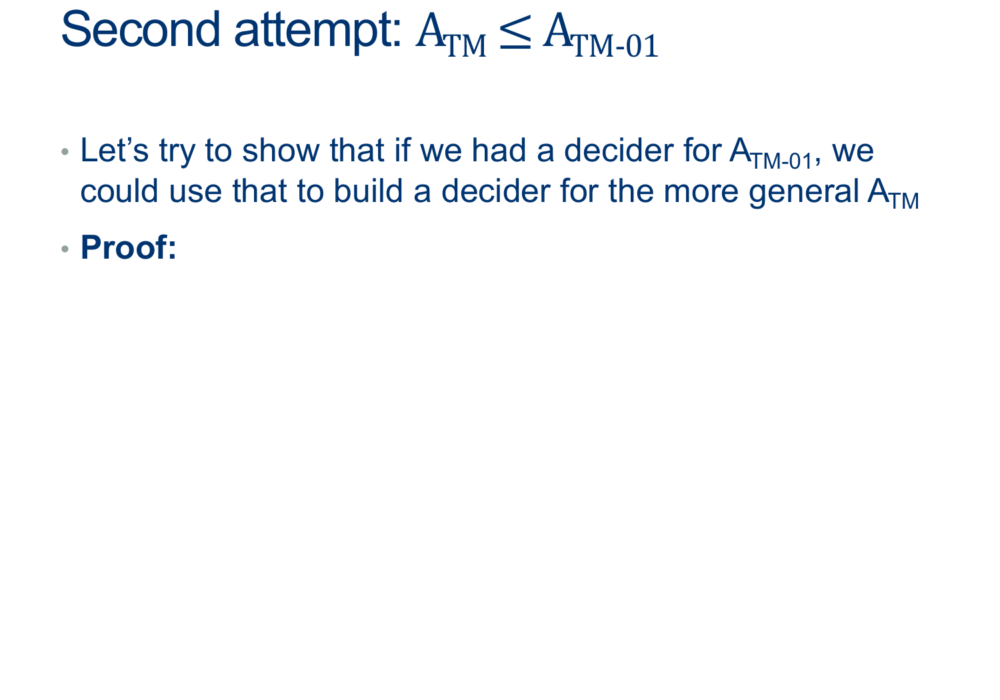

---
layout: default
title: Lecture23
parent: CSC250
grand_parent: Teaching
nav_order: 23
#permalink: /docs/teaching/csc110/
---  

Lecture Notes 23: Recap: Reductions
==============================

## Recap: Two contradiction machines:

### Contradiction Machine 1: $M_{X}$ to prove $D_{HALT}$ can't exist:

 

Suppose $D_{HALT}$ <b>exists and it always replies with a consistent answer</b>:

  $$ 
  \begin{align*} 
  &M_{HALT}: \\
  & \text{On INPUT $< M, \hat{w} >$} \\
  & \quad \text{ if M HALTS on $\hat{w}$, ACCEPT } \\
  & \quad \text{ if M FLOOPS on $\hat{w}$, REJECT } 
  \end{align*} 
  $$  

If we build the helper machine $M_X$:

  $$ 
  \begin{align*} 
  &M_X: \\
  & On \; INPUT \; < M > \\ 
  & \quad \text{Make } \hat{w} = < M > \color{gray}{ \text{# a copy of the input machine's description} }\\
  & \quad \text{run $M_{HALT} ( < M , \hat{w}>)$}
  \quad \color{gray}{ \text{# run $M_{HALT} ( < M , < M > > )$ } } \\
  & \quad \text{if $M_{HALT}( < M , \hat{w} > )$ returns ACCEPT, FLOOP on purpose } \\
  & \quad \text{if $M_{HALT}( < M , \hat{w} > )$ returns REJECT, ACCEPT } \\
  \end{align*} 
  $$  

And run $M_X$ with input equal to itself, we get:

  $$ 
  \begin{align*} 
  &M_X: \\
  & On \; INPUT \; < M_x > \\
  & \quad \text{run $M_{HALT} ( < M_x , M_x > )$}\\
  & \quad \text{if $M_{HALT}( < M_x ,  M_x > )$ returns ACCEPT, FLOOP on purpose } \\
  & \quad \text{if $M_{HALT}( < M_x ,  M_x > )$ returns REJECT, ACCEPT } \\
  \end{align*} 
  $$ 

This causes an inconsistent response from $D_{HALT}$: a contradiction

therefore, $D_{HALT}$ can't exist.

 

{: width="80%"} 

  

### Contradiction Machine 2: $M_{OPPOSITE}$ to prove $D_{ATM}$ can't exist:

 

Prove that the following Language is NOT Decidable:

$$ ATM = \{ <M, w> \vert \text{ M is a TM that accepts the word w} \}$$

<!-- {: width="60%"}  -->
  
Step 1: Assume Is ATM is **Decidable** Now try to use this "fact" to arrive at a contradiction  

Again, this means that $D_{ATM}$ <b>exists and it always replies with a consistent answer</b>.
  
Consider the Machine $M_{OPPOSITE} ( < M> )$  
  
$$ \begin{align*} &M_{OPPOSITE}:\\ 
& \quad \text{ On input $ < M > $ }:\\ 
& \quad \text{ Simulate $D_{ATM} \; on \; < M , < M > > $}\\ 
& \quad \text{ If $D_{ATM}$ accepts, REJECT. }\\ 
& \quad \text{ If $D_{ATM}$ rejects, ACCEPT. }\\ 
\end{align*} 
$$  
  
And run $M_{OPPOSITE}$ with input equal to itself, we get:

$$ \begin{align*} &M_{OPPOSITE}:\\ 
& \quad \text{ On input $ < M_{OPPOSITE} > $ }:\\ 
& \quad \text{ Simulate $D_{ATM} \; on \; < M_{OPPOSITE} , M_{OPPOSITE} > $}\\ 
& \quad \text{ If $D_{ATM}$ accepts, REJECT. }\\ 
& \quad \text{ If $D_{ATM}$ rejects, ACCEPT. }\\ 
\end{align*} 
$$  

This causes an inconsistent response from $D_{ATM}$: a contradiction

therefore, $D_{ATM}$ can't exist.

{: width="80%"} 

## Contradiction Machines are hard... but there's a better way

  

Let's use the knowledge that ATM is undecidable to make a new proof that HALT is undecidable.

  
  
{: width="80%"} 
  
In other words, $ HALT$ is AT LEAST as hard as $ ATM $  
(So if we can solve HALT, we can, for sure, solve ATM)  
  
  
   
  
  
{: width="80%"} 
  
Try it out yourselves first  
  
Think of a way you can get to say:  
if we can solve HALT, we can, for sure, solve ATM  
  
  

  answer: 
    

(Wait; then Click)

      

Assume HALT is decidable, and so there exists some $D_{HALT}$ that decides, for any input $< M,w>$, whether $M$ halts on $w$.  
  
We'll design the Machine $D_{ATM} $ as follows:  
  
$$ 
\begin{align*} &D_{ATM}:\\
& \text{ On input $ < M, w > $ }:\\
& \text{ Simulate $D_{HALT} \; on \; < M, w > $}\\
& \text{ If $D_{HALT}$ rejects, $M$ doesn't halt, so it did not accept: REJECT. }\\
& \text{ If $D_{HALT}$ accepts, we know $M$ won't loop forever, so }\\
& \quad \text{ Simulate $M$ on $w$ ADWID }\\
\end{align*} 
$$  
  
This machine is a decider for ATM (why?)  
 
– it avoided the only problem we had with solving ATM, namely telling the difference between looping and not waiting long enough.  
  
  
However, we proved that ATM was undecidable by contradiction just a few minutes ago.  
Aaaand...the only condition we need to build $D_{ATM}$ was that $D_{HALT}$ existed, so ...  
  
Since $D_{ATM}$ can't exist, <b>$D_{HALT} \; $ must not exist</b>.
      

    

  

 

  

  
  
{: width="80%"} 
  
<b>Example</b>:  
  
Above, we said:  
$ ATM \leq HALT $  
  
Therefore :

1.  $D_{HALT}$ can be used to build $D_{ATM}$

  
{: width="80%"} 
  
<b>Example</b>:  
  
Above, we said:  
$ ATM \leq HALT $  
  
Therefore :

* It is possible that $D_{HALT}$ can be much harder to build than $D_{ATM}$, so if you have $D_{ATM}$, you would still have much more to do.
  
  
* If you want to show equivalence, you have to prove both directions.

  
  
{: width="80%"} 
  
  
  
{: width="80%"} 
  
  
  
{: width="80%"} 
  
Let's go together  
  
Let's try to say ... "if we can solve ATM01, we can, for sure, solve ATM  
  

  answer: 
    

(Wait; then Click)

      

Assume ATM01 is decidable, and so there exists some $D_{ATM01}$ that decides, for any input $< M >$, whether $M$ accepts $w = 01$.  
  
We'll design the Machine $D_{ATM} $ as follows:  
  
$$ 
\begin{align*} 
&D_{ATM}:\\
& \quad \text{ On input $ < M, w > $ }:\\
& \quad \text{ Simulate $D_{ATM01} \; on \; < M > $}\\
& \quad \text{ If $D_{ATM01}$ accepts, we know $M$ accepts string 01 }\\
& \quad \text{ If $D_{ATM01}$ rejects, we know $M$ doesn't accept string 01 }\\
& \quad \quad \text{ ... }\\
\end{align*} 
$$  
  
Then what?   

$D_{ATM01} $ only gives useful information about the string 01.  
It doesn't even look at the string $w$ (which we need to build $D_{ATM} $).   
  
We’ll have the be a little more clever to get our machine to force it to check $w$.
      

    

  

 

  

  

{: width="80%"} 
  
Let's go together  
  
Let's use, in addition to $D_{ATM01} $, an extra HELPER machine to help us extend the usefulness of $D_{ATM01} $.  
  
  

  answer: 
    

(Wait; then Click)

      

Assume ATM01 is decidable, and so there exists some $D_{ATM01}$ that decides, for any input $< M >$, whether $M$ accepts $w = 01$.  
  
We'll design the Machine $D_{ATM} $ as follows:  
  
$$ 
\begin{align*} 
&D_{ATM}:\\
& \text{ On input $ < M, w > $ }:\\
& \text{ 1. build a HELPER machine (but don't run it yet) $Helper_{M,w}$ that is shown below: }\\
& \; \\
& \qquad Helper_{M,w}:\\
& \qquad \text{ On input $ x $ }: \quad \color{gray}{\text{# x: Anything! we don't care} }\\
& \qquad \text{ Ignore $ x $ and run $M$ on $w$ ADWID} \quad \color{gray}{\text{# We hardcode what $Helper_{M,w}$ does} }\\
& \; \\
& \text{ 2. Simulate $D_{ATM01}$ on $Helper_{M,w}$ } ADWID\\
\end{align*} 
$$  
  
  
  
<b>Analysis of cases</b> 
  
What is going on?:

<ul>
	<li>Inside our $D_{ATM} $ machine, we use $D_{ATM01} $ to ask if its input TM $M$ accepts $01$ ...  
    But in order to do it ... <b>it is forced to simulate the input machine $M$</b> ... instead of running $D_{ATM01} $ on $M$, we can have $D_{ATM01} $ run on a <b>Trojan-Horse Machine</b> whose only job is to check if $M$ accepts $w$!</li>
     
	<li>$Helper_{M,w}$ is a TM built solely to check if the $M$ actually accepts the $w$ from the input to $D_{ATM} $ ($ < M, w > $ ).</li>
	 
	<li>When $D_{ATM01} $ runs $Helper_{M,w}$ with input $01$, we IGNORE the input and just run $M$ on $w$  
    It will actually answer if $M$ accepts $w$ rather than if the input $Helper_{M,w}$ accepts $01$.
		<ul>
			<li>If $Helper_{M,w}$ replies ACCEPT, then $D_{ATM01}$ would return ACCEPT</li>
			<li>If $Helper_{M,w}$ replies REJECT, then $D_{ATM01}$ would return REJECT</li>
		</ul>
	</li>
	 
	<li>The output of $D_{ATM01} $ is NOT actually answering if its input accepts $01$... it is secretly answering the question : "Does $M$ accept $w$?"</li>
</ul>

  
If $D_{ATM01} $ says that $Helper_{M,w}$ accepts 01,  
we know that $M$ must have accepted $w$.  
  

For any $M, w$ pair that gets passed into $D_{ATM} $, we can construct a hardcoded helper machine and trick $D_{ATM01} $ into telling us the answer,  
in other words...<b>deciding ATM</b>.  
  

However, This can't be true!!,  
<b>we know ATM is undecidable, so ATM01 must also be undecidable</b>.
      

    

  

 

  

# Now, let's try it again!

Prove that the following Language is NOT Decidable:

$$ ATM11 = \{ <M> \vert \text{ M is a TM that accepts the word 11} \}$$

