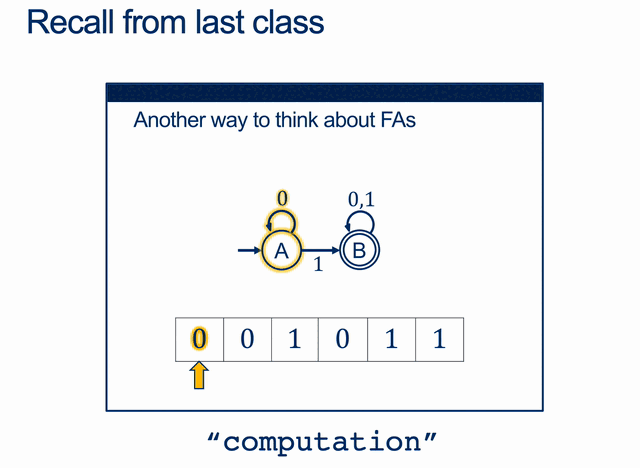
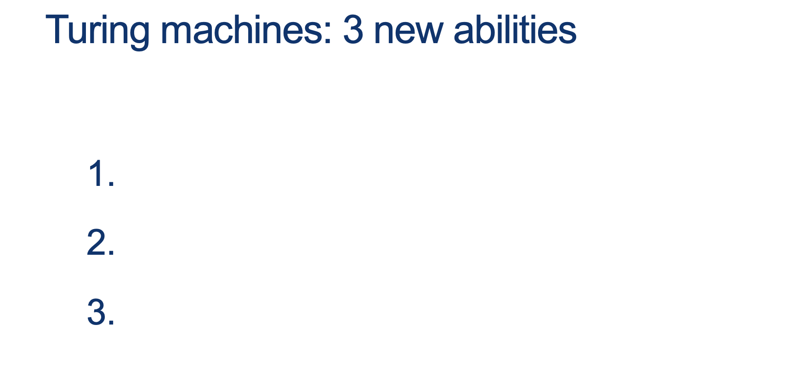
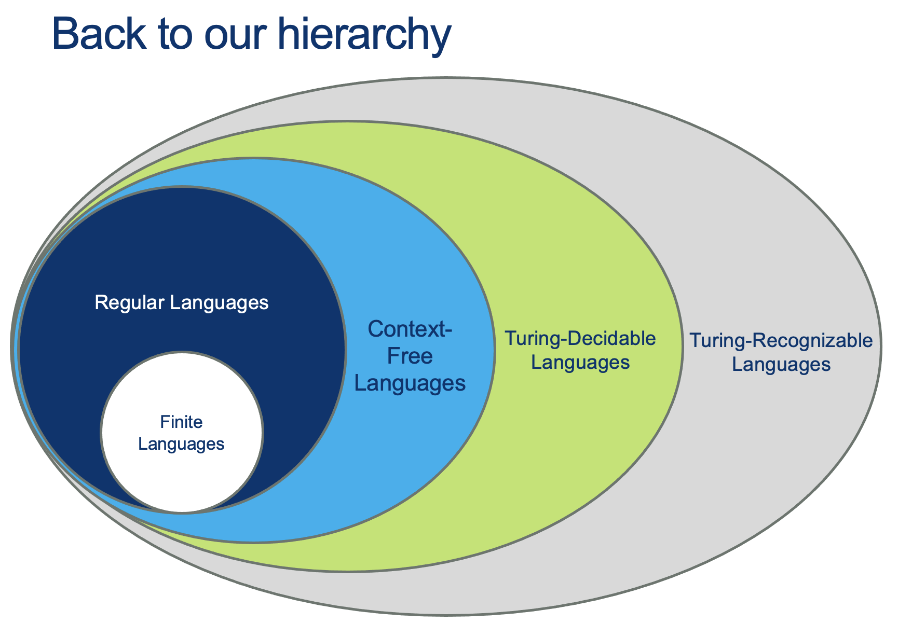
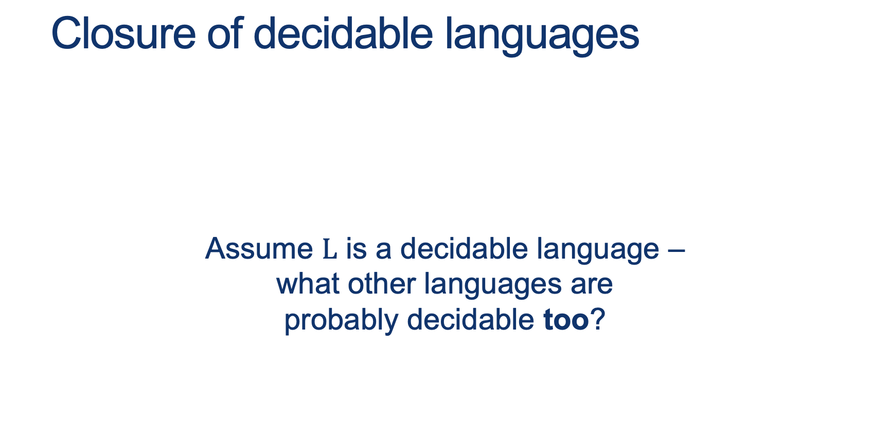
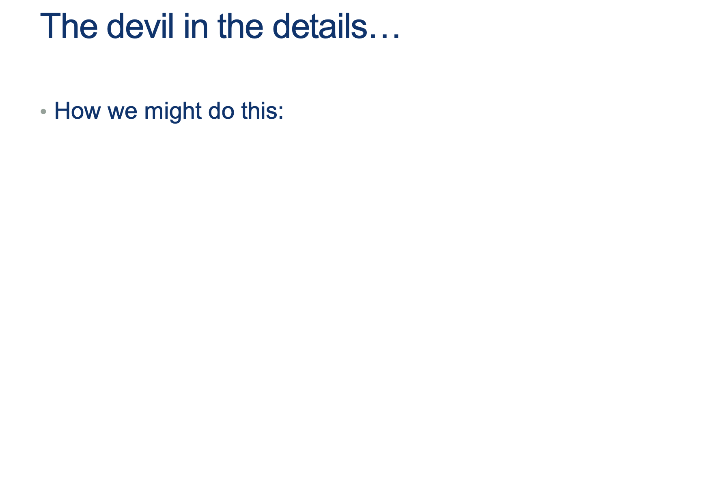
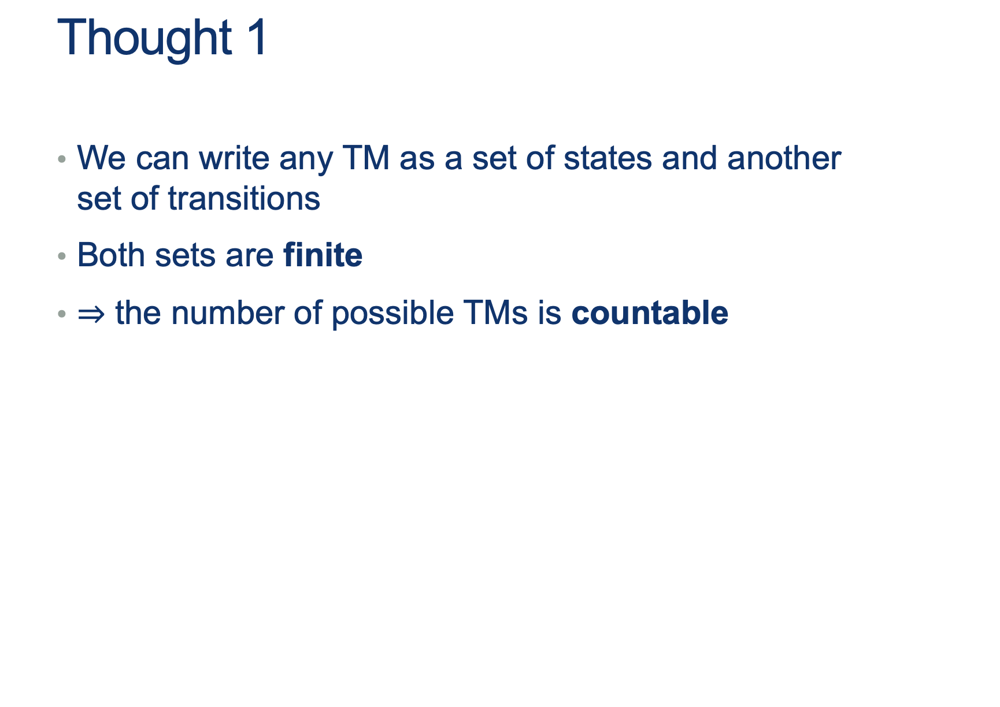
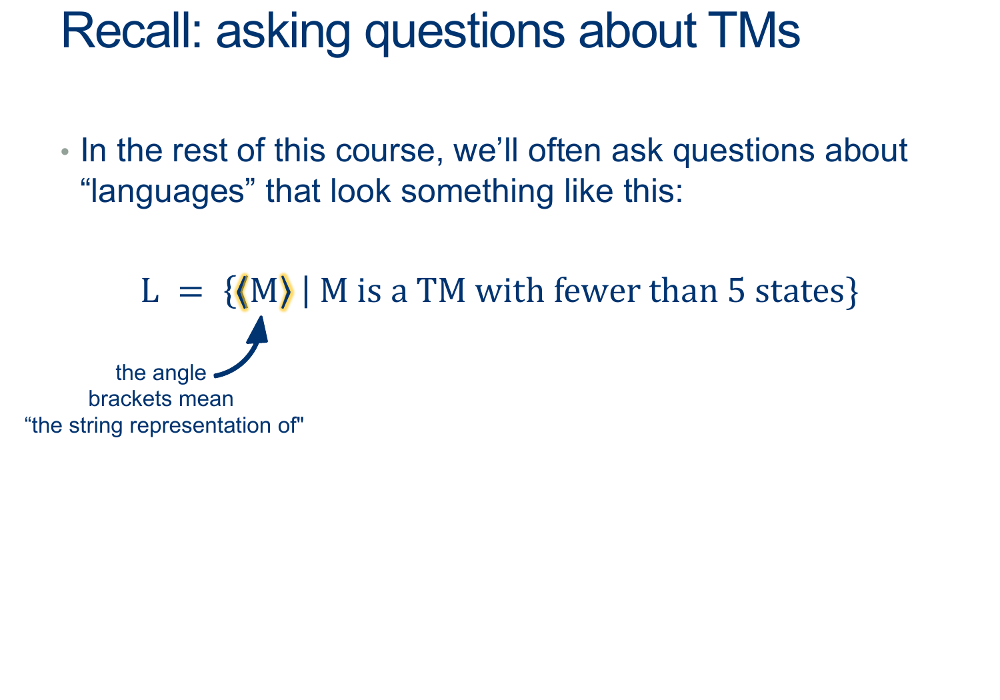

---
layout: default
title: Lecture23
parent: CSC250
grand_parent: Teaching
nav_order: 23
#permalink: /docs/teaching/csc110/
---  

Lecture Notes 23: Decidability and Undecidability
==============================


Outline
-------

This class we'll discuss:

* Recap: TMs
* Decidability
* Undecidability


* * *

  

Turing Machines and Decidability
--------------------------------

  
  
  
  
  
  
{: width="80%"}  
  
  
  
{: width="80%"}  
  

<div class="container mx-lg-5">
  <span style='color:#6f439a'>answer: 
    <details><summary>(Wait; then Click)</summary>
      <p>
        <ol>
          <li>move both left and right</li>
          <li>write new symbols to the tape</li>
          <li>stop at any point and return an answer</li>
        </ol>
      </p>
    </details>
  </span>
</div> 
  

  
{: width="80%"}  
  

## Recognizing vs Deciding  
  
  
  
**Recognizing** a word is having the capacity of saying "YES, I know this one", if that word is in the Language $L$ you are able to "Recognize".  
  
Note: If you are trying to **Recognize** a word, but you are not done checking, .... how long do you wait?  
  
In other words, you just say: If I say "YES", I'm sure it is "YES" (ACCEPT), but I don't promise anything else.  
  
  
  
**Deciding** a word is having the capacity of saying "YES, I know this one", if that word is in the Language $L$ you are able to "Decide", AND "NO, this one is NOT one of mine" for ALL words that are not in the Language you are able to "Decide" (called the complement of $L$, or $L^c$ or $\bar{L}$.  
  
<br><br>

## Examples

### A Decider for PAL
  
  
{: width="80%"}  
  

  
{: width="80%"}  
  
  
  
{: width="80%"}  
  


```    
    On input w:
    while there are symbols left in the tape:
        i. note whether 1st letter is a 0 or a 1 and erase it
        ii. go all the way to the last symbol
        iii. if this symbol doesn't match the one we just erased, REJECT; 
            otherwise erase it and go back to the start.
    ACCEPT. 
```

<br><br>

### Recap: A Decider for HALT?


if we define HALT as: 

$$\{ w \vert w = < M, \hat{w}> \text{ where M is a TM and M HALTS on } \hat{w} \}$$

We can prove a Decider for HALT cannot exist by contradiction:

Suppose it exists:

  $$ 
  \begin{align*} 
  &M_{HALT}: \\
  & \text{On INPUT $< M, \hat{w} >$} \\
  & \quad \text{ if M HALTS on $\hat{w}$, ACCEPT } \\
  & \quad \text{ if M FLOOPS on $\hat{w}$, REJECT } 
  \end{align*} 
  $$  

If we build the helper machine $M_X$:

  $$ 
  \begin{align*} 
  &M_X: \\
  & On \; INPUT \; < M > \\ 
  & \quad \text{Make } \hat{w} = < M > \color{gray}{ \text{# a copy of the input machine's description} }\\
  & \quad \text{run $M_{HALT} ( < M , \hat{w}>)$}
  \quad \color{gray}{ \text{# run $M_{HALT} ( < M , < M > > )$ } } \\
  & \quad \text{if $M_{HALT}( < M , \hat{w} > )$ returns ACCEPT, FLOOP on purpose } \\
  & \quad \text{if $M_{HALT}( < M , \hat{w} > )$ returns REJECT, ACCEPT } \\
  \end{align*} 
  $$  

And run $M_X$ with input equal to itself, we get:

  $$ 
  \begin{align*} 
  &M_X: \\
  & On \; INPUT \; < M_x > \\
  & \quad \text{run $M_{HALT} ( < M_x , M_x > )$}\\
  & \quad \text{if $M_{HALT}( < M_x ,  M_x > )$ returns ACCEPT, FLOOP on purpose } \\
  & \quad \text{if $M_{HALT}( < M_x ,  M_x > )$ returns REJECT, ACCEPT } \\
  \end{align*} 
  $$ 

  1.  This run of $M_X$ takes in the description of itself $< M_X >$ as input
  2.  It calls $M_{HALT}$ to check if it HALTS on its own description (remember that $M_{HALT}$ should always have a consistent answer!):

      1. If $M_{HALT}$ predicts that $M_{X}$ HALTS on its own description (ACCEPT), $M_X$ FLOOPS on purpose... But that means that we just FLOOPED when runing $M_{X}$ with its own input (which is exactly the opposite of what $M_{HALT}$ predicted!)
      2. If $M_{HALT}$ predicts that $M_{X}$ FLOOPS on its own description (REJECT), $M_X$ ACCEPTS!... But that means that we just HALTED when runing $M_{X}$ with its own input (which is exactly the opposite of what $M_{HALT}$ predicted!)

 **A CONTRADICTION**

 Since the ONLY assumption was that $M_{HALT}$ exists, then **that means that $M_{HALT}$ cannot exist!** 

  
{: width="80%"}  
  
  
  
{: width="80%"}  
  
  
  
{: width="80%"}  
  
  
  
{: width="80%"}  
  
  
  
{: width="80%"}  
  
  
  
{: width="80%"}  
  

<div class="container mx-lg-5">
  <span style='color:#6f439a'>answer: 
    <details><summary>(Wait; then Click)</summary>
      <p>
        <ol>
          <li>Run both machines in parallel</li>
          <li> $\qquad$ Accept if either accepts</li>
        </ol>
      </p>
    </details>
  </span>
</div>  
  

<br><br>

  
  
{: width="80%"}  
  

<div class="container mx-lg-5">
  <span style='color:#6f439a'>answer: 
    <details><summary>(Wait; then Click)</summary>
      <p>
        <ol>
          <li>Run both machines in parallel</li>
          <li> $\qquad$ Accept if both accept</li>
        </ol>
      </p>
    </details>
  </span>
</div>  
  

<br><br>

  
  
{: width="80%"}  
  

<div class="container mx-lg-5">
  <span style='color:#6f439a'>answer: 
    <details><summary>(Wait; then Click)</summary>
      <p>
        <ol>
          <li>Suppose that M decides L.</li>
          <li> Design a new machine $M^\prime$ that behaves just like M, but: 
            <ul>
              <li>If M accepts, $M^{\prime}$ rejects</li>
              <li>If M rejects, $M^{\prime}$ accepts</li>
            </ul>
          </li>
          <li>Formally, can do this by interchanging $q_{acc}$ and $ q_{rej}$</li>
          <li>Then $M^{\prime}$ decides $L^c$</li>
<!--            
            <ul>
              <li></li>
              <li></li>
              <li></li>
            </ul> 
-->
        </ol>
      </p>
    </details>
  </span>
</div>  
  

<br><br>
  

  
{: width="80%"}  
  
  
  
{: width="80%"}  
  

<div class="container mx-lg-5">
  <span style='color:#6f439a'>answer: 
    <details><summary>(Wait; then Click)</summary>
      <p>
        <ol>
          <li>Run both M1 and M2 on w</li>
          <li>One must accept</li>
          <li> 
            <ul>
              <li>If M1 accepts, then M accepts</li>
              <li>If M 2 accepts, then M rejects</li>
            </ul>             
          </li>
        </ol>
How? In sequence? <b>What if M1 loops?</b>  <br>
What can we do? <br><br>

{: width="80%"}  
      </p>
    </details>
  </span>
</div>  
  
<br><br><br>
  
{: width="80%"}  
  
  
  
{: width="80%"}  
  
  
  
{: width="80%"}  
  
  
  
{: width="80%"}  
  
  
  
{: width="80%"}


Undecidability
==============================


Intro to Undecidable Problems (Languages)
-----------------------------------------

  
## Problems as Languages  
  
  
  
In this class, we have converted "finding a solution to a problem" to "Learning to accept words from a Language".  
  
In our world, **Answering a question** means building a machine that recognizes the language-version of that question.  
  
Example problem:  
"Can you come up with a binary string with a pattern of 0s and 1s such that the string is a palindrome"  
  
Example Language-Version:  
$$ L = \{ w \in \Sigma^* | w^R = w \} $$  
  
Example solution:  
(See the CMF, PDA, or TM solutions to this problem)  
  
  
  
  
# Questions about Machines  
  
  
  
Often we'll ask questions about the machines we've seen so far.  
  
Again, **answering a question** means building a machine that recognizes the language-version of that question.  
  
  
  
So, a problem like:  
"Find the set of Turing Machines that have up to 5 states",  
can be rephrased as finding the Language: 

$$ L = \{ < M > | M \text{ is a TM and } M \text{ has fewer than 5 states} \} $$  
  
  
  
  
# Answering with an Algorithm  
  

  
How would you "Solve" the problem for:  

$$ L = \{ < M > | M \text{ is a TM and } M \text{ has fewer than 5 states} \} $$  
  

What could you use to "Solve" (Decide/Recognize) $L$? 


<div class="container mx-lg-5">
  <span style='color:#6f439a'>answer: 
    <details><summary>(Wait; then Click)</summary>
      <p>
        Another Turing Machine!! ... A <b>Decider</b> for $L$ we'll call $D_L$

   $$ 
   \begin{align*} & D_L :\\ 
   & \text{On INPUT } < M >\\ 
   & \quad \text{Inspect the description of } M \\ 
   & \quad \quad \text{IF $M$ is not a valid TM: REJECT} \\ 
   & \quad \quad \text{ELSE IF $M$ has fewer than 5 states: ACCEPT} \\ 
   & \quad \quad \text{ELSE: REJECT} \\ 
   \end{align*} 
   $$  

   CAN we get stuck on a loop?  
   (Note that we know something about description $M$ that helps us answer this question)
      </p>
    </details>
  </span>
</div> 
  


# Another Recap (so we don't get lost)
  
<br><br>

{: width="80%"} 
  
  
  
{: width="80%"} 
  
  
  
{: width="80%"} 
  
  
  
{: width="80%"} 
  
  
  
{: width="80%"} 
  
  
  
{: width="80%"} 
  
  
  
{: width="80%"} 
  
  
<!-- Note: this is in PS05 so watch the vdeo recording to hear about how to solve this. (you should be able to clearly explain both approaches)   -->
  
  
  
  
  
  
## Questions about Machines  
  
  
  
### Discuss if you could build $D_L$ for the following language: 

$$L = \{ < M, w > | TM \; M \text{ accepts } w \text{ in fewer than 10 steps} \}$$  
  
  
  
### Discuss if you could build $D_L$ for the following language:  

$$ L = \{ < A > | \text{DFA $A$ accepts an infinite number of words (L(A) is infinite)} \} $$  
  

  
### Discuss if you could build $D_L$ for the following language:  

$$ A_{TM} = \{ < M, w> | \text{TM $M$ accepts } w \} $$  


<div class="container mx-lg-5">
  <span style='color:#6f439a'>answer: 
    <details><summary>(Wait; then Click)</summary>
      <p>
        <ul>
          <li>Can we prove it is at least recognizable?</li>
          <li>Can we prove it is NOT Decidable?</li>
          <li>Are these two things the same?</li>
        </ul>
      </p>
    </details>
  </span>
</div> 
  

<br><br>


How about ATM?
---------------------

  
  
  
{: width="80%"} 
  
  
  
{: width="80%"} 
  
  
  

Can we come up with a simple proof?  
  


<div class="container mx-lg-5">
  <span style='color:#6f439a'>answer: 
    <details><summary>(Wait; then Click)</summary>
      <p>

<b>Proof by construction</b>:  

$$ 
\begin{align*} 
&R_{ATM}:\\ 
& \text{ On input $ < M,w > $ }:\\ 
& \text{ Simulate M on w.}\\ 
& \text{ If it accepts, accept. }\\ 
\end{align*} 
$$
      </p>
    </details>
  </span>
</div> 

<br><br>
  
Is ATM **decidable**?  
  
  
  
Discuss if you could build $D_L$ for the following language:  

$$ A_{TM} = \{ < M, w> | \text{TM $M$ accepts } w \} $$  
  
Can a $D_{ATM}$ be constructed such that:

1.  It Accepts any $w $ such that $w \in A_{TM}$
  
AND  
  
5.  It Rejects any $w $ such that $w \notin A_{TM}$

  
  
  

<div class="container mx-lg-5">
  <span style='color:#6f439a'>answer: 
    <details><summary>(Wait; then Click)</summary>
      <p>

<b>Intuition...Not decidable</b>:  

<ul>
  <li>we can’t tell the difference between looping and “just haven’t waited long enough”.</li>
  <li>But we can't prove "we haven't waited long enough" for each input... (AND we have infinite inputs)</li>
  <li>But we can use another technique to try to prove this... <b>CONTRADICTION</b>!</li>
</ul>
  
If we can find a single example where we can't predict what $D_{ATM}$ will say ... then we have it!
      </p>
    </details>
  </span>
</div> 

<br><br>
  

  
{: width="80%"} 
  
Step 1: Assume Is ATM is **Decidable** Now try to use this "fact" to arrive at a contradiction  
  
  
Consider the Machine $M_{OPPOSITE} ( < M> )$  
  
$$ \begin{align*} &M_{OPPOSITE}:\\ 
& \quad \text{ On input $ < M > $ }:\\ 
& \quad \text{ Simulate $D_{ATM} \; on \; < M , < M > > $}\\ 
& \quad \text{ If $D_{ATM}$ accepts, REJECT. }\\ 
& \quad \text{ If $D_{ATM}$ rejects, ACCEPT. }\\ 
\end{align*} 
$$  
  
  
  
  
  
{: width="80%"} 
  
  
  
{: width="80%"} 
  
  
  
{: width="80%"} 
  


  
{: width="80%"} 
  
In other words, $ HALT$ is AT LEAST as hard as $ ATM $  
(So if we can solve HALT, we can, for sure, solve ATM)  
  
  
  
  
  
{: width="80%"} 
  
Try it out yourselves first  
  
Think of a way you can get to say:  
if we can solve HALT, we can, for sure, solve ATM  
  
  

<div class="container mx-lg-5">
  <span style='color:#6f439a'>answer: 
    <details><summary>(Wait; then Click)</summary>
      <p>
Assume HALT is decidable, and so there exists some $D_{HALT}$ that decides, for any input $< M,w>$, whether $M$ halts on $w$.  
  
We'll design the Machine $D_{ATM} $ as follows:  
  
$$ 
\begin{align*} &D_{ATM}:\\ 
& \quad \text{ On input $ < M, w > $ }:\\ 
& \quad \text{ Simulate $D_{HALT} \; on \; < M, w > $}\\ 
& \quad \text{ If $D_{HALT}$ rejects, $M$ doesn't halt, so it did not accept: REJECT. }\\ 
& \quad \text{ If $D_{HALT}$ accepts, we know $M$ won't loop forever, so }\\ 
& \quad \quad \text{ Simulate $M$ on $w$ ADWID }\\ 
\end{align*} 
$$  
  
This machine is a decider for ATM (why?)  
– it avoided the only problem we had with solving ATM, namely telling the difference between looping and lot waiting long enough.  
<br>
  
However, we proved that ATM was undecidable by contradiction just a few minutes ago.  
Aaaand...the only condition we need to build $D_{ATM}$ was that $D_{HALT}$ existed, so ...  
<b>$D_{HALT} \; $ must not exist</b>.      
      </p>
    </details>
  </span>
</div> 

<br><br>
