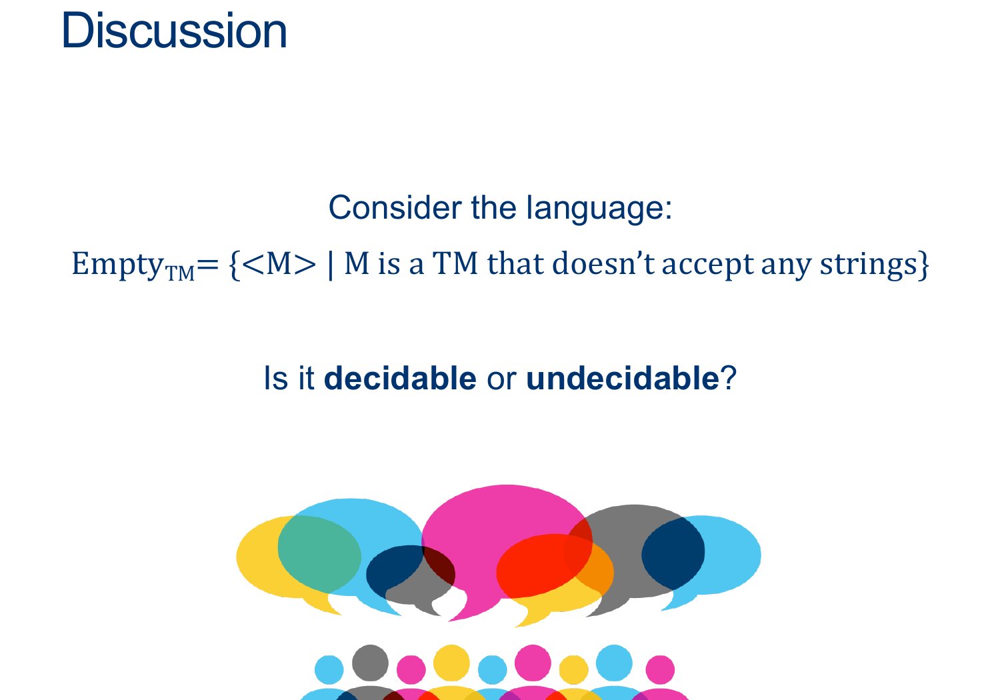
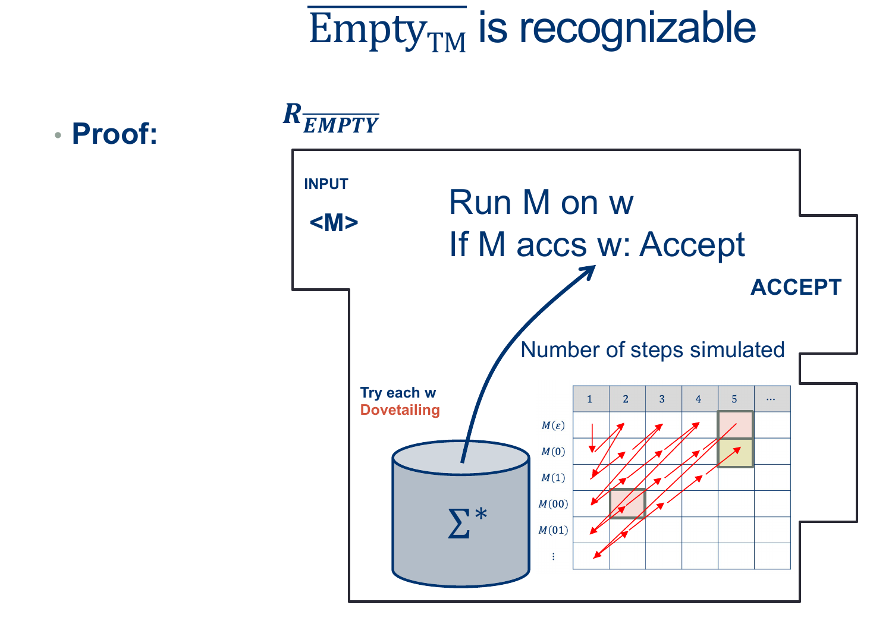
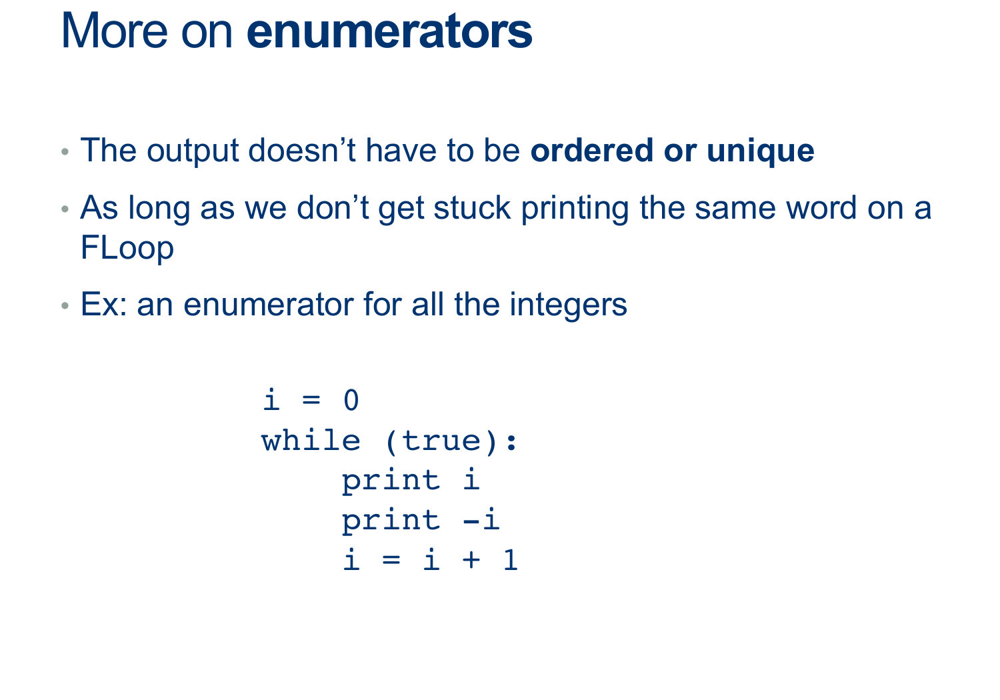
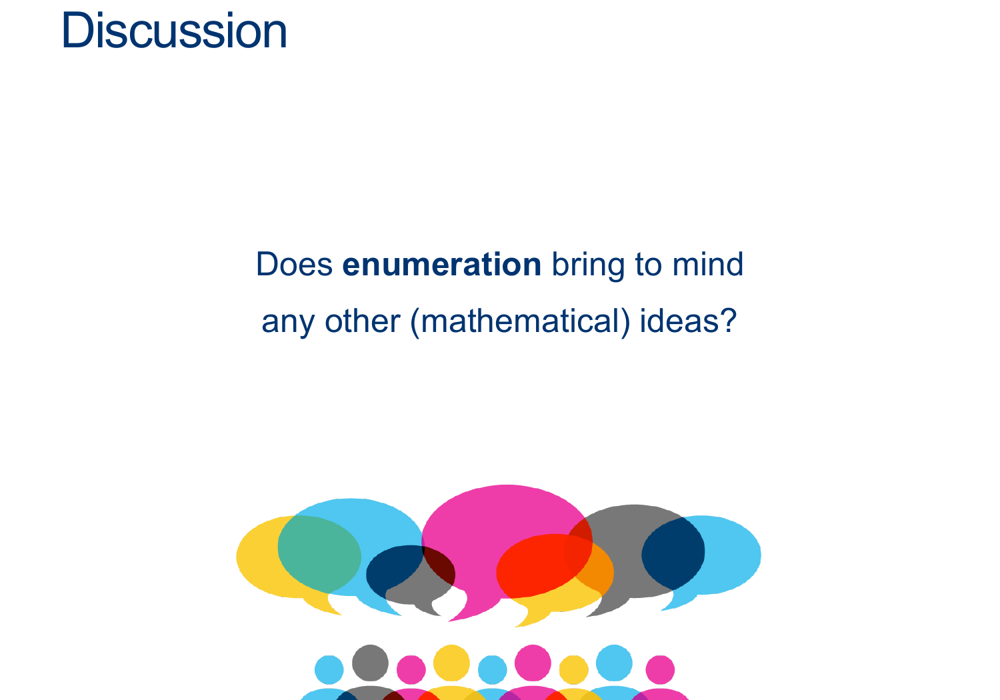
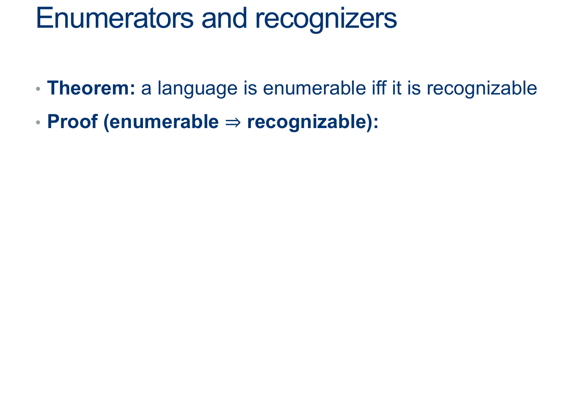
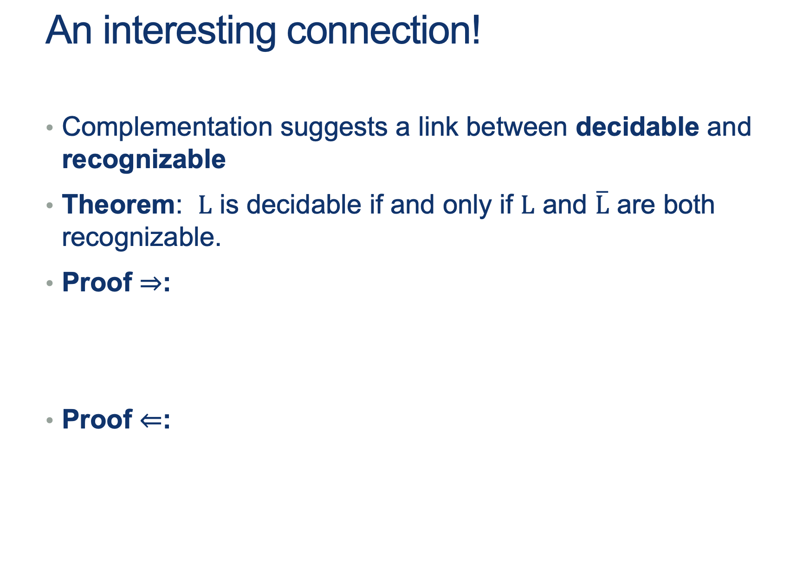
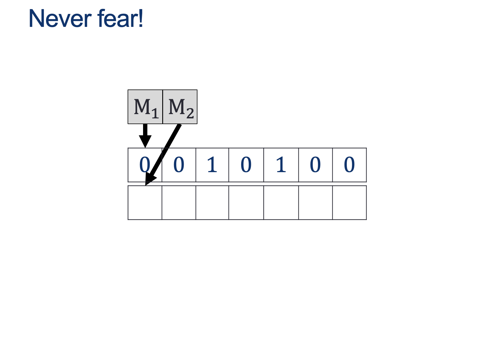
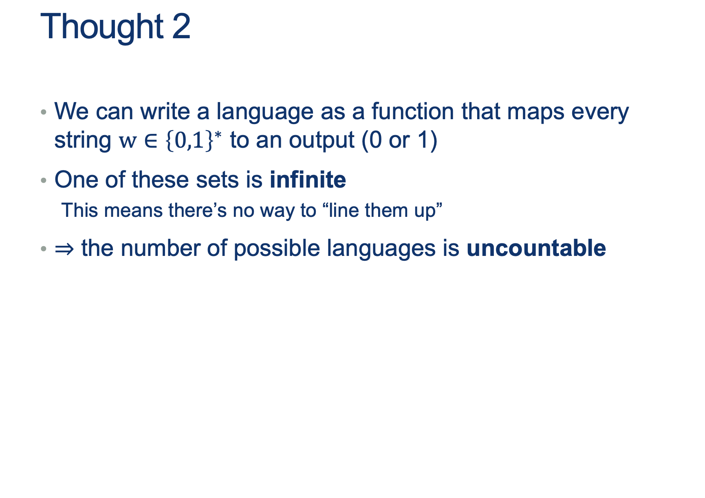
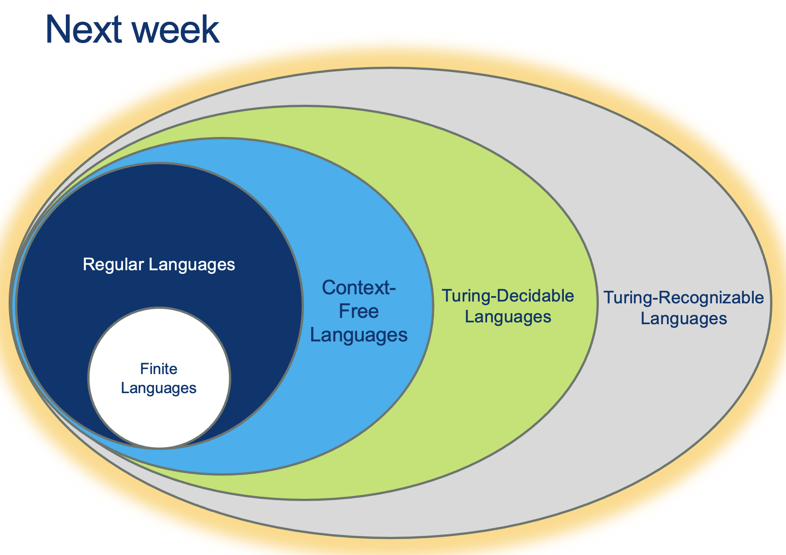

GUIDED NOTES (Optional)
=======================

  
  
{: width=80%}  
  
  
  
{: width=80%}  
(ATM-01 is at least as hard to decide as ATM)  
  
Note that:  

1.  IF a machine $D_{ATM}$ existed, it would receive input $ < M, w > $
2.  IF a machine $D_{ATM-01}$ existed, it would receive input $ < M > $
3.  The order of the proof is:  
    1.  Assume $D_{ATM-01}$ already exists
    2.  We can use it to build another machine that should behave like $D_{ATM}$
    3.  This larger machine, should be able to handle input $ < M, w > $
    4.  You must somehow get a machine with ONLY $ < M > $ as input to handle the input $ < M, w > $
    5.  Note that, as part of the steps, you can build helper machines

  
  
  
  
**Activity 4** \[2 minutes\]:  
In teams, write a Machine that uses $D_{ATM-01}$ to perform the work of $D_{ATM}$ (Wait; then Click)  
  
  
  
{: width=80%}  
  
  
  
{: width=80%}  
  
  
  
{: width=80%}  
  

  
  
{: width=80%}  
  
  
  
{: width=80%}  
  
  
  
{: width=80%}  
  
  
  
{: width=80%}  
  
This can be written like this:  
  
Assume EMPTY-TM is decidable, and so there exists some $D_{EMPTY-TM}$ that decides, for any input $< M >$, whether $L (M) $ is empty.  
  
We'll design the Machine $D_{ATM} $ as follows:  
  
$$ \begin{align*} &D_{ATM}:\\ & \text{ On input $ < M, w > $ }:\\ & \text{ Create (but don't run) $HELPER_{M,w}$ such that}\\ & \quad \text{ On input $ < X > $ }:\\ & \quad \quad \text{ Ignore $ < X > $ }\\ & \quad \quad \text{ Run $M$ on $w$ ADWID}\\ & \text{ Now Run $D_{EMPTY-TM}$ on $HELPER_{M,w}$}\\ & \text{ If $D_{EMPTY-TM}$ rejects, invert the result and our machine ACCEPTS}\\ & \text{ If $D_{HALT}$ accepts, , invert the result and our machine REJECTS}\\ \end{align*} $$  
  
As we saw above, the ONLY way $D_{EMPTY-TM}$ Rejects is if $HELPER_{M,W}$ Accepts, which happens ONLY when $M$ accepts $w$.  
  
This means we CAN make $D_{ATM}$ as long as $D_{EMPTY-TM}$ exists.  
  
However, $D_{ATM}$ doesn't exist...which means $D_{EMPTY-TM}$ CANNOT EXIST EITHER.  
  
  
  
  
  
{: width=80%}  
  
  
  
{: width=80%}  
  
  
  
{: width=80%}  
  
  
  
This will lead us to a new way of looking at Recognizers: Enumeration.

# Enumeration  
  
  
  
  
  
  
{: width="80%"}  
  
  
  
{: width="80%"}  
  
  
  
{: width="80%"}  
  
  
  
{: width="80%"}  
  

**Activity 3** \[2 minutes\] In groups, come up with an algorithm to enumerate $\\Sigma^*$?:  

  
  
  
  
{: width="80%"}  
  
  
  
{: width="80%"}  
  

**Activity 4** \[2 minutes\] In groups,  
How would you prove that, IF you can enumerate a Language, then that language is Recognizable.  
(Wait; then Click)  
  
  
  
Assume L is enumerable, i.e. there exists some machine E_L that can print out all of Ls words.  
Build a machine R_L that uses E_L to print them out one at a time, and compares each one with the input.  
As soon as they match, accept.  
  
This machine accepts only words that are in L, and if a word is in L we’re guaranteed to reach it at some point (though it might take awhile).  
Thus, it recognizes L. QED.  

  
  
{: width="80%"}  
  
  
  
{: width="80%"}  
  
  
  
{: width="80%"}

  
  

  
{: width="80%"}  
  
  
  
{: width="80%"}  
  

  answer: 
    

(Wait; then Click)

      

        <ol>
          <li>Run both M1 and M2 on w</li>
          <li>One must accept</li>
          <li> 
            <ul>
              <li>If M1 accepts, then M accepts</li>
              <li>If M 2 accepts, then M rejects</li>
            </ul>             
          </li>
        </ol>
How? In sequence? <b>What if M1 loops?</b>   
What can we do?   

{: width="80%"}  
      

    

  

  
  
   
  
{: width="80%"}  
  
  
  
{: width="80%"}  
  
  
  
{: width="80%"}  
  
  
  
{: width="80%"}  
  
  
  
{: width="80%"}

Undecidability
==============================

Intro to Undecidable Problems (Languages)
-----------------------------------------

  
## Problems as Languages  
  
  
  
In this class, we have converted "finding a solution to a problem" to "Learning to accept words from a Language".  
  
In our world, **Answering a question** means building a machine that recognizes the language-version of that question.  
  
Example problem:  
"Can you come up with a binary string with a pattern of 0s and 1s such that the string is a palindrome"  
  
Example Language-Version:  
$$ L = \{ w \in \Sigma^* | w^R = w \} $$  
  
Example solution:  
(See the CMF, PDA, or TM solutions to this problem)  
  
  
  
  
# Questions about Machines  
  
  
  
Often we'll ask questions about the machines we've seen so far.  
  
Again, **answering a question** means building a machine that recognizes the language-version of that question.  
  
  
  
So, a problem like:  
"Find the set of Turing Machines that have up to 5 states",  
can be rephrased as finding the Language: 

$$ L = \{ < M > | M \text{ is a TM and } M \text{ has fewer than 5 states} \} $$  
  
  
  
  
# Answering with an Algorithm  
  

  
How would you "Solve" the problem for:  

$$ L = \{ < M > | M \text{ is a TM and } M \text{ has fewer than 5 states} \} $$  
  

What could you use to "Solve" (Decide/Recognize) $L$? 

  answer: 
    

(Wait; then Click)

      

        Another Turing Machine!! ... A <b>Decider</b> for $L$ we'll call $D_L$

   $$ 
   \begin{align*} & D_L :\\ 
   & \text{On INPUT } < M >\\ 
   & \quad \text{Inspect the description of } M \\ 
   & \quad \quad \text{IF $M$ is not a valid TM: REJECT} \\ 
   & \quad \quad \text{ELSE IF $M$ has fewer than 5 states: ACCEPT} \\ 
   & \quad \quad \text{ELSE: REJECT} \\ 
   \end{align*} 
   $$  

   CAN we get stuck on a loop?  
   (Note that we know something about description $M$ that helps us answer this question)
      

    

  

 
  

# Another Recap (so we don't get lost)
  
  

{: width="80%"} 
  
  
  
{: width="80%"} 
  
  
  
{: width="80%"} 
  
  
  
{: width="80%"} 
  
  
  
{: width="80%"} 
  
  
  
{: width="80%"} 
  
  
  
{: width="80%"} 
  
  
<!-- Note: this is in PS05 so watch the vdeo recording to hear about how to solve this. (you should be able to clearly explain both approaches)   -->
  
  
  
  
  
  
## Questions about Machines  
  
  
  
### Discuss if you could build $D_L$ for the following language: 

$$L = \{ < M, w > | TM \; M \text{ accepts } w \text{ in fewer than 10 steps} \}$$  
  
  
  
### Discuss if you could build $D_L$ for the following language:  

$$ L = \{ < A > | \text{DFA $A$ accepts an infinite number of words (L(A) is infinite)} \} $$  
  

  
### Discuss if you could build $D_L$ for the following language:  

$$ A_{TM} = \{ < M, w> | \text{TM $M$ accepts } w \} $$  

  answer: 
    

(Wait; then Click)

      

        <ul>
          <li>Can we prove it is at least recognizable?</li>
          <li>Can we prove it is NOT Decidable?</li>
          <li>Are these two things the same?</li>
        </ul>
      

    

  

 
  

  

How about ATM?
---------------------

  
  
  
{: width="80%"} 
  
  
  
{: width="80%"} 
  
  
  

Can we come up with a simple proof?  
  

  answer: 
    

(Wait; then Click)

      

<b>Proof by construction</b>:  

$$ 
\begin{align*} 
&R_{ATM}:\\ 
& \text{ On input $ < M,w > $ }:\\ 
& \text{ Simulate M on w.}\\ 
& \text{ If it accepts, accept. }\\ 
\end{align*} 
$$
      

    

  

 

  
  
Is ATM **decidable**?  
  
  
  
Discuss if you could build $D_L$ for the following language:  

$$ A_{TM} = \{ < M, w> | \text{TM $M$ accepts } w \} $$  
  
Can a $D_{ATM}$ be constructed such that:

1.  It Accepts any $w $ such that $w \in A_{TM}$
  
AND  
  
5.  It Rejects any $w $ such that $w \notin A_{TM}$

  
  
  

  answer: 
    

(Wait; then Click)

      

<b>Intuition...Not decidable</b>:  

<ul>
  <li>we can’t tell the difference between looping and “just haven’t waited long enough”.</li>
  <li>But we can't prove "we haven't waited long enough" for each input... (AND we have infinite inputs)</li>
  <li>But we can use another technique to try to prove this... <b>CONTRADICTION</b>!</li>
</ul>
  
If we can find a single example where we can't predict what $D_{ATM}$ will say ... then we have it!
      

    

  

 

  
  

  
{: width="80%"} 
  
Step 1: Assume Is ATM is **Decidable** Now try to use this "fact" to arrive at a contradiction  
  
  
Consider the Machine $M_{OPPOSITE} ( < M> )$  
  
$$ \begin{align*} &M_{OPPOSITE}:\\ 
& \quad \text{ On input $ < M > $ }:\\ 
& \quad \text{ Simulate $D_{ATM} \; on \; < M , < M > > $}\\ 
& \quad \text{ If $D_{ATM}$ accepts, REJECT. }\\ 
& \quad \text{ If $D_{ATM}$ rejects, ACCEPT. }\\ 
\end{align*} 
$$  
  
  
  
  
  
{: width="80%"} 
  
  
  
{: width="80%"} 
  
  
  
{: width="80%"} 
  

  
{: width="80%"} 
  
In other words, $ HALT$ is AT LEAST as hard as $ ATM $  
(So if we can solve HALT, we can, for sure, solve ATM)  
  
  
  
  
  
{: width="80%"} 
  
Try it out yourselves first  
  
Think of a way you can get to say:  
if we can solve HALT, we can, for sure, solve ATM  
  
  

  answer: 
    

(Wait; then Click)

      

Assume HALT is decidable, and so there exists some $D_{HALT}$ that decides, for any input $< M,w>$, whether $M$ halts on $w$.  
  
We'll design the Machine $D_{ATM} $ as follows:  
  
$$ 
\begin{align*} &D_{ATM}:\\ 
& \quad \text{ On input $ < M, w > $ }:\\ 
& \quad \text{ Simulate $D_{HALT} \; on \; < M, w > $}\\ 
& \quad \text{ If $D_{HALT}$ rejects, $M$ doesn't halt, so it did not accept: REJECT. }\\ 
& \quad \text{ If $D_{HALT}$ accepts, we know $M$ won't loop forever, so }\\ 
& \quad \quad \text{ Simulate $M$ on $w$ ADWID }\\ 
\end{align*} 
$$  
  
This machine is a decider for ATM (why?)  
– it avoided the only problem we had with solving ATM, namely telling the difference between looping and lot waiting long enough.  
 
  
However, we proved that ATM was undecidable by contradiction just a few minutes ago.  
Aaaand...the only condition we need to build $D_{ATM}$ was that $D_{HALT}$ existed, so ...  
<b>$D_{HALT} \; $ must not exist</b>.      
      

    

  

 

  
 -->