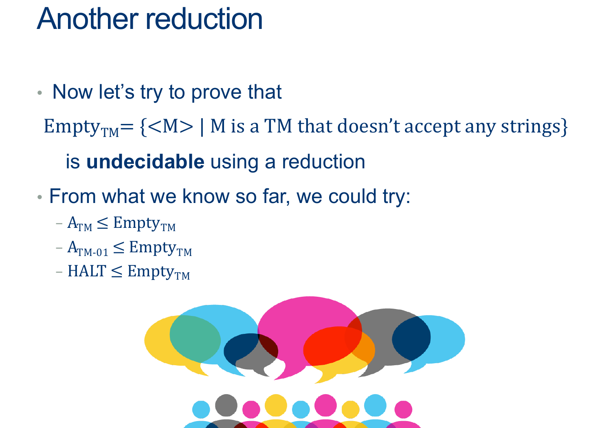
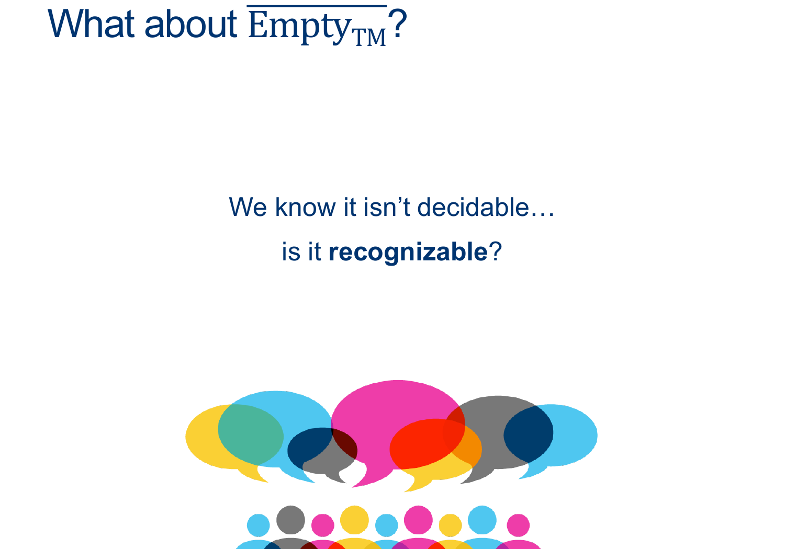
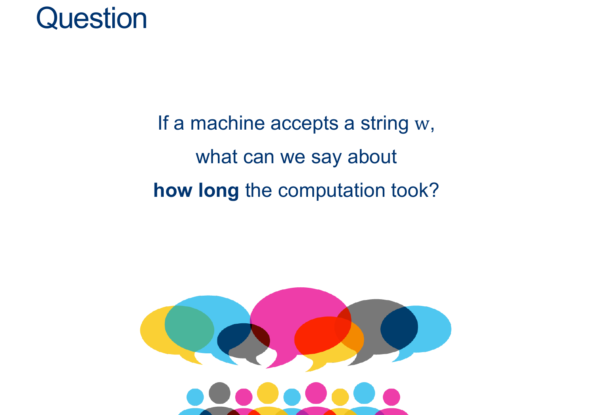
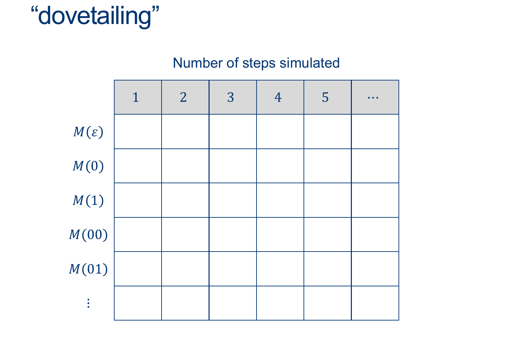
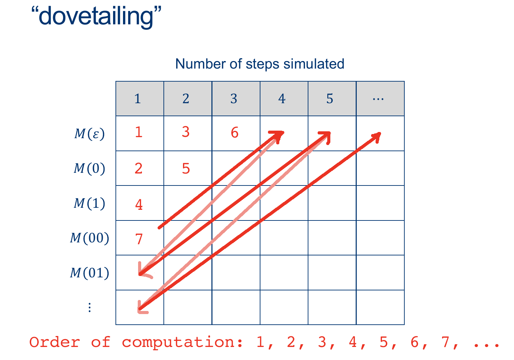
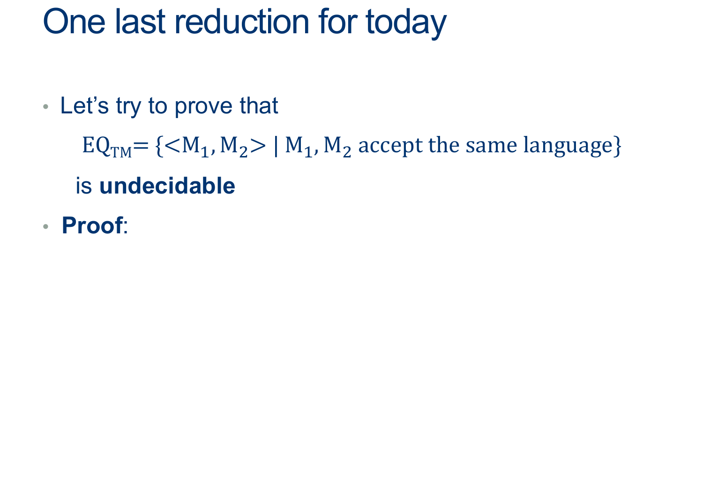

---
layout: default
title: Lecture24
parent: CSC250
grand_parent: Teaching
nav_order: 24
#permalink: /docs/teaching/csc110/
---  

Lecture Notes 24: More reductions
==============================

  
More Reductions: The EMPTY Language
-----------------------------------

  
  
{: width="80%"} 
  
Let's go together  
  
Let's use, in addition to $D_{EMPTY} $, an extra HELPER machine to help us extend the usefulness of $D_{EMPTY} $.  
  

  answer: 
    

(Wait; then Click)

      

Assume that Empty_TM is decidable, and so there exists some $D_{EMPTY}$ that decides for any input $< M >$ whether $M$’s language is empty.  
  
We'll design the Machine $ D_{ATM} $ as follows:  
  
$$ 
\begin{align*} 
& D_{ATM}:\\ 
& \text{ On input $ < M, w > $ }:\\ 
& \text{ 1. build a HELPER machine (but don't run it yet) $Helper_{M,w}$ that is shown below: }\\ 
& \; \\ 
& \qquad Helper_{M,w}:\\ 
& \qquad \text{ On input $ x $ }: \quad \color{gray}{\text{# x: Anything! we don't care} }\\ 
& \qquad \text{ Ignore $ x $ and run $M$ on $w$ ADWID} \quad \color{gray}{\text{# We hardcode what $Helper_{M,w}$ does} }\\ 
& \; \\ 
& \text{ 2. Simulate $D_{EMPTY}$ on $Helper_{M,w}$ }\\ 
& \qquad \text{ If it accepts, REJECT (if the language of $Helper_{M,w}$ is empty, $M$ doesn’t accept $w$)}\\ 
& \qquad \text{ If it rejects, ACCEPT (the only way $Helper_{M,w}$ accepts anything is if $M$ accepts $w$)}\\ \end{align*} $$ 

<b>Analysis of cases</b>
  
What is going on?:

<ul>
	<li>Inside our $D_{ATM} $ machine, we use $D_{EMPTY} $ to ask if its input TM $M$'s' language is empty ...  
    But in order to do it ... <b>it is forced to simulate the input machine $M$</b> ... instead of running $D_{EMPTY} $ on $M$, we can have $D_{EMPTY} $ run on a <b>Trojan-Horse Machine</b> whose only job is to check if $M$ accepts $w$!</li>
	<li>$Helper_{M,w}$ is a TM built solely to check if the $M$ actually accepts the $w$ from the input to $D_{ATM} $ ($ < M, w >$ ).</li>
	<li>When $D_{EMPTY} $ runs on $Helper_{M,w}$, it simlates $Helper_{M,w}$ (on some unimportant input); $Helper_{M,w}$ IGNORES the input and just runs $M$ on $w$  
    It will actually answer if $M$ accepts $w$ rather than if the input $Helper_{M,w}$ has an empty language.
		<ul>
			<li>If $D_{EMPTY}$ returns ACCEPT, then $Helper_{M,w}$ rejects all words (because $M$ rejects $w$), so return REJECT</li>
			<li>If If $D_{EMPTY}$ returns REJECT it was because $Helper_{M,w}$ accepted, which means $M$ accepted $w$;so return ACCEPT</li>
		</ul>
	</li>
	<li>The output of $D_{EMPTY} $ is NOT actually answering if its input has an empty language... it is secretly answering the question : "Does $M$ accept $w$?"</li>
</ul>

  
  
For any $M, w$ pair that gets passed into $D_{ATM} $, we can construct a hardcoded helper machine and trick $D_{EMPTY} $ into telling us the answer,  
in other words...<b>deciding ATM</b>.  
  
However, This can't be true!!,  
<b>we know ATM is undecidable, so EMPTY must also be undecidable</b>.
      

    

  

 

  

  

* * *

  

More Reductions: The $\overline{EMPTY}$ Language
-----------------------------------------------------

  
  
  
Is $\overline{EMPTY}$ Decidable?  
  
$\overline{EMPTY}$ is the complement language of $EMPTY$.  
  
Its definition, should be:  
$$ \overline{EMPTY} = \{ < M > | \text{TM $M$ accepts at least one string} \} $$  
  
There is a first simple step: We can say, for sure that $\overline{EMPTY}$ must be undecidable... Why?  
  
   
  
  
{: width="80%"} 
  

Can we come up with a simple Recognizer? 

  answer: 
    

(Wait; then Click)

      

<b>Recognizer by construction</b>:  

$$ \begin{align*} &R_{\overline{EMPTY}}:\\ & \text{ On input $ < M > $ }:\\ & \text{ Simulate M on all possible w's one at a time}\\ & \text{ If any accepts, accept. }\\ \end{align*} $$  
  
Is there a problem here?
      

    

  

 

   

  
  
{: width="80%"} 

  answer: 
    

(Wait; then Click)

      

The computation is FINITE! 
      

    

  

 

     

  
 
  
{: width="80%"} 
  
  
  
{: width="80%"} 
  

Attempt 2 at a Recognizer for $\overline{EMPTY}$ 

  answer: 
    

(Wait; then Click)

      

<b>Recognizer by construction</b>:  

$$ \begin{align*} &R_{\overline{EMPTY}}:\\ & \text{ On input $ < M > $ }:\\ & \text{ Simulate M on all possible w's DOVETAILED}\\ & \text{ If any accepts, accept. }\\ \end{align*} $$  
      

    

  

 

   

  

* * *

  

More Reductions: The $\overline{EQ}$ Language
--------------------------------------------------

  
  
{: width="80%"} 
  

A proof:  

  answer: 
    

(Wait; then Click)

      

Reducing EMPTY to EQ.  
$$ \begin{align*} &D_{EMPTY}:\\ & \text{ On input $ < M > $ }:\\ & \text{ Build a helper $TM_{\emptyset}$ such that $L(TM_{\emptyset}) = \emptyset$ }:\\ & \text{ Run $D_{EQ}$ on input $ < M, TM_{\emptyset} >$ ADWID}\\ \end{align*} $$  
  
Note that $D_{EQ}$ tells whether $\; < M, TM_{\emptyset} > \; \in \; EQ \;$ , that is, whether $L(M) = L(TM_{\emptyset}) = \emptyset$... Which is the question that $D_{EMPTY}$ is supposed to answer.
      

    

  

 

  
  

