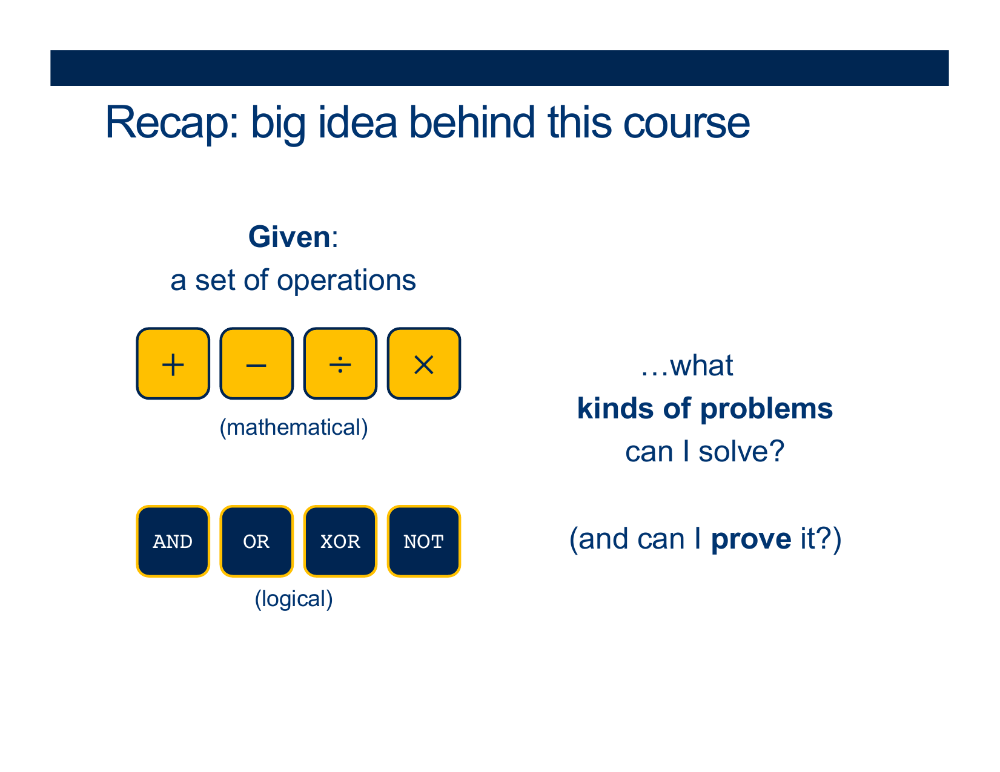
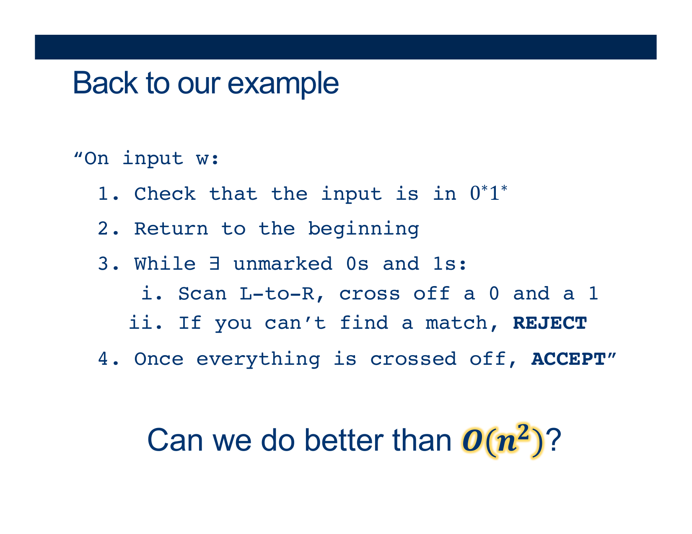
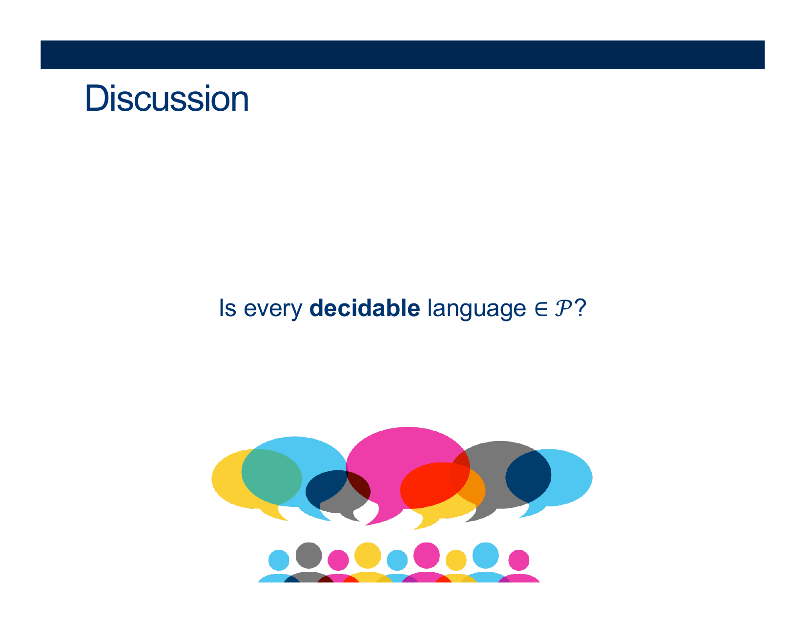
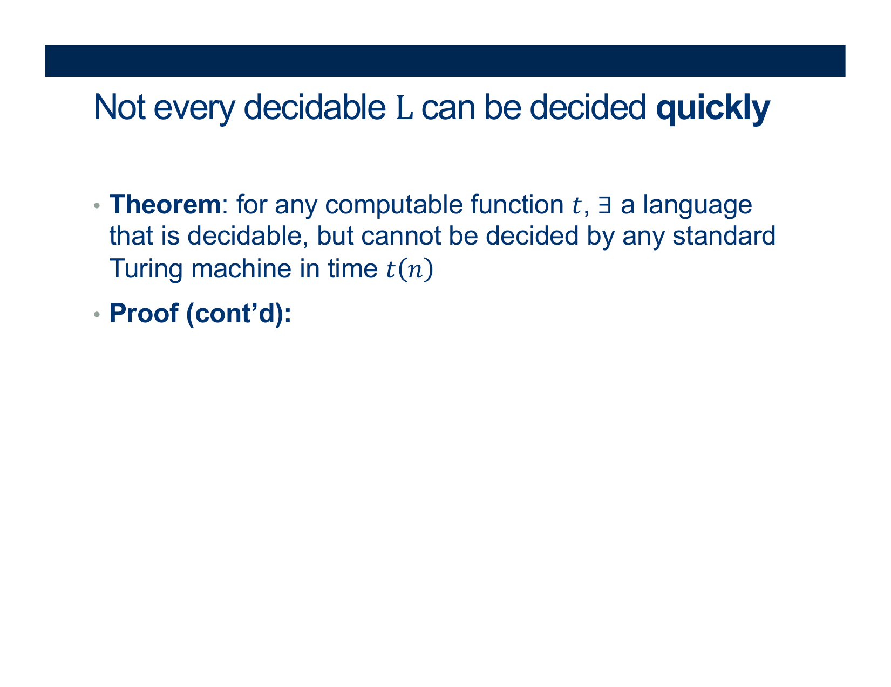
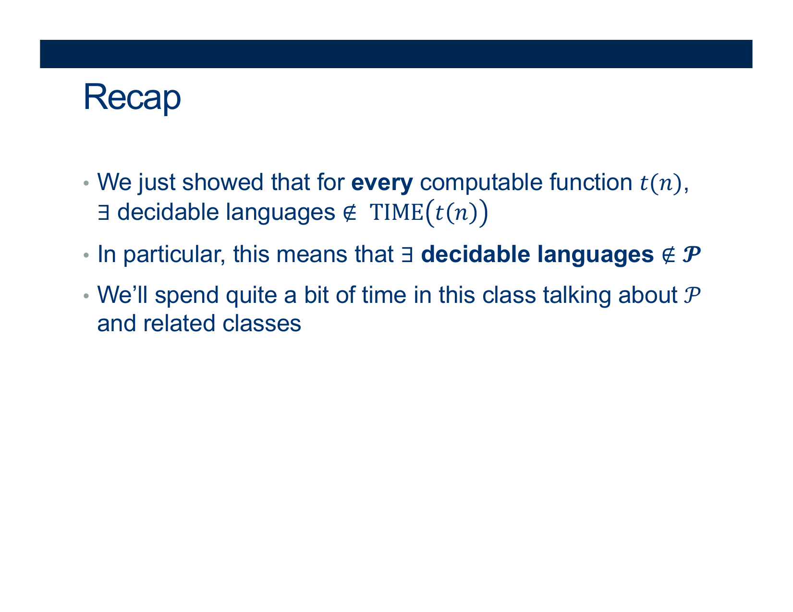

GUIDED NOTES (Optional)
=======================

  

Recap: Is this problem doable?
------------------------------

  
  
{: width="80%"}    
  
  
  
{: width="80%"}    
  
  
  
{: width="80%"}    
  
The problem: Is there some way to set these boolean values so the whole thing evaluates to TRUE?  
  
{: width="80%"}    
  
The problem: Pattern matching  
  
{: width="80%"}    
  
The problem: More powerful pattern matching  
  
{: width="80%"}    
  
Restricted notion of “computation”

* no memory
* only get to read once
* exactly the same class of languages as REs

  
  
{: width="80%"}    
  
Very general notion of computation

1.  unlimited storage
2.  multiple passes over the input
3.  can compute for as long as you like (doesn’t even have to be guaranteed to stop)
4.  Large, sweeping language classes: turing decidable, turing recognizable = enumerable

  
  
{: width="80%"}    
  
  
  
{: width="80%"}    
  
  
  
{: width="80%"}    
  
Here’s the thing: just knowing that it is POSSIBLE to compute a solution to a problem doesn’t give us any information about how difficult that problem is. The only information we have is… it is not impossible.  
  
That level of **resolution** is not great.  
  
  
  
What else would be useful to know (in addition to the fact that a problem is solvable)?

  
  
  

* * *

  
  
  
  
Complexity

  
  
{: width="80%"}    
  
  
  
{: width="80%"}    
  

  answer: 
    

(Wait; then Click)

      

$HALF = \{w | w = 0^i1^i, i \leq 0\}$
      

    

  

 

   
  

  
  
{: width="80%"}    
  
  
  
{: width="80%"}    
  

  answer: 
    

(Wait; then Click)

      

Depends on the particular input.
      

    

  

 

   

  
  
{: width="80%"}    
  
  
  
{: width="80%"}    
  
How long will it take for this input?  
  
How about for "01", "0011", "00001111" ... ?  
  
{: width="80%"}    
  
  
  
{: width="80%"}    
  
  
  
{: width="80%"}    
  
  
  
{: width="80%"}    
  
  
  
{: width="80%"}    
  
  
  
{: width="80%"}    
  

  answer: 
    

(Wait; then Click)

      

Initial check (steps 1 and 2) takes 2n steps (n to read, and n to get back)  
We could have at most n/2 passes over step 3 (because we mark off two letters each time)  
And to make things easier, let’s say we read the whole string each pass  
$2n + (n/2)*2n = 2n + n^2$ steps to accept
      

    

  

 

    

  
  
{: width="80%"}    
  

  answer: 
    

(Wait; then Click)

      

$\mathcal{O}( n^2 )$
      

    

  

 

    
  

  
  
{: width="80%"}    
  
  
  
{: width="80%"}    
  
  
  
{: width="80%"}    
  
  
  
{: width="80%"}    
  
  
  
{: width="80%"}    
  
  
  
{: width="80%"}    
  
  
  
{: width="80%"}    
  
Try modifying the algorithm with a more **efficient** one  
  
{: width="80%"}    
  

  answer: 
    

(Wait; then Click)

      

  3. Copy all the 0s to a second tape  
  4. Move the two heads together, counting off a 1 and a 0 each step  
  5. If you hit the end of both tapes at the same time ACCEPT, otherwise REJECT”  
  
2n steps for lines 1 and 2  
n steps for line 3  
n steps for line 4  
$= 4n = \mathcal{O}(n)$    
      

    

  

 

  

  

  
{: width="80%"}    
  
  
  
{: width="80%"}    
  
  
  
{: width="80%"}    
  
  
  
{: width="80%"}    
  
  
  
{: width="80%"}    
  
  
  
{: width="80%"}    
  
  
  
{: width="80%"}    
  
  
  
{: width="80%"}    
  
  
  
{: width="80%"}    
  
  
  
{: width="80%"}    
  
  
  
{: width="80%"}    
  
  
  
{: width="80%"}    
  
  
  
{: width="80%"}    
  
  
  
{: width="80%"}    
  
  
  
{: width="80%"}  

