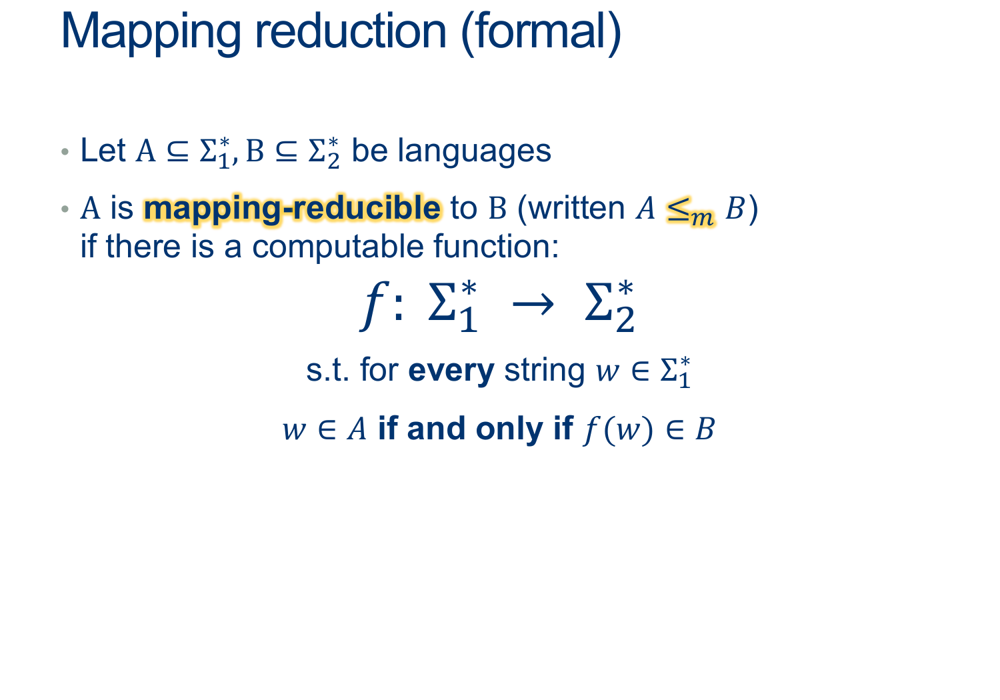
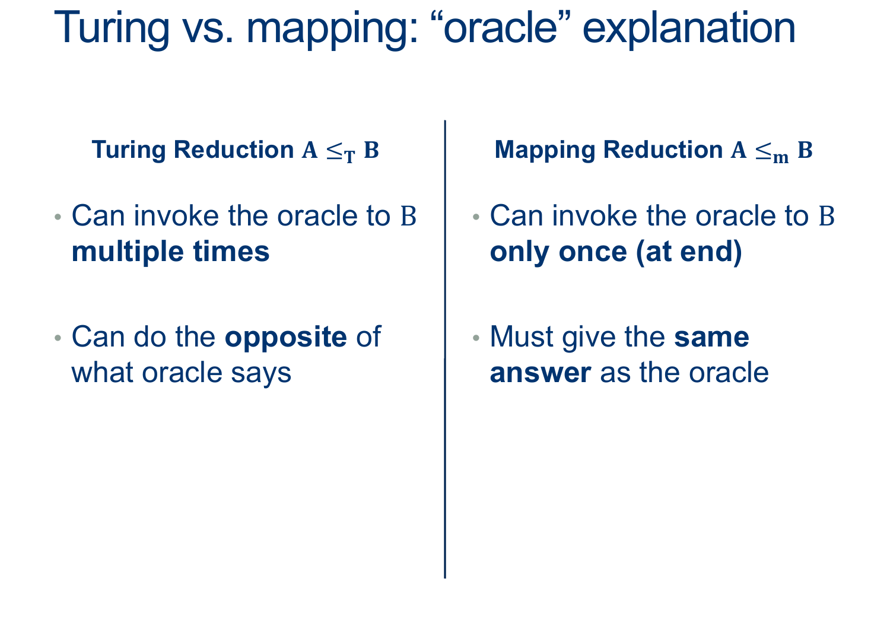
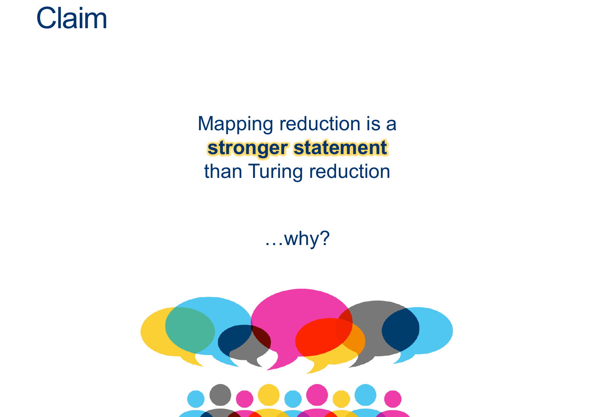

---
layout: default
title: Lecture28
parent: CSC250
grand_parent: Teaching
nav_order: 28
#permalink: /docs/teaching/csc110/
---  

Lecture Notes 28: Mapping Reducibility and Reductions Conclussion
==================================================================

  

Outline
-------

This class we'll discuss:

* Recap: A reduction issue
* Mapping Reductions
* Practice

  

* * *

  

A Reduction Issuue
------------------

  
  
The Emptiness Problem

* Theorem: $\overline{EMPTY-TM}$ is recognizable
* Theorem: $EMPTY-TM$ is undecidable
* Corollary: $EMPTY-TM$is **unrecognizable**
* Proof: If $\overline{EMPTY-TM}$ and $EMPTY-TM$ recognizable,
* that would imply $EMPTY-TM$ is decidable
  
  
  
  
This means our Turing Reduction Can't catch if the fact that we're reducing outside the same class of languages  
  
Issue with EMPTY ≤ ¬EMPTY is that the “Domain” of one is complement of the “Domain” of the other!  
  
  
  
However, we've actually seen a STRONGER type of reduction  
  
  
  
{: width="80%"}  
  
Here, The “Domain” of EMPTY corresponds to the “Domain” of EQ!  
  
  
  
  
  
{: width="80%"}  
  
We could rewrite this as a simple conversion:  
from any word in EmptyTM to a word in EQ_TM (and similarly a word not in EmptyTM to a word not in EQ_TM).  
  
We call this a **mapping reduction**, and denote it $ \leq_m$

  

* * *

  

Mapping Reductions
------------------

  
  
{: width="80%"}  
  
  
  
{: width="80%"}  
  
  
  
{: width="80%"}  
  
  
  
{: width="80%"}  
  
  
  
{: width="80%"}  
  
  
  
{: width="80%"}  
  
They’re a way for us to relate problems to one another  
  
If A reduces to B and B is easy => A is easy too  
More common: if A reduces to be and A is hard => B is hard too  
  
We started with ATM (which we proved was undecidable using a big ugly contradiction )  
Reduced ATM to HALT (ATM ≤ HALT): we showed that if we had a decider HALT, we could use that to decide ATM  
(so that means HALT must also be undecidable)  
  
We did the same thing with ATM-01  
And EmptyTM  
  
Later, we also showed that if we had a decider for HALT, we could use that to decide EmptyTM  
And that if we had a decider for EQ_TM, we could yet again decide EmptyTM (mapping)  
  
  
  
  
  
  
  
  
  
{: width="80%"}  
  

**Activity 1** \[2 minutes\] How would you do this reduction?: (Wait; then Click)  

  answer: 
    

(Wait; then Click)

      

  
$$HALT \leq_m SOMETIMES-HALTS$$ 
  
We want to show that we can take any input and transform it such that:  
if the input was a word in HALT $(< M,w>)$, the output is a word $(< M>)$ in SOMETIMES-HALTS  
  
if the input was NOT a word in HALT, the output is NOT a word in SOMETIMES-HALTS  
  
This suggests that we want to build a helper machine that “amplifies” the behavior of M on w:  
  
$$ \begin{align*} &D_{HALT}:\\ & \text{ On input $ < M,w > $ }:\\ & \text{ Create (but don't run) $HELPER_{M,w}$ such that}\\ & \quad \text{ On input $ < X > $ }:\\ & \quad \quad \text{ Ignore $ < X > $ }\\ & \quad \quad \text{ Run M on w ADWID}\\ & \text{ Now Run $D_{S-H}$ on input $ < HELPER_{M,w} > $ ADWID}\\ \end{align*} $$  
  
The only way the helper halts is if M halts on w (if this is the case, it halts on EVERY input). Otherwise, it loops.  
In other words, if $< M,w>$ was in HALT, then the helper will be in SOMETIMES-HALTS,  
and if $< M,w>$ is NOT in HALT, then the helper won’t be in SOMETIMES-HALT.  
  
Thus, we’ve defined a mapping that from problems in HALT to problems in SOMETIMES-HALTS, proving that SOMETIMES-HALTS is at least as difficult as HAL, and so must be undecidable.  
      

    

  

 

  

  

* * *

# Work on HW07

  