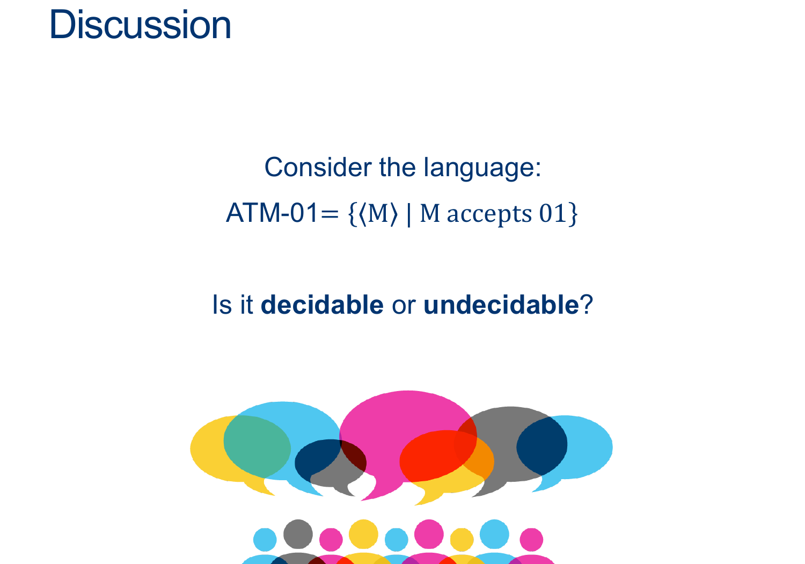
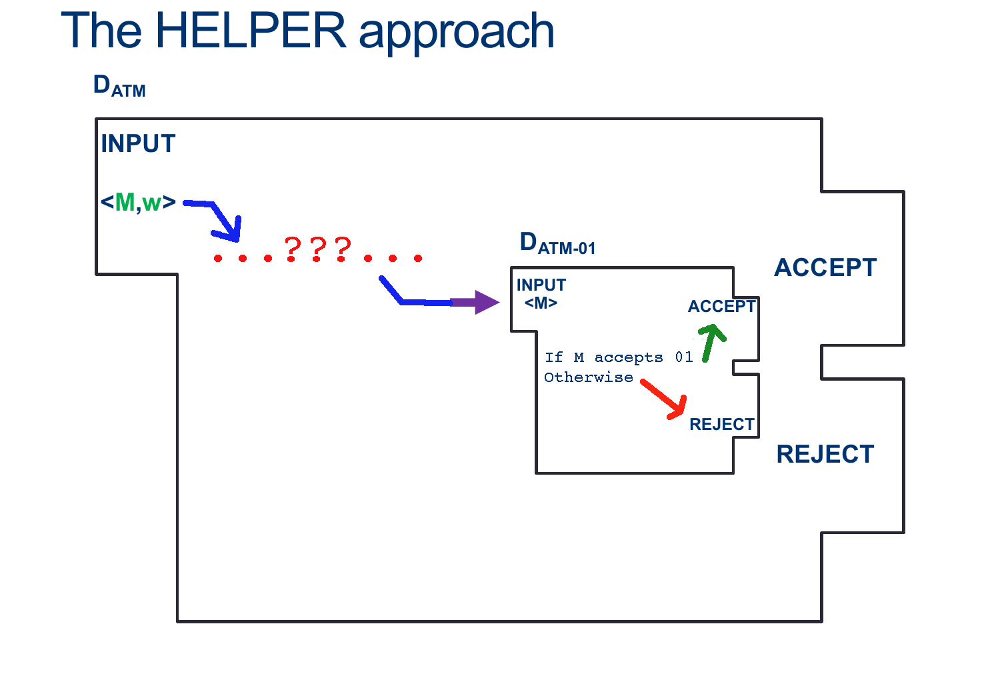
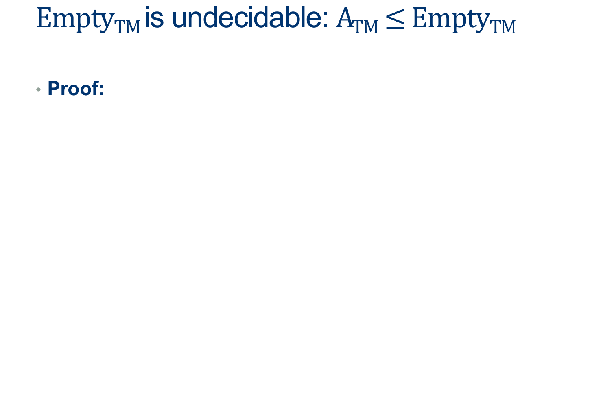
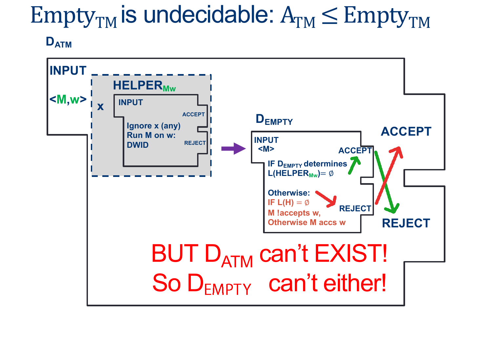
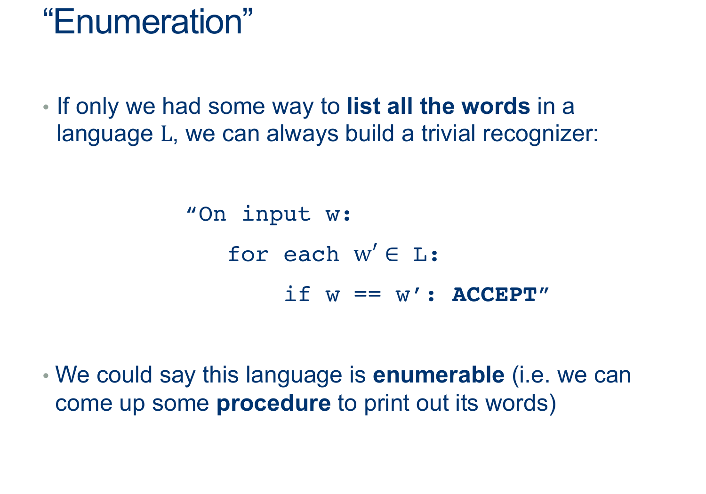
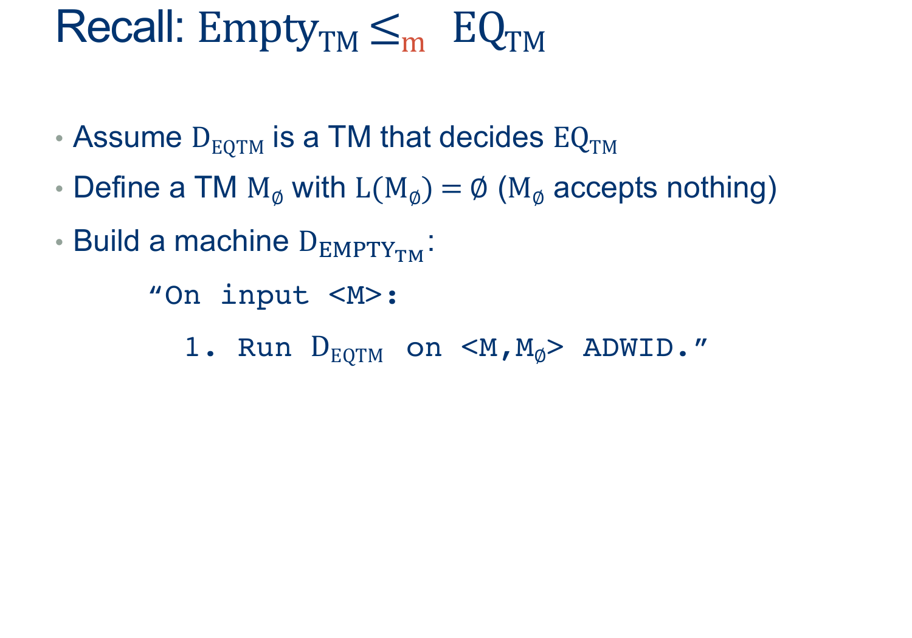

---
layout: default
title: Lecture28
parent: CSC250
grand_parent: Teaching
nav_order: 28
#permalink: /docs/teaching/csc110/
---  

Lecture Notes 28: Reductions and Enumeration
=============================================================

Outline
-------

This class we'll discuss:

* Recap: Reductions

  

* * *

  
  
{: width=80%}  
  
  
  
{: width=80%}  
(ATM-01 is at least as hard to decide as ATM)  
  
Note that:  

1.  IF a machine $D_{ATM}$ existed, it would receive input $ < M, w > $
2.  IF a machine $D_{ATM-01}$ existed, it would receive input $ < M > $
3.  The order of the proof is:  
    1.  Assume $D_{ATM-01}$ already exists
    2.  We can use it to build another machine that should behave like $D_{ATM}$
    3.  This larger machine, should be able to handle input $ < M, w > $
    4.  You must somehow get a machine with ONLY $ < M > $ as input to handle the input $ < M, w > $
    5.  Note that, as part of the steps, you can build helper machines

  
  
  
  
**Activity 4** \[2 minutes\]:  
In teams, write a Machine that uses $D_{ATM-01}$ to perform the work of $D_{ATM}$ (Wait; then Click)  
  
  
  
{: width=80%}  
  
  
  
{: width=80%}  
  
  
  
{: width=80%}  
  

  
  
{: width=80%}  
  
  
  
{: width=80%}  
  
  
  
{: width=80%}  
  
  
  
{: width=80%}  
  
This can be written like this:  
  
Assume EMPTY-TM is decidable, and so there exists some $D_{EMPTY-TM}$ that decides, for any input $< M >$, whether $L (M) $ is empty.  
  
We'll design the Machine $D_{ATM} $ as follows:  
  
$$ \begin{align*} &D_{ATM}:\\ & \text{ On input $ < M, w > $ }:\\ & \text{ Create (but don't run) $HELPER_{M,w}$ such that}\\ & \quad \text{ On input $ < X > $ }:\\ & \quad \quad \text{ Ignore $ < X > $ }\\ & \quad \quad \text{ Run $M$ on $w$ ADWID}\\ & \text{ Now Run $D_{EMPTY-TM}$ on $HELPER_{M,w}$}\\ & \text{ If $D_{EMPTY-TM}$ rejects, invert the result and our machine ACCEPTS}\\ & \text{ If $D_{HALT}$ accepts, , invert the result and our machine REJECTS}\\ \end{align*} $$  
  
As we saw above, the ONLY way $D_{EMPTY-TM}$ Rejects is if $HELPER_{M,W}$ Accepts, which happens ONLY when $M$ accepts $w$.  
  
This means we CAN make $D_{ATM}$ as long as $D_{EMPTY-TM}$ exists.  
  
However, $D_{ATM}$ doesn't exist...which means $D_{EMPTY-TM}$ CANNOT EXIST EITHER.  
  
  
  
  
  
{: width=80%}  
  
  
  
{: width=80%}  
  
  
  
{: width=80%}  
  
  
  
This will lead us to a new way of looking at Recognizers: Enumeration.

# Enumeration  
  
  
  
  
  
  
{: width="80%"}  
  
  
  
{: width="80%"}  
  
  
  
{: width="80%"}  
  
  
  
{: width="80%"}  
  

**Activity 3** \[2 minutes\] In groups, come up with an algorithm to enumerate $\\Sigma^*$?:  

  
  
  
  
{: width="80%"}  
  
  
  
{: width="80%"}  
  

**Activity 4** \[2 minutes\] In groups,  
How would you prove that, IF you can enumerate a Language, then that language is Recognizable.  
(Wait; then Click)  
  
  
  
Assume L is enumerable, i.e. there exists some machine E_L that can print out all of Ls words.  
Build a machine R_L that uses E_L to print them out one at a time, and compares each one with the input.  
As soon as they match, accept.  
  
This machine accepts only words that are in L, and if a word is in L we’re guaranteed to reach it at some point (though it might take awhile).  
Thus, it recognizes L. QED.  

  
  
{: width="80%"}  
  
  
  
{: width="80%"}  
  
  
  
{: width="80%"}

<!-- 
  Sipser
ATM = {⟨M,w⟩| M is a TM and M accepts w}. P202, 207
THE DIAGONALIZATION METHOD P202  
ATM is not Turing-recognizable. P210
HALTTM ={⟨M,w⟩|MisaTMandMhaltsoninputw}. P216
ETM ={⟨M⟩|M isaTMandL(M)=∅}. P217
EQTM = {⟨M1,M2⟩| M1 and M2 are TMs and L(M1) = L(M2)}. P220
f: Σ∗−→Σ∗ is a computable function P234
EQTM is neither Turing-recognizable nor co-Turing-recognizable. P238
TURING REDUCIBILITY P261 
-->

<!-- Lecture Notes 28: Mapping Reducibility and Reductions Conclussion
================================================================== -->

<!-- 
  

Outline
-------

This class we'll discuss:

* Recap: A reduction issue
* Mapping Reductions
* Practice

  

* * *

  

A Reduction Issuue
------------------

  
  
The Emptiness Problem

* Theorem: $\overline{EMPTY-TM}$ is recognizable
* Theorem: $EMPTY-TM$ is undecidable
* Corollary: $EMPTY-TM$is **unrecognizable**
* Proof: If $\overline{EMPTY-TM}$ and $EMPTY-TM$ recognizable,
* that would imply $EMPTY-TM$ is decidable
  
  
  
  
This means our Turing Reduction Can't catch if the fact that we're reducing outside the same class of languages  
  
Issue with EMPTY ≤ ¬EMPTY is that the “Domain” of one is complement of the “Domain” of the other!  
  
  
  
However, we've actually seen a STRONGER type of reduction  
  
  
  
{: width="80%"}  
  
Here, The “Domain” of EMPTY corresponds to the “Domain” of EQ!  
  
  
  
  
  
{: width="80%"}  
  
We could rewrite this as a simple conversion:  
from any word in EmptyTM to a word in EQ_TM (and similarly a word not in EmptyTM to a word not in EQ_TM).  
  
We call this a **mapping reduction**, and denote it $ \leq_m$

  

* * *

  

Mapping Reductions
------------------

  
  
{: width="80%"}  
  
  
  
{: width="80%"}  
  
  
  
{: width="80%"}  
  
  
  
{: width="80%"}  
  
  
  
{: width="80%"}  
  
  
  
{: width="80%"}  
  
They’re a way for us to relate problems to one another  
  
If A reduces to B and B is easy => A is easy too  
More common: if A reduces to be and A is hard => B is hard too  
  
We started with ATM (which we proved was undecidable using a big ugly contradiction )  
Reduced ATM to HALT (ATM ≤ HALT): we showed that if we had a decider HALT, we could use that to decide ATM  
(so that means HALT must also be undecidable)  
  
We did the same thing with ATM-01  
And EmptyTM  
  
Later, we also showed that if we had a decider for HALT, we could use that to decide EmptyTM  
And that if we had a decider for EQ_TM, we could yet again decide EmptyTM (mapping)  
  
  
  
  
  
  
  
  
  
{: width="80%"}  
  

**Activity 1** \[2 minutes\] How would you do this reduction?: (Wait; then Click)  

  answer: 
    

(Wait; then Click)

      

  
$$HALT \leq_m SOMETIMES-HALTS$$ 
  
We want to show that we can take any input and transform it such that:  
if the input was a word in HALT $(< M,w>)$, the output is a word $(< M>)$ in SOMETIMES-HALTS  
  
if the input was NOT a word in HALT, the output is NOT a word in SOMETIMES-HALTS  
  
This suggests that we want to build a helper machine that “amplifies” the behavior of M on w:  
  
$$ \begin{align*} &D_{HALT}:\\ & \text{ On input $ < M,w > $ }:\\ & \text{ Create (but don't run) $HELPER_{M,w}$ such that}\\ & \quad \text{ On input $ < X > $ }:\\ & \quad \quad \text{ Ignore $ < X > $ }\\ & \quad \quad \text{ Run M on w ADWID}\\ & \text{ Now Run $D_{S-H}$ on input $ < HELPER_{M,w} > $ ADWID}\\ \end{align*} $$  
  
The only way the helper halts is if M halts on w (if this is the case, it halts on EVERY input). Otherwise, it loops.  
In other words, if $< M,w>$ was in HALT, then the helper will be in SOMETIMES-HALTS,  
and if $< M,w>$ is NOT in HALT, then the helper won’t be in SOMETIMES-HALT.  
  
Thus, we’ve defined a mapping that from problems in HALT to problems in SOMETIMES-HALTS, proving that SOMETIMES-HALTS is at least as difficult as HAL, and so must be undecidable.  
      

    

  

 

  

  

* * *

# Work on HW07
 -->
  