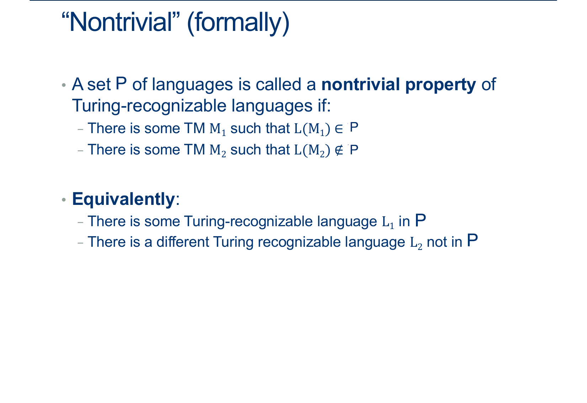

---
layout: default
title: Lecture30
parent: CSC250
grand_parent: Teaching
nav_order: 30
#permalink: /docs/teaching/csc110/
---  

Lecture Notes 30: Mapping Reducibility and Intro to Rice's Theorem
==================================================================

  

Outline
-------

This class we'll discuss:

* Rice's Theorem

  

* * *

  
  

Rice's Theorem
-------------------------

  
  
{: width="80%"}  
  
  
  
{: width="80%"}  
  
  
  
{: width="80%"}  
  
  
  
{: width="80%"}  
  
Our previous example:  
  
{: width="80%"}  
  
  
  
{: width="80%"}  
  
  
  
{: width="80%"}  
  
  
  
{: width="80%"}  
  
  
  
{: width="80%"}  
  
  
  
{: width="80%"}  
  
  
  
{: width="80%"}  
  
  
  
{: width="80%"}  
  
  
  
{: width="80%"}  
  

  
  
{: width="80%"}  
  
  
  
{: width="80%"}  
  
Remember, we have to be able to deal with any input, but we don’t necessarily have to map them all to unique outputs.  
This is why a mapping reduction is sometimes called a “many-one” reduction.  
  
  
  
{: width="80%"}  
  
  
  
{: width="80%"}  
  
Let’s start by assuming that ∅ ∉ P (that is, it doesn’t exhibit the non-trivial property we care about).  
Because we’re trying to prove undecidability, I claim that we can assume this WLOG.  
Why? (otherwise, just work with the complement of P).  
  
Let M1 be any TM such that L(M1) = ∅, so < M1 > ∉ MP.  
Cool, so now we’ve got something we could map not-in-ATM words to.  
  
  
  
  
{: width="80%"}  
  
Next let M2 be any TM such that L(M2) ∈ P, so < M1 > ∈ MP.  
How do we know M2 exists?  
Because P is nontrivial.  
  
  
  
{: width="80%"}  
  
  
  
{: width="80%"}  
  
We have M1 not in P, M2 in P  
  
<!-- Goal:  
on any input x:  
if $x = < M,w >$ $\in$ ATM, map to something in MP  
otherwise, map to something not in MP (like M1)   -->

$$
\begin{align*}
\text{Goal:}&\\
\quad & \text{On any input x:  }\\
\quad & \quad \text{if } x = < M,w >\in ATM \text{, map to something in MP}\\
\quad & \quad \text{otherwise, map to something not in MP (like M1)}\\
\end{align*}
$$

Easy part: If x isn’t of the form $< M,w >$ return something $\notin$ MP, like $< M1 >$.  
  
Harder part: If x IS of the form $< M,w >$ , we have two cases: if it’s in ATM, we want to map it to a machine in MP and if it’s NOT in ATM, we want to map it to something not in MP.  
  
  
  
  
{: width="80%"}  
  
Time to get tricksy: if x is of the form $< M,w >$ , then return the following machine: $< M^{\prime}_{M,w} >$  

$$
\begin{align*}
<M^{\prime}_{M,w}>:&\\
\quad & \text{On any input y:  }\\
\quad & \quad \text{Run M on w. #(If stuck on a loop, this is M1!)}\\
\quad & \quad \quad \text{If M accepts w then run M2 on y ADWID}\\
\quad & \quad \quad \text{If M rejects w, REJECT.}\\
\end{align*}
$$
  
  
  

If M accepts w, what is $<M^{\prime}_{M,w}>$’s language?  

exactly the same as M2’s, which means this machine is in MP  
(If M accepts w, then $< M^{\prime}_{M,w} >$ is just the result of M2)  
  
If M doesn’t accept w, what is its language?  
the empty language, exactly like M1, which means NOT in MP  
(If M doesn't accept w,$< M^{\prime}_{M,w} >$ is just M1)  
  
Therefore, ATM $\leq_m$ MP using this process.  
This implies that MP is undecidable  
  
  
  
  
{: width="80%"}  
  
  
  
{: width="80%"}  
  
  
  
{: width="80%"}

  
  
{: width="80%"}  
  
  
  
{: width="80%"}