---
layout: default
title: Lecture31
parent: CSC250
grand_parent: Teaching
nav_order: 31
#permalink: /docs/teaching/csc110/
---  

Lecture Notes 31: More Computational Complexity
==========================================

  

Outline
-------

This class we'll discuss:

* Recap: Computational Complexity
* Demo HW07 (Q1a and Q1b)

* * *

  

Continuing: Computational Complexity Questions
------------------------------

  
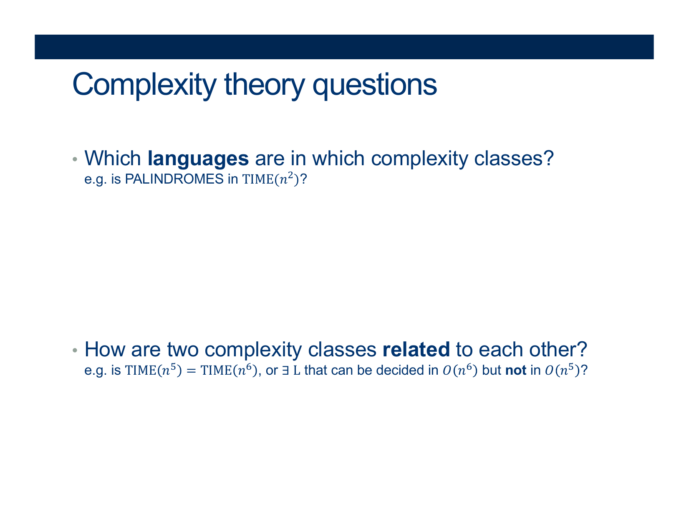{: width="80%"}    
  

  
  
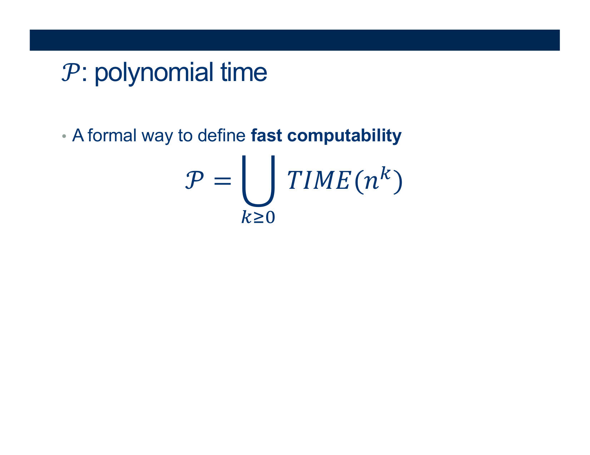{: width="80%"}    
  
  
  
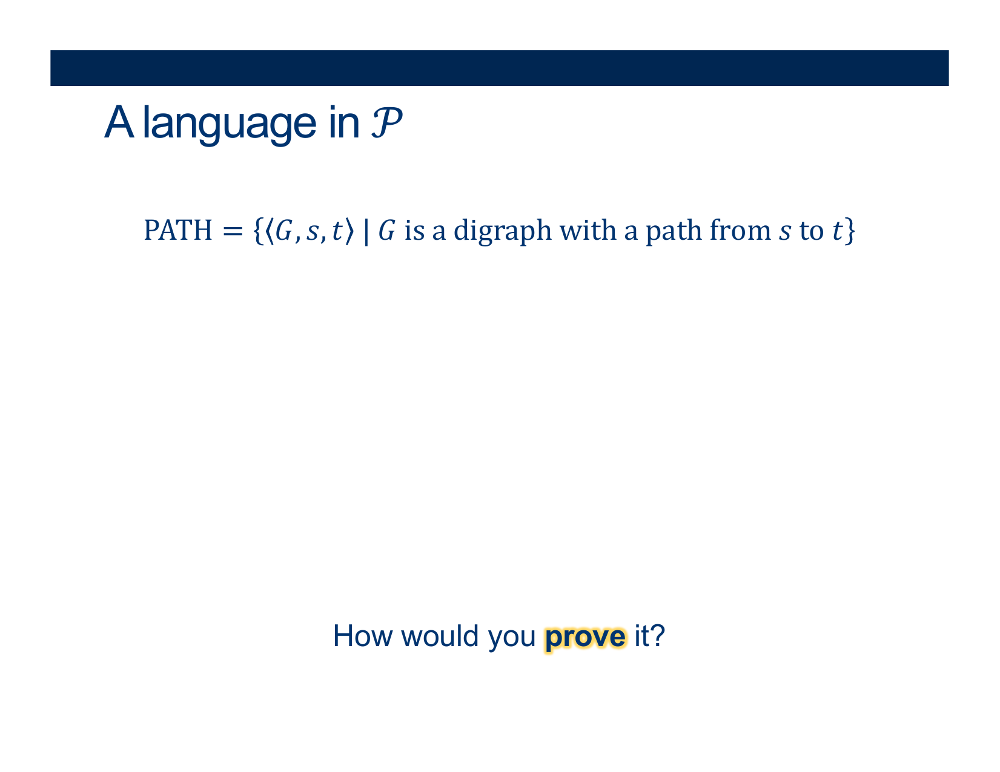{: width="80%"}    
  
  
  
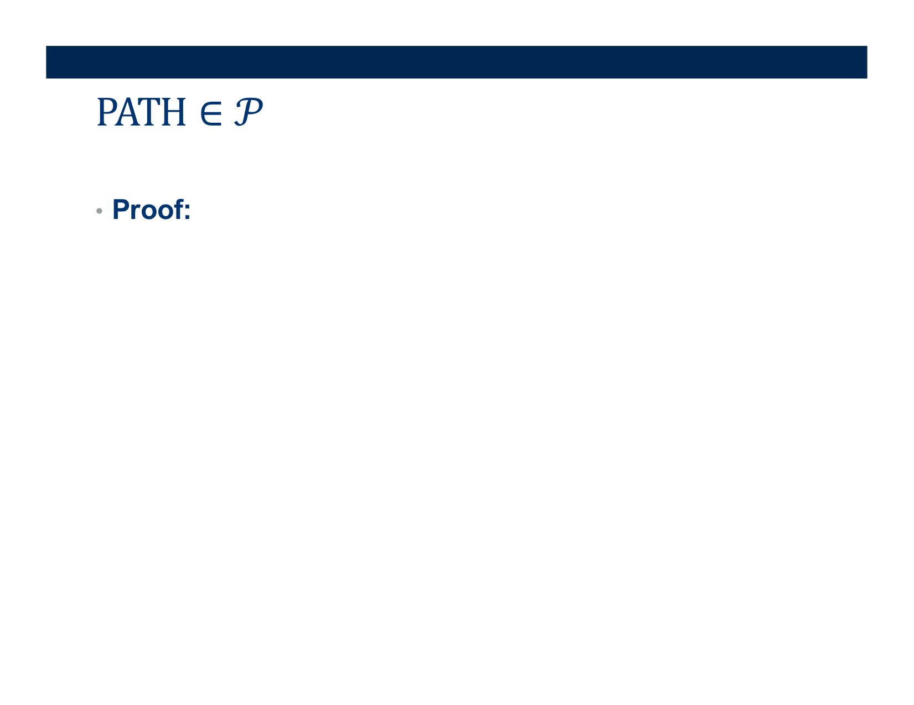{: width="80%"}    
  
  
  
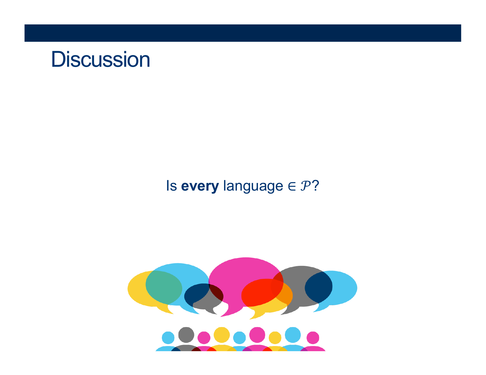{: width="80%"}    
  
  
  
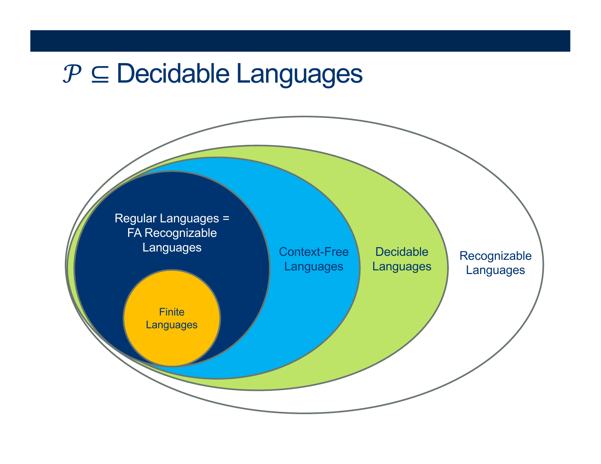{: width="80%"}    
  
  
  
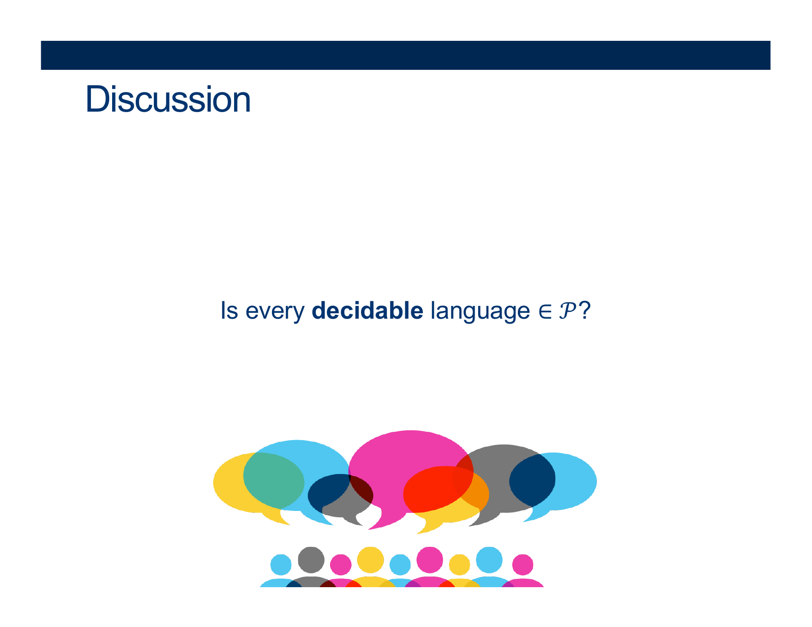{: width="80%"}    
  
  
  
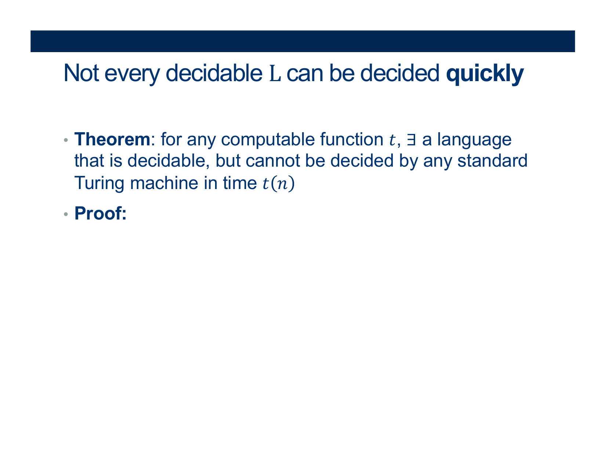{: width="80%"}    
  
  
  
{: width="80%"}    
  
  
  
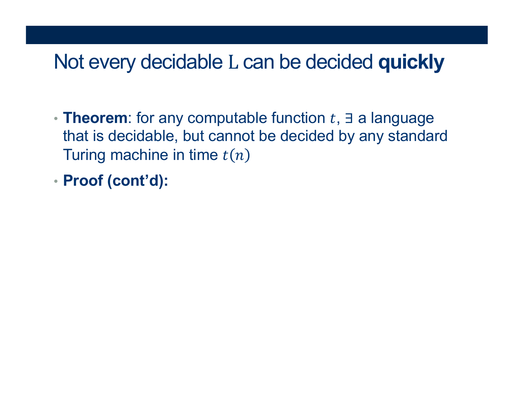{: width="80%"}    
  
  
  
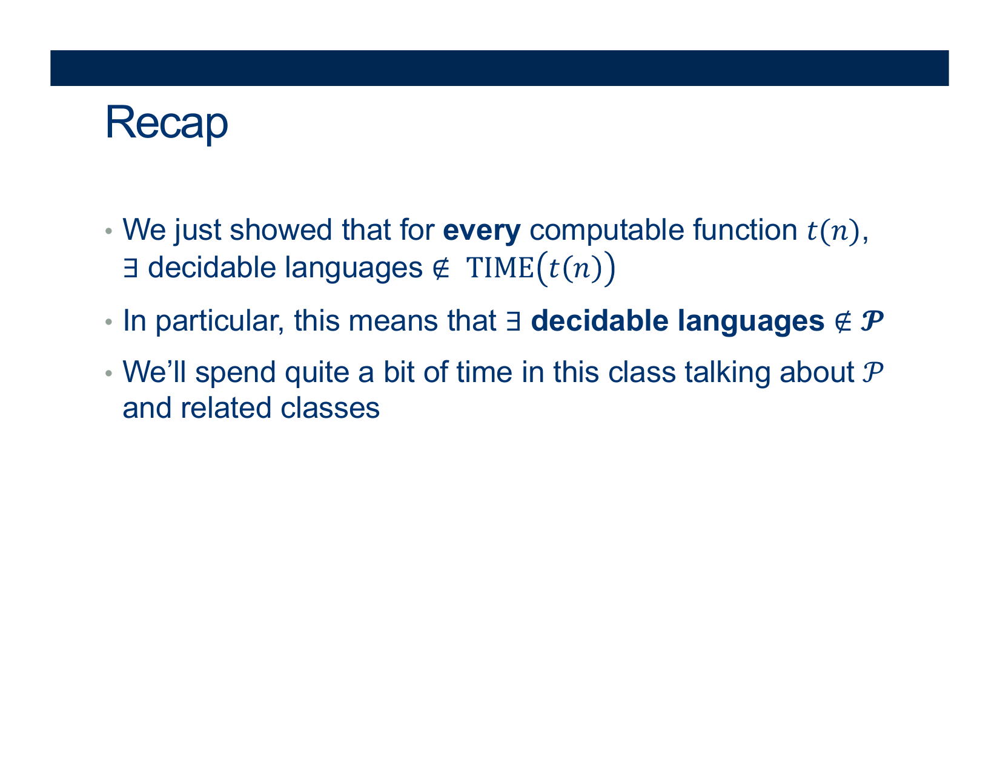{: width="80%"}    
  
  
  
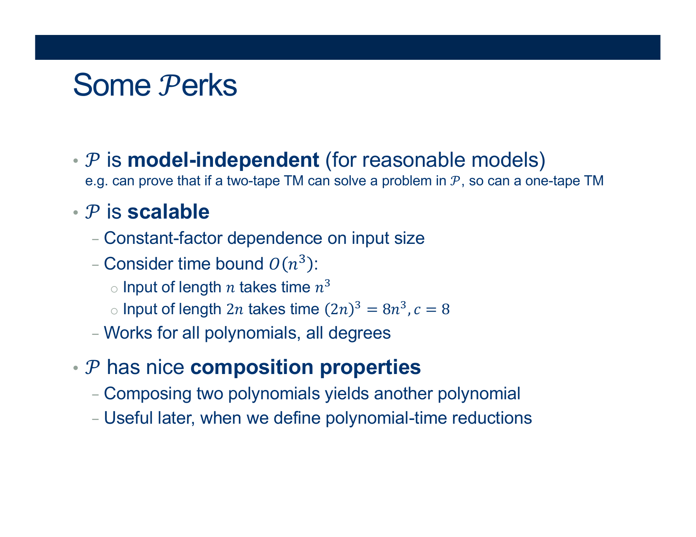{: width="80%"}    
  
  
  
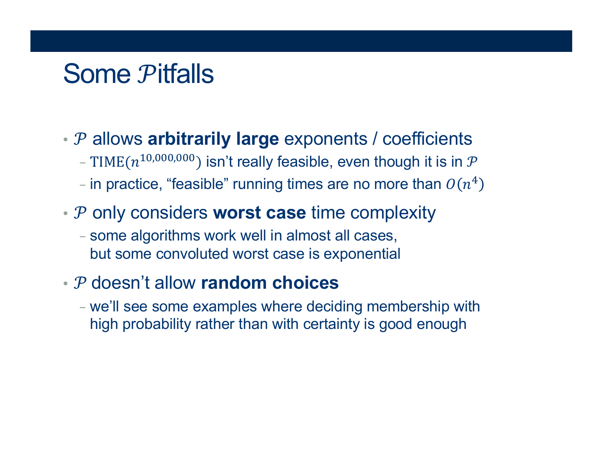{: width="80%"}    
  
  
  
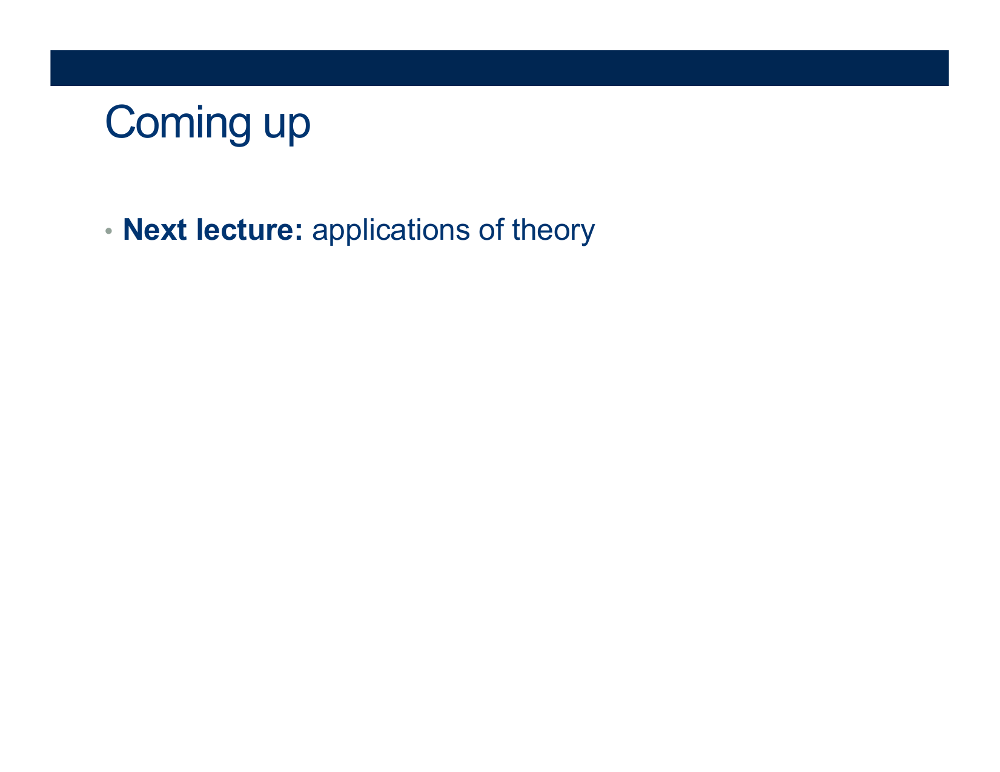{: width="80%"}  