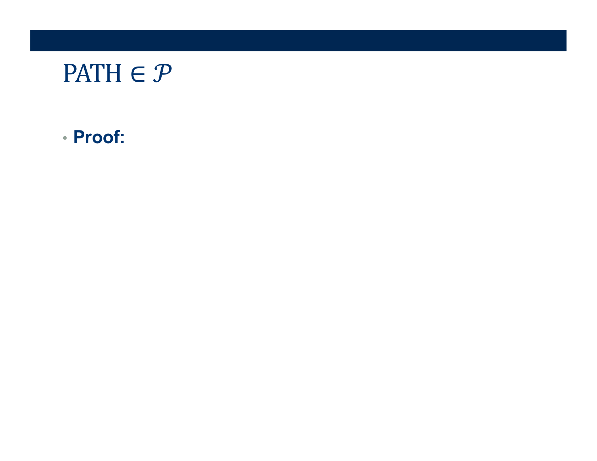
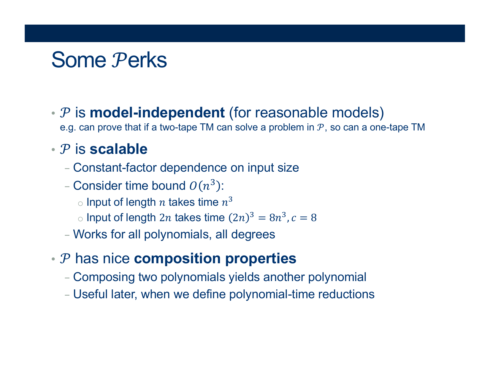
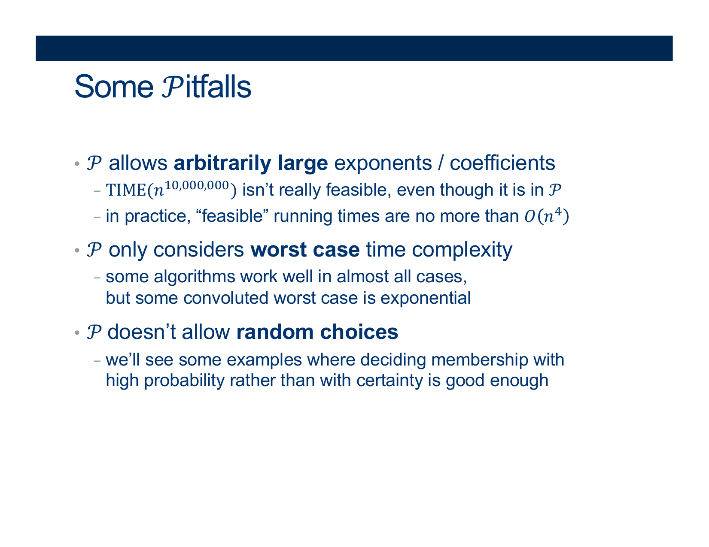

---
layout: default
title: Lecture33
parent: CSC250
grand_parent: Teaching
nav_order: 33
#permalink: /docs/teaching/csc110/
---  

Lecture Notes 33: More Computational Complexity
==========================================

  

Outline
-------

This class we'll discuss:

* Recap: Computational Complexity
* Demo HW07 (Q1a and Q1b)

* * *

  

Continuing: Computational Complexity Questions
------------------------------

  
{: width="80%"}    
  

  
{: width="80%"}    
  
  
  
{: width="80%"}    
  
  
  
{: width="80%"}    
  

**Activity 1** \[2 minutes\] How would you Prove this?:

  answer: 
    

(Wait; then Click)

      

  
You must build a Decider that solves it in $ \mathcal{O} (n^k) $ (Polynomial time)  

 

Use <b>Breadth-First-Search</b>!

<ol>
  <li>On input $< G, s, t>$</li>
  <li>Mark all nodes rechable from the current node (starting at s and moving to the next in a running queue)</li>
  <li>Continue to expand until we reach $t$ or $\nexists$ another node</li>
  <li>if we reach $t$ : ACCEPT</li>
  <li>REJECT</li>
</ol> 

<!--   1. On input $< G, s, t>$
  2. Mark all nodes rechable from the current node (starting at s and moving to the next in a running queue)
  3. Continue to expand until we reach $t$ or $\nexists$ another node
  4. if we reach $t$ : ACCEPT
  5. REJECT -->

 
  
What is the complexity!!!???  

   

<b>Complexity analysis</b>:
 
Worst case: traversing every edge.  
 
How many edges? ...  

  

<b>Another approach</b>:
 
At most $\mid V \mid$ phases are executed.  
 
Each phase takes polynomial time to explore marked nodes and their outgoing edges.  
 
(Imagine $\mid V \mid$ nodes in a straight line VS $\mid V \mid$ nodes all connected to each other)
      

    

  

 

   
  

  
  
{: width="80%"}    
  
  
  
{: width="80%"}    
  
  
  
{: width="80%"}    
  
  
  
{: width="80%"}    
  
  
**Note**: The aforememntioned statement just means: 

> Given a function of $n$ called $t(n)$ (which could be very large),
> we can always come up with a language $L$ that is so difficult to decide that, even $t(n)$ isn't enough time to decide an input of size $n$

How would you Prove this?:

$$AutoTM_t = \{<M>\vert \text{M is a TM that accepts }<M> in \leq t( \vert M \vert ) \text{ steps}\}$$

**Claim 1**: $AutoTM_t$ is decidable  
  
Proof of Claim 1:

On input $< M>$ , simulate M on $< M>$ for $t( \vert M \vert )$ simulated steps ADWID.

(What does this mean?)  
  
The computation is BOUNDED... so it is DECIDABLE

  
  
**Claim 2**: $AutoTM_t$ can’t be decided by any basic TM in ≤ $t( \vert M \vert )$ steps  
  
Proof of claim 2: (everyone’s favorite contradiction argument)  
  
Assume $AutoTM_t$ is decided in time ≤ $t( \vert M \vert )$ by some TM $M_A$  
This implies that the complement is also decided by some other TM $M_\overline{A}$  
(just swap the accepting and rejecting states of $M_A$ )  
  
 
Now we have assumptions:

  * $M_A$: a TM that decides the language of words $< M>$ such that  
    they accept themselves in ≤ $t( \vert M \vert )$ steps
  * $M_\overline{A}$: a TM that decides the language of words such that they are  
    either not TMs or they are $< M>$'s that don't accept themselves  
    in ≤ $t( \vert M \vert )$ steps

  
  
Thus, for every Turing machine M:  
  

  1. Either $< M>\in \overline{AutoTM_t}$ iff $M_\overline{A}$ accepts $< M>$ in time ≤ $t( \vert M \vert )$  
    And by taking the complement of the definition of $AutoTM_t$:  
  2. Or $< M> \in AutoTM_t$ iff $M_{\overline{A}}$ does not accept $< M>$ in time ≤ $t( \vert M \vert )$ .  
    (equivalent to:)  
    $< M> \in AutoTM_t$ iff $ M_A $ accepts $< M>$ in time ≤ $ t( \vert M \vert ) $ .

  
What happens if we plug in $ M_\overline{A} $ for M in both statements:  

  * $M_\overline{A} \in \overline{AutoTM_t}$ iff $M_\overline{A}$ accepts in time ≤ $t(\vert M_\overline{A} \vert )$  
      
  (But that means $ M_\overline{A} $ belongs to the language that accepts its description under the bound!)
  
  * $M_\overline{A} \in AutoTM_t$ iff $M_\overline{A}$ does not accept in time ≤ $t( \vert M_\overline{A} \vert )$.

– Contradiction!

  
{: width="80%"}    
  
  
  
{: width="80%"}    
  
  
  
{: width="80%"}    
  
  
  
{: width="80%"}    
  
  
  
{: width="80%"}    
  
  
  
{: width="80%"}  

