---
layout: default
title: Lecture34
parent: CSC250
grand_parent: Teaching
nav_order: 34
#permalink: /docs/teaching/csc110/
---  

Lecture Notes 34: Complexity and NP-Completeness
==========================================================

  

Outline
-------

This class we'll discuss:

* NP-Completeness

  

* * *

Recap: Computational Complexity
-------------------------------

  
  
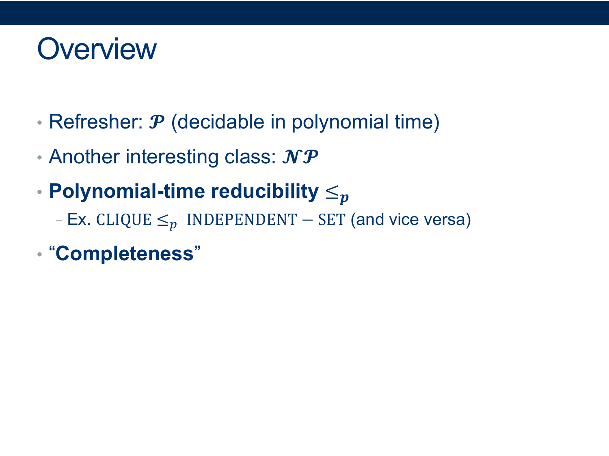{: width="80%"}   
  
  
  
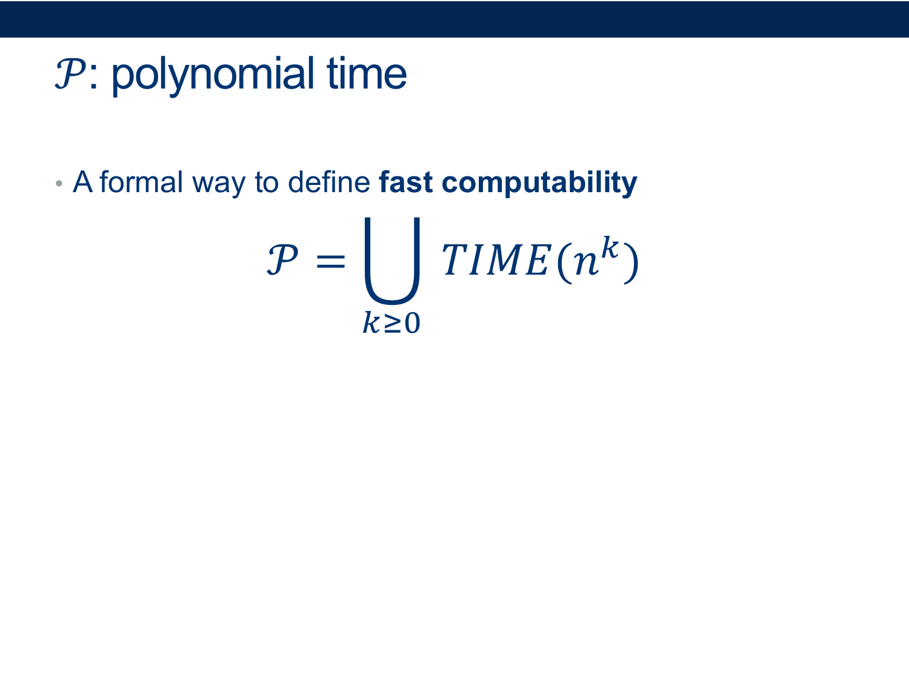{: width="80%"}   
  
  
  
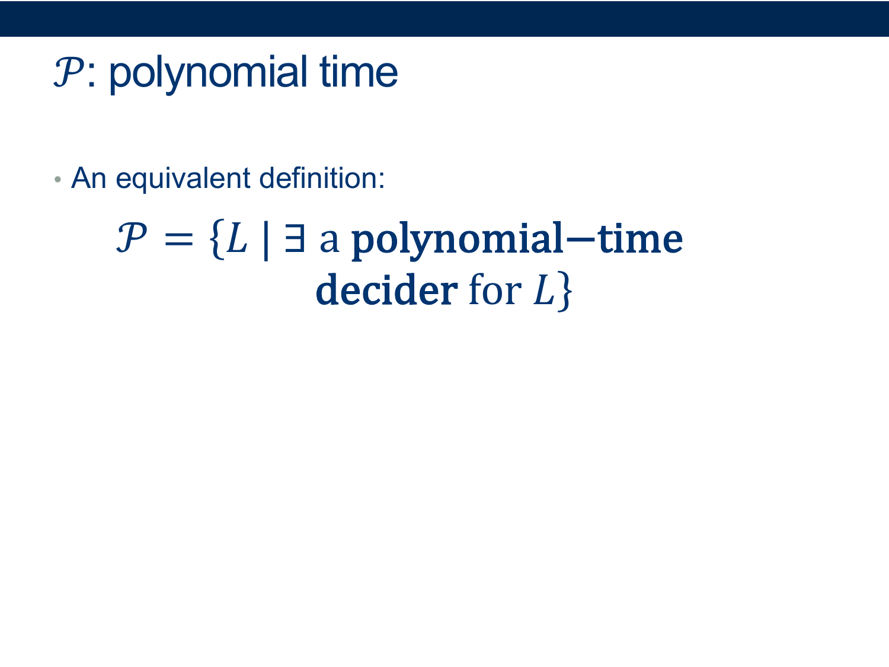{: width="80%"}   
  
  
  
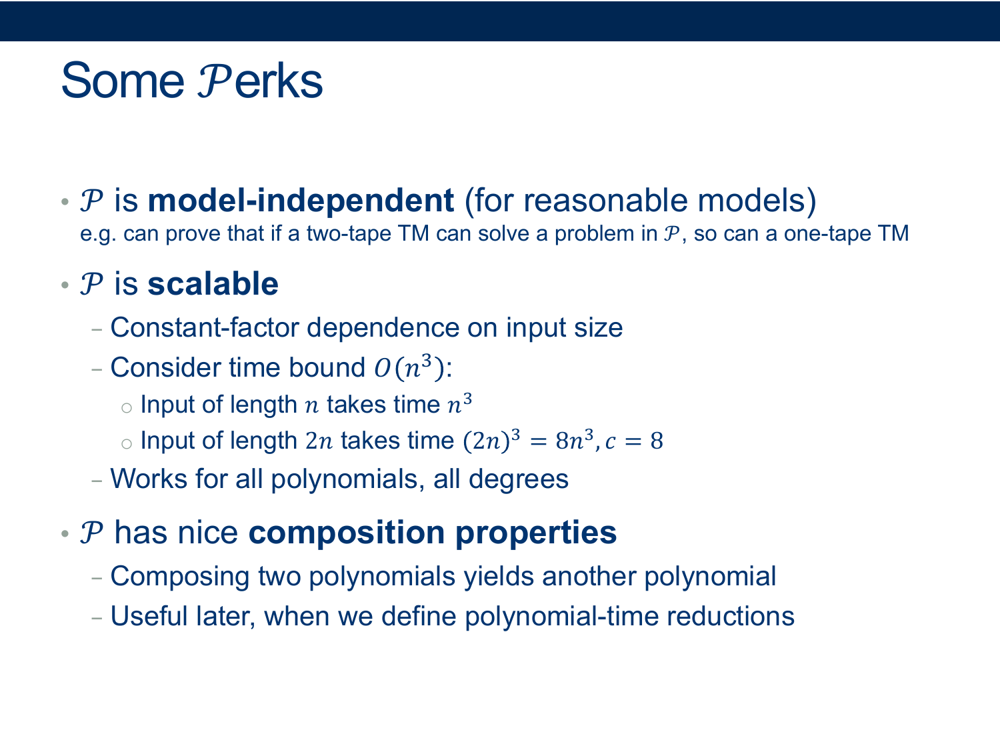{: width="80%"}   
  
  
  
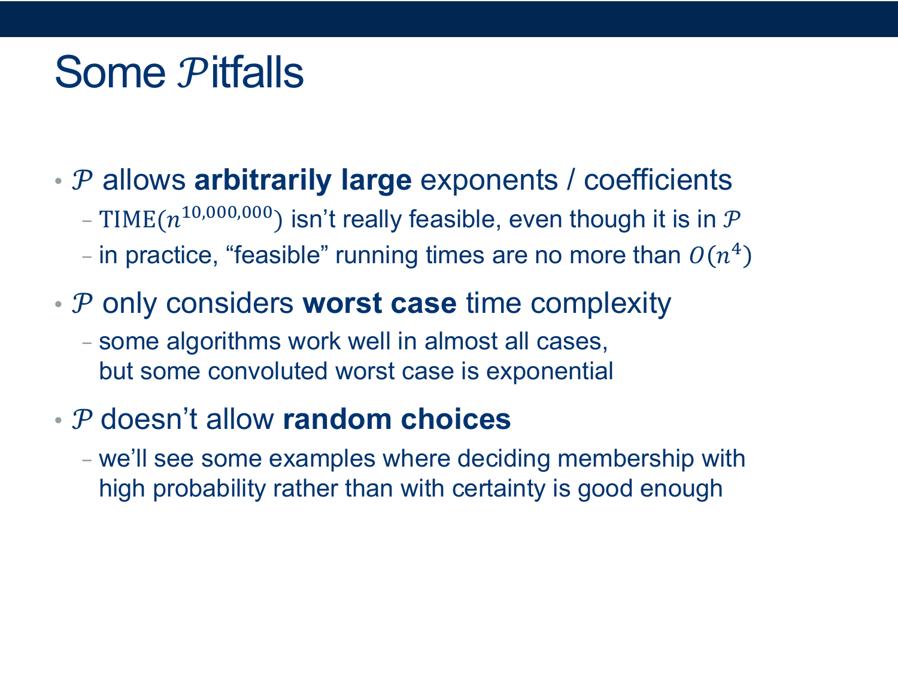{: width="80%"}   
  
  
  
{: width="80%"}   
  
  
  
{: width="80%"}   
  
  
  
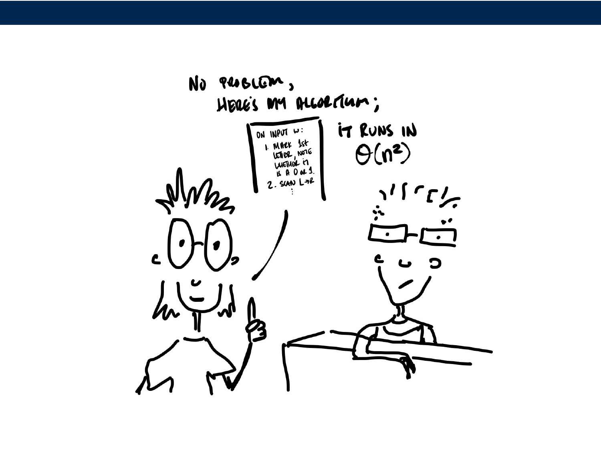{: width="80%"}   
  
  
  
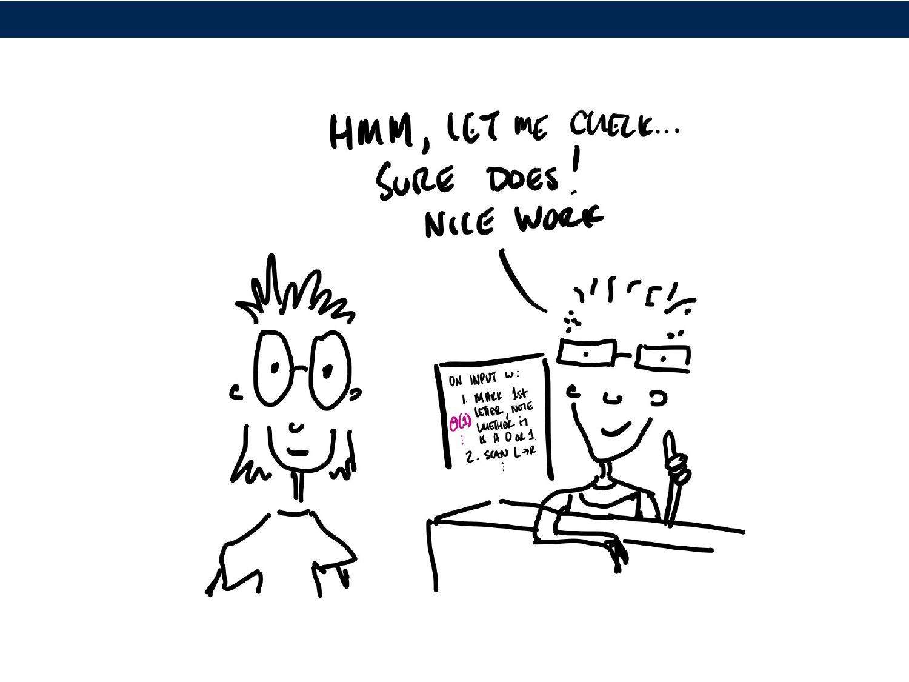{: width="80%"}   
  
  
  
{: width="80%"}   
  
  
  
{: width="80%"}   
  
  
  
{: width="80%"}   
  
  
  
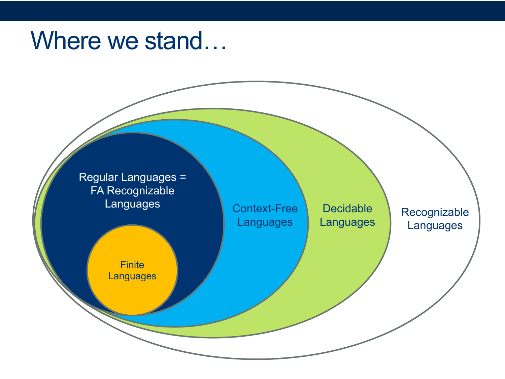{: width="80%"}   
  
  
  
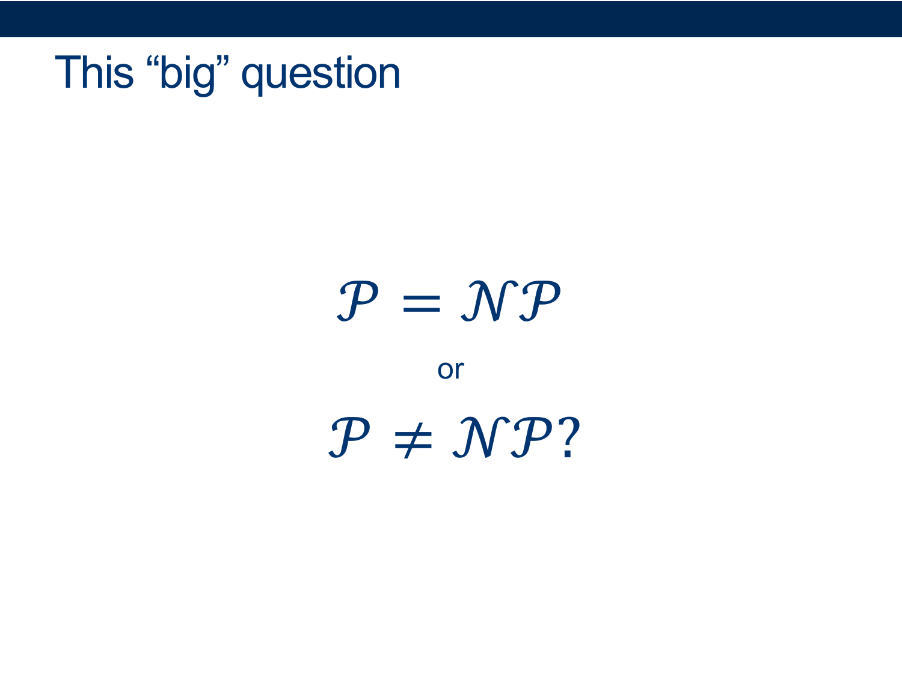{: width="80%"}   
  
  
  
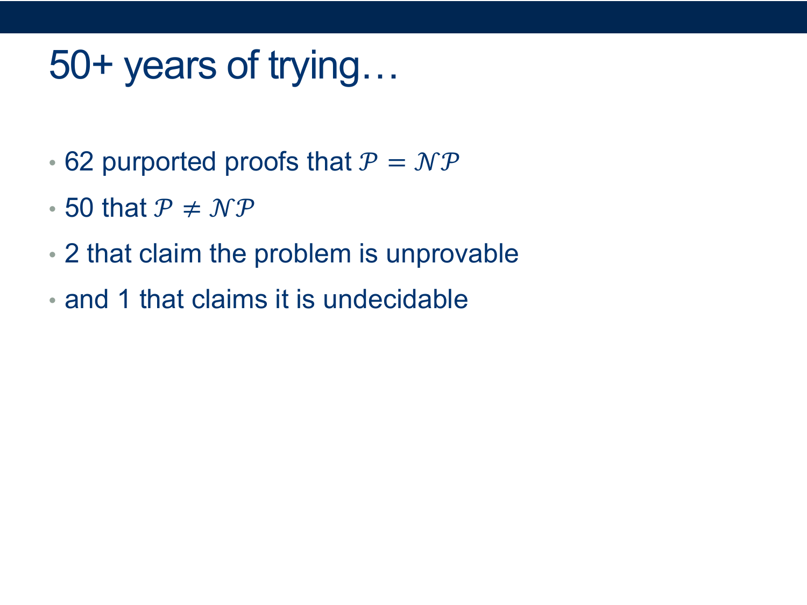{: width="80%"}   
  
  
  
{: width="80%"}   
  
  
  
{: width="80%"}   
  
  
  
{: width="80%"}   
  
  
  
{: width="80%"}   
  
  
  
{: width="80%"}   
  

**Activity 1** \[2 minutes\] How would you Prove this?:  
  

  answer: 
    

(Wait; then Click)

      

To show a language is in NP using a verifier:  

  <ul>
      <li>Specify a certificate that can be used with a verifier to decide the language.  </li>
      <li>Give a verifier that uses that certificate to verify membership in the given language.  </li>
      <li>Prove that the language recognized by the verifier is the given language and that the verifier runs in polynomial time.</li>
  </ul>

<b>Certificate</b>: a graph and a set of k vertices we claim is a cliquebr Verifier: loop over all pairs in the set and check to make sure there’s an edge between them, and if so: ACCEPT - O(k^2) (can’t be bigger than n^2)
      

    

  

 

  
  
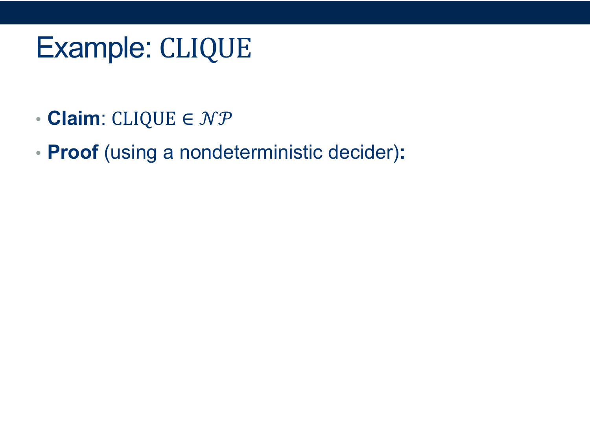{: width="80%"}   
  

**Activity 2** \[2 minutes\] How would you Prove this?: 

  answer: 
    

(Wait; then Click)

      

<b>Nondeterminism</b>: we can try multiple “branches” of computation at once  
  
The trick: each branch can only take polynomial time  
  
Nondeterministically test all subsets of vertices. On each subset:  
loop over all pairs in the (sub)set and check to make sure there’s an edge between them, and if so: ACCEPT - O(n^2)  
if no branch accepts REJECT  
  
  
Guaranteed to halt? YES (there’s nowhere to get stuck)  
  
What would happen if we tried to serialize all the branches?  

  <ul>
      <li>how many possible subsets do we have to check? $2^n$ <-- not polynomial anymore  </li>
      <li>note: this just means that this particular algorithm doesn’t run in polynomial time, but it turns out we haven’t been able to find any polynomial-time deciders for this language</li>
  </ul>
      

    

  

 

  

  
{: width="80%"}   
  
  
  
{: width="80%"}   
  
  
  
{: width="80%"} 