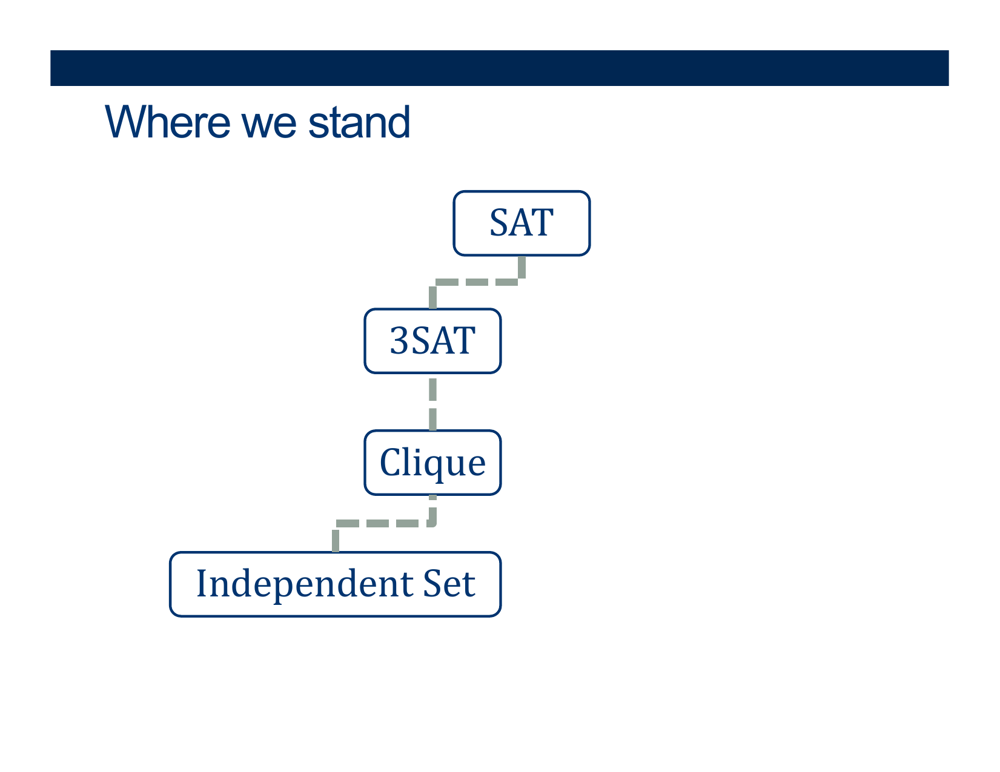

---
layout: default
title: Lecture37
parent: CSC250
grand_parent: Teaching
nav_order: 37
#permalink: /docs/teaching/csc110/
---  

Lecture Notes 37: even Even More Poly-Time Reductions in NP-C
===================================================

  

Outline
-------

This class we'll discuss:

* Poly-time reductions in NP-Complete
* Work on PS06 - PS08

  

* * *

  

More reductions
---------------

  
  
{: width="80%"}  
  
  
  
{: width="80%"}  
  
  
  
  

**Activity** \[2 minutes\] How would you Prove this?:  

  answer: 
    

(Wait; then Click)

      

 

 

 

 

 

 

<b>Upshot</b>:  
  
If you find k vertices connected in the graph, then they MUST be between vertices in different clauses, which means there is a combination that could be simultaneously TRUE in each clause... making $\Phi$ == True!

  

   	
      

    

  

 

  
  
  
  

  

{: width="80%"}  
  
  
  
{: width="80%"}  
  
  
  
{: width="80%"}  
  
  
  
{: width="80%"}  
  
  
  
{: width="80%"}  
  
  
  
{: width="80%"}  
  
**TIP**:  
  
What is the most obvious vertex-cover of a graph $G$?  
  
What is the most obvious independent-set of a graph $G$?  
  
  
  
As you make the I-Set greater... what happens to the vertex-cover?  
  
Is there a maximum I-Set in a graph $G$?  
  
What is the relation with the vertex-cover of a graph $G$?  
  
  

**Activity** \[2 minutes\] How would you Prove this?:  

  answer: 
    

(Wait; then Click)

      

  	
 

  
<b>Upshot</b>:  
  
The largest I-Set must have, as its complement, the smallest vertex-cover!      
      

    

  

 

  
  

  
{: width="80%"}  
  
  
  
{: width="80%"}