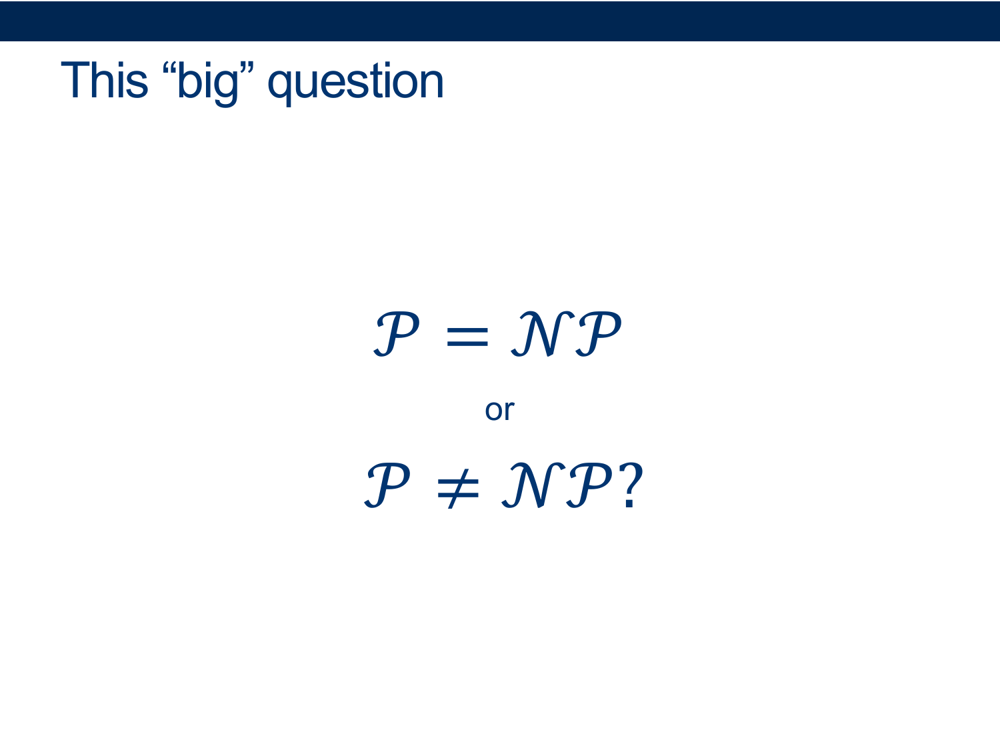
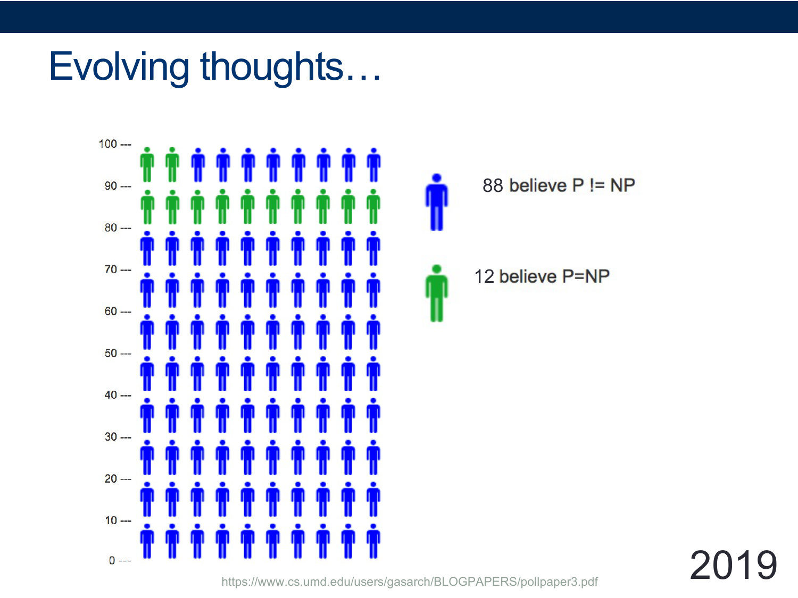

GUIDED NOTES (Optional)
=======================

NP and P vs NP
--------------

  
  
{: width="80%"}   
  
  
  
{: width="80%"}   
  
  
  
{: width="80%"}   
  
  
  
{: width="80%"}   
  
  
  
{: width="80%"}   
  
  
  
{: width="80%"}   
  
  
  
{: width="80%"}   
  
  
  
{: width="80%"}   
  
  
  
{: width="80%"}   
  
  
  
{: width="80%"}   
  

**Activity 1** \[2 minutes\] How would you Prove this?: 

  answer: 
    

(Wait; then Click)

      

To show a language is in NP using a verifier:  

  <ul>
      <li>Specify a certificate that can be used with a verifier to decide the language.  </li>
      <li>Give a verifier that uses that certificate to verify membership in the given language.  </li>
      <li>Prove that the language recognized by the verifier is the given language and that the verifier runs in polynomial time.</li>
  </ul>

<b>Certificate</b>: a graph and a set of k vertices we claim is a cliquebr Verifier: loop over all pairs in the set and check to make sure there’s an edge between them, and if so: ACCEPT - O(k^2) (can’t be bigger than n^2)
      

    

  

 

  
  
{: width="80%"}   
  

**Activity 2** \[2 minutes\] How would you Prove this?: 

  answer: 
    

(Wait; then Click)

      

<b>Nondeterminism</b>: we can try multiple “branches” of computation at once  
  
The trick: each branch can only take polynomial time  
  
Nondeterministically test all subsets of vertices. On each subset:  
loop over all pairs in the (sub)set and check to make sure there’s an edge between them, and if so: ACCEPT - O(n^2)  
if no branch accepts REJECT  
  
  
Guaranteed to halt? YES (there’s nowhere to get stuck)  
  
What would happen if we tried to serialize all the branches?  

  <ul>
      <li>how many possible subsets do we have to check? $2^n$ <-- not polynomial anymore  </li>
      <li>note: this just means that this particular algorithm doesn’t run in polynomial time, but it turns out we haven’t been able to find any polynomial-time deciders for this language</li>
  </ul>
      

    

  

 

  

  
{: width="80%"}   
  
 
  
  
  
{: width="80%"}   
  
  
  
{: width="80%"}   
  
  
  
{: width="80%"}   
  

**Activity 3** \[2 minutes\] How would you Prove this?: 

  answer: 
    

(Wait; then Click)

      

Draw graph with a clique  
 
Invert the graph  
 
Point out that a clique in the graph is an independent set in the inverse  
 
How long does it take to invert a graph?  

  <li> how many edges could there possibly be? O(n^2) </li>
      

    

  

 

  

  
{: width="80%"}   
  
  
  
{: width="80%"}   
  
So what can we say about the relative difficulty of these problems?  
  
  
This means that they are essentially equivalent  
Either both CLIQUE and INDEPENDENT−SET are in 𝒫 or neither is  
  
  
  

## NP-Completeness
  
  
  
{: width="80%"}   
  
  
  
{: width="80%"}   
  
  
  
{: width="80%"}   
  

**Activity 4** \[2 minutes\] How would you Prove this?:  

  answer: 
    

(Wait; then Click)

      

Suppose B is NP-complete and B ∈ P.  
  
<ul>
 <li> Let A be any language in NP; </li>
 <li> We know $A \leq_p B$ since B is NP-complete. </li>
 <li> Then A ∈ P, since B ∈ P and “easiness propagates downward”. </li>
 <li> Since every A in NP is also in P, this means NP ⊆ P. </li>
 <li> Since we also know P ⊆ NP, it follows that P = NP. </li>
</ul>
      

    

  

 

  

  
  
{: width="80%"}   
  
  
  
{: width="80%"}   
  

**Activity 5** \[2 minutes\] How would you Prove this?: 

  answer: 
    

(Wait; then Click)

      

Our witness (certificate) would be a satisfying assignment x1, x2, ..., xn s.t xi ∈ T/F.  
 
A deterministic TM can easily verify that the assignment satisfies all clauses, in polynomial (even linear) time in n, m.
      

    

  

 

  

  
  
  
  
  
  
{: width="80%"}   
  

**Activity 6** \[2 minutes\] How would you Prove this?: (Wait; then Click)  
  

  answer: 
    

(Wait; then Click)

      

<ul>
    <li> We must show that any language A in NP is efficiently reducible to SAT.  
        That is, if we could solve SAT, we could solve any problem A that’s in NP.</li>
    <li> Since AND, OR and NOT form a universal system, i.e, a basis for Boolean logical operators, we know we can can construct a boolean formula that simulates the transitions of a Turing Machine.</li>
    <li> Since A is in NP, there must be some nondeterministic TM $M_A$ that decides it.</li>
    <li> The reduction function, given $M_A$ (the NP-machine for A), receives a string w and produces a Boolean formula $\Phi_{M_{A,w}}$ that simulates the run of $M_A$ on the input w</li>
    <li> An assignment to $\Phi_{M_{A,w}}$ could represent a computational path of the NP machine,</li>
    <li> And if we’re clever, we can set it up so that $\Phi_{M_{A,w}}$ will be satisfiable iff the machine $M_A$ accepts w.</li>
  
  
This is called the <b>Cook-Levin Theorem</b>  

  
The full proof of this theorem is a little beyond the scope of this video, but if check out the original publication on Moodle if you want all the gory details. 
 
The important takeaway is that if we had some efficient decider for SAT, we’d be able to efficiently decide anything.  
</ul>
      

    

  

 

  

  
  
  
  
  
{: width="80%"}   
  
  
  
{: width="80%"}   
  
3CNF = conjunctive normal form with no more than three variables per conjunct  
  
3SAT is in NP for the same reason that regular SAT was: given a set of T/F values, it’s easy to check whether the formula evaluates to T  
  

  
  
  
  
  
{: width="80%"}   
  
Reduce it to SAT (SAT ≤p 3SAT)  
  
It turns out that ANY propositional formula can be converted into an equivalent 3CNF version by splitting it into pieces and adding some dummy variables as necessary  
  
  
  
  
  
  
{: width="80%"}   
  
  
  
{: width="80%"}   
  
  
  
{: width="80%"}   
  
  
  
{: width="80%"}   
  
  
  
{: width="80%"}   
  
  
  
{: width="80%"}   
  
  
  
{: width="80%"}   
  
  
  
{: width="80%"}   
  
  
  
{: width="80%"}   
  
  
  
{: width="80%"}   
  
  
  
{: width="80%"} 